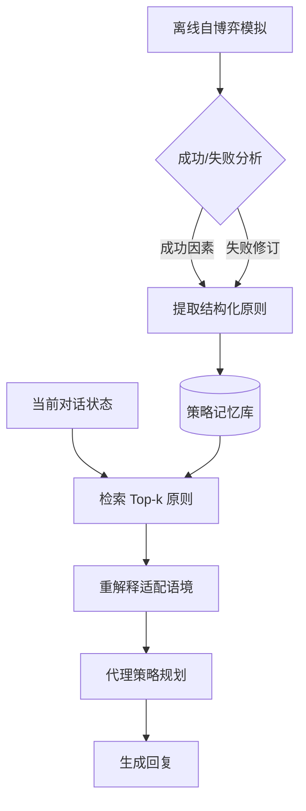

# PRINCIPLES：面向主动对话代理的合成策略记忆

## 一、论文基础元数据
- 原文标题：PRINCIPLES: Synthetic Strategy Memory for Proactive Dialogue Agents
- 中文译版：PRINCIPLES：面向主动对话代理的合成策略记忆
- 发表渠道：预印本（arXiv）
- 发表时间：2025 年
- 链接：https://arxiv.org/abs/2509.17459
- 作者及核心机构：Namyoung Kim 等（具体机构待补充）
- 研究领域：人工智能 + 自然语言处理（对话系统/主动对话）
- 关联数据集：ESConv（情感支持）、P4G/P4G+（说服）、ExTES（人类评估）

## 二、论文综合评价
### 2.1 量化评分（1-5 分，5 分为最优）

| 评价维度 | 评分 | 备注 |
| -------- | ---- | ---- |
| 📚 理论基础 | ⭐⭐⭐⭐ | 逻辑清晰，基于记忆检索理论 |
| 🎯 问题核心性 | ⭐⭐⭐⭐⭐ | 直击策略偏差与高成本痛点 |
| 💡 方法创新性 | ⭐⭐⭐⭐⭐ | 无训练合成策略记忆机制新颖 |
| ⚙️ 技术壁垒 | ⭐⭐⭐ | 依赖现有 API，算法复杂度低 |
| 🧪 实验严谨性 | ⭐⭐⭐⭐⭐ | 评估严格，人类对齐度高 |
| 🔧 落地可行性 | ⭐⭐⭐⭐⭐ | 无需微调，工程落地极易 |
| 🚀 应用前景 | ⭐⭐⭐⭐ | 适用于多种主动对话场景 |
| 📊 综合评分 | 4.4 | 无需训练即可显著提升策略规划能力，兼具高效与高性能 |

### 2.2 定性综合评价（≤300 字）
> 核心概括：研究定位、核心价值、差异化优势、关键结论
本研究定位为解决主动对话代理中策略覆盖窄、偏好偏差大及训练成本高的问题。核心价值在于提出了一种无需额外训练的合成策略记忆框架（PRINCIPLES），通过离线自博弈将模型隐性知识显性化。差异化优势在于采用结构化对比原则（成功 vs 失败）有效抑制了模型偏好，且成本仅为基线方法的 1/11.5。关键结论表明，该方法在情感支持与说服任务上成功率显著优于需微调的基线，且策略多样性更高，为利用 LLM 隐性知识提供了高效路径。

## 三、领域本体论映射
| 核心维度 | 具体内容 |
| -------- | -------- |
| 核心研究对象 | 主动对话代理（情感支持、说服任务） |
| 核心技术路径 | 离线自博弈生成 + 结构化记忆检索 + 无需微调推理 |
| 数据/载体形态 | 结构化文本原则（When/Should/Rather/Because） |
| 核心功能目标 | 提升任务成功率，缓解策略偏好偏差，降低训练成本 |
| 验证核心指标 | 成功率 (SR)、策略多样性 (熵)、宏观 F1、人类偏好 |

## 四、核心问题与解决方案
### 4.1 待解决的核心问题
1. **领域级根本问题**：主动对话需要有效的策略规划来实现特定目标（如安慰、说服）。
2. **现有方法痛点**：依赖预定义策略集覆盖受限；LLM 存在固有偏好偏差；微调/RL 训练成本高。
3. **工程落地卡点**：标注数据稀缺，模型微调资源消耗大，难以快速适配新场景。

### 4.2 核心解决方案
- 理论框架：合成策略记忆（Synthetic Strategy Memory），将参数知识转化为非参数记忆。
- 核心架构：离线自博弈生成原则 -> 结构化存储 -> 在线检索与重解释 -> 指导规划。
- 关键技术：离线自博弈模拟、成败对比原则提取、基于嵌入的检索机制。
- 创新机制：结构化对比格式（"应做...而非...因为..."）显式缓解偏差，无需更新模型参数。

### 4.3 核心优势（量化+定性）
1. 性能优势：ESConv 任务成功率达 0.7385，优于多数基线；策略预测 F1 最高。
2. 效率优势：训练成本约为 PPDPP 的 1/11.5，推理成本与 Prompt 基线相当。
3. 工程优势：无需标注数据，无需微调，即插即用，易于部署和维护。

## 五、方法与技术架构
### 5.1 核心架构设计
> 文字描述：系统分为离线构建与在线推理两阶段。离线阶段通过自博弈模拟生成对话，分析成败提取结构化原则存入记忆库。在线阶段根据当前对话状态检索相关原则，经重解释适配后指导代理生成策略。

### 5.2 关键技术实现细节
| 技术模块 | 实现路径 | 工程注意事项 |
| -------- | -------- | ------------ |
| 原则生成 | 离线自博弈，GPT-4o 作为批评者打分 | 需设定成功阈值（如平均得分>0.5） |
| 结构化格式 | "When [情境], should [策略], rather than [失败], because [原因]" | 确保格式一致性以便解析 |
| 检索机制 | 基于当前状态与原则 When 子句的嵌入相似度 | 需选择合适的 Embedding 模型 |
| 重解释 | 利用 LLM 将检索原则适配到具体语境 | 防止重解释偏离原原则核心 |

### 5.3 架构优缺点
- 优点：无需训练，成本低；策略多样性高；可解释性强；易于更新记忆库。
- 缺点：检索精度依赖嵌入质量；缺乏显式长期目标建模；原则质量依赖源模型。

## 六、实验设计与结果分析
### 6.1 实验基础设置
| 维度 | 内容 |
| ---- | ---- |
| 数据集 | ESConv（情感支持）、P4G/P4G+（说服）、ExTES |
| 基线方法 | Standard, Proactive, PPDPP (微调), AnE, ICL-AIF |
| 实验环境 | 使用 GPT-4o 作为批评者，Claude/Llama 生成原则 |
| 评价指标 | 成功率 (SR)、平均轮数 (AT)、F1 分数、熵、人类偏好 |

### 6.2 核心实验结果
| 方法 | 核心指标 1 (SR) | 核心指标 2 (Entropy) | 工程指标（算力/耗时） |
| ---- | --------- | --------- | -------------------- |
| 基线 1 (PPDPP) | 低于本文 | 低 (单一策略>80%) | 高 (需微调) |
| 基线 2 (Standard) | 0.65 左右 (预估) | 中 | 低 |
| 本文方法 | 0.7385 (ESConv) | 高 (策略分布均匀) | 低 (无需训练) |

### 6.3 消融实验/鲁棒性分析
| 实验变体 | 指标变化 | 核心结论 |
| -------- | -------- | -------- |
| 移除结构化格式 | 性能下降 | 对比结构对缓解偏差至关重要 |
| 移除检索机制 | 性能下降 | 情境适配是生效关键 |
| 仅成功学习 | 性能下降 | 失败学习提供的负例信息有价值 |
| 更换批评模型 | 评估分数波动 | GPT-4o 比 3.5 更符合人类判断 |

### 6.4 实验结论（工程视角）
该方法在无需微调的情况下实现了超越微调方法的性能，且策略分布更健康，避免了模型坍塌到单一策略。评估器升级（GPT-4o）证明了结果的可靠性，适合资源受限但需高性能的对话场景。

## 七、领域贡献与创新点
| 贡献层级 | 具体内容 |
| -------- | -------- |
| 理论贡献 | 提出将 LLM 参数知识转化为非参数结构化记忆的理论路径 |
| 方法/架构贡献 | 设计了基于成败对比的离线自博弈原则生成与检索框架 |
| 数据/工具贡献 | 构建了合成策略记忆库，提供了新的评估基准（GPT-4o 批评） |
| 实验/验证贡献 | 验证了无训练方法在多种主动对话任务上的有效性与鲁棒性 |
| 工程落地贡献 | 提供了低成本、易部署的主动对话策略规划解决方案 |

## 八、局限性与风险
| 维度 | 具体描述 | 应对思路 |
| ---- | -------- | -------- |
| 学术局限性 | 检索可能忽略细微语境 nuance；缺乏长期目标建模 | 改进检索算法，引入长期规划模块 |
| 工程落地风险 | 依赖外部 API 成本；原则库需定期更新 | 本地化部署小模型，建立原则更新机制 |
| 伦理/合规风险 | 情感支持场景非专家 curated，不可直接临床 | 部署前需专家审查，增加安全过滤层 |

## 九、未来研究/落地方向
| 方向类型 | 具体内容 | 优先级 |
| -------- | -------- | ------ |
| 科研拓展 | 探索长期对话目标建模与多轮策略一致性 | 高 |
| 工程优化 | 优化检索效率，降低在线推理延迟 | 中 |
| 跨领域适配 | 适配谈判、教学等其他主动交互场景 | 中 |

## 十、关键词与术语表
| 语言 | 关键词 |
| ---- | ------ |
| 中文 | 主动对话、策略记忆、自博弈、无训练、偏差缓解 |
| 英文 | Proactive Dialogue, Strategy Memory, Self-Play, Training-free, Bias Mitigation |
| 领域专属术语 | 合成策略记忆（Synthetic Strategy Memory）：通过模拟生成的外部策略库 |
| 领域专属术语 | 离线自博弈（Offline Self-Play）：模型自我对话生成数据的过程 |

## 十一、参考文献与关联资源
- 核心参考文献：待补充（需查看原文 BibTeX）
- 补充阅读：关于主动对话策略规划的相关研究（如 PPDPP, ProCoT）
- 开源代码/工具：待补充（通常 arXiv 论文会后续公开代码）

## 十二、阅读者批注
1. **科研启发**：隐性知识显性化的思路可迁移到其他需要规划的任务（如代码生成、推理）。
2. **工程落地思考**：非常适合快速搭建垂直领域对话助手，无需收集大量标注数据即可冷启动。
3. **待验证/存疑点**：在超长对话窗口下，检索原则的准确性是否会下降？
4. **个人/团队应用场景**：客服系统升级、心理健康辅助聊天机器人（需合规审查）。

## 十三、阅读元信息
| 维度 | 内容 |
| ---- | ---- |
| 阅读日期 | 2026-04-08 22:40 |
| 阅读人 | xPaperReader AI |
| 文档编号 | arxiv-2509.17459 |
| 版本迭代 | v1.0 |