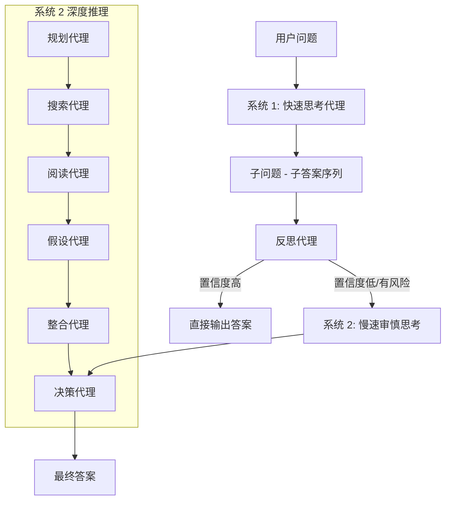

# PRIME：用于增强推理的规划与检索集成记忆

## 一、论文基础元数据
- 原文标题：PRIME: Planning and Retrieval-Integrated Memory for Enhanced Reasoning
- 中文译版：PRIME：用于增强推理的规划与检索集成记忆
- 发表渠道：预印本（arXiv，待正式录用）
- 发表时间：2025 年
- 链接：arXiv:2509.22315
- 作者及核心机构：Hieu Tran, Zonghai Yao, Nguyen Luong Tran, Zhichao Yang, Feiyun Ouyang, Shuo Han, Razieh Rahimi, Hong Yu（机构信息待补充）
- 研究领域：人工智能（一级）+ 大模型推理/多智能体系统（二级）
- 关联数据集：MedQA, MedMCQA, MMLU-Medical, Musique, 2Wiki, HotpotQA, Amboss（多语言/多领域/人工标注）

## 二、论文综合评价
### 2.1 量化评分（1-5 分，5 分为最优）

| 评价维度 | 评分 | 备注 |
| -------- | ---- | ---- |
| 📚 理论基础 | ⭐⭐⭐⭐⭐ | 双过程理论操作化，认知科学结合紧密 |
| 🎯 问题核心性 | ⭐⭐⭐⭐⭐ | 解决效率与准确性权衡，痛点精准 |
| 💡 方法创新性 | ⭐⭐⭐⭐⭐ | 动态调度双系统，反思机制设计新颖 |
| ⚙️ 技术壁垒 | ⭐⭐⭐⭐ | 多智能体协作复杂，调度逻辑有门槛 |
| 🧪 实验严谨性 | ⭐⭐⭐⭐⭐ | 多基准测试 + 人工评估，数据详实 |
| 🔧 落地可行性 | ⭐⭐⭐⭐ | 延迟较高，适合高价值场景而非实时 |
| 🚀 应用前景 | ⭐⭐⭐⭐⭐ | 医疗/法律等高风险领域应用潜力巨大 |
| 📊 综合评分 | 4.7 | 架构设计卓越，显著提升开源模型上限 |

### 2.2 定性综合评价（≤300 字）
> 核心概括：研究定位、核心价值、差异化优势、关键结论

本研究定位为大模型复杂推理框架，核心价值在于通过模拟人类“双过程认知”解决推理效率与准确性的矛盾。差异化优势在于引入“反思代理”动态调度系统 1（快思考）与系统 2（慢思考），实现计算资源按需分配。关键结论表明，该框架使开源模型（如 LLaMA 3.3 70B）在医疗及多跳推理任务上超越 GPT-4o，且显著降低无效 Token 消耗，为构建高鲁棒性推理系统提供了新范式。

## 三、领域本体论映射
| 核心维度 | 具体内容 |
| -------- | -------- |
| 核心研究对象 | 大语言模型复杂推理过程与计算资源分配 |
| 核心技术路径 | 双系统认知架构 + 多智能体协作 + 动态反思机制 |
| 数据/载体形态 | 文本问答对、知识库检索片段、推理轨迹日志 |
| 核心功能目标 | 最大化推理准确率的同时最小化计算成本 |
| 验证核心指标 | 准确率（Accuracy/EM/F1）、Token 消耗量、触发率 |

## 四、核心问题与解决方案
### 4.1 待解决的核心问题
1. **领域级根本问题**：大模型在复杂任务中难以平衡推理深度与计算成本。
2. **现有方法痛点**：纯检索增强（RAG）缺乏深度规划，纯思维链（CoT）资源消耗过大且易幻觉。
3. **工程落地卡点**：固定深度的推理导致简单任务浪费资源，困难任务资源不足。

### 4.2 核心解决方案
- 理论框架：人类认知双过程理论（系统 1 直觉 + 系统 2 审慎）。
- 核心架构：PRIME 双阶段架构（快速思考 + 按需深度推理）。
- 关键技术：反思代理（Reflection Agent）动态触发机制。
- 创新机制：基于不确定性评估的计算资源动态调度。

### 4.3 核心优势（量化 + 定性）
1. 性能优势：医疗基准平均得分 86.39，超越 GPT-4o (83.57)。
2. 效率优势：简单题系统 1 准确率 96.59%，极少触发高耗系统 2。
3. 工程优势：开源模型可达闭源模型性能，降低 API 依赖成本。

## 五、方法与技术架构
### 5.1 核心架构设计
> 文字描述 + 架构图（Mermaid/图片）

PRIME 架构分为系统 1（快速直觉）与系统 2（慢速审慎）。系统 1 生成初步答案，反思代理评估其置信度。若置信度低，触发系统 2，包含规划、搜索、阅读、假设、整合及决策六个代理协作。

### 5.2 关键技术实现细节
| 技术模块 | 实现路径 | 工程注意事项 |
| -------- | -------- | ------------ |
| 反思代理 | 分析系统 1 轨迹，检测逻辑矛盾/幻觉 | 需设定明确的触发阈值，避免误判 |
| 规划代理 | 将复杂问题分解为细粒度可检索子问题 | 分解粒度影响检索精度与召回率 |
| 搜索/阅读 | 外部知识库查询与关键证据提取 | 需处理检索噪声，避免证据污染 |
| 依赖组件 | 外部向量数据库、多模型路由调度器 | 需优化多代理间通信延迟 |

### 5.3 架构优缺点
- 优点：自适应计算深度，显著节省 Token；结构化推理减少幻觉。
- 缺点：多代理串行/并行调度增加系统延迟；架构复杂度高。

## 六、实验设计与结果分析
### 6.1 实验基础设置
| 维度 | 内容 |
| ---- | ---- |
| 数据集 | MedQA, MedMCQA, MMLU-Medical, 2Wiki, HotpotQA |
| 基线方法 | GPT-4, GPT-4o, Search-O1, MedRAG, CoT |
| 实验环境 | 基于 LLaMA 3.3 70B/8B，外部知识库 |
| 评价指标 | Accuracy, EM, F1, Token 消耗量 |

### 6.2 核心实验结果
| 方法 | 核心指标 1 (MedQA) | 核心指标 2 (2Wiki EM) | 工程指标（算力/耗时） |
| ---- | --------- | --------- | -------------------- |
| GPT-4o | 83.57 | 待补充 | 高（闭源 API） |
| Search-O1 | 待补充 | 63.33 | 高（固定深度） |
| 本文方法 | 86.39 | 68.84 | 中（动态调度，省 Token） |

### 6.3 消融实验/鲁棒性分析
| 实验变体 | 指标变化 | 核心结论 |
| -------- | -------- | -------- |
| 仅系统 1 | 简单题 96.59%，困难题 35.71% | 快思考无法处理复杂逻辑 |
| 系统 1+ 反思 | 困难题提升至 54.55% | 动态触发系统 2 显著增益 |
| 移除规划 | 准确率下降 | 结构化规划对检索至关重要 |

### 6.4 实验结论（工程视角）
动态调度机制在简单任务上节省了大量计算资源，而在困难任务上通过系统 2 保证了下限。虽然单次推理延迟增加，但整体吞吐量因简单任务快速通过而优化。

## 七、领域贡献与创新点
| 贡献层级 | 具体内容 |
| -------- | -------- |
| 理论贡献 | 首次将双过程理论操作化为多智能体推理框架 |
| 方法/架构贡献 | 提出 PRIME 架构，实现反思驱动的动态计算调度 |
| 数据/工具贡献 | 提供了多智能体协作的详细日志与评估标准 |
| 实验/验证贡献 | 在医疗及多跳推理多个基准上确立开源模型 SOTA |
| 工程落地贡献 | 证明了选择性计算支出在资源受限环境的可行性 |

## 八、局限性与风险
| 维度 | 具体描述 | 应对思路 |
| ---- | -------- | -------- |
| 学术局限性 | 假设代理存在锚定效应，难修正矛盾信念 | 引入对抗性验证或多次假设生成 |
| 工程落地风险 | 多代理协作导致延迟增加，不适合低延迟场景 | 优化代理并行度，缓存常见查询 |
| 伦理/合规风险 | 医疗建议需人工复核，避免自动化决策风险 | 增加人工审核环节，明确免责声明 |

## 九、未来研究/落地方向
| 方向类型 | 具体内容 | 优先级 |
| -------- | -------- | ------ |
| 科研拓展 | 探索系统 2 内部的并行推理机制 | 高 |
| 工程优化 | 降低反思代理的判断延迟，优化路由 | 高 |
| 跨领域适配 | 适配法律、金融等其他高风险领域 | 中 |

## 十、关键词与术语表
| 语言 | 关键词 |
| ---- | ------ |
| 中文 | 双过程理论，多智能体，反思机制，动态调度，检索增强 |
| 英文 | Dual-Process Theory, Multi-agent, Reflection Mechanism, Dynamic Scheduling, RAG |
| 领域专属术语 | 系统 1/2（快/慢思考）、选择性计算支出（Selective Computational Expenditure） |

## 十一、参考文献与关联资源
- 核心参考文献：待补充（双过程理论原始文献、RAG 相关基础论文）
- 补充阅读：关于 LLM Agent 协作的最新综述
- 开源代码/工具：待补充（关注作者 GitHub 后续发布）

## 十二、阅读者批注
1. **科研启发**：认知科学理论在大模型架构设计中的应用潜力巨大，不仅是隐喻，可操作化。
2. **工程落地思考**：动态调度是降低推理成本的关键，但反射机制本身的成本需控制在收益之下。
3. **待验证/存疑点**：反思代理在极端边缘案例下的判断准确性是否足够稳定？
4. **个人/团队应用场景**：适用于构建企业级知识库问答系统，特别是需要高准确率的垂直领域。

## 十三、阅读元信息
| 维度 | 内容 |
| ---- | ---- |
| 阅读日期 | 2026-04-08 22:59 |
| 阅读人 | xPaperReader AI |
| 文档编号 | arxiv-2509.22315 |
| 版本迭代 | v1.0 |