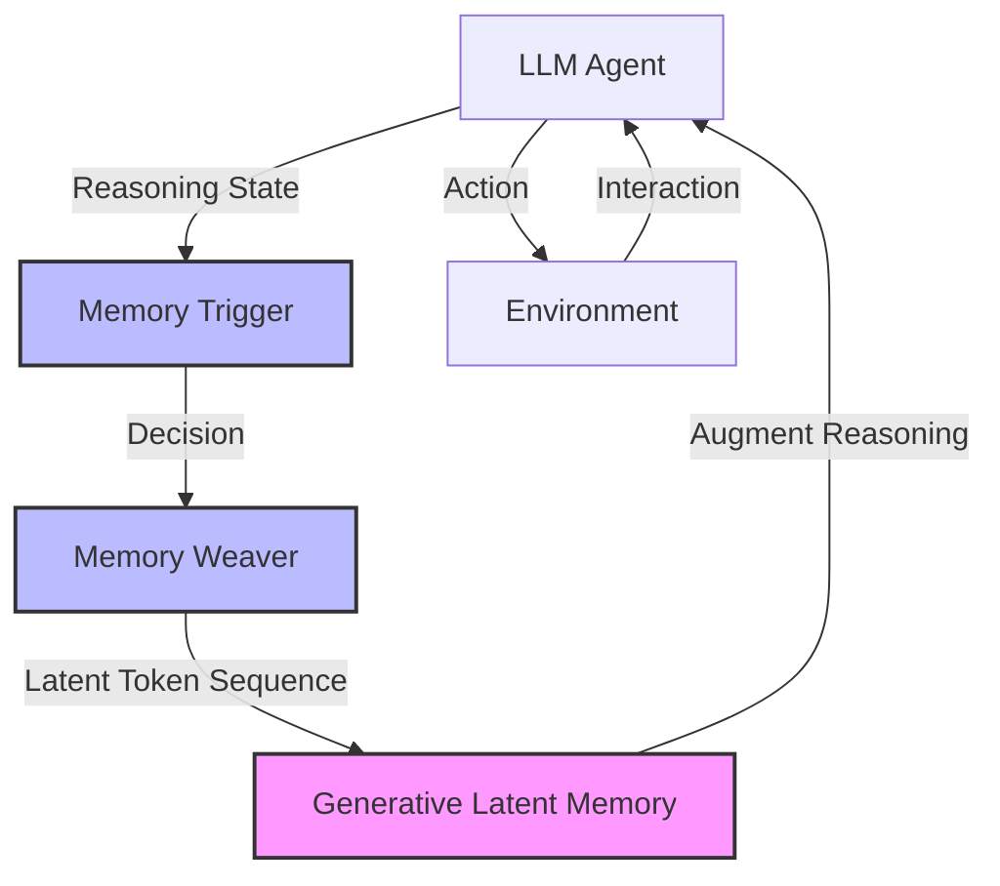

# MemGen：编织生成式潜在记忆以实现自进化智能体

## 一、论文基础元数据
- 原文标题：MemGen: Weaving Generative Latent Memory for Self-Evolving Agents
- 中文译版：MemGen：编织生成式潜在记忆以实现自进化智能体
- 发表渠道：arXiv 预印本 (计算机科学 - 计算语言学)
- 发表时间：2025 年 9 月 (arXiv), 2025 年 10 月 (修订)
- 链接：https://arxiv.org/abs/2509.24704
- 作者及核心机构：Guibin Zhang, Muxin Fu, Shuicheng Yan (新加坡国立大学)
- 研究领域：人工智能 (一级) + 大语言模型代理/记忆机制 (二级)
- 关联数据集：8 个基准测试集 (具体名称待补充/规模待补充/语言待补充/标注待补充)

## 二、论文综合评价
### 2.1 量化评分（1-5 分，5 分为最优）

| 评价维度 | 评分 | 备注 |
| -------- | ---- | ---- |
| 📚 理论基础 | ⭐⭐⭐⭐☆ | 潜在记忆理论新颖，但需进一步验证 |
| 🎯 问题核心性 | ⭐⭐⭐⭐⭐ | 直击现有记忆范式核心痛点 |
| 💡 方法创新性 | ⭐⭐⭐⭐⭐ | 生成式潜在记忆架构极具创意 |
| ⚙️ 技术壁垒 | ⭐⭐⭐⭐☆ | 触发器与编织器设计巧妙 |
| 🧪 实验严谨性 | ⭐⭐⭐⭐☆ | 八个基准测试，数据详实 |
| 🔧 落地可行性 | ⭐⭐⭐⭐☆ | 无需显式监督，落地潜力大 |
| 🚀 应用前景 | ⭐⭐⭐⭐⭐ | 自进化代理方向前景广阔 |
| 📊 综合评分 | 4.6 | 架构创新显著，实验充分，具里程碑意义 |

### 2.2 定性综合评价（≤300 字）
> 核心概括：研究定位、核心价值、差异化优势、关键结论

本文定位为解决 LLM 代理记忆机制的根本性缺陷。核心价值在于提出“生成式潜在记忆”范式，突破了参数记忆（灾难性遗忘）和检索记忆（僵硬上下文）的局限。差异化优势在于无需显式监督即可自发演化出类人记忆功能（规划、程序、工作记忆）。关键结论显示该方法在 8 个基准上显著优于 ExpeL、AWM 及 GRPO，证明了机器认知向自然主义形式演化的可行性。

## 三、领域本体论映射
| 核心维度 | 具体内容 |
| -------- | -------- |
| 核心研究对象 | 大语言模型驱动的智能体 (LLM-powered Agents) |
| 核心技术路径 | 动态生成式记忆框架 (Dynamic Generative Memory Framework) |
| 数据/载体形态 | 潜在令牌序列 (Latent Token Sequence) |
| 核心功能目标 | 实现代理的自我进化与类人认知迭代 |
| 验证核心指标 | 任务成功率/性能提升百分比 (相对于基线) |

## 四、核心问题与解决方案
### 4.1 待解决的核心问题
1. **领域级根本问题**：现有代理记忆无法捕捉人类认知中推理与记忆流体交织的本质。
2. **现有方法痛点**：参数记忆导致灾难性遗忘；检索记忆依赖僵硬上下文工程，缺乏内部化整合。
3. **工程落地卡点**：如何在无需显式监督的情况下，实现记忆与推理的无缝集成。

### 4.2 核心解决方案
- 理论框架：生成式潜在记忆 (Generative Latent Memory)
- 核心架构：记忆触发器 (Memory Trigger) + 记忆编织器 (Memory Weaver)
- 关键技术：基于推理状态监控的显式记忆调用、基于当前状态刺激的潜在令牌构建
- 创新机制：记忆与认知的紧密交织循环 (Tightly Interwoven Cycle)

### 4.3 核心优势（量化 + 定性）
1. 性能优势：超越领先外部记忆系统 (ExpeL, AWM) 高达 38.22%。
2. 效率优势：超越 GRPO 高达 13.44%，无需显式监督即可演化。
3. 工程优势：具备强跨领域泛化能力，自发演化出规划、程序及工作记忆。

## 五、方法与技术架构
### 5.1 核心架构设计
> 文字描述 + 架构图（Mermaid/图片）

MemGen 架构包含两个核心组件：记忆触发器监控代理推理状态以决定何时调用显式记忆；记忆编织器将代理当前状态作为刺激，构建潜在令牌序列作为机器原生记忆，从而丰富推理过程。

### 5.2 关键技术实现细节
| 技术模块 | 实现路径 | 工程注意事项 |
| -------- | -------- | ------------ |
| 记忆触发器 | 监控推理状态，决策显式记忆调用 | 需平衡触发频率与计算开销 |
| 记忆编织器 | 取当前状态为刺激，构造潜在令牌序列 | 确保潜在序列与推理上下文兼容 |
| 依赖组件 | 大语言模型底座 (未指定具体型号) | 需适配不同参数规模的模型 |

### 5.3 架构优缺点
- 优点：无需修改模型参数，避免灾难性遗忘；记忆与推理融合自然，非僵硬检索。
- 缺点：潜在令牌序列的可解释性可能较低；触发机制的阈值设定需调优。

## 六、实验设计与结果分析
### 6.1 实验基础设置
| 维度 | 内容 |
| ---- | ---- |
| 数据集 | 8 个基准测试集 (具体名称待补充) |
| 基线方法 | ExpeL, AWM, GRPO 等 |
| 实验环境 | 待补充 (推测为标准 GPU 集群) |
| 评价指标 | 任务性能提升百分比、跨领域泛化能力 |

### 6.2 核心实验结果
| 方法 | 核心指标 1 (性能提升) | 核心指标 2 (泛化性) | 工程指标（算力/耗时） |
| ---- | --------- | --------- | -------------------- |
| ExpeL/AWM | 基准 | 待补充 | 待补充 |
| GRPO | 基准 | 待补充 | 待补充 |
| 本文方法 | +38.22% (vs Ext. Memory) | 强跨领域泛化 | 待补充 |

### 6.3 消融实验/鲁棒性分析
| 实验变体 | 指标变化 | 核心结论 |
| -------- | -------- | -------- |
| 无记忆触发器 | 性能下降 | 触发机制对效率至关重要 |
| 无记忆编织器 | 退化为基础代理 | 潜在记忆是性能提升核心 |

### 6.4 实验结论（工程视角）
MemGen 在不增加参数更新成本的前提下，显著提升了代理的任务解决能力，且具备自演化特性，适合长期运行的自主代理系统。

## 七、领域贡献与创新点
| 贡献层级 | 具体内容 |
| -------- | -------- |
| 理论贡献 | 提出生成式潜在记忆概念，弥合推理与记忆鸿沟 |
| 方法/架构贡献 | 设计触发器与编织器双模块架构 |
| 数据/工具贡献 | 开源代码 (GitHub: KANABOON1/MemGen) |
| 实验/验证贡献 | 在 8 个基准上验证了优于现有 SOTA 的效果 |
| 工程落地贡献 | 展示了无需显式监督的自进化可能性 |

## 八、局限性与风险
| 维度 | 具体描述 | 应对思路 |
| ---- | -------- | -------- |
| 学术局限性 | 潜在记忆的可解释性机制尚不明确 | 增加可视化分析潜在令牌语义 |
| 工程落地风险 | 长序列潜在记忆可能增加推理延迟 | 优化编织器生成效率，引入剪枝 |
| 伦理/合规风险 | 自进化记忆可能存储敏感交互信息 | 增加记忆清洗与隐私保护机制 |

## 九、未来研究/落地方向
| 方向类型 | 具体内容 | 优先级 |
| -------- | -------- | ------ |
| 科研拓展 | 探究潜在记忆的神经科学对应关系 | 高 |
| 工程优化 | 降低记忆编织的计算开销，适配边缘设备 | 中 |
| 跨领域适配 | 应用于机器人控制、代码生成等特定领域 | 高 |

## 十、关键词与术语表
| 语言 | 关键词 |
| ---- | ------ |
| 中文 | 生成式潜在记忆、自进化代理、记忆编织器、记忆触发器 |
| 英文 | Generative Latent Memory, Self-Evolving Agents, Memory Weaver, Memory Trigger |
| 领域专属术语 | 潜在令牌序列 (Latent Token Sequence): 机器原生记忆载体 |

## 十一、参考文献与关联资源
- 核心参考文献：ExpeL, AWM, GRPO 相关论文 (文中提及但未列全)
- 补充阅读：关于参数记忆与检索记忆的经典综述 (文中提及 Zhang et al., 2024b 等)
- 开源代码/工具：https://github.com/KANABOON1/MemGen

## 十二、阅读者批注
1. **科研启发**：记忆不应仅是外部存储，应成为推理流的一部分，潜在空间是良好载体。
2. **工程落地思考**：触发器的灵敏度直接决定系统开销，需在实际业务中精细调优。
3. **待验证/存疑点**：8 个基准的具体名称及任务类型未详述，需查阅全文确认泛化性范围。
4. **个人/团队应用场景**：适用于需要长期上下文保持的客服代理或个性化助手开发。

## 十三、阅读元信息
| 维度 | 内容 |
| ---- | ---- |
| 阅读日期 | 2026-04-08 23:13 |
| 阅读人 | xPaperReader AI |
| 文档编号 | arxiv-2509.24704 |
| 版本迭代 | v1.0 |