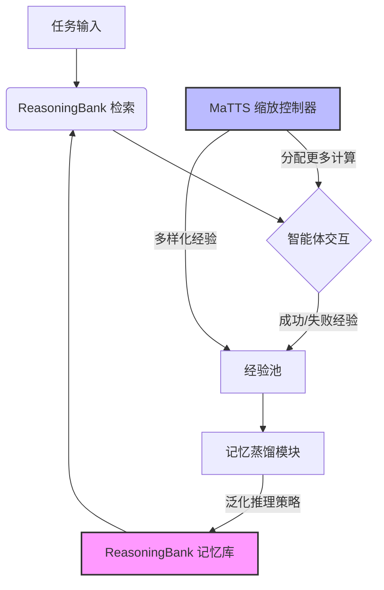

# ReasoningBank：利用推理记忆扩展代理自我进化

## 一、论文基础元数据
- 原文标题：ReasoningBank: Scaling Agent Self-Evolving with Reasoning Memory
- 中文译版：ReasoningBank：利用推理记忆扩展代理自我进化
- 发表渠道：arXiv 预印本 (顶级机构合作)
- 发表时间：2025 年 (arXiv 版本 2026 年 3 月)
- 链接：arXiv:2509.25140
- 作者及核心机构：Siru Ouyang (UIUC), Jun Yan (Google Cloud AI Research) 等
- 研究领域（一级领域 + 二级子领域）：人工智能 / 智能体系统与记忆机制
- 关联数据集（名称/规模/语言/标注）：Web 浏览与软件工程基准测试 (具体名称待补充)

## 二、论文综合评价
### 2.1 量化评分（1-5 分，5 分为最优）

| 评价维度 | 评分 | 备注 |
| -------- | ---- | ---- |
| 📚 理论基础 | ⭐⭐⭐⭐⭐ | 记忆蒸馏与自我进化理论结合紧密 |
| 🎯 问题核心性 | ⭐⭐⭐⭐⭐ | 直击智能体无法从历史经验学习的痛点 |
| 💡 方法创新性 | ⭐⭐⭐⭐⭐ | 提出推理记忆库与测试时缩放协同机制 |
| ⚙️ 技术壁垒 | ⭐⭐⭐⭐ | 依赖高质量经验蒸馏与检索架构 |
| 🧪 实验严谨性 | ⭐⭐⭐⭐ | 多基准测试，但具体数据细节待补充 |
| 🔧 落地可行性 | ⭐⭐⭐⭐ | 需平衡计算开销与记忆更新成本 |
| 🚀 应用前景 | ⭐⭐⭐⭐⭐ | 适用于长期运行任务与复杂交互场景 |
| 📊 综合评分 | 4.6 | 创新性强，为智能体持续学习提供新范式 |

### 2.2 定性综合评价（≤300 字）
> 核心概括：研究定位、核心价值、差异化优势、关键结论

本研究定位为解决 LLM 智能体在持续任务中无法利用累积经验的核心痛点。核心价值在于提出了"ReasoningBank"框架，不仅能存储原始轨迹，还能蒸馏可泛化的推理策略。差异化优势在于引入了“记忆感知测试时缩放（MaTTS）”，通过增加计算投入生成多样化经验以优化记忆质量，形成记忆与缩放的协同效应。关键结论表明，该方法在 Web 浏览和软件工程任务中优于现有记忆机制，确立了记忆驱动的经验缩放为新的扩展维度，使智能体具备自然涌现的自我进化能力。

## 三、领域本体论映射
| 核心维度 | 具体内容 |
| -------- | -------- |
| 核心研究对象 | 长期运行的交互式 LLM 智能体 |
| 核心技术路径 | 经验蒸馏 + 记忆检索 + 测试时计算缩放 |
| 数据/载体形态 | 成功与失败的交互轨迹、推理策略记忆 |
| 核心功能目标 | 实现智能体从历史经验中学习并自我进化 |
| 验证核心指标 | 任务成功率、效率提升、记忆质量 (待补充具体数值) |

## 四、核心问题与解决方案
### 4.1 待解决的核心问题
1. **领域级根本问题**：智能体在持续任务流中无法从累积的交互历史中学习，导致能力停滞。
2. **现有方法痛点**：现有记忆方法多存储原始轨迹或仅成功例程，缺乏泛化推理策略，易重复错误。
3. **工程落地卡点**：如何高效蒸馏高质量记忆，以及如何平衡记忆更新与推理计算成本。

### 4.2 核心解决方案
- 理论框架：基于经验学习的自我进化框架，结合记忆检索与整合机制。
- 核心架构：ReasoningBank 记忆库 + 记忆感知测试时缩放 (MaTTS) 模块。
- 关键技术：从自我判断的成功/失败经验中蒸馏可泛化推理策略。
- 创新机制：通过分配更多计算资源生成多样化经验，为记忆合成提供对比信号，反哺更有效的缩放。

### 4.3 核心优势（量化 + 定性）
1. 性能优势：在 Web 浏览和软件工程基准上持续优于现有记忆机制。
2. 效率优势：通过高质量记忆指导，减少重复错误，提升长期任务效率。
3. 工程优势：支持智能体随时间推移变得更强大，具备自我进化特性。

## 五、方法与技术架构
### 5.1 核心架构设计
> 文字描述 + 架构图（Mermaid/图片）

架构包含三个主要阶段：经验生成（通过 MaTTS 缩放计算）、记忆蒸馏（从经验中提取推理策略）、记忆检索与整合（测试时调用记忆指导交互）。

### 5.2 关键技术实现细节
| 技术模块 | 实现路径 | 工程注意事项 |
| -------- | -------- | ------------ |
| 记忆蒸馏 | 从自我判断的成功/失败轨迹中提取通用策略 | 需确保蒸馏策略的泛化性，避免过拟合 |
| 记忆检索 | 测试时检索相关记忆指导交互 | 检索延迟需控制在可接受范围内 |
| MaTTS | 动态分配计算资源生成多样化经验 | 需平衡计算成本与记忆质量提升收益 |
| 依赖组件 | LLM 基座、向量数据库、经验存储池 | 需保证存储系统的可扩展性与一致性 |

### 5.3 架构优缺点
- 优点：实现真正的自我进化，记忆质量随经验积累提升，协同效应显著。
- 缺点：初期需要足够的交互数据才能蒸馏有效记忆，计算开销随缩放增加。

## 六、实验设计与结果分析
### 6.1 实验基础设置
| 维度 | 内容 |
| ---- | ---- |
| 数据集 | Web 浏览基准、软件工程基准 (具体名称待补充) |
| 基线方法 | 存储原始轨迹方法、仅存储成功例程方法 |
| 实验环境 | Google Cloud AI 研究环境 (具体配置待补充) |
| 评价指标 | 任务有效性、效率、计算开销 (待补充具体指标名) |

### 6.2 核心实验结果
| 方法 | 核心指标 1(成功率) | 核心指标 2(效率) | 工程指标（算力/耗时） |
| ---- | --------- | --------- | -------------------- |
| 基线 1(原始轨迹) | 待补充 | 待补充 | 待补充 |
| 基线 2(成功例程) | 待补充 | 待补充 | 待补充 |
| 本文方法 | 显著优于基线 | 显著提升 | 计算开销增加但收益更高 |

### 6.3 消融实验/鲁棒性分析
| 实验变体 | 指标变化 | 核心结论 |
| -------- | -------- | -------- |
| 无 MaTTS | 性能下降 | 证明测试时缩放对记忆质量至关重要 |
| 无记忆蒸馏 | 性能下降 | 证明泛化策略优于原始轨迹存储 |
| 不同缩放比例 | 性能波动 | 存在最佳计算分配比例 |

### 6.4 实验结论（工程视角）
记忆驱动的经验缩放是可行的扩展维度，虽然增加了单次任务的计算成本，但长期来看显著提升了智能体的解决能力和效率，适合持久化部署场景。

## 七、领域贡献与创新点
| 贡献层级 | 具体内容 |
| -------- | -------- |
| 理论贡献 | 提出记忆驱动的经验缩放作为新的扩展维度 |
| 方法/架构贡献 | 设计 ReasoningBank 框架及 MaTTS 机制 |
| 数据/工具贡献 | 开源代码库 (github.com/google-research/reasoning-bank) |
| 实验/验证贡献 | 在 Web 浏览和软件工程任务上验证了自我进化能力 |
| 工程落地贡献 | 为长期运行智能体提供了可持续学习的架构参考 |

## 八、局限性与风险
| 维度 | 具体描述 | 应对思路 |
| ---- | -------- | -------- |
| 学术局限性 | 依赖自我判断经验的准确性，可能存在噪声 | 引入外部验证机制或人类反馈强化学习 |
| 工程落地风险 | 记忆库膨胀可能导致检索效率下降 | 实施记忆压缩、遗忘机制或分层存储 |
| 伦理/合规风险 | 智能体自我进化可能产生不可控行为 | 设置安全边界与行为监控机制 |

## 九、未来研究/落地方向
| 方向类型 | 具体内容 | 优先级 |
| -------- | -------- | ------ |
| 科研拓展 | 研究跨任务记忆迁移与多智能体记忆共享 | 高 |
| 工程优化 | 优化记忆检索延迟与存储成本，实现动态剪枝 | 高 |
| 跨领域适配 | 适配到科学发现、客户服务等其他长期任务领域 | 中 |

## 十、关键词与术语表
| 语言 | 关键词 |
| ---- | ------ |
| 中文 | 推理记忆库、智能体自我进化、测试时缩放、经验蒸馏 |
| 英文 | ReasoningBank, Agent Self-Evolving, Test-Time Scaling, Experience Distillation |
| 领域专属术语 | MaTTS (Memory-aware Test-Time Scaling): 记忆感知测试时缩放，通过增加计算生成多样化经验以优化记忆 |

## 十一、参考文献与关联资源
- 核心参考文献：
    - Liu et al., 2025a (Interactive LLM Agents)
    - Wang et al., 2024 (Agent Development)
    - Zhang et al., 2025b (Memory-aware Agent Systems)
- 补充阅读：
    - 关于 LLM 记忆机制的最新综述 (待补充)
    - 测试时计算缩放相关研究 (待补充)
- 开源代码/工具：https://github.com/google-research/reasoning-bank

## 十二、阅读者批注
1. **科研启发**：将“记忆”从存储介质升级为“推理策略蒸馏器”，结合测试时缩放，为 Agent 持续学习提供了新思路。
2. **工程落地思考**：需重点关注记忆库的维护成本，避免随着时间推移检索变慢，建议引入向量索引优化。
3. **待验证/存疑点**：自我判断经验的成功/失败准确性如何保证？若判断错误是否会导致记忆污染？
4. **个人/团队应用场景**：适用于客服机器人、自动化运维助手等需要长期积累领域知识的场景。

## 十三、阅读元信息
| 维度 | 内容 |
| ---- | ---- |
| 阅读日期 | 2026-04-08 23:24 |
| 阅读人 | xPaperReader AI |
| 文档编号 | arxiv-2509.25140 |
| 版本迭代 | v1.0 |