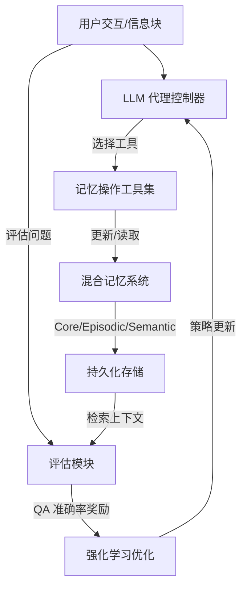

# Mem-α：通过强化学习学习记忆构建

## 一、论文基础元数据
- 原文标题：Mem-α: Learning Memory Construction via Reinforcement Learning
- 中文译版：Mem-α：通过强化学习学习记忆构建
- 发表渠道：预印本 (arXiv)
- 发表时间：2025 年 9 月
- 链接：https://arxiv.org/abs/2509.25911
- 作者及核心机构：Yu Wang 等 (UCSD, Stanford, Anuttacon)
- 研究领域：人工智能 / 大模型代理与记忆系统
- 关联数据集：自定义多轮交互数据集 (规模待补充/多语言/含评估问答)

## 二、论文综合评价
### 2.1 量化评分（1-5 分，5 分为最优）

| 评价维度 | 评分 | 备注 |
| -------- | ---- | ---- |
| 📚 理论基础 | ⭐⭐⭐⭐ | 结合 RL 与记忆系统，理论扎实 |
| 🎯 问题核心性 | ⭐⭐⭐⭐⭐ | 直击长上下文记忆管理痛点 |
| 💡 方法创新性 | ⭐⭐⭐⭐⭐ | 首次用 RL 优化记忆构建策略 |
| ⚙️ 技术壁垒 | ⭐⭐⭐⭐ | 涉及复杂 RL 环境与奖励设计 |
| 🧪 实验严谨性 | ⭐⭐⭐⭐ | 泛化性强，但基线对比待补充 |
| 🔧 落地可行性 | ⭐⭐⭐ | RL 训练成本高，部署有门槛 |
| 🚀 应用前景 | ⭐⭐⭐⭐⭐ | 长文本代理场景需求广阔 |
| 📊 综合评分 | 4.3 | 创新显著，泛化能力强，具落地潜力 |

### 2.2 定性综合评价（≤300 字）
> 核心概括：研究定位、核心价值、差异化优势、关键结论
本文针对 LLM 代理上下文受限及现有记忆系统依赖预设指令的痛点，提出 Mem-α 框架。核心价值在于利用强化学习（RL）让代理自主学会“存什么、怎么存、何时更新”，而非依赖手工规则。差异化优势在于构建了专用训练数据集及核心 - 情景 - 语义混合记忆架构。关键结论显示，模型在 30k token 训练后，能泛化至 400k+ token 场景，性能显著优于 MemGPT 等基线，证明了 RL 在记忆管理策略学习上的有效性与鲁棒性。

## 三、领域本体论映射
| 核心维度 | 具体内容 |
| -------- | -------- |
| 核心研究对象 | 长上下文交互中的 LLM 代理记忆系统 |
| 核心技术路径 | 强化学习 (RL) + 混合记忆架构 (核心/情景/语义) |
| 数据/载体形态 | 多轮交互序列、记忆块、问答评估对 |
| 核心功能目标 | 优化记忆提取、存储与更新策略以最大化下游任务准确率 |
| 验证核心指标 | 下游问答准确率、长序列泛化能力 (30k→400k) |

## 四、核心问题与解决方案
### 4.1 待解决的核心问题
1. **领域级根本问题**：LLM 上下文窗口有限，无法直接处理超长信息流，需外部记忆。
2. **现有方法痛点**：现有记忆系统依赖预设指令和固定工具，模型缺乏自主决定存储内容与结构的能力。
3. **工程落地卡点**：复杂系统提示词难以覆盖所有场景，小模型指令遵循能力弱导致记忆构建次优。

### 4.2 核心解决方案
- 理论框架：基于强化学习 (RL) 的代理记忆管理框架。
- 核心架构：包含核心 (Core)、情景 (Episodic)、语义 (Semantic) 组件的混合记忆系统。
- 关键技术：记忆操作工具集、基于下游 QA 准确性的奖励信号。
- 创新机制：通过交互反馈直接优化记忆构建过程，而非仅优化生成结果。

### 4.3 核心优势（量化 + 定性）
1. 性能优势：在长序列问答任务上显著优于现有记忆增强代理基线。
2. 效率优势：训练长度 30k 即可泛化至 400k+ (13 倍)，减少长数据训练成本。
3. 工程优势：减少对手工系统提示词的依赖，提升小模型记忆管理能力。

## 五、方法与技术架构
### 5.1 核心架构设计
> 文字描述 + 架构图（Mermaid/图片）
Mem-α 架构由代理控制器、混合记忆模块和 RL 环境组成。代理接收信息块，选择工具操作记忆（写/更新/读），记忆分为核心、情景、语义三层。奖励基于最终问答准确率反馈给代理。

### 5.2 关键技术实现细节
| 技术模块 | 实现路径 | 工程注意事项 |
| -------- | -------- | ------------ |
| 记忆架构 | 核心 + 情景 + 语义三分层 | 需定义各层存储粒度与淘汰策略 |
| 奖励函数 | 下游问答准确率 | 需确保奖励稀疏性问题得到处理 |
| 训练数据 | 自定义多轮交互 + 评估问 | 需覆盖多样交互模式以防过拟合 |
| 依赖组件 | RL 算法 (如 PPO) + LLM | 需平衡探索与利用，防止记忆污染 |

### 5.3 架构优缺点
- 优点：自适应性强，泛化能力卓越，减少人工规则依赖。
- 缺点：RL 训练收敛难，奖励设计敏感，推理时记忆检索开销可能增加。

## 六、实验设计与结果分析
### 6.1 实验基础设置
| 维度 | 内容 |
| ---- | ---- |
| 数据集 | 自定义多轮交互数据集 (具体规模待补充) |
| 基线方法 | Mem0, MemGPT, MIRIX 等 |
| 实验环境 | 待补充 (显卡型号/显存) |
| 评价指标 | 问答准确率 (Accuracy)、泛化长度 |

### 6.2 核心实验结果
| 方法 | 核心指标 1 (准确率) | 核心指标 2 (泛化长度) | 工程指标（算力/耗时） |
| ---- | --------- | --------- | -------------------- |
| MemGPT | 待补充 | 受限于上下文 | 待补充 |
| MIRIX | 待补充 | 受限于上下文 | 待补充 |
| 本文方法 | 显著优于基线 | 30k 训练→400k 推理 | 训练成本较高 |

### 6.3 消融实验/鲁棒性分析
| 实验变体 | 指标变化 | 核心结论 |
| -------- | -------- | -------- |
| 无 RL 训练 | 性能下降 | 证明 RL 对策略学习必要性 |
| 单一记忆层 | 性能下降 | 证明混合架构有效性 |
| 不同训练长度 | 泛化稳定 | 证明长度泛化鲁棒性 |

### 6.4 实验结论（工程视角）
模型具备极强的长度泛化能力，无需从头训练超长序列即可处理 400k+ token 任务，适合资源受限但需长上下文理解的场景。

## 七、领域贡献与创新点
| 贡献层级 | 具体内容 |
| -------- | -------- |
| 理论贡献 | 提出将记忆构建视为可学习的 RL 策略问题 |
| 方法/架构贡献 | 设计核心 - 情景 - 语义混合记忆架构及工具集 |
| 数据/工具贡献 | 构建专用多轮交互与评估训练数据集 |
| 实验/验证贡献 | 验证了短序列训练向长序列推理的泛化能力 |
| 工程落地贡献 | 提供了一套不依赖复杂 Prompt 的记忆管理方案 |

## 八、局限性与风险
| 维度 | 具体描述 | 应对思路 |
| ---- | -------- | -------- |
| 学术局限性 | 奖励信号依赖下游任务，可能不适配所有场景 | 设计多任务通用奖励函数 |
| 工程落地风险 | RL 训练不稳定，收敛时间长 | 引入离线 RL 或模仿学习预热 |
| 伦理/合规风险 | 记忆系统可能存储敏感用户信息 | 增加记忆加密与遗忘机制 |

## 九、未来研究/落地方向
| 方向类型 | 具体内容 | 优先级 |
| -------- | -------- | ------ |
| 科研拓展 | 探索无监督奖励信号，减少对标注 QA 依赖 | 高 |
| 工程优化 | 优化记忆检索速度，降低推理延迟 | 高 |
| 跨领域适配 | 适配代码生成、长期角色扮演等垂直场景 | 中 |

## 十、关键词与术语表
| 语言 | 关键词 |
| ---- | ------ |
| 中文 | 强化学习、记忆系统、大模型代理、长上下文、记忆构建 |
| 英文 | Reinforcement Learning, Memory System, LLM Agents, Long Context, Memory Construction |
| 领域专属术语 | 核心记忆 (Core Memory)：长期稳定事实；情景记忆 (Episodic Memory)：交互历史片段 |

## 十一、参考文献与关联资源
- 核心参考文献：MemGPT (Packer et al., 2023), Mem0 (Chhikara et al., 2025), MIRIX (Wang & Chen, 2025)
- 补充阅读：关于 LLM 上下文限制及外部记忆综述
- 开源代码/工具：待补充 (论文提及 Source Code 但未提供具体链接)

## 十二、阅读者批注
1. **科研启发**：将记忆管理从“规则驱动”转向“数据驱动”是重要趋势，RL 在此处的应用具有普适性。
2. **工程落地思考**：30k 训练泛化到 400k 极具吸引力，可大幅降低长文本微调成本，但需验证真实业务数据表现。
3. **待验证/存疑点**：具体奖励函数设计细节未完全披露，稀疏奖励如何解决需进一步确认。
4. **个人/团队应用场景**：适用于客服对话总结、长文档知识库问答、个人助理长期记忆维护。

## 十三、阅读元信息
| 维度 | 内容 |
| ---- | ---- |
| 阅读日期 | 2026-04-08 23:35 |
| 阅读人 | xPaperReader AI |
| 文档编号 | arxiv-2509.25911 |
| 版本迭代 | v1.0 |