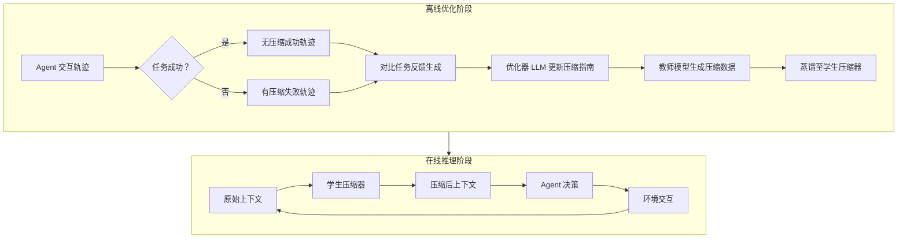

# ACON：优化长程 LLM 智能体的上下文压缩

## 一、论文基础元数据
- 原文标题：ACON: Optimizing Context Compression for Long-horizon LLM Agents
- 中文译版：ACON：优化长程 LLM 智能体的上下文压缩
- 发表渠道：预印本（arXiv）
- 发表时间：2025 年
- 链接：https://arxiv.org/abs/2510.00615
- 作者及核心机构：Minki Kang, Wei-Ning Chen 等（Microsoft Research）
- 研究领域（一级领域 + 二级子领域）：人工智能 / 大语言模型智能体
- 关联数据集（名称/规模/语言/标注）：AppWorld（9 个应用/多步任务）、OfficeBench（办公自动化）、8-Objective QA（深度研究）

## 二、论文综合评价
### 2.1 量化评分（1-5 分，5 分为最优）

| 评价维度 | 评分 | 备注 |
| -------- | ---- | ---- |
| 📚 理论基础 | ⭐⭐⭐⭐ | 基于提示优化与蒸馏，理论扎实但非突破性 |
| 🎯 问题核心性 | ⭐⭐⭐⭐⭐ | 直击长程智能体上下文爆炸核心痛点 |
| 💡 方法创新性 | ⭐⭐⭐⭐ | 指南优化结合蒸馏，思路巧妙实用 |
| ⚙️ 技术壁垒 | ⭐⭐⭐ | 依赖现有大模型能力，无底层架构革新 |
| 🧪 实验严谨性 | ⭐⭐⭐⭐⭐ | 多基准测试、消融实验及成本分析详尽 |
| 🔧 落地可行性 | ⭐⭐⭐⭐ | 蒸馏降低开销，但历史压缩可能增加延迟 |
| 🚀 应用前景 | ⭐⭐⭐⭐⭐ | 长程任务需求激增，通用压缩框架价值高 |
| 📊 综合评分 | 4.3 | 解决关键工程问题，平衡性能与成本优异 |

### 2.2 定性综合评价（≤300 字）
> 核心概括：研究定位、核心价值、差异化优势、关键结论
本文针对长程 LLM 智能体上下文无限增长导致的成本与效率问题，提出了 ACON 框架。核心价值在于通过自然语言形式的“压缩指南优化”替代传统微调，并结合模型蒸馏技术，实现了高性能与低开销的平衡。差异化优势在于同时支持交互历史与环境观察的压缩，且模型无关。关键结论表明，该方法可减少 26%-54% 的 Token 消耗，同时保持甚至提升任务准确率，尤其能显著增强小模型在长程任务中的表现，为实际部署提供了可行路径。

## 三、领域本体论映射
| 核心维度 | 具体内容 |
| -------- | -------- |
| 核心研究对象 | 长程交互中的 LLM 智能体上下文（历史 + 观察） |
| 核心技术路径 | 提示词优化（指南生成）+ 知识蒸馏（压缩器迁移） |
| 数据/载体形态 | 自然语言交互轨迹、API 调用记录、环境状态 |
| 核心功能目标 | 最大化任务奖励的同时最小化上下文成本（Token） |
| 验证核心指标 | 峰值 Token 数、依赖成本（Dependency）、任务准确率 |

## 四、核心问题与解决方案
### 4.1 待解决的核心问题
1. **领域级根本问题**：长程交互导致上下文无限增长，引发计算成本爆炸及推理效率下降。
2. **现有方法痛点**：传统压缩（检索、摘要）多为静态任务设计，无法适应 Agent 动态异构环境；缺乏压缩金标准，难以梯度优化。
3. **工程落地卡点**：引入压缩模块本身带来额外延迟与成本，尤其是历史压缩可能破坏 KV-cache 效率。

### 4.2 核心解决方案
- 理论框架：ACON (Agent Context Optimization)，效用最大化与压缩最大化双阶段优化。
- 核心架构：大模型优化压缩指南 -> 生成高质量压缩数据 -> 蒸馏至小模型压缩器。
- 关键技术：对比任务反馈（Contrastive Task Feedback）、自然语言指南优化、LoRA 微调蒸馏。
- 创新机制：不微调决策模型，仅优化压缩指南；利用“无压缩成功 vs 有压缩失败”轨迹对生成反馈。

### 4.3 核心优势（量化 + 定性）
1. 性能优势：任务准确率持平或略优于无压缩基线，小模型性能提升高达 46%。
2. 效率优势：峰值 Token 数减少 26%-54%，依赖成本显著降低。
3. 工程优势：模型无关，支持开源与专有模型；蒸馏后压缩器开销大幅降低。

## 五、方法与技术架构
### 5.1 核心架构设计
ACON 框架分为离线优化与在线推理两个阶段。离线阶段利用大模型优化压缩指南并生成蒸馏数据；在线阶段使用蒸馏后的小模型压缩器处理上下文。

### 5.2 关键技术实现细节
| 技术模块 | 实现路径 | 工程注意事项 |
| -------- | -------- | ------------ |
| 指南优化 | 利用 o3+ 对比反馈迭代更新自然语言提示 | 需固定随机种子确保优化稳定性 |
| 压缩蒸馏 | 仅使用成功轨迹数据，交叉熵损失微调 | 学生模型参数量需远小于教师模型 |
| 双阶段优化 | 先效用最大化（保奖励），后压缩最大化（减 Token） | 避免过度压缩导致关键信息丢失 |
| 依赖组件 | Azure OpenAI 固定快照，LoRA 微调框架 | 需监控 KV-cache 实际开销变化 |

### 5.3 架构优缺点
- 优点：通用性强，无需修改 Agent 核心架构；显著降低输入 Token 成本；提升小模型长程能力。
- 缺点：压缩过程引入额外延迟；历史压缩可能破坏 KV-cache 连续性，增加实际推理成本。

## 六、实验设计与结果分析
### 6.1 实验基础设置
| 维度 | 内容 |
| ---- | ---- |
| 数据集 | AppWorld, OfficeBench, 8-Objective QA |
| 基线方法 | 无压缩、FIFO、检索（Retrieval）、LLMLingua、Naive Prompting |
| 实验环境 | Azure OpenAI 固定快照，多模型对比（gpt-4.1, Qwen3, Phi-4） |
| 评价指标 | 峰值 Token 数、依赖成本、任务准确率（Accuracy/EM/F1） |

### 6.2 核心实验结果
| 方法 | 核心指标 1 (准确率) | 核心指标 2 (峰值 Token) | 工程指标（依赖成本） |
| ---- | --------- | --------- | -------------------- |
| 无压缩基线 | 基准值 | 49.9k (AppWorld) | 35.9 |
| 检索基线 | 略低 | 中等 | 中等 |
| 本文方法 (ACON) | 持平或略高 | 27.3k (减少 45%) | 4.69 (大幅降低) |

### 6.3 消融实验/鲁棒性分析
| 实验变体 | 指标变化 | 核心结论 |
| -------- | -------- | -------- |
| 移除对比反馈 | 性能下降 | 反馈对指南优化至关重要 |
| 仅优化效用 | Token 减少较少 | 需压缩最大化步骤进一步精简 |
| 组合压缩 (历史 + 观察) | 性能大幅下降 | 建议单独使用，避免信息过载丢失 |
| 中等压缩阈值 | 最佳平衡 | 过小损准确率，过大增成本 |

### 6.4 实验结论（工程视角）
ACON 在显著降低 Token 消耗的同时保持了任务成功率，尤其适合高难度长程任务。但需注意历史压缩可能因破坏 KV-cache 而导致实际金钱成本增加，建议结合蒸馏技术部署压缩器以抵消开销。

## 七、领域贡献与创新点
| 贡献层级 | 具体内容 |
| -------- | -------- |
| 理论贡献 | 提出自然语言空间压缩指南优化范式，避开离散梯度难题 |
| 方法/架构贡献 | 设计效用最大化与压缩最大化两阶段优化流程 |
| 数据/工具贡献 | 开源 ACON 代码及优化后的压缩指南数据集 |
| 实验/验证贡献 | 在多个长程基准上验证了压缩对大小模型的不同增益 |
| 工程落地贡献 | 证实了小模型蒸馏压缩器的可行性，降低部署门槛 |

## 八、局限性与风险
| 维度 | 具体描述 | 应对思路 |
| ---- | -------- | -------- |
| 学术局限性 | 主要基于 GPT 系列验证，开源模型泛化性需更多证据 | 扩展至 Claude、Gemini 及更多开源模型测试 |
| 工程落地风险 | 历史压缩可能破坏 KV-cache，增加推理延迟与成本 | 开发 KV-cache 级别的压缩策略或异步压缩 |
| 伦理/合规风险 | 压缩可能导致关键信息丢失，影响决策可解释性 | 保留关键依赖字段（如 Token、ID）不压缩 |

## 九、未来研究/落地方向
| 方向类型 | 具体内容 | 优先级 |
| -------- | -------- | ------ |
| 科研拓展 | 研究 KV-cache 感知的上下文淘汰策略 | 高 |
| 工程优化 | 优化压缩器推理速度，实现流式压缩 | 中 |
| 跨领域适配 | 适配多模态智能体（视觉 + 语言）上下文压缩 | 中 |

## 十、关键词与术语表
| 语言 | 关键词 |
| ---- | ------ |
| 中文 | 上下文压缩、长程智能体、提示优化、模型蒸馏 |
| 英文 | Context Compression, Long-horizon Agent, Prompt Optimization, Distillation |
| 领域专属术语 | **依赖成本 (Dependency)**：轨迹累积计算成本（曲线下面积）；**峰值 Token**：序列中最大 Token 数 |

## 十一、参考文献与关联资源
- 核心参考文献：待补充（文中未列出具体引用文献列表）
- 补充阅读：LLMLingua, Retrieval-Augmented Generation 相关论文
- 开源代码/工具：https://github.com/microsoft/acon

## 十二、阅读者批注
1. **科研启发**：将压缩问题转化为自然语言优化问题，避开了难以微分的离散 Token 选择，思路值得借鉴。
2. **工程落地思考**：在实际系统中，需仔细权衡压缩器本身的延迟与节省的 Token 成本，特别是历史压缩对 KV-cache 的影响。
3. **待验证/存疑点**：在极高并发场景下，小模型压缩器的吞吐量是否成为新的瓶颈？
4. **个人/团队应用场景**：适用于需要长期记忆的个人助理 Agent 或自动化运维脚本，可显著降低 API 账单。

## 十三、阅读元信息
| 维度 | 内容 |
| ---- | ---- |
| 阅读日期 | 2026-04-08 23:48 |
| 阅读人 | xPaperReader AI |
| 文档编号 | arxiv-2510.00615 |
| 版本迭代 | v1.0 |