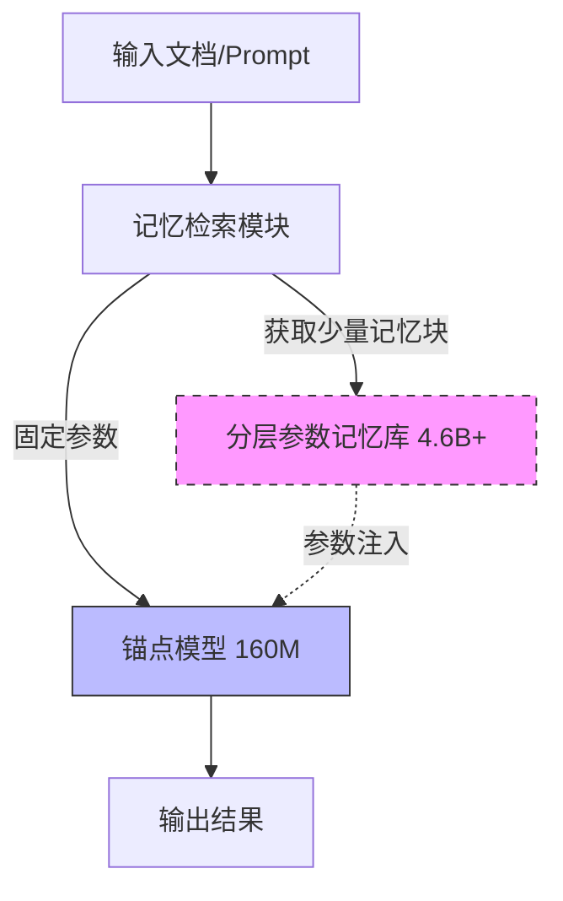

# 预训练与分层记忆：分离长尾知识与常识

## 一、论文基础元数据
- 原文标题：Pretraining with hierarchical memories: separating long-tail and common knowledge
- 中文译版：预训练与分层记忆：分离长尾知识与常识
- 发表渠道：arXiv 预印本 (计算机科学 - 计算语言学)
- 发表时间：2025 年 (arXiv 版本日期 2026 年 3 月 23 日)
- 链接：arXiv:2510.02375
- 作者及核心机构：Hadi Pouransari, David Grangier, C Thomas, Michael Kirchhof, Oncel Tuzel (Apple)
- 研究领域：人工智能 (一级) + 大语言模型/高效深度学习 (二级)
- 关联数据集：DCLM-Baseline (规模待补充/语言英文/标注无监督)

## 二、论文综合评价
### 2.1 量化评分（1-5 分，5 分为最优）

| 评价维度 | 评分 | 备注 |
| -------- | ---- | ---- |
| 📚 理论基础 | ⭐⭐⭐⭐ | 知识解耦理论清晰，参数记忆化有依据 |
| 🎯 问题核心性 | ⭐⭐⭐⭐⭐ | 直击大模型参数冗余与边缘部署痛点 |
| 💡 方法创新性 | ⭐⭐⭐⭐ | 分层参数记忆机制区别于传统 RAG |
| ⚙️ 技术壁垒 | ⭐⭐⭐ | 需修改 Transformer 架构，工程复杂度中 |
| 🧪 实验严谨性 | ⭐⭐⭐⭐ | 万亿 token 规模实验，长尾验证充分 |
| 🔧 落地可行性 | ⭐⭐⭐ | 内存检索开销需优化，适配边缘设备 |
| 🚀 应用前景 | ⭐⭐⭐⭐ | 显著降低推理成本，利于端侧智能 |
| 📊 综合评分 | 3.9 | 创新性强且实验扎实，工程落地待验证 |

### 2.2 定性综合评价（≤300 字）
> 核心概括：本研究针对大模型参数冗余问题，提出“锚点模型 + 分层参数记忆库”架构。核心价值在于将长尾知识存储于外部参数记忆，锚点模型专注常识与推理。差异化优势在于无需额外检索模型，直接通过参数fetching 实现知识增强。关键结论显示，160M 模型辅以少量记忆参数即可媲美 2 倍参数量的常规模型，尤其在长尾知识任务上准确率从 17% 提升至 83%。

## 三、领域本体论映射
| 核心维度 | 具体内容 |
| -------- | -------- |
| 核心研究对象 | 大语言模型中的知识存储机制与参数效率 |
| 核心技术路径 | 分层前馈记忆网络 (Hierarchical Feed-Forward Memories) |
| 数据/载体形态 | 万亿级 Token 文本数据 / 参数化记忆块 |
| 核心功能目标 | 分离长尾知识与常识，提升边缘设备推理效率 |
| 验证核心指标 | 精确匹配率 (Exact Match)、参数量效率比 |

## 四、核心问题与解决方案
### 4.1 待解决的核心问题
1. **领域级根本问题**：大模型将所有世界知识压缩进参数导致冗余，边缘设备内存/算力受限。
2. **现有方法痛点**：传统缩放定律下，增加参数才能增加知识，但大部分长尾知识使用频率极低。
3. **工程落地卡点**：端侧设备无法加载超大模型，且静态参数无法动态更新知识。

### 4.2 核心解决方案
- 理论框架：知识解耦理论，将常识/推理与长尾事实分离存储。
- 核心架构：锚点模型 (Anchor Model) + 分层参数记忆库 (Hierarchical Memory Bank)。
- 关键技术：上下文相关的记忆块获取 (Context-dependent memory block fetching)。
- 创新机制：预训练阶段学习将长尾知识存入记忆参数，锚点模型作为通用能力基座。

### 4.3 核心优势（量化 + 定性）
1. 性能优势：160M 模型 +18M 记忆 ≈ 常规 2 倍参数量模型性能。
2. 效率优势：推理时仅加载少量记忆块，降低活跃参数量。
3. 工程优势：适配现有硬件范式，支持后验 (post-hoc) 添加记忆。

## 五、方法与技术架构
### 5.1 核心架构设计
> 文字描述：输入文档首先触发记忆检索机制，从巨大的分层记忆库中获取小型上下文相关记忆块。该记忆块与固定的锚点模型参数结合，共同完成前向传播。锚点模型保持较小规模，负责通用推理；记忆块负责特定事实知识。

### 5.2 关键技术实现细节
| 技术模块 | 实现路径 | 工程注意事项 |
| -------- | -------- | ------------ |
| 锚点模型 | 小型 Transformer，捕捉常识与推理 | 需确保基础泛化能力不退化 |
| 记忆库 | 分层前馈网络参数，存储长尾知识 | 记忆索引效率与存储压缩 |
| 检索机制 | 基于输入上下文的参数块获取 | 检索延迟需低于推理增益 |
| 依赖组件 | 标准 Transformer 架构修改 | 需定制算子支持参数动态加载 |

### 5.3 架构优缺点
- 优点：显著降低活跃参数量，长尾知识更新无需重训主模型。
- 缺点：引入检索开销，记忆库管理复杂度增加，可能增加显存碎片。

## 六、实验设计与结果分析
### 6.1 实验基础设置
| 维度 | 内容 |
| ---- | ---- |
| 数据集 | DCLM-Baseline, 万亿级 Token 规模 |
| 基线方法 | 常规稠密 Transformer 模型 (同等参数量) |
| 实验环境 | 待补充 (推测为 Apple 内部集群) |
| 评价指标 | 精确匹配率 (Exact Match),  perplexity |

### 6.2 核心实验结果
| 方法 | 核心指标 1 (原子序数准确率) | 核心指标 2 (参数量效率) | 工程指标（算力/耗时） |
| ---- | --------- | --------- | -------------------- |
| 基线 1.4B | 17% (低频元素桶) | 1.0x | 基准 |
| 基线 160M | 待补充 | 0.11x | 低 |
| 本文方法 (160M+18M) | 83% (低频元素桶) | 媲美 2x 参数模型 | 检索 + 推理开销 |

### 6.3 消融实验/鲁棒性分析
| 实验变体 | 指标变化 | 核心结论 |
| -------- | -------- | -------- |
| 记忆比例≃10% | 性能显著提升 | 少量记忆即可覆盖关键长尾知识 |
| 不同模型规模 (160M-1.4B) | 均获得增益 | 方法具有架构无关的鲁棒性 |
| 预训练 vs 后验添加 | 均有效 | 支持灵活部署策略 |

### 6.4 实验结论（工程视角）
在资源受限场景下，通过分配约 10% 的参数作为记忆，可大幅提升知识密集型任务表现，且无需成倍增加主模型规模，适合端侧部署。

## 七、领域贡献与创新点
| 贡献层级 | 具体内容 |
| -------- | -------- |
| 理论贡献 | 验证了知识与推理能力在参数层面可解耦 |
| 方法/架构贡献 | 提出分层前馈记忆机制，实现参数化知识检索 |
| 数据/工具贡献 | 开源代码 (ml-memory-pretraining) |
| 实验/验证贡献 | 万亿 Token 规模验证，长尾知识效果显著 |
| 工程落地贡献 | 为边缘设备运行大模型提供新范式 |

## 八、局限性与风险
| 维度 | 具体描述 | 应对思路 |
| ---- | -------- | -------- |
| 学术局限性 | 记忆库构建的具体聚类算法细节未完全披露 | 后续补充技术报告 |
| 工程落地风险 | 记忆检索延迟可能抵消推理加速收益 | 优化索引结构，硬件级缓存 |
| 伦理/合规风险 | 记忆库可能存储敏感或偏见知识 | 建立记忆库审核与过滤机制 |

## 九、未来研究/落地方向
| 方向类型 | 具体内容 | 优先级 |
| -------- | -------- | ------ |
| 科研拓展 | 研究记忆库的动态更新与遗忘机制 | 高 |
| 工程优化 | 针对 NPU/GPU 优化的记忆加载算子 | 高 |
| 跨领域适配 | 扩展至多模态模型的记忆增强 | 中 |

## 十、关键词与术语表
| 语言 | 关键词 |
| ---- | ------ |
| 中文 | 分层记忆、长尾知识、参数效率、锚点模型 |
| 英文 | Hierarchical Memories, Long-tail Knowledge, Parameter Efficiency, Anchor Model |
| 领域专属术语 | Parametric Memory (参数记忆): 将知识编码为模型参数而非外部数据库 |

## 十一、参考文献与关联资源
- 核心参考文献：Roberts et al., 2020 (Knowledge memorization); Yang et al., 2025 (Qwen3)
- 补充阅读：Scaling Laws for Neural Language Models
- 开源代码/工具：https://github.com/apple/ml-memory-pretraining

## 十二、阅读者批注
1. **科研启发**：参数记忆化可能是 RAG 之外的另一条知识增强路径，避免了检索生成的一致性问题。
2. **工程落地思考**：在端侧设备上，记忆库可预加载，根据用户场景动态激活，节省运行时内存。
3. **待验证/存疑点**：记忆检索的具体延迟数据未提供，实际推理速度提升需实测。
4. **个人/团队应用场景**：适用于个人助理类应用，需频繁查询用户特定长尾信息但主模型需保持轻量。

## 十三、阅读元信息
| 维度 | 内容 |
| ---- | ---- |
| 阅读日期 | 2026-04-08 23:59 |
| 阅读人 | xPaperReader AI |
| 文档编号 | arxiv-2510.02375 |
| 版本迭代 | v1.0 |