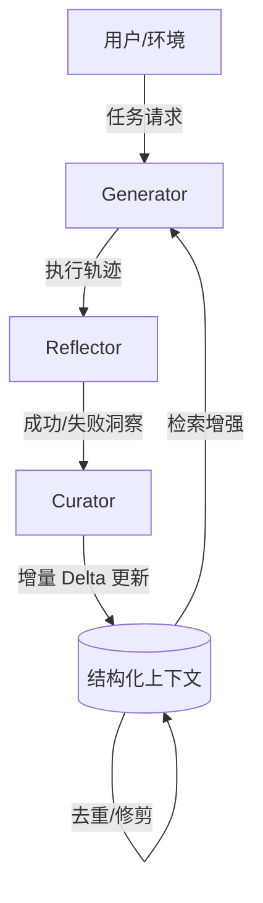

# 代理上下文工程：用于自改进语言模型的上下文进化

## 一、论文基础元数据
- 原文标题：Agentic Context Engineering: Evolving Contexts for Self-Improving Language Models
- 中文译版：代理上下文工程：用于自改进语言模型的上下文进化
- 发表渠道：预印本 (arXiv)
- 发表时间：2025 年
- 链接：arXiv:2510.04618
- 作者及核心机构：Qizheng Zhang, James Zou, Kunle Olukotun 等（斯坦福大学等）
- 研究领域：人工智能 + 大语言模型/代理系统
- 关联数据集：AppWorld, FiNER, DDXPlus, BIRD-SQL（多领域基准/多语言/执行反馈标注）

## 二、论文综合评价
### 2.1 量化评分（1-5 分，5 分为最优）

| 评价维度 | 评分 | 备注 |
| -------- | ---- | ---- |
| 📚 理论基础 | ⭐⭐⭐⭐ | 基于上下文学习与代理架构理论 |
| 🎯 问题核心性 | ⭐⭐⭐⭐⭐ | 直击上下文坍塌与简洁性偏差痛点 |
| 💡 方法创新性 | ⭐⭐⭐⭐⭐ | 增量 Delta 更新机制具有显著创新 |
| ⚙️ 技术壁垒 | ⭐⭐⭐⭐ | 需构建多代理协作与状态管理系统 |
| 🧪 实验严谨性 | ⭐⭐⭐⭐⭐ | 多基准测试且包含详细消融与成本分析 |
| 🔧 落地可行性 | ⭐⭐⭐⭐ | 成本大幅降低，兼容现有 KV Cache 机制 |
| 🚀 应用前景 | ⭐⭐⭐⭐⭐ | 适用于复杂 Agent 任务与持续学习场景 |
| 📊 综合评分 | 4.6 | 高效解决上下文丢失问题，工程价值极高 |

### 2.2 定性综合评价（≤300 字）
> 核心概括：研究定位、核心价值、差异化优势、关键结论

本研究定位为测试时上下文适应框架，核心价值在于无需更新权重即可实现模型自我改进。差异化优势在于提出了“增量 Delta 更新”机制，有效避免了传统方法中的“上下文坍塌”和“简洁性偏差”问题。关键结论表明，ACE 框架在 Agent 任务及领域推理中显著优于 GEPA 等基线，同时将适配成本降低 80% 以上，证明了结构化上下文进化在长程任务中的卓越性能与效率。

## 三、领域本体论映射
| 核心维度 | 具体内容 |
| -------- | -------- |
| 核心研究对象 | 大语言模型的上下文记忆系统 |
| 核心技术路径 | 代理协作（生成 - 反射 - 策展）+ 增量更新 |
| 数据/载体形态 | 结构化条目化子弹点（带元数据） |
| 核心功能目标 | 实现离线系统提示优化与在线测试时适应 |
| 验证核心指标 | 任务准确率、Token 消耗量、延迟、缓存命中率 |

## 四、核心问题与解决方案
### 4.1 待解决的核心问题
1. **领域级根本问题**：如何在不动模型权重的前提下，让 LLM 持续积累领域知识并自我改进？
2. **现有方法痛点**：全量重写导致“上下文坍塌”（信息压缩丢失）；优化趋向“简洁性偏差”（丢失细节多样性）。
3. **工程落地卡点**：长上下文导致推理成本高昂；历史知识难以保留与复用。

### 4.2 核心解决方案
- 理论框架：代理上下文工程（Agentic Context Engineering, ACE）。
- 核心架构：Generator（生成轨迹）- Reflector（提取洞察）- Curator（整合更新）。
- 关键技术：增量 Delta 更新、结构化条目管理、语义去重与修剪。
- 创新机制：仅更新相关条目而非全量重写，利用执行信号（成功/失败）驱动反思。

### 4.3 核心优势（量化+定性）
1. 性能优势：AppWorld 任务准确率提升 10.6%，医疗推理提升 15.0%。
2. 效率优势：适配阶段输入 Token 减少 80.8%，评估阶段计费成本降低 82.6%。
3. 工程优势：支持 KV Cache 复用（91.8% 命中率），超参数鲁棒性强。

## 五、方法与技术架构
### 5.1 核心架构设计
ACE 框架通过三元组代理协作管理上下文进化。Generator 执行任务产生轨迹，Reflector 分析轨迹提取洞察，Curator 将洞察以增量方式写入结构化 Playbook。

### 5.2 关键技术实现细节
| 技术模块 | 实现路径 | 工程注意事项 |
| -------- | -------- | ------------ |
| Generator | 基于当前上下文执行任务，生成推理轨迹 | 需确保执行环境可反馈成功/失败信号 |
| Reflector | 分析轨迹，提取具体规则或代码片段 | 弱模型亦可胜任，但强模型增益更大 |
| Curator | 将新洞察合并为条目，更新计数器 | 需处理语义去重，防止上下文无限膨胀 |
| 依赖组件 | 向量数据库（用于去重）、KV Cache 机制 | 需优化缓存命中率以降低实际成本 |

### 5.3 架构优缺点
- 优点：避免信息丢失，支持细粒度知识管理，成本显著低于全量优化。
- 缺点：依赖反射器质量，若无法提取有效洞察则效果受限；需任务环境提供反馈信号。

## 六、实验设计与结果分析
### 6.1 实验基础设置
| 维度 | 内容 |
| ---- | ---- |
| 数据集 | AppWorld, FiNER, DDXPlus, BIRD-SQL |
| 基线方法 | Base LLM, ICL, MIPROv2, GEPA, Dynamic Cheatsheet |
| 实验环境 | DeepSeek-V3.1 (非思考模式), 统一模型避免知识转移 |
| 评价指标 | 准确率 (Accuracy), Token 用量，延迟，成本 |

### 6.2 核心实验结果
| 方法 | 核心指标 1 (准确率) | 核心指标 2 (提升幅度) | 工程指标（算力/耗时） |
| ---- | --------- | --------- | -------------------- |
| 基线 (GEPA) | 75.2% (FiNER) | - | 输入 Token 基准 |
| 基线 (DC) | 59.4% (AppWorld) | - | 延迟基准 |
| 本文方法 | 90.2% (FiNER) | +15.0% (FiNER) | 输入 Token 减少 80.8% |

### 6.3 消融实验/鲁棒性分析
| 实验变体 | 指标变化 | 核心结论 |
| -------- | -------- | -------- |
| 移除增量更新 | AppWorld TGC -11.7% | 增量更新是防止上下文坍塌的关键 |
| 反射器变弱 | 性能仍优于基线 | 框架对反射器模型质量不敏感 |
| 反射轮数>5 | 性能下降 | 5 轮为最佳平衡点，过多引入噪声 |

### 6.4 实验结论（工程视角）
ACE 在保持高性能的同时大幅降低了适配和推理成本。KV Cache 的高复用率使其在实际部署中极具竞争力，但需确保任务环境能提供可靠的执行反馈信号以避免噪声污染。

## 七、领域贡献与创新点
| 贡献层级 | 具体内容 |
| -------- | -------- |
| 理论贡献 | 定义了上下文坍塌与简洁性偏差的机制及解决方案 |
| 方法/架构贡献 | 提出 ACE 框架及增量 Delta 更新机制 |
| 数据/工具贡献 | 构建了可进化的结构化上下文存储格式 |
| 实验/验证贡献 | 在多领域基准上验证了效率与性能的双重优势 |
| 工程落地贡献 | 证明了测试时适应可大幅降低 Token 成本与延迟 |

## 八、局限性与风险
| 维度 | 具体描述 | 应对思路 |
| ---- | -------- | -------- |
| 学术局限性 | 依赖反射器提取洞察的能力，纯文本无反馈任务效果受限 | 结合外部验证器或人工反馈强化信号 |
| 工程落地风险 | 上下文无限增长可能导致检索效率下降 | 实施更严格的修剪策略与分层存储 |
| 伦理/合规风险 | 上下文可能存储敏感信息，需支持选择性遗忘 | 开发基于条目的隐私移除机制 |

## 九、未来研究/落地方向
| 方向类型 | 具体内容 | 优先级 |
| -------- | -------- | ------ |
| 科研拓展 | 探索无反馈信号下的上下文自进化机制 | 高 |
| 工程优化 | 实现选择性遗忘以符合隐私/法律要求 | 高 |
| 跨领域适配 | 适配到多模态任务及更长程的自主代理场景 | 中 |

## 十、关键词与术语表
| 语言 | 关键词 |
| ---- | ------ |
| 中文 | 代理上下文工程，增量更新，上下文坍塌，自我改进 |
| 英文 | Agentic Context Engineering, Incremental Delta Updates, Context Collapse, Self-Improving |
| 领域专属术语 | 简洁性偏差 (Brevity Bias)：优化倾向于收敛到简短通用提示词的现象 |
| 领域专属术语 | 结构化条目 (Itemized Bullets)：带元数据的上下文存储单元 |

## 十一、参考文献与关联资源
- 核心参考文献：GEPA (Genetic-Pareto), Dynamic Cheatsheet, ReAct.
- 补充阅读：关于 Prompt Optimization 及 Test-time Training 的相关综述。
- 开源代码/工具：待补充（论文未明确提及开源地址）。

## 十二、阅读者批注
1. **科研启发**：上下文管理不应是静态的，增量式更新比全量重写更符合知识积累规律。
2. **工程落地思考**：KV Cache 复用带来的成本降低是落地关键，需在实际系统中优化缓存策略。
3. **待验证/存疑点**：在完全无执行反馈的纯生成任务（如创意写作）中效果如何？
4. **个人/团队应用场景**：适用于构建垂直领域的客服 Agent 或代码辅助工具，需积累领域规则。

## 十三、阅读元信息
| 维度 | 内容 |
| ---- | ---- |
| 阅读日期 | 2026-04-09 00:13 |
| 阅读人 | xPaperReader AI |
| 文档编号 | arxiv-2510.04618 |
| 版本迭代 | v1.0 |