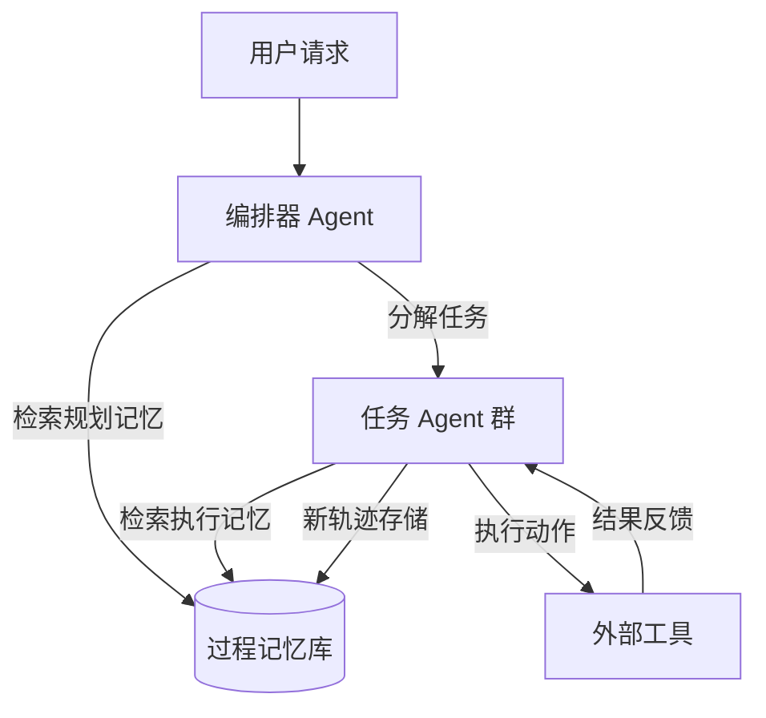

# LEGOMem：面向工作流自动化的多智能体 LLM 系统模块化过程记忆

## 一、论文基础元数据
- 原文标题：LEGOMem: Modular Procedural Memory for Multi-agent LLM Systems for Workflow Automation
- 中文译版：LEGOMem：面向工作流自动化的多智能体 LLM 系统模块化过程记忆
- 发表渠道（期刊/会议/预印本，标注等级）：AAMAS 2026 (CCF B 类会议) / arXiv 预印本
- 发表时间：2025 年 10 月 (arXiv) / 2026 年 5 月 (会议)
- 链接（arXiv/DOI）：https://arxiv.org/abs/2510.04851 (待补充 DOI)
- 作者及核心机构：Dongge Han 等 (Microsoft)
- 研究领域（一级领域 + 二级子领域）：人工智能 / 多智能体系统与工作流自动化
- 关联数据集（名称/规模/语言/标注）：OfficeBench (规模待补充/ 英文 / 任务标注)

## 二、论文综合评价
### 2.1 量化评分（1-5 分，5 分为最优）

| 评价维度 | 评分 | 备注 |
| -------- | ---- | ---- |
| 📚 理论基础 | ⭐⭐⭐⭐ | 过程记忆理论框架清晰，模块化设计合理 |
| 🎯 问题核心性 | ⭐⭐⭐⭐⭐ | 直击多智能体无状态、无法复用经验痛点 |
| 💡 方法创新性 | ⭐⭐⭐⭐ | 记忆在编排器与任务代理间的分配机制新颖 |
| ⚙️ 技术壁垒 | ⭐⭐⭐ | 基于现有 LLM 架构，核心在于系统设计 |
| 🧪 实验严谨性 | ⭐⭐⭐⭐ | 基于 OfficeBench 基准，系统性对比研究 |
| 🔧 落地可行性 | ⭐⭐⭐⭐⭐ | 微软出品，面向生产力场景，落地性强 |
| 🚀 应用前景 | ⭐⭐⭐⭐⭐ | 智能体经济核心组件，自动化需求广泛 |
| 📊 综合评分 | 4.3 | 框架实用性强，显著提升小模型工作流能力 |

### 2.2 定性综合评价（≤300 字）
> 核心概括：研究定位、核心价值、差异化优势、关键结论
本文定位为多智能体工作流自动化中的记忆增强框架。核心价值在于解决了当前系统“无状态”导致无法复用经验的问题。差异化优势在于提出了模块化的过程记忆分配机制，区分了编排器记忆与代理记忆的不同作用。关键结论表明：编排器记忆对任务分解至关重要，细粒度代理记忆提升执行准确率，且能显著缩小小模型与大模型的性能差距。该研究兼具工程实用性与学术探索价值。

## 三、领域本体论映射
| 核心维度 | 具体内容 |
| -------- | -------- |
| 核心研究对象 | 多智能体 LLM 系统（Multi-agent LLM Systems） |
| 核心技术路径 | 模块化过程记忆（Modular Procedural Memory） |
| 数据/载体形态 | 任务轨迹（Task Trajectories）、记忆单元（Memory Units） |
| 核心功能目标 | 工作流自动化中的规划与执行支持（Planning & Execution） |
| 验证核心指标 | 任务分解有效性、执行准确率、模型性能差距缩小程度 |

## 四、核心问题与解决方案
### 4.1 待解决的核心问题
1. **领域级根本问题**：多智能体系统缺乏长期记忆，无法从历史经验中学习技能。
2. **现有方法痛点**：当前系统多为无状态和事务性的，每次任务从头开始，无法复用过往轨迹。
3. **工程落地卡点**：记忆在多智能体间的分配策略不明，协调与专业化挑战未被解决。

### 4.2 核心解决方案
- 理论框架：模块化过程记忆框架（LEGOMem）。
- 核心架构：将记忆单元灵活分配给编排器（Orchestrators）和任务代理（Task Agents）。
- 关键技术：任务轨迹分解、记忆检索机制、记忆分配策略。
- 创新机制：区分编排层记忆（用于分解/委派）与执行层记忆（用于准确执行）。

### 4.3 核心优势（量化 + 定性）
1. 性能优势：显著提升任务分解有效性和执行准确率。
2. 效率优势：小模型团队利用记忆可缩小与大模型的性能差距。
3. 工程优势：模块化设计支持灵活配置，适用于不同规模智能体团队。

## 五、方法与技术架构
### 5.1 核心架构设计
> 文字描述 + 架构图（Mermaid/图片）
LEGOMem 架构包含记忆库、编排器记忆模块和任务代理记忆模块。历史任务轨迹被分解为可重用的记忆单元，存储于中央记忆库。编排器在规划阶段检索记忆以优化任务分解，任务代理在执行阶段检索记忆以优化工具使用。

### 5.2 关键技术实现细节
| 技术模块 | 实现路径 | 工程注意事项 |
| -------- | -------- | ------------ |
| 记忆分解 | 将过往任务轨迹拆解为独立单元 | 需保证单元语义完整性 |
| 记忆检索 | 基于语义相似度匹配历史轨迹 | 需控制检索延迟与噪音 |
| 记忆分配 | 动态决定记忆投向编排器或代理 | 需平衡上下文窗口限制 |
| 依赖组件 | LLM  backbone, 向量数据库 | 需兼容不同尺寸模型 |

### 5.3 架构优缺点
- 优点：灵活性高，针对性强，能有效提升小模型能力。
- 缺点：记忆管理带来额外开销，检索准确性依赖嵌入质量。

## 六、实验设计与结果分析
### 6.1 实验基础设置
| 维度 | 内容 |
| ---- | ---- |
| 数据集 | OfficeBench 基准测试集 |
| 基线方法 | 无记忆多智能体系统、单智能体记忆系统 (待补充具体名称) |
| 实验环境 | 微软内部计算集群 (待补充具体配置) |
| 评价指标 | 任务成功率、规划准确性、工具使用准确率 |

### 6.2 核心实验结果
| 方法 | 核心指标 1(任务成功率) | 核心指标 2(规划准确性) | 工程指标（算力/耗时） |
| ---- | --------- | --------- | -------------------- |
| 基线 1(无记忆) | 待补充 | 待补充 | 低 |
| 基线 2(单代理记忆) | 待补充 | 待补充 | 中 |
| 本文方法 (LEGOMem) | 显著提升 | 显著提升 | 中偏高 (检索开销) |

### 6.3 消融实验/鲁棒性分析
| 实验变体 | 指标变化 | 核心结论 |
| -------- | -------- | -------- |
| 仅编排器记忆 | 任务分解提升，执行持平 | 编排记忆对分解至关重要 |
| 仅代理记忆 | 分解持平，执行提升 | 代理记忆改善执行精度 |
| 小模型 +LEGOMem | 性能接近大模型 | 记忆可弥补模型能力不足 |

### 6.4 实验结论（工程视角）
在生产环境中，应优先为编排器配置记忆以优化工作流结构，其次为具体执行代理配置记忆以减少错误。小模型团队配合记忆系统是高性价比方案。

## 七、领域贡献与创新点
| 贡献层级 | 具体内容 |
| -------- | -------- |
| 理论贡献 | 系统化研究了多智能体系统中过程记忆的设计空间 |
| 方法/架构贡献 | 提出了 LEGOMem 模块化记忆分配框架 |
| 数据/工具贡献 | 基于 OfficeBench 进行了系统性评估 (待补充是否开源代码) |
| 实验/验证贡献 | 验证了记忆位置对不同类型的智能体影响不同 |
| 工程落地贡献 | 证明了记忆增强可降低成本（使用小模型达到大模型效果） |

## 八、局限性与风险
| 维度 | 具体描述 | 应对思路 |
| ---- | -------- | -------- |
| 学术局限性 | 实验主要集中在办公场景，通用性待验证 | 扩展至跨领域工作流测试 |
| 工程落地风险 | 记忆库膨胀可能导致检索效率下降 | 引入记忆遗忘或压缩机制 |
| 伦理/合规风险 | 记忆可能存储敏感用户操作数据 | 实施数据脱敏与访问控制 |

## 九、未来研究/落地方向
| 方向类型 | 具体内容 | 优先级 |
| -------- | -------- | ------ |
| 科研拓展 | 研究记忆在多模态智能体中的迁移能力 | 中 |
| 工程优化 | 优化记忆检索延迟，实现实时响应 | 高 |
| 跨领域适配 | 适配代码开发、数据分析等非办公场景 | 高 |

## 十、关键词与术语表
| 语言 | 关键词 |
| ---- | ------ |
| 中文 | 多智能体系统、过程记忆、工作流自动化、大语言模型、记忆分配 |
| 英文 | Multi-agent systems, Procedural memory, Workflow Automation, LLM Agents, Memory Allocation |
| 领域专属术语 | （术语 + 定义） Orchestrator Memory: 用于任务分解和委派的控制层记忆 Task Trajectories: 智能体过往执行任务的完整记录序列 |

## 十一、参考文献与关联资源
- 核心参考文献：Synapse [37], Agent Workflow Memory (AWM) [29] (文中提及)
- 补充阅读：多智能体协作相关综述 (待补充)
- 开源代码/工具：待补充 (通常微软研究会在 GitHub 发布)

## 十二、阅读者批注
1. **科研启发**：记忆不再是单点的向量检索，而是需要结构化地分配给不同角色的智能体，这是一个重要的设计范式转变。
2. **工程落地思考**：在企业内部部署 Agent 时，应优先构建“编排层记忆库”，沉淀最佳实践流程，再逐步完善执行层记忆。
3. **待验证/存疑点**：记忆更新机制如何避免错误轨迹的污染？长期记忆的压缩策略未详细说明。
4. **个人/团队应用场景**：适用于客服自动化流程、内部 IT 运维工单处理等重复性高但需灵活决策的场景。

## 十三、阅读元信息
| 维度 | 内容 |
| ---- | ---- |
| 阅读日期 | 2026-04-09 00:23 |
| 阅读人 | xPaperReader AI |
| 文档编号 | arxiv-2510.04851 |
| 版本迭代 | v1.0 |