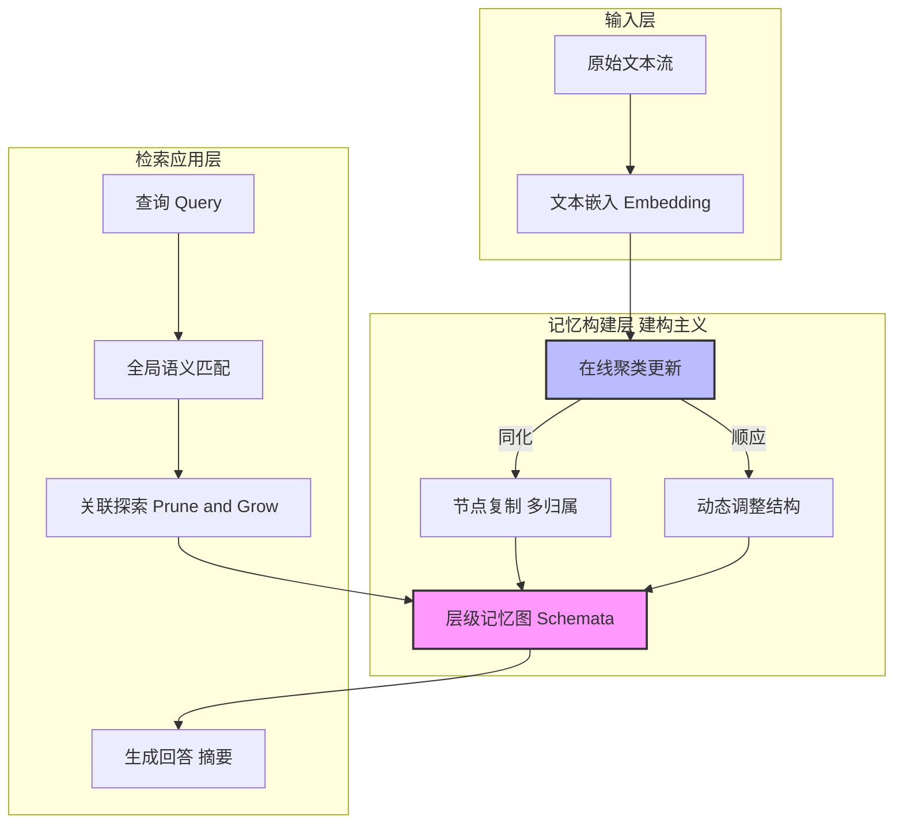

# CAM：基于建构主义视角的 LLM 阅读理解代理记忆框架

## 一、论文基础元数据
- 原文标题：CAM: A Constructivist View of Agentic Memory for LLM-Based Reading Comprehension
- 中文译版：CAM：基于建构主义视角的 LLM 阅读理解代理记忆框架
- 发表渠道：预印本（arXiv）
- 发表时间：2025 年
- 链接：arXiv:2510.05520
- 作者及核心机构：Rui Li, Zeyu Zhang, Xiaohe Bo, Zihang Tian, Xu Chen, Quanyu Dai, Zhenhua Dong, Ruiming Tang（机构未知）
- 研究领域：人工智能（一级）+ 大模型记忆机制/阅读理解（二级）
- 关联数据集：NovelQA, QMSum, FABLES, MultiHop-RAG, ODSum, HotpotQA（规模/标注未知，语言主要为英文）

## 二、论文综合评价
### 2.1 量化评分（1-5 分，5 分为最优）

| 评价维度 | 评分 | 备注 |
| -------- | ---- | ---- |
| 📚 理论基础 | 5 | 建构主义理论引入记忆设计，理论基础深厚 |
| 🎯 问题核心性 | 5 | 长文本记忆管理是 LLM 落地关键痛点，核心性强 |
| 💡 方法创新性 | 5 | 首次兼具结构性灵活性与动态性，创新显著 |
| ⚙️ 技术壁垒 | 4 | 增量聚类与节点复制机制，技术实现复杂 |
| 🧪 实验严谨性 | 5 | 六数据集多基线对比，消融实验设计严谨 |
| 🔧 落地可行性 | 4 | 在线批量插入效率高，工程落地可行性强 |
| 🚀 应用前景 | 5 | 适用于连载小说新闻追踪，应用前景广阔 |
| 📊 综合评分 | 4.7 | 理论创新与工程效率兼备，长文本记忆解决方案标杆 |

### 2.2 定性综合评价（≤300 字）
> 核心概括：研究定位、核心价值、差异化优势、关键结论

本研究定位为提升 LLM 长文本阅读理解能力的代理记忆框架。核心价值在于首次将皮亚杰建构主义理论应用于记忆系统设计，解决了现有方法无法兼顾结构性、灵活性与动态性的痛点。差异化优势体现在通过节点复制实现多义性捕捉，以及基于增量聚类的在线结构更新，避免了全量重建的高成本。关键结论表明，CAM 在多个基准测试中性能平均提升约 3.0%，且在线更新效率比离线方法快 4 倍，证明了记忆架构设计比单纯依赖模型规模更有效，为认知型 LLM 智能体提供了清晰蓝图。

## 三、领域本体论映射
| 核心维度 | 具体内容 |
| -------- | -------- |
| 核心研究对象 | LLM 长文本阅读理解中的代理记忆模块 |
| 核心技术路径 | 建构主义理论驱动的分层图式记忆与增量更新 |
| 数据/载体形态 | 非结构化文本流转化为层级记忆图（Memory Graph） |
| 核心功能目标 | 实现记忆的结构化存储、灵活整合与动态适应 |
| 验证核心指标 | ROUGE, ACC-L, Exact Match (EM), F1, 插入耗时 |

## 四、核心问题与解决方案
### 4.1 待解决的核心问题
1. **领域级根本问题**：LLM 上下文窗口有限，长文本处理性能随长度增加而下降。
2. **现有方法痛点**：无结构方法（如 MemGPT）难处理分散信息；结构化方法（如 MemTree）节点归属单一缺乏灵活性；动态方法（如 GraphRAG）多为离线重建，不支持高效在线更新。
3. **工程落地卡点**：长文本记忆系统难以同时满足结构性、灵活性和动态性，且在线更新成本过高。

### 4.2 核心解决方案
- 理论框架：让·皮亚杰建构主义理论（图式、同化、顺应）。
- 核心架构：CAM (Constructivist Agentic Memory) 分层记忆图。
- 关键技术：自我中心解缠（节点复制）、在线聚类更新（增量标签传播）、关联检索（Prune-and-Grow）。
- 创新机制：允许低层单元同时归属多个高层抽象（Many-to-Many 映射），支持批量在线插入无需全量重建。

### 4.3 核心优势（量化 + 定性）
1. 性能优势：在所有数据集和指标上 consistently 优于基线，平均提升约 3.0%。
2. 效率优势：在线批量插入时间成本呈次线性增长，比离线重建方法快 4 倍。
3. 工程优势：不依赖昂贵闭源模型，开源模型下性能仅轻微下降，架构兼容多种检索策略。

## 五、方法与技术架构
### 5.1 核心架构设计
CAM 架构模拟人类认知过程，包含自底向上的图式构建、灵活的同化机制及动态的顺应更新。输入文本经过嵌入后，通过增量聚类形成层级节点，支持多父节点关联，检索时采用剪枝与生长策略。

### 5.2 关键技术实现细节
| 技术模块 | 实现路径 | 工程注意事项 |
| -------- | -------- | ------------ |
| 结构化图式 | 自底向上构建层级记忆图，整合抽象与细节 | 需平衡层级深度与检索效率 |
| 灵活同化 | 节点复制技术，实现低层单元多高层归属 | 避免节点冗余导致存储爆炸 |
| 动态顺应 | 基于增量标签传播算法，局部调整结构 | 确保批量插入时的结构一致性 |
| 依赖组件 | GPT-4o-mini/Qwen2.5, text-embedding-3-small | 嵌入模型质量直接影响聚类效果 |

### 5.3 架构优缺点
- 优点：支持在线高效更新，捕捉信息多义性，不依赖特定大模型，复杂推理能力强。
- 缺点：依赖 LLM 生成层级摘要可能传播幻觉，无法处理源文本内部矛盾信息，超参数固定缺乏自适应。

## 六、实验设计与结果分析
### 6.1 实验基础设置
| 维度 | 内容 |
| ---- | ---- |
| 数据集 | NovelQA, QMSum, FABLES, MultiHop-RAG, ODSum, HotpotQA |
| 基线方法 | MemGPT, ReadAgent, RAPTOR, GraphRAG, HippoRAG, MemTree |
| 实验环境 | GPT-4o-mini + text-embedding-3-small (默认) |
| 评价指标 | ROUGE, ACC-L, EM, F1, 插入耗时 |

### 6.2 核心实验结果
| 方法 | 核心指标 1 (平均性能) | 核心指标 2 (复杂推理) | 工程指标（算力/耗时） |
| ---- | --------- | --------- | -------------------- |
| 基线 1 (GraphRAG) | 基准 | 较弱 | 离线重建，耗时高 |
| 基线 2 (MemTree) | 基准 | 中等 | 在线但灵活性差 |
| 本文方法 (CAM) | 提升约 3.0% | 优势明显 | 在线插入快 4 倍 |

### 6.3 消融实验/鲁棒性分析
| 实验变体 | 指标变化 | 核心结论 |
| -------- | -------- | -------- |
| 移除层次聚类 | 性能明显下降 | 层次结构是设计原则关键要素 |
| 移除灵活性 (解缠) | 性能明显下降 | 多归属机制对捕捉多义性至关重要 |
| 替换开源模型 | 性能轻微下降 | 核心优势在于记忆设计而非模型本身 |

### 6.4 实验结论（工程视角）
CAM 在多种长文本任务中实现了稳健性能，优势不依赖昂贵 LLM backbone。避免了高成本细粒度知识建模，在复杂推理任务中表现突出，适合需要频繁更新记忆的在线场景。

## 七、领域贡献与创新点
| 贡献层级 | 具体内容 |
| -------- | -------- |
| 理论贡献 | 将认知发展理论（建构主义）成功应用于 LLM 记忆系统设计 |
| 方法/架构贡献 | 提出首个兼具结构性、灵活性和动态性的代理记忆框架 |
| 数据/工具贡献 | 代码已开源，提供可复现的长上下文在线阅读理解解决方案 |
| 实验/验证贡献 | 在 6 个基准数据集上验证了有效性与效率，包含详细消融实验 |
| 工程落地贡献 | 提供了高效、可靠的长上下文在线阅读理解解决方案，适用于连载小说等场景 |

## 八、局限性与风险
| 维度 | 具体描述 | 应对思路 |
| ---- | -------- | -------- |
| 学术局限性 | 仅专注于文本阅读理解，未拓展至行为规划、多模态 | 未来探索规划及多模态任务适配 |
| 工程落地风险 | 依赖 LLM 生成摘要，底层错误可能向上传播（幻觉） | 集成反思机制，开发矛盾信息检测模块 |
| 伦理/合规风险 | 依赖外部大模型 API 可能存在数据隐私风险 | 支持本地开源模型部署，加强数据脱敏 |

## 九、未来研究/落地方向
| 方向类型 | 具体内容 | 优先级 |
| -------- | -------- | ------ |
| 科研拓展 | 探索超参数自动化（如强化学习）及细粒度知识建模扩展 | 高 |
| 工程优化 | 开发可训练记忆控制器，实现记忆结构自适应优化 | 高 |
| 跨领域适配 | 应用于行为规划、推理及多模态任务场景 | 中 |

## 十、关键词与术语表
| 语言 | 关键词 |
| ---- | ------ |
| 中文 | 建构主义、代理记忆、长文本理解、增量聚类、节点复制 |
| 英文 | Constructivism, Agentic Memory, Long-context Understanding, Online Clustering, Node Replication |
| 领域专属术语 | 图式 (Schemata)：层级记忆结构；同化 (Assimilation)：新信息整合进现有结构；顺应 (Accommodation)：动态调整结构适应新信息 |

## 十一、参考文献与关联资源
- 核心参考文献：MemGPT, RAPTOR, GraphRAG, HippoRAG, MemTree 相关论文
- 补充阅读：让·皮亚杰建构主义理论相关著作
- 开源代码/工具：论文代码已开源（具体链接未知）

## 十二、阅读者批注
1. **科研启发**：认知心理学理论（如建构主义）为 LLM 架构设计提供了新的隐喻和方向，不仅限于注意力机制。
2. **工程落地思考**：在线增量更新机制对于实时性要求高的应用（如新闻追踪）至关重要，避免了全量重建的资源浪费。
3. **待验证/存疑点**：幻觉传播问题在长链条记忆中的具体影响程度需进一步量化；矛盾信息处理在实际业务中较为常见。
4. **个人/团队应用场景**：适用于构建企业知识库助手、长篇小说分析工具、实时情报追踪系统。

## 十三、阅读元信息
| 维度 | 内容 |
| ---- | ---- |
| 阅读日期 | 2026-04-09 00:36 |
| 阅读人 | xPaperReader AI |
| 文档编号 | arxiv-2510.05520 |
| 版本迭代 | v1.0 |