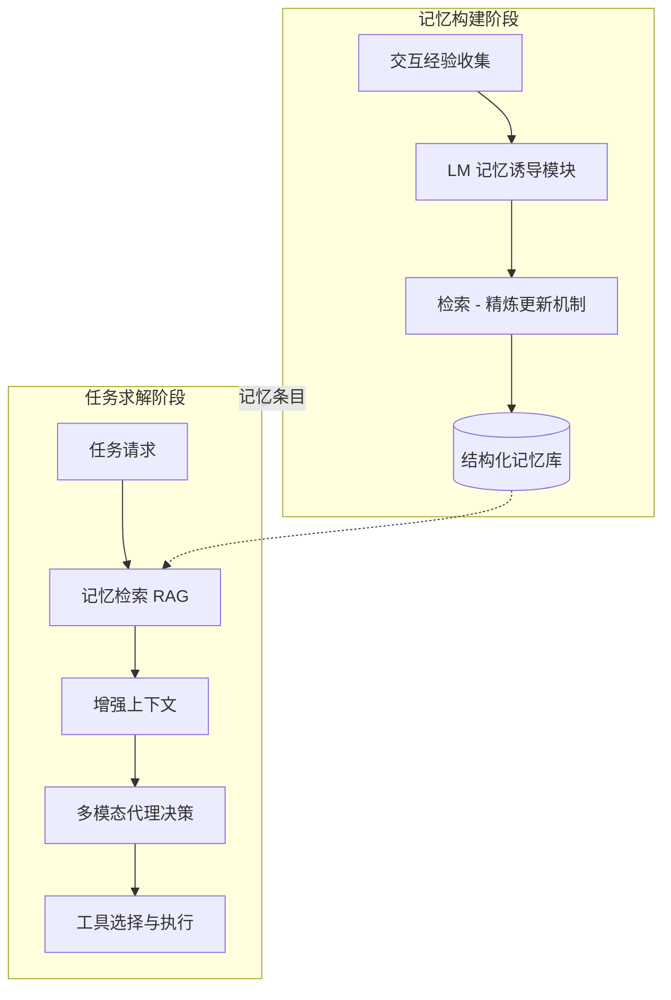

# ToolMem：通过可学习工具能力记忆增强多模态代理

## 一、论文基础元数据
- 原文标题：ToolMem: Enhancing Multimodal Agents with Learnable Tool Capability Memory
- 中文译版：ToolMem：通过可学习工具能力记忆增强多模态代理
- 发表渠道：预印本（arXiv）
- 发表时间：2025 年
- 链接：https://arxiv.org/abs/2510.06664
- 作者及核心机构：Yunzhong Xiao, Yangmin Li, Hewei Wang, Yunlong Tang, Zora Zhiruo Wang（机构待补充）
- 研究领域：人工智能 + 多模态代理/工具学习
- 关联数据集：BiGGen Bench（696 任务/103 模型）、GenAI-Bench（1600 指令/6 工具）

## 二、论文综合评价
### 2.1 量化评分（1-5 分，5 分为最优）

| 评价维度 | 评分 | 备注 |
| -------- | ---- | ---- |
| 📚 理论基础 | ⭐⭐⭐⭐ | 结合记忆机制与代理学习，理论扎实 |
| 🎯 问题核心性 | ⭐⭐⭐⭐⭐ | 直击生成式工具性能波动核心痛点 |
| 💡 方法创新性 | ⭐⭐⭐⭐⭐ | 提出结构化可学习工具能力记忆框架 |
| ⚙️ 技术壁垒 | ⭐⭐⭐⭐ | 依赖检索与精炼机制，实现难度中等 |
| 🧪 实验严谨性 | ⭐⭐⭐⭐⭐ | 双场景验证，指标丰富，对比充分 |
| 🔧 落地可行性 | ⭐⭐⭐⭐ | 轻量级设计，依赖 API，易于集成 |
| 🚀 应用前景 | ⭐⭐⭐⭐⭐ | 适用于多工具调度场景，通用性强 |
| 📊 综合评分 | 4.6 | 方法创新显著，实验充分，落地潜力大，具有较高参考价值 |

### 2.2 定性综合评价（≤300 字）
> 核心概括：研究定位、核心价值、差异化优势、关键结论

本研究定位为解决多模态代理在动态工具环境下的决策难题。核心价值在于提出 ToolMem 框架，通过结构化记忆模拟人类从经验中学习工具特性的过程。差异化优势在于摒弃静态假设，利用检索 - 精炼机制动态更新工具能力认知，显著优于 Few-Shot 基线。关键结论显示，该方法在文本和图像生成任务中大幅提升了性能预测准确性（MAE 降低 14.8%-28.7%）及工具选择准确率，尤其在弱模型场景下增益显著，有效平衡了预测精度与计算效率。

## 三、领域本体论映射
| 核心维度 | 具体内容 |
| -------- | -------- |
| 核心研究对象 | 多模态代理（Multimodal Agents）及其工具调用能力 |
| 核心技术路径 | 经验诱导记忆 + 检索增强生成（RAG）+ 记忆更新机制 |
| 数据/载体形态 | 任务 Prompt、工具解决方案、质量反馈（分数/文本） |
| 核心功能目标 | 优化工具选择、提升任务解决性能、增强决策鲁棒性 |
| 验证核心指标 | MAE、RMSE、Pearson 相关系数、工具选择准确率 |

## 四、核心问题与解决方案
### 4.1 待解决的核心问题
1. **领域级根本问题**：生成式工具（如 LLM、文生图模型）在不同任务场景下表现存在不确定性，难以静态评估。
2. **现有方法痛点**：现有代理通常假设工具行为固定或使用静态记忆，忽略工具性能波动，导致决策次优。
3. **工程落地卡点**：非专家用户难以准确预判工具能力，导致高级模型能力使用门槛高，推理效率低。

### 4.2 核心解决方案
- 理论框架：基于经验学习的闭环工具能力记忆框架。
- 核心架构：包含记忆初始化、经验诱导、记忆更新（检索 - 精炼）、任务求解（RAG）模块。
- 关键技术：结构化记忆分类（熟练度分类法）、LM 记忆诱导、检索增强记忆更新。
- 创新机制：将原始交互经验转化为结构化能力记忆，避免冗余并修正过时信息。

### 4.3 核心优势（量化+定性）
1. 性能优势：文本场景 MAE 降低 14.8%，图像场景 MAE 降低 28.7%，小模型增益显著。
2. 效率优势：轻量级设计，主要推理通过 API 完成，本地资源需求低。
3. 工程优势：相比 Few-Shot 策略更稳定，避免性能回退，降低工具选择错误率。

## 五、方法与技术架构
### 5.1 核心架构设计
> 文字描述 + 架构图（Mermaid/图片）

ToolMem 架构分为训练（记忆构建）与测试（任务求解）两个阶段。训练阶段通过收集交互经验，利用 LM 诱导生成结构化记忆并存入向量库；测试阶段通过 RAG 检索相关记忆条目，增强上下文以辅助工具选择与性能预测。

### 5.2 关键技术实现细节
| 技术模块 | 实现路径 | 工程注意事项 |
| -------- | -------- | ------------ |
| 记忆诱导 | 使用 LM 模块从经验中总结工具能力（优势/劣势） | 需确保诱导内容结构化，避免自然语言冗余 |
| 记忆更新 | 检索相关旧记忆（k=6），与新经验结合进行精炼 | 避免记忆冗余，修正过时信息，防止灾难性遗忘 |
| 依赖组件 | ChromaDB（检索）、OpenAI Embedding（嵌入）、GPT-4o（生成） | 注意 API 调用成本与延迟，嵌入模型需保持一致 |

### 5.3 架构优缺点
- 优点：模拟人类学习过程，记忆紧凑高效，对弱模型增益大，避免原始示例噪声。
- 缺点：依赖反馈质量，工具版本更新可能导致记忆过时，存在过度依赖历史经验风险。

## 六、实验设计与结果分析
### 6.1 实验基础设置
| 维度 | 内容 |
| ---- | ---- |
| 数据集 | BiGGen Bench（文本）、GenAI-Bench（图像） |
| 基线方法 | Generic Agent（无记忆）、Few-Shot Memory（原始示例） |
| 实验环境 | OpenAI API, 本地 clip-flant5-xl (A100 GPU) |
| 评价指标 | MAE, RMSE, Pearson 相关系数，工具选择准确率 |

### 6.2 核心实验结果
| 方法 | 核心指标 1 (MAE 降低) | 核心指标 2 (Pearson/准确率) | 工程指标（算力/耗时） |
| ---- | --------- | --------- | -------------------- |
| 基线 1 (Generic) | - | 文本 Pearson 基准 | 低 |
| 基线 2 (Few-Shot) | 不稳定（有时误差翻倍） | 图像选择准确率 +0.06 | 中（上下文长） |
| 本文方法 (ToolMem) | 文本 14.8% / 图像 28.7% | 文本 Pearson+76.7% / 图像选择 +24% | 轻量（检索快） |

### 6.3 消融实验/鲁棒性分析
| 实验变体 | 指标变化 | 核心结论 |
| -------- | -------- | -------- |
| Top-k 检索数量 | 10-14 之间最佳，过大噪声增加 | 检索粒度需平衡信息量与噪声，k=12 最优 |
| 模型层级差异 | 中低端开源模型收益最大 | 工具缺乏先验知识时，记忆机制价值最高 |

### 6.4 实验结论（工程视角）
ToolMem 在弱模型和精细描述任务上表现最佳，解决了 Few-Shot 方法的不稳定性。工程上需注意记忆库的维护成本，适合工具池相对稳定的场景。

## 七、领域贡献与创新点
| 贡献层级 | 具体内容 |
| -------- | -------- |
| 理论贡献 | 提出工具能力记忆的可学习性与演进性理论 |
| 方法/架构贡献 | 设计闭环记忆框架，包含诱导、更新、检索机制 |
| 数据/工具贡献 | 验证了跨模态（文本/图像）工具评估的通用性 |
| 实验/验证贡献 | 在双基准上证明了对弱模型和强模型的不同增益模式 |
| 工程落地贡献 | 提供了轻量级、可复现的代理增强方案，降低 API 调用成本 |

## 八、局限性与风险
| 维度 | 具体描述 | 应对思路 |
| ---- | -------- | -------- |
| 学术局限性 | 评分机制有时与人类评估存在分歧，主观性难题 | 引入多评估者一致性验证，优化评分标准 |
| 工程落地风险 | 工具版本迭代可能导致历史记忆过时失效 | 建立记忆过期机制，定期重新评估工具能力 |
| 伦理/合规风险 | 依赖外部 API 生成反馈，可能存在数据隐私泄露 | 本地化部署反馈模型，或对敏感数据进行脱敏 |

## 九、未来研究/落地方向
| 方向类型 | 具体内容 | 优先级 |
| -------- | -------- | ------ |
| 科研拓展 | 支持更多生成及决策工具（多模态编辑、代码合成） | 高 |
| 工程优化 | 开发更先进的自主记忆构建机制，减少人工反馈依赖 | 中 |
| 跨领域适配 | 引入人机回环及原则性记忆巩固策略，应对噪声经验 | 中 |

## 十、关键词与术语表
| 语言 | 关键词 |
| ---- | ------ |
| 中文 | 多模态代理、工具学习、可学习记忆、检索增强生成、能力评估 |
| 英文 | Multimodal Agents, Tool Learning, Learnable Memory, RAG, Capability Assessment |
| 领域专属术语 | 记忆诱导（Memory Induction）：从经验中总结工具能力的过程；检索 - 精炼（Retrieve-Refine）：更新记忆时结合旧记忆与新经验的机制 |

## 十一、参考文献与关联资源
- 核心参考文献：待补充（原文未提供具体引用列表）
- 补充阅读：关于 Agent Memory, Tool Use 的相关综述
- 开源代码/工具：待补充（原文提及管道可复现，未提供具体 repo 链接）

## 十二、阅读者批注
1. **科研启发**：记忆机制不仅是存储，更是知识的结构化与演进，可迁移至其他动态系统建模。
2. **工程落地思考**：在实际系统中，需建立工具版本监控，防止记忆库污染；检索粒度需根据任务复杂度动态调整。
3. **待验证/存疑点**：反馈偏差的具体影响程度未量化，若使用低成本模型生成反馈，效果是否下降？
4. **个人/团队应用场景**：适用于内部工具平台的路由调度系统，优化不同模型 API 的调用策略以降低成本。

## 十三、阅读元信息
| 维度 | 内容 |
| ---- | ---- |
| 阅读日期 | 2026-04-09 00:55 |
| 阅读人 | xPaperReader AI |
| 文档编号 | arxiv-2510.06664 |
| 版本迭代 | v1.0 |