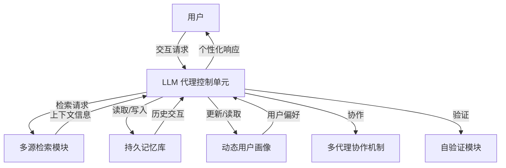

# 通过持久记忆与用户画像实现基于 LLM 代理的个性化长期交互

## 一、论文基础元数据
- 原文标题：Enabling Personalized Long-term Interactions in LLM-based Agents through Persistent Memory and User Profiles
- 中文译版：通过持久记忆与用户画像实现基于 LLM 代理的个性化长期交互
- 发表渠道：arXiv 预印本（等级：待同行评审）
- 发表时间：2025 年
- 链接：https://arxiv.org/abs/2510.07925
- 作者及核心机构：Rebecca Westhäußer (Mercedes-Benz AG), Wolfgang Minker (Ulm University), Sebastian Zepf (Mercedes-Benz AG)
- 研究领域（一级领域 + 二级子领域）：人工智能 + 大语言模型代理/人机交互
- 关联数据集（名称/规模/语言/标注）：3 个公共数据集（名称待补充）；5 天试点用户研究（规模待补充）

## 二、论文综合评价
### 2.1 量化评分（1-5 分，5 分为最优）

| 评价维度 | 评分 | 备注 |
| -------- | ---- | ---- |
| 📚 理论基础 | ⭐⭐⭐⭐ | 基于统一个性化定义推导技术要求 |
| 🎯 问题核心性 | ⭐⭐⭐⭐⭐ | 直击 LLM 代理缺乏个性化痛点 |
| 💡 方法创新性 | ⭐⭐⭐⭐ | 结合持久记忆与动态用户画像 |
| ⚙️ 技术壁垒 | ⭐⭐⭐ | 原文截断，具体实现细节未知 |
| 🧪 实验严谨性 | ⭐⭐⭐ | 提及多指标但结果数据缺失 |
| 🔧 落地可行性 | ⭐⭐⭐⭐ | 包含试点用户研究，场景明确 |
| 🚀 应用前景 | ⭐⭐⭐⭐⭐ | 智能座舱及助手场景潜力巨大 |
| 📊 综合评分 | 4.0 | 选题价值高，但全文截断影响评估 |

### 2.2 定性综合评价（≤300 字）
> 核心概括：研究定位、核心价值、差异化优势、关键结论

本研究定位于解决当前 LLM 代理在长期交互中缺乏个性化能力的问题。核心价值在于提出了一套结合持久记忆（Persistent Memory）与动态用户画像（User Profiles）的技术框架，超越了传统 RAG 仅关注上下文检索的局限。差异化优势在于将个性化从概念层面转化为具体的系统技术要求，并引入了自验证与多代理协作机制。关键结论表明，该框架有望提升代理的自适应性与用户感知的个性化水平。但因原文截断，具体架构细节与实验数值无法验证，整体潜力较高但实证完整性待确认。

## 三、领域本体论映射
| 核心维度 | 具体内容 |
| -------- | -------- |
| 核心研究对象 | 基于大语言模型的智能代理（LLM-based Agents） |
| 核心技术路径 | 持久记忆存储 + 动态用户画像演化 + 多源检索 |
| 数据/载体形态 | 交互历史数据、用户偏好特征、公共数据集 |
| 核心功能目标 | 实现自适应、以用户为中心的长期个性化交互 |
| 验证核心指标 | 检索准确率、响应正确性、BertScore、用户反馈 |

## 四、核心问题与解决方案
### 4.1 待解决的核心问题
1. **领域级根本问题**：
   当前 LLM 代理设计静态且特定于任务，缺乏跨交互保留和利用过去信息的能力，导致无法提供个性化响应。
2. **现有方法痛点**：
   检索增强生成（RAG）虽增强了上下文感知，但缺乏结合上下文信息与用户特定数据的机制；现有个性化研究多限于概念，缺乏技术实现。
3. **工程落地卡点**：
   用户因查询被误解导致无关响应而感到沮丧，系统行为与人类期望不一致，缺乏动态演化的记忆机制。

### 4.2 核心解决方案
- 理论框架：基于统一的个性化定义推导自适应、以用户为中心的 LLM 代理技术要求。
- 核心架构：集成持久记忆、动态协调、自验证和演化用户画像的框架。
- 关键技术：多代理协作（Multi-agent collaboration）、多源检索（Multi-source retrieval）。
- 创新机制：将用户特定数据与上下文信息动态结合，支持长期交互中的记忆持久化。

### 4.3 核心优势（量化 + 定性）
1. 性能优势：旨在提高检索准确率与响应正确性（具体数值待补充）。
2. 效率优势：通过动态协调机制优化信息检索与生成流程。
3. 工程优势：包含 5 天试点用户研究，验证了用户感知的个性化提升潜力。

## 五、方法与技术架构
### 5.1 核心架构设计
> 文字描述 + 架构图（Mermaid/图片）

根据摘要描述，系统核心由 LLM 代理控制单元驱动，集成持久记忆模块与用户画像模块。代理通过多源检索获取信息，并利用动态协调与自验证机制确保响应质量。用户交互数据持续更新用户画像与记忆库。

### 5.2 关键技术实现细节
| 技术模块 | 实现路径 | 工程注意事项 |
| -------- | -------- | ------------ |
| 持久记忆 | 跨交互存储历史信息 | 需解决隐私与存储成本问题 |
| 用户画像 | 动态演化用户偏好数据 | 需确保画像更新的实时性与准确性 |
| 多源检索 | 结合上下文与用户数据 | 需优化检索相关性以避免噪声 |
| 依赖组件 | LLM 基座、向量数据库 | 依赖基座模型的推理与规划能力 |

### 5.3 架构优缺点
- 优点：支持长期交互记忆，具备自适应能力，结合理论与技术实现。
- 缺点：原文截断导致具体算法细节未知；系统复杂度较高，可能增加延迟。

## 六、实验设计与结果分析
### 6.1 实验基础设置
| 维度 | 内容 |
| ---- | ---- |
| 数据集 | 3 个公共数据集（具体名称因原文截断待补充） |
| 基线方法 | 传统 RAG 方法、静态代理设计（推测） |
| 实验环境 | 待补充 |
| 评价指标 | 检索准确率、响应正确性、BertScore、用户反馈 |

### 6.2 核心实验结果
| 方法 | 核心指标 1 | 核心指标 2 | 工程指标（算力/耗时） |
| ---- | --------- | --------- | -------------------- |
| 基线 1 | 待补充 | 待补充 | 待补充 |
| 基线 2 | 待补充 | 待补充 | 待补充 |
| 本文方法 | 待补充 | 待补充 | 待补充 |

### 6.3 消融实验/鲁棒性分析
| 实验变体 | 指标变化 | 核心结论 |
| -------- | -------- | -------- |
| 无持久记忆 | 待补充 | 待补充 |
| 无用户画像 | 待补充 | 待补充 |

### 6.4 实验结论（工程视角）
摘要提及研究提供了早期迹象，表明集成持久记忆和用户画像有望改善 LLM 代理的自适应性和感知个性化。具体统计显著性及数值结果因原文截断无法提取。

## 七、领域贡献与创新点
| 贡献层级 | 具体内容 |
| -------- | -------- |
| 理论贡献 | 建立了个性化统一概念定义到技术需求的推导基础 |
| 方法/架构贡献 | 提出了集成持久记忆、动态协调与用户画像的框架 |
| 数据/工具贡献 | 进行了 5 天试点用户研究，收集了用户反馈数据 |
| 实验/验证贡献 | 在 3 个公共数据集上进行了多维度指标评估 |
| 工程落地贡献 | 为梅赛德斯 - 奔驰等场景的个性化代理提供技术路径 |

## 八、局限性与风险
| 维度 | 具体描述 | 应对思路 |
| ---- | -------- | -------- |
| 学术局限性 | 原文截断，无法验证方法细节与完整实验数据 | 需获取全文进行复现验证 |
| 工程落地风险 | 长期记忆存储可能涉及用户隐私合规问题 | 需设计隐私保护机制与数据脱敏 |
| 伦理/合规风险 | 用户画像演化可能存在偏见强化风险 | 引入自验证机制与人工审核流程 |

## 九、未来研究/落地方向
| 方向类型 | 具体内容 | 优先级 |
| -------- | -------- | ------ |
| 科研拓展 | 深化个性化定义与技术需求的映射关系 | 高 |
| 工程优化 | 优化持久记忆的检索效率与存储成本 | 高 |
| 跨领域适配 | 适配智能座舱、个人助理等不同交互场景 | 中 |

## 十、关键词与术语表
| 语言 | 关键词 |
| ---- | ------ |
| 中文 | 人工智能代理、个性化、大语言模型、持久记忆、用户画像 |
| 英文 | AI-Agents, Personalization, LLM, Persistent Memory, User Profiles |
| 领域专属术语 | （RAG：检索增强生成；BertScore：基于 BERT 的文本生成评价指标） |

## 十一、参考文献与关联资源
- 核心参考文献：待补充（原文截断，仅见引用编号 [1-47]）
- 补充阅读：关于 LLM 代理个性化、人机交互中的个性化定义相关文献
- 开源代码/工具：待补充（摘要未提及代码开源情况）

## 十二、阅读者批注
1. **科研启发**：将个性化从用户体验概念转化为具体技术需求（如记忆、画像）的思路值得借鉴。
2. **工程落地思考**：在智能座舱场景中，长期记忆如何平衡隐私与个性化是落地关键。
3. **待验证/存疑点**：具体的“自验证”机制如何实现？3 个公共数据集的具体名称是什么？
4. **个人/团队应用场景**：可尝试在客服机器人或车载助手中引入用户偏好记忆模块。

## 十三、阅读元信息
| 维度 | 内容 |
| ---- | ---- |
| 阅读日期 | 2026-04-09 01:07 |
| 阅读人 | xPaperReader AI |
| 文档编号 | arxiv-2510.07925 |
| 版本迭代 | v1.0 |