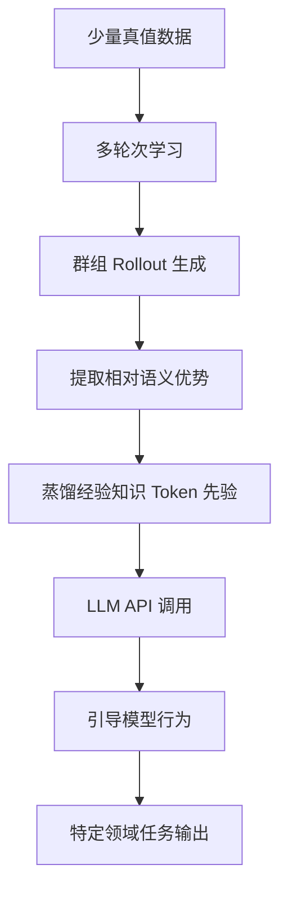

# 免训练群组相对策略优化

## 一、论文基础元数据
- 原文标题：Training-Free Group Relative Policy Optimization
- 中文译版：免训练群组相对策略优化
- 发表渠道：arXiv 预印本（未标注同行评审等级）
- 发表时间：2025 年 10 月 9 日
- 链接：https://arxiv.org/abs/2510.08191
- 作者及核心机构：Yuzheng Cai 等（Youtu-Agent Team, Tencent）
- 研究领域（一级领域 + 二级子领域）：人工智能 / 大语言模型代理与强化学习
- 关联数据集（名称/规模/语言/标注）：AIME Benchmarks（规模待补充/数学领域/英文/含标准答案）

## 二、论文综合评价
### 2.1 量化评分（1-5 分，5 分为最优）

| 评价维度 | 评分 | 备注 |
| -------- | ---- | ---- |
| 📚 理论基础 | ⭐⭐⭐⭐ | 基于 GRPO 改进，理论依据较充分 |
| 🎯 问题核心性 | ⭐⭐⭐⭐⭐ | 直击 Agent 微调成本高痛点 |
| 💡 方法创新性 | ⭐⭐⭐⭐⭐ | 提出免训练策略优化新范式 |
| ⚙️ 技术壁垒 | ⭐⭐⭐⭐ | 依赖语义优势提取，实现有难度 |
| 🧪 实验严谨性 | ⭐⭐⭐ | 原文片段未展示完整实验数据 |
| 🔧 落地可行性 | ⭐⭐⭐⭐⭐ | 无需参数更新，工程落地成本低 |
| 🚀 应用前景 | ⭐⭐⭐⭐⭐ | 适用于资源受限的 Agent 场景 |
| 📊 综合评分 | 4.3 | 创新性强且落地成本低，但实验细节待验证 |

### 2.2 定性综合评价（≤300 字）
> 核心概括：研究定位、核心价值、差异化优势、关键结论
本文针对 LLM Agent 在特定领域性能下降及传统 Agentic RL 微调成本高的问题，提出了一种免训练的方案。核心价值在于通过“经验知识作为 token 先验”替代参数更新，利用群组相对语义优势进行蒸馏。差异化优势是无需修改模型权重，仅需少量样本即可在 API 调用阶段引导模型行为。关键结论表明该方法在 AIME 基准上显著提升了 DeepSeek-V3.1-Terminus 的表现，且成本远低于微调小模型。

## 三、领域本体论映射
| 核心维度 | 具体内容 |
| -------- | -------- |
| 核心研究对象 | 大语言模型代理（LLM Agents） |
| 核心技术路径 | 群组相对策略优化（GRPO）的免训练变体 |
| 数据/载体形态 | 少量真值数据（Minimal ground-truth data） |
| 核心功能目标 | 提升特定领域任务性能，降低微调成本 |
| 验证核心指标 | Mean@32（AIME 基准） |

## 四、核心问题与解决方案
### 4.1 待解决的核心问题
1. **领域级根本问题**：通用 LLM 在需要外部工具和专业提示策略的特定现实领域表现不佳。
2. **现有方法痛点**：现有的 Agent 强化学习（如 GRPO）依赖昂贵的参数更新（SFT+RL），成本高且易过拟合。
3. **工程落地卡点**：实际数据稀缺，大规模微调计算资源需求过高，环境成本高。

### 4.2 核心解决方案
- 理论框架：将输出分布的调整转化为学习经验知识作为 Token 先验。
- 核心架构：在 rollout 组内利用相对语义优势而非数值优势进行迭代蒸馏。
- 关键技术：免训练群组相对策略优化（Training-Free GRPO）。
- 创新机制：在 LLM API 调用期间无缝集成学到的先验知识以引导行为，无需参数更新。

### 4.3 核心优势（量化 + 定性）
1. 性能优势：在少量样本（几十条）下，性能优于使用边际训练数据微调的小模型。
2. 效率优势：消除了参数更新过程，显著降低计算成本和训练时间。
3. 工程优势：无需维护模型权重版本，直接通过 API 引导，部署灵活。

## 五、方法与技术架构
### 5.1 核心架构设计
> 文字描述 + 架构图（Mermaid/图片）
该方法不改变模型权重，而是在推理阶段引入先验知识。流程包括：收集 rollout 组 -> 提取语义优势 -> 蒸馏经验知识 -> API 调用时注入先验。

### 5.2 关键技术实现细节
| 技术模块 | 实现路径 | 工程注意事项 |
| -------- | -------- | ------------ |
| 语义优势提取 | 在组内比较不同 rollouts 的语义质量 | 需定义有效的语义相似度度量 |
| 知识蒸馏 | 迭代式蒸馏高质量经验知识 | 避免噪声知识累积 |
| 先验集成 | 在 API 调用时无缝集成 | 需确保不影响原生推理速度 |
| 依赖组件 | DeepSeek-V3.1-Terminus 模型 | 依赖模型 API 支持特定引导格式 |

### 5.3 架构优缺点
- 优点：无需反向传播，显存占用低，支持黑盒模型优化。
- 缺点：依赖 API 接口灵活性，可能受限于上下文窗口长度。

## 六、实验设计与结果分析
### 6.1 实验基础设置
| 维度 | 内容 |
| ---- | ---- |
| 数据集 | AIME Benchmarks（数学推理）, Web Searching Tasks |
| 基线方法 | 微调小模型（32B）, 原始 DeepSeek-V3.1-Terminus |
| 实验环境 | 待补充（原文片段未提及具体硬件） |
| 评价指标 | Mean@32, 成本（训练数据量/计算开销） |

### 6.2 核心实验结果
| 方法 | 核心指标 1 | 核心指标 2 | 工程指标（算力/耗时） |
| ---- | --------- | --------- | -------------------- |
| 基线 1（原始模型） | 待补充 | 待补充 | 低 |
| 基线 2（微调 32B） | 待补充 | 待补充 | 高 |
| 本文方法 | 显著提升 | 优于微调小模型 | 极低（免训练） |

*注：原文片段仅声明“显著提升”和“优于”，未提供具体数值表格。*

### 6.3 消融实验/鲁棒性分析
| 实验变体 | 指标变化 | 核心结论 |
| -------- | -------- | -------- |
| 不同 Epoch 数 | 待补充 | 多轮次学习有助于知识蒸馏 |
| 样本数量变化 | 待补充 | 仅需几十条样本即可生效 |

### 6.4 实验结论（工程视角）
该方法在极低数据成本下实现了性能突破，适合无法进行大规模微调的生产环境，但具体提升幅度需参考完整论文数据。

## 七、领域贡献与创新点
| 贡献层级 | 具体内容 |
| -------- | -------- |
| 理论贡献 | 提出通过 Token 先验而非参数空间调整输出分布的理论 |
| 方法/架构贡献 | 设计了 Training-Free GRPO 算法框架 |
| 数据/工具贡献 | 开源代码库（Youtu-Agent） |
| 实验/验证贡献 | 验证了在数学推理和网页搜索任务上的有效性 |
| 工程落地贡献 | 提供了一种低成本的 Agent 领域适配方案 |

## 八、局限性与风险
| 维度 | 具体描述 | 应对思路 |
| ---- | -------- | -------- |
| 学术局限性 | 原文片段未提供完整数学推导和对比细节 | 需查阅完整版本验证理论严谨性 |
| 工程落地风险 | 依赖特定 API 调用方式，可能受限于服务商策略 | 封装适配层，兼容不同 API 格式 |
| 伦理/合规风险 | 可能引入偏见知识先验 | 加强先验知识的审核与过滤机制 |

## 九、未来研究/落地方向
| 方向类型 | 具体内容 | 优先级 |
| -------- | -------- | ------ |
| 科研拓展 | 探索语义优势量化的具体数学定义 | 高 |
| 工程优化 | 优化先验知识注入的延迟开销 | 高 |
| 跨领域适配 | 验证在代码生成、医疗等非数学领域的效果 | 中 |

## 十、关键词与术语表
| 语言 | 关键词 |
| ---- | ------ |
| 中文 | 免训练、群组相对策略优化、经验知识、Token 先验 |
| 英文 | Training-Free, GRPO, Experiential Knowledge, Token Prior |
| 领域专属术语 | （术语 + 定义） |
| 术语 | 定义 |
| Group Relative Policy Optimization | 群组相对策略优化，一种强化学习算法变体 |
| Agentic RL | 代理强化学习，针对 Agent 行为的强化学习 |

## 十一、参考文献与关联资源
- 核心参考文献：[1] ReAct, [2] AIME Benchmarks, [3] DeepSeek-V3.1-Terminus, [4] 相关微调研究（原文引用编号）
- 补充阅读：待补充（原文片段未列出完整参考文献列表）
- 开源代码/工具：https://github.com/TencentCloudADP/youtu-agent/tree/training_free_GRPO

## 十二、阅读者批注
1. **科研启发**：将强化学习的优化目标从参数空间转移到输入/先验空间是一个非常有价值的思路，可能适用于黑盒模型优化。
2. **工程落地思考**：对于无法获取模型权重的商业 API 场景，此方法提供了唯一的优化路径，极具商业价值。
3. **待验证/存疑点**：语义优势的具体量化方法未在片段中披露，如何保证蒸馏知识的准确性存疑。
4. **个人/团队应用场景**：可尝试应用于公司内部受限算力下的垂直领域 Agent 优化。

## 十三、阅读元信息
| 维度 | 内容 |
| ---- | ---- |
| 阅读日期 | 2026-04-09 01:18 |
| 阅读人 | xPaperReader AI |
| 文档编号 | arxiv-2510.08191 |
| 版本迭代 | v1.0 |