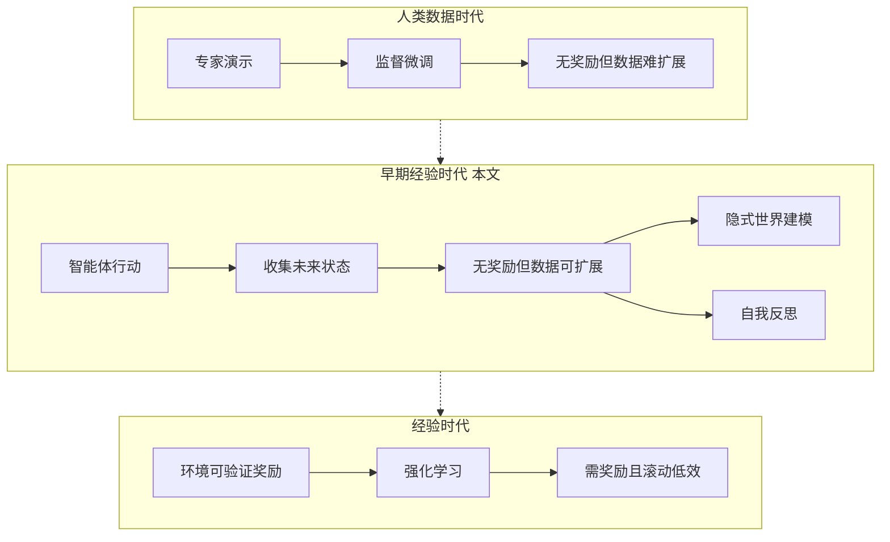

# 基于早期经验的智能体学习

## 一、论文基础元数据
- 原文标题：Agent Learning via Early Experience
- 中文译版：基于早期经验的智能体学习
- 发表渠道：arXiv 预印本 (未标注具体等级)
- 发表时间：2025 年 10 月 15 日 (根据文档日期)
- 链接：arXiv:2510.08558
- 作者及核心机构：Kai Zhang 等 (Meta Superintelligence Labs, FAIR at Meta, The Ohio State University)
- 研究领域：人工智能 (一级) + 语言智能体/强化学习 (二级)
- 关联数据集：提及“八个多样化环境”，具体名称因原文截断待补充

## 二、论文综合评价
### 2.1 量化评分（1-5 分，5 分为最优）

| 评价维度 | 评分 | 备注 |
| -------- | ---- | ---- |
| 📚 理论基础 | ⭐⭐⭐⭐ | 问题定义清晰，理论动机充分 |
| 🎯 问题核心性 | ⭐⭐⭐⭐⭐ | 直击智能体扩展性与奖励稀缺痛点 |
| 💡 方法创新性 | ⭐⭐⭐⭐ | 提出早期经验范式，介于模仿与强化之间 |
| ⚙️ 技术壁垒 | ⭐⭐⭐ | 因原文截断，具体技术细节无法评估 |
| 🧪 实验严谨性 | ⭐⭐ | 原文截断，无法验证实验数据与设置 |
| 🔧 落地可行性 | ⭐⭐⭐⭐ | 无需奖励信号，数据可扩展性强 |
| 🚀 应用前景 | ⭐⭐⭐⭐ | 为完全经验驱动智能体提供桥梁 |
| 📊 综合评分 | 3.7 | 概念新颖但全文截断，实验部分无法验证 |

### 2.2 定性综合评价（≤300 字）
> 核心概括：研究定位、核心价值、差异化优势、关键结论

本文针对语言智能体在缺乏可验证奖励环境中难以通过强化学习训练的问题，提出“早期经验”（Early Experience）范式。核心价值在于利用智能体自身行动产生的未来状态作为监督信号，无需奖励即可扩展数据。差异化优势在于介于模仿学习（数据难扩展）与强化学习（需奖励/长滚动）之间。关键结论声称该方法在八个环境中提升了有效性与泛化能力，并为后续强化学习奠定基础。**注：因提供的原文仅含摘要与引言开头，部分技术细节与实验数据无法完整评估。**

## 三、领域本体论映射
| 核心维度 | 具体内容 |
| -------- | -------- |
| 核心研究对象 | 语言智能体 (Language Agents) |
| 核心技术路径 | 早期经验范式 (早期经验 + 隐式世界建模 + 自我反思) |
| 数据/载体形态 | 智能体自身行动生成的交互数据 (无奖励信号) |
| 核心功能目标 | 实现无需专家数据或环境奖励的智能体自我改进 |
| 验证核心指标 | 有效性 (Effectiveness)、域外泛化能力 (Out-of-domain Generalization) |

## 四、核心问题与解决方案
### 4.1 待解决的核心问题
1. **领域级根本问题**：智能体如何通过自身经验学习并超越人类，特别是在复杂真实任务中。
2. **现有方法痛点**：强化学习在许多环境中缺乏可验证奖励或滚动效率低；监督微调依赖专家数据，难以扩展且泛化差。
3. **工程落地卡点**：环境多样性不足，专家演示仅覆盖狭窄场景。

### 4.2 核心解决方案
- 理论框架：早期经验范式 (Early Experience Paradigm)。
- 核心架构：利用智能体行动产生的未来状态作为监督信号。
- 关键技术：(1) 隐式世界建模 (Implicit world modeling)；(2) 自我反思 (Self-reflection)。
- 创新机制：无需奖励信号，利用自身生成的状态数据进行策略接地与推理改进。

### 4.3 核心优势（量化 + 定性）
1. 性能优势：原文声称在多个模型家族中一致提升有效性 (具体数值待补充)。
2. 效率优势：避免了长滚动 (long-horizon rollouts) 的低效问题。
3. 工程优势：数据可扩展 (Scalable)，无需环境提供可验证奖励 (Reward-Free)。

## 五、方法与技术架构
### 5.1 核心架构设计
> 文字描述 + 架构图（Mermaid/图片）

本文提出从“人类数据时代”向“经验时代”过渡的中间范式。架构核心在于智能体提出动作并收集未来状态，以此作为监督源。

### 5.2 关键技术实现细节
| 技术模块 | 实现路径 | 工程注意事项 |
| -------- | -------- | ------------ |
| 隐式世界建模 | 利用收集的状态使策略基于环境动态接地 | 需确保状态表示能捕捉环境动态 |
| 自我反思 | 智能体从次优动作中学习以改进推理 | 需定义次优动作的识别机制 |
| 依赖组件 | 大语言模型 (LLM)、多样化交互环境 | 环境需支持智能体自主行动 |

### 5.3 架构优缺点
- 优点：摆脱了对专家数据和环境奖励的双重依赖，数据获取成本低。
- 缺点：因原文截断，具体如何处理状态噪声及收敛性保障未知。

## 六、实验设计与结果分析
### 6.1 实验基础设置
| 维度 | 内容 |
| ---- | ---- |
| 数据集 | 八个多样化环境 (具体名称因原文截断待补充) |
| 基线方法 | 监督微调 (专家数据)、强化学习 (需奖励) |
| 实验环境 | 多个模型家族 (具体型号待补充) |
| 评价指标 | 有效性、域外泛化能力、后续强化学习基础信号 |

### 6.2 核心实验结果
| 方法 | 核心指标 1 | 核心指标 2 | 工程指标（算力/耗时） |
| ---- | --------- | --------- | -------------------- |
| 基线 1 | 待补充 | 待补充 | 待补充 |
| 基线 2 | 待补充 | 待补充 | 待补充 |
| 本文方法 | 待补充 (声称一致提升) | 待补充 (泛化提升) | 待补充 |

### 6.3 消融实验/鲁棒性分析
| 实验变体 | 指标变化 | 核心结论 |
| -------- | -------- | -------- |
| 隐式世界建模 | 待补充 | 待补充 |
| 自我反思 | 待补充 | 待补充 |

### 6.4 实验结论（工程视角）
因原文仅提供摘要，具体实验数据缺失。摘要声称该方法为模仿学习与完全经验驱动智能体之间提供了实用桥梁，在有可验证奖励环境中为后续强化学习提供良好基础。

## 七、领域贡献与创新点
| 贡献层级 | 具体内容 |
| -------- | -------- |
| 理论贡献 | 定义了“早期经验”范式，填补模仿学习与强化学习之间的空白 |
| 方法/架构贡献 | 提出利用无奖励的未来状态作为监督信号的机制 |
| 数据/工具贡献 | 实现了无需专家标注的数据可扩展生成路径 |
| 实验/验证贡献 | 在八个环境中验证了有效性与泛化性 (具体数据待补充) |
| 工程落地贡献 | 降低了智能体训练对环境奖励信号的依赖 |

## 八、局限性与风险
| 维度 | 具体描述 | 应对思路 |
| ---- | -------- | -------- |
| 学术局限性 | 原文截断，无法评估方法在极端稀疏奖励下的具体表现 | 需阅读完整论文获取实验细节 |
| 工程落地风险 | 自我反思机制可能引入误差累积 | 需设计验证机制过滤低质量反思 |
| 伦理/合规风险 | 智能体自主行动可能产生不可控行为 | 需设置安全护栏与人工审核 |

## 九、未来研究/落地方向
| 方向类型 | 具体内容 | 优先级 |
| -------- | -------- | ------ |
| 科研拓展 | 探索早期经验与强化学习的具体衔接机制 | 高 |
| 工程优化 | 优化状态收集与存储的效率 | 中 |
| 跨领域适配 | 适配到更多缺乏奖励信号的复杂真实环境 | 高 |

## 十、关键词与术语表
| 语言 | 关键词 |
| ---- | ------ |
| 中文 | 早期经验、语言智能体、隐式世界建模、自我反思、无奖励学习 |
| 英文 | Early Experience, Language Agents, Implicit World Modeling, Self-Reflection, Reward-Free |
| 领域专属术语 | 早期经验 (智能体自身行动生成的交互数据，未来状态作为监督) |

## 十一、参考文献与关联资源
- 核心参考文献：Su et al., 2024; Xue et al., 2025; Xie et al., 2024a (文中提及)
- 补充阅读：待补充 (原文参考文献列表未提供)
- 开源代码/工具：待补充 (文中未提供链接)

## 十二、阅读者批注
1. **科研启发**：将“未来状态”本身作为监督信号是一个巧妙的中间路径，避免了奖励设计的难题。
2. **工程落地思考**：在实际系统中，如何高效存储和检索“早期经验”数据是关键工程挑战。
3. **待验证/存疑点**：自我反思的具体实现逻辑未知，是否存在幻觉风险需完整论文验证。
4. **个人/团队应用场景**：适用于客服对话、网页操作等难以定义明确奖励函数的场景。

## 十三、阅读元信息
| 维度 | 内容 |
| ---- | ---- |
| 阅读日期 | 2026-04-09 01:32 |
| 阅读人 | xPaperReader AI |
| 文档编号 | arxiv-2510.08558 |
| 版本迭代 | v1.0 |

---
**注：因提供的论文内容仅包含摘要与引言片段，部分章节（如详细实验数据、具体公式、完整参考文献）标记为“待补充”或基于摘要推断，以确保信息忠实性。**