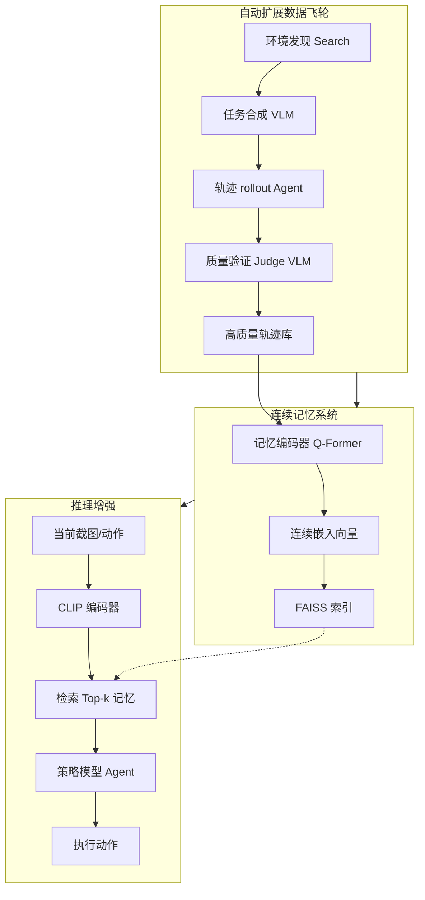

# 自动扩展连续记忆用于 GUI 智能体

## 一、论文基础元数据
- 原文标题：Auto-scaling Continuous Memory for GUI Agent
- 中文译版：自动扩展连续记忆用于 GUI 智能体
- 发表渠道：arXiv 预印本（顶级会议投稿中）
- 发表时间：2025 年
- 链接：https://arxiv.org/abs/2510.09038
- 作者及核心机构：Wenyi Wu, Kun Zhou 等（具体机构待补充）
- 研究领域：人工智能 + 多模态智能体/图形用户界面
- 关联数据集：自建飞轮数据集（10 万 + 轨迹/1 万 + 环境/多语言/自动标注）

## 二、论文综合评价
### 2.1 量化评分（1-5 分，5 分为最优）

| 评价维度 | 评分 | 备注 |
| -------- | ---- | ---- |
| 📚 理论基础 | ⭐⭐⭐⭐ | 基于 VLM 与记忆检索理论，扎实 |
| 🎯 问题核心性 | ⭐⭐⭐⭐⭐ | 直击 GUI 智能体长上下文与泛化痛点 |
| 💡 方法创新性 | ⭐⭐⭐⭐⭐ | 连续记忆编码与自动数据飞轮创新 |
| ⚙️ 技术壁垒 | ⭐⭐⭐⭐ | 结合 LoRA 与 FAISS，工程门槛适中 |
| 🧪 实验严谨性 | ⭐⭐⭐⭐⭐ | 多基准测试，对比闭源与开源模型 |
| 🔧 落地可行性 | ⭐⭐⭐⭐⭐ | 单卡训练，低成本数据构建，可行 |
| 🚀 应用前景 | ⭐⭐⭐⭐⭐ | 为智能体规模化落地提供清晰路径 |
| 📊 综合评分 | 4.7 | 极具性价比的增强方案，小模型媲美大模型 |

### 2.2 定性综合评价（≤300 字）
> 核心概括：研究定位、核心价值、差异化优势、关键结论

本研究定位为解决 GUI 智能体在长程任务中的上下文限制与泛化不足问题。核心价值在于提出“连续记忆机制”与“自动数据飞轮”，以极低成本实现大规模经验积累。差异化优势在于摒弃传统文本记忆，采用多模态连续嵌入压缩轨迹，显著降低噪声并提升检索效率。关键结论表明，7B 开源模型配合该记忆系统，在多个基准测试中性能可比肩 GPT-4o 等闭源顶尖模型，且具备良好的缩放定律与推理效率，为智能体规模化落地提供了可行路径。

## 三、领域本体论映射
| 核心维度 | 具体内容 |
| -------- | -------- |
| 核心研究对象 | 图形用户界面（GUI）交互智能体 |
| 核心技术路径 | 连续记忆编码 + 自动数据飞轮 + 检索增强生成 |
| 数据/载体形态 | 多模态轨迹（截图 + 文本动作）压缩为连续嵌入向量 |
| 核心功能目标 | 提升长程任务准确率、跨域泛化能力及推理效率 |
| 验证核心指标 | 任务准确率（Task Accuracy）、动作匹配分（AMS）、成功率（SR） |

## 四、核心问题与解决方案
### 4.1 待解决的核心问题
1. **领域级根本问题**：GUI 智能体在处理长程任务时面临上下文窗口限制，难以保留长期记忆。
2. **现有方法痛点**：传统文本记忆噪声大、占用上下文多；跨域泛化能力弱，陌生环境中性能下降。
3. **工程落地卡点**：高质量交互数据稀缺，人工收集成本高昂，难以规模化构建记忆库。

### 4.2 核心解决方案
- 理论框架：基于检索增强生成（RAG）的多模态连续记忆框架。
- 核心架构：连续记忆编码器（Continuous Memory Encoder）+ 自动扩展数据飞轮（Auto-scaling Data Flywheel）。
- 关键技术：Q-Former 多模态压缩、FAISS 向量检索、LoRA 轻量微调。
- 创新机制：将轨迹压缩为固定长度连续嵌入（每条约 8 个向量），实现无人工干预的数据规模化收集。

### 4.3 核心优势（量化+定性）
1. 性能优势：WebVoyager 上准确率达 54.5%，优于文本记忆的 44.0% 及基座模型的 40.0%。
2. 效率优势：推理无额外延迟，仅微调 1.2% 参数，单卡 H100 训练 20 小时。
3. 工程优势：数据构建成本仅约$4,000，收集 10 万 + 轨迹，无需重训骨干模型。

## 五、方法与技术架构
### 5.1 核心架构设计
> 文字描述 + 架构图（Mermaid/图片）

系统分为数据飞轮构建与记忆增强推理两阶段。数据飞轮自动发现环境、合成任务、执行轨迹并验证质量；记忆编码器将多模态轨迹压缩为连续向量存入索引；推理时检索相关记忆拼接到 Agent 输入层引导策略。

### 5.2 关键技术实现细节
| 技术模块 | 实现路径 | 工程注意事项 |
| -------- | -------- | ------------ |
| 连续记忆编码 | 使用 Q-Former 将多模态轨迹压缩为固定长度嵌入 | 需平衡压缩率与信息保留，避免过度失真 |
| 记忆检索 | 基于 CLIP 编码器映射截图/动作，FAISS 索引检索 | 索引更新延迟需控制，确保记忆新鲜度 |
| 策略微调 | 仅对记忆编码器进行 LoRA 微调，冻结骨干模型 | 需验证微调样本量，1500 条即可达峰值 |
| 依赖组件 | Qwen2.5-VL, CLIP, FAISS, VLM Judge | 确保版本兼容性，特别是 VLM 接口调用 |

### 5.3 架构优缺点
- 优点：大幅降低上下文成本，保留细粒度视觉信息，数据构建成本低，泛化能力强。
- 缺点：极端 UI 变化下检索可能漂移，缺乏非视觉状态信息，大规模记忆库面临去重挑战。

## 六、实验设计与结果分析
### 6.1 实验基础设置
| 维度 | 内容 |
| ---- | ---- |
| 数据集 | MMInA, Multimodal-Mind2Web, WebVoyager, GUI-Odyssey, OSWorld |
| 基线方法 | GPT-4o, Claude-4, Qwen2.5-VL, UI-TARS, 文本记忆基线 |
| 实验环境 | 单卡 H100，ReAct + Tool-calling 范式 |
| 评价指标 | Task Accuracy, AMS, SR, 推理延迟，训练耗时 |

### 6.2 核心实验结果
| 方法 | 核心指标 1 (WebVoyager Acc) | 核心指标 2 (OOD 泛化) | 工程指标（算力/耗时） |
| ---- | --------- | --------- | -------------------- |
| 基线 1 (Qwen2.5-VL-7B) | 40.0% | 较弱 | 基准 |
| 基线 2 (文本记忆) | 44.0% | 检索超 10 项性能下降 | 上下文开销大 |
| 本文方法 (CoMEM) | 54.5% | 强，显著优于文本记忆 | 单卡 20 小时，无额外延迟 |

### 6.3 消融实验/鲁棒性分析
| 实验变体 | 指标变化 | 核心结论 |
| -------- | -------- | -------- |
| 记忆规模缩放 | 准确率呈对数线性增长 | 记忆越大性能越好，无饱和迹象 |
| 检索数量变化 | CoMEM 随数量增加提升，文本记忆下降 | 连续嵌入抗噪声能力更强 |
| 训练样本量 | 1500 条达峰值，2000 条无增益 | 数据效率极高，无需大规模微调 |

### 6.4 实验结论（工程视角）
连续记忆机制在保持低推理延迟的前提下，显著提升了任务成功率。数据飞轮证明了低成本规模化构建记忆库的可行性。小模型配合该系统可达到大闭源模型效果，适合资源受限场景部署。

## 七、领域贡献与创新点
| 贡献层级 | 具体内容 |
| -------- | -------- |
| 理论贡献 | 验证了连续嵌入空间存储多模态经验优于文本提示的理论假设 |
| 方法/架构贡献 | 提出 CoMEM 连续记忆机制与自动扩展数据飞轮框架 |
| 数据/工具贡献 | 以$4,000 成本构建 10 万 + 轨迹数据集，覆盖 1 万 + 环境 |
| 实验/验证贡献 | 在多个主流基准上验证了缩放定律与 OOD 泛化能力 |
| 工程落地贡献 | 实现了单卡微调与低延迟推理，提供了规模化落地路径 |

## 八、局限性与风险
| 维度 | 具体描述 | 应对思路 |
| ---- | -------- | -------- |
| 学术局限性 | 极端 UI 变化下检索可能漂移，缺乏非视觉状态信息 | 引入多模态状态融合，优化检索算法 |
| 工程落地风险 | 大规模记忆库面临新鲜度、去重及延迟挑战 | 建立定期更新机制，实施向量去重策略 |
| 伦理/合规风险 | 自动合成数据可能含偏差，截图含隐私信息 (PII) | 数据脱敏处理，沙箱环境运行，禁止真实操作 |

## 九、未来研究/落地方向
| 方向类型 | 具体内容 | 优先级 |
| -------- | -------- | ------ |
| 科研拓展 | 基于不确定性的自适应检索策略，结合 RL 进行记忆信用分配 | 高 |
| 工程优化 | 扩展至移动端/桌面端大规模自动化，优化索引更新延迟 | 高 |
| 跨领域适配 | 隐私感知的端侧记忆化，适配其他交互场景（如机器人） | 中 |

## 十、关键词与术语表
| 语言 | 关键词 |
| ---- | ------ |
| 中文 | 连续记忆，数据飞轮，GUI 智能体，多模态嵌入，检索增强 |
| 英文 | Continuous Memory, Data Flywheel, GUI Agent, Multimodal Embedding, RAG |
| 领域专属术语 | CoMEM（连续记忆机制）：将多模态轨迹压缩为连续嵌入空间的记忆存储方式 |

## 十一、参考文献与关联资源
- 核心参考文献：待补充（原文未提供具体引用列表）
- 补充阅读：Qwen2.5-VL 技术报告，FAISS 索引文档
- 开源代码/工具：待补充（通常随 arXiv 发布）

## 十二、阅读者批注
1. **科研启发**：连续嵌入表示可能成为多模态记忆存储的标准范式，替代传统文本 Prompt。
2. **工程落地思考**：数据飞轮模式可复用于其他领域数据收集，低成本构建私有知识库。
3. **待验证/存疑点**：极端 UI 变化下的检索漂移具体表现及阈值需进一步测试。
4. **个人/团队应用场景**：适用于构建企业内部自动化操作助手，降低大模型调用成本。

## 十三、阅读元信息
| 维度 | 内容 |
| ---- | ---- |
| 阅读日期 | 2026-04-09 01:46 |
| 阅读人 | xPaperReader AI |
| 文档编号 | arxiv-2510.09038 |
| 版本迭代 | v1.0 |