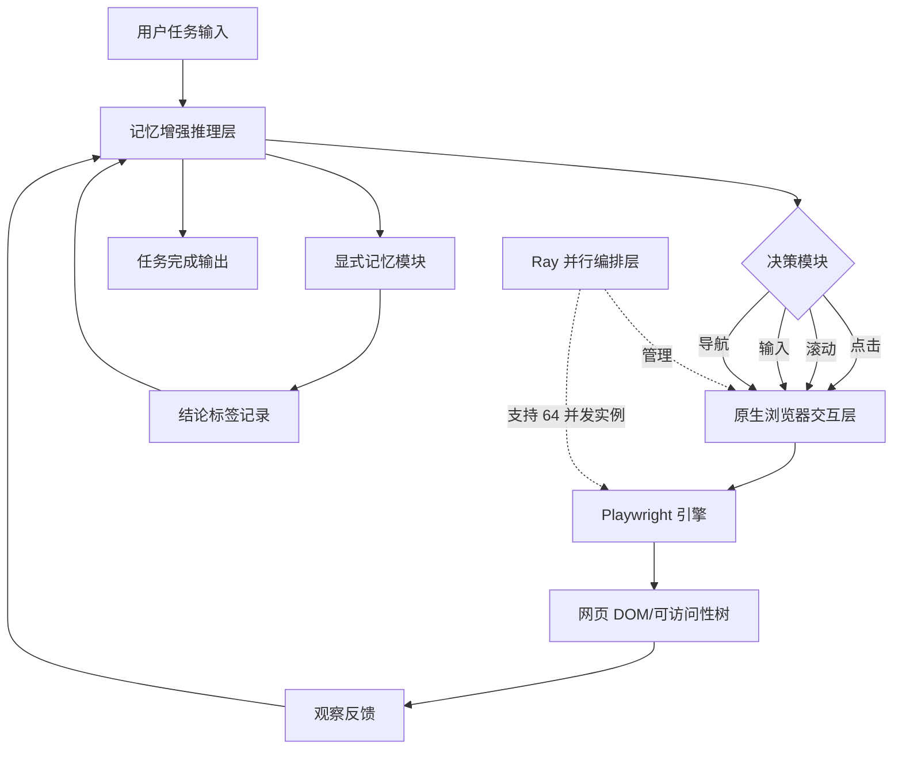

# BrowserAgent：构建具有人类启发式网页浏览动作的网页智能体

## 一、论文基础元数据
- 原文标题：BrowserAgent: Building Web Agents with Human-Inspired Web Browsing Actions
- 中文译版：BrowserAgent：构建具有人类启发式网页浏览动作的网页智能体
- 发表渠道：预印本（arXiv）
- 发表时间：2025 年
- 链接（arXiv/DOI）：arXiv: 2510.10666
- 作者及核心机构：Tao Yu, Zhengbo Zhang, Zhiheng Lyu, Junhao Gong, Hongzhu Yi, Xinming Wang, Yuxuan Zhou, Jiabing Yang, Ping Nie, Yan Huang, Wenhu Chen（待补充具体机构）
- 研究领域（一级领域 + 二级子领域）：人工智能 + 智能体/网页交互
- 关联数据集（名称/规模/语言/标注）：NQ、HotpotQA、PopQA、2Wiki、Musique、Bamboogle、TriviaQA；5.3K 合成轨迹；英文；基于问答任务标注

## 二、论文综合评价
### 2.1 量化评分（1-5 分，5 分为最优）

| 评价维度 | 评分 | 备注 |
| -------- | ---- | ---- |
| 📚 理论基础 | ⭐⭐⭐⭐ | 基于 ReAct 框架扩展记忆机制 |
| 🎯 问题核心性 | ⭐⭐⭐⭐⭐ | 解决 Web Agent 交互瓶颈问题 |
| 💡 方法创新性 | ⭐⭐⭐⭐⭐ | 原生浏览器交互范式创新 |
| ⚙️ 技术壁垒 | ⭐⭐⭐⭐ | Ray 并行化实现高吞吐 |
| 🧪 实验严谨性 | ⭐⭐⭐⭐ | 双重评估机制验证充分 |
| 🔧 落地可行性 | ⭐⭐⭐⭐ | Playwright 生态成熟易部署 |
| 🚀 应用前景 | ⭐⭐⭐⭐⭐ | 通用网页智能体潜力巨大 |
| 📊 综合评分 | 4.4 | 范式创新显著，数据效率高，多跳推理优势突出 |

### 2.2 定性综合评价（≤300 字）
> 核心概括：研究定位、核心价值、差异化优势、关键结论

本研究定位为高效可扩展的真实世界网页交互训练框架。核心价值在于摒弃静态摘要依赖，通过原生浏览器交互实现端到端网页操作。差异化优势体现在三方面：一是人类启发的浏览动作设计（点击、滚动、输入），二是基于 Ray 的高吞吐基础设施（50+ episodes/分钟），三是显式记忆机制支持长推理链。关键结论表明，仅用 5.3K 训练数据和 7B 参数模型，在多跳 QA 任务上相比 Search-R1 提升约 20%，证明了轻量化训练策略的有效性和模型规模对复杂推理的决定性影响。

## 三、领域本体论映射
| 核心维度 | 具体内容 |
| -------- | -------- |
| 核心研究对象 | 基于浏览器的网页智能体（Web Agent） |
| 核心技术路径 | 原生浏览器交互 + 两阶段微调（SFT+RFT）+ 显式记忆机制 |
| 数据/载体形态 | 网页 DOM/可访问性树、5.3K 合成轨迹、Wikipedia 知识库 |
| 核心功能目标 | 实现人类启发的网页浏览、信息获取与多跳推理问答 |
| 验证核心指标 | 精确匹配（EM）、LLM-based Judgment、推理步数、吞吐量 |

## 四、核心问题与解决方案
### 4.1 待解决的核心问题
1. **领域级根本问题**：
   如何让智能体像人类一样通过主动交互获取网页深度信息，而非依赖静态文本摘要？

2. **现有方法痛点**：
   当前 Web Agent（如 Search-R1）严重依赖外部工具将动态网页转化为静态文本，限制深度交互能力且调用成本高昂。

3. **工程落地卡点**：
   基于浏览器的 Agent 吞吐量极低（1-2 episodes/分钟），难以支持大规模训练。

### 4.2 核心解决方案
- 理论框架：基于 ReAct 框架扩展，增加显式记忆模块，要求模型在 `<conclusion>` 标签中记录关键中间结论
- 核心架构：原生浏览器交互层 + 并行编排层 + 记忆增强推理层
- 关键技术：Playwright 原生交互、Ray 并行化、拒绝采样微调（RFT）
- 创新机制：引入滚动操作使模型主动阅读长内容；显式记忆解决多跳推理信息丢失问题

### 4.3 核心优势（量化 + 定性）
1. 性能优势：多跳 QA 任务平均提升约 20%，BrowserAgent-RFT 平均得分 0.484 优于 Search-R1-Instruct 的 0.348
2. 效率优势：吞吐量从 1-2 episodes/分钟提升至 50+ episodes/分钟，降低超过一个数量级的数据收集成本
3. 工程优势：仅需 5.3K 训练样本实现 SOTA 性能，7B 模型参数规模提供高成本效益方案

## 五、方法与技术架构
### 5.1 核心架构设计

> 文字描述 + 架构图（Mermaid/图片）

BrowserAgent 采用三层架构设计：底层为原生浏览器交互层，通过 Playwright 直接操作网页 DOM 和可访问性树；中间层为并行编排层，基于 Ray 实现 64 个并发 Playwright 实例；上层为记忆增强推理层，在 ReAct 框架基础上增加显式记忆模块支持长推理链。

### 5.2 关键技术实现细节
| 技术模块 | 实现路径 | 工程注意事项 |
| -------- | -------- | ------------ |
| 原生浏览器交互 | 通过 Playwright 直接操作网页状态，定义原子操作集（点击、滚动、输入、标签管理、URL 导航） | 需处理动态网页加载延迟，设置合理超时机制 |
| 并行编排层 | 基于 Ray 实现并行化，单机 32 核支持 64 个并发 Playwright 实例 | 注意资源隔离，避免实例间状态污染 |
| 显式记忆机制 | 在 ReAct 框架中增加 `<conclusion>` 标签，记录关键中间结论 | 需设计记忆压缩策略，防止上下文溢出 |
| 两阶段训练 | SFT 使用 5.3K 高质量轨迹，RFT 基于 EM 指标筛选推理步骤最多的样本 | RFT 阶段学习率需降低（1e-6 vs 5e-6） |
| 依赖组件 | Playwright、Ray、Verl-Tool、Qwen2.5-7B-Instruct | 确保版本兼容性，特别是 Playwright 与浏览器驱动 |

### 5.3 架构优缺点
- 优点：
  1. 无需外部摘要服务，降低依赖成本和延迟
  2. 高吞吐设计支持大规模训练和数据收集
  3. 显式记忆机制有效解决长推理链信息丢失问题
  4. 数据效率高，5.3K 样本即可实现强泛化能力

- 缺点：
  1. 浏览器自动化仍存在稳定性风险（网页结构变化）
  2. 仅验证了 3B 和 7B 模型，更大规模扩展性待验证
  3. 评估时限制最大 30 轮交互，复杂任务可能不足
  4. 格式敏感性导致 EM 得分偏低，需依赖 LLM 判决

## 六、实验设计与结果分析
### 6.1 实验基础设置
| 维度 | 内容 |
| ---- | ---- |
| 数据集 | NQ、PopQA（通用 QA）；HotpotQA、2Wiki、Musique、Bamboogle（多跳 QA）；TriviaQA |
| 基线方法 | Search-R1、Search-R1-Instruct、RAG、IRCoT 等检索增强基线 |
| 实验环境 | 8 NVIDIA A100 GPUs；SFT 与 RFT 各训练 2 epochs |
| 评价指标 | 精确匹配（EM）、LLM-based Judgment（GPT-4.1、Gemini Flash 2.5、Claude Sonnet 3.7 三模型共识） |

### 6.2 核心实验结果
| 方法 | 核心指标 1（LLM-judge） | 核心指标 2（EM） | 工程指标（算力/耗时） |
| ---- | --------- | --------- | -------------------- |
| Search-R1-Instruct | 0.348 | 待补充 | 待补充 |
| BrowserAgent-SFT | 0.468 | 0.394 | 8 A100, 2 epochs |
| BrowserAgent-RFT | 0.484 | 0.407 | 8 A100, 2 epochs |

### 6.3 消融实验/鲁棒性分析
| 实验变体 | 指标变化 | 核心结论 |
| -------- | -------- | -------- |
| 记忆模块移除 | 多跳 QA 性能显著下降 | 记忆模块防止逻辑断链，对长推理链至关重要 |
| 多轮观察 vs 单轮 | 修剪冗余输入提升性能 | 减少上下文冗余增强可扩展性 |
| 3B vs 7B 模型 | 7B 在所有基准上一致优于 3B | 模型容量对复杂推理具有决定性影响 |
| 测试步数 6 步→30 步 | 平均得分从 0.343 升至 0.407 | 增加交互步数显著提升性能，支持更长推理链 |

### 6.4 实验结论（工程视角）
从工程视角看，BrowserAgent 证明了端到端浏览器交互范式的可行性。关键工程启示包括：1）7B 模型规模是复杂推理任务的推荐起点；2）5.3K 数据量即可实现有效训练，降低数据收集成本；3）双重评估机制（EM+LLM-judge）更全面反映真实性能；4）测试时增加交互步数预算可显著提升任务完成率，建议根据任务复杂度动态调整步数限制。

## 七、领域贡献与创新点
| 贡献层级 | 具体内容 |
| -------- | -------- |
| 理论贡献 | 验证了原生浏览器交互范式无需重型外部工具的可行性，提出显式记忆机制解决长推理链信息丢失问题 |
| 方法/架构贡献 | 设计人类启发的原子操作集（含滚动操作），提出基于 Ray 的高吞吐并行编排架构 |
| 数据/工具贡献 | 构建 5.3K 高质量网页交互轨迹数据集，开源基于 Playwright+Ray 的训练基础设施 |
| 实验/验证贡献 | 采用三模型共识的 LLM 判决机制，提供比单一 EM 指标更全面的性能评估视图 |
| 工程落地贡献 | 实现 50+ episodes/分钟吞吐量，降低超过一个数量级的数据收集成本，提供高成本效益方案 |

## 八、局限性与风险
| 维度 | 具体描述 | 应对思路 |
| ---- | -------- | -------- |
| 学术局限性 | 仅对比 3B 和 7B 模型，更大规模扩展性未验证；评估任务集中于 QA，缺乏多样化网页任务验证 | 未来扩展至 14B+ 模型验证规模效应；增加导航、表单填写等任务类型 |
| 工程落地风险 | 浏览器自动化稳定性受网页结构变化影响；30 步交互限制可能不足以完成极复杂任务 | 增加网页结构变化鲁棒性训练；设计动态步数预算分配机制 |
| 伦理/合规风险 | 网页爬取可能违反网站服务条款；自动化操作可能被视为滥用行为 | 遵循 robots.txt 规范；实现请求频率限制；添加人工审核环节 |

## 九、未来研究/落地方向
| 方向类型 | 具体内容 | 优先级 |
| -------- | -------- | ------ |
| 科研拓展 | 探索更智能的记忆机制（如分层记忆、向量检索记忆）；研究跨网站泛化能力；多智能体协作 | 高 |
| 工程优化 | 基于交互日志的持续学习；优化浏览器实例资源管理；降低单次交互延迟 | 高 |
| 跨领域适配 | 适配移动端网页交互；扩展至桌面应用自动化；结合视觉理解处理复杂网页布局 | 中 |

## 十、关键词与术语表
| 语言 | 关键词 |
| ---- | ------ |
| 中文 | 网页智能体、原生浏览器交互、显式记忆机制、拒绝采样微调、多跳推理、高吞吐训练 |
| 英文 | Web Agent, Browser-Native Interaction, Explicit Memory, Rejection Sampling Fine-Tuning, Multi-hop Reasoning, High-Throughput Training |
| 领域专属术语 | Playwright：浏览器自动化测试工具；ReAct：推理与行动交替框架；RFT：拒绝采样微调，筛选高质量推理轨迹进行二次训练；EM：精确匹配，答案与标准答案完全一致才计为正确；LLM-judge：基于大语言模型的语义正确性判决 |

## 十一、参考文献与关联资源
- 核心参考文献：
  1. Search-R1 相关工作（检索增强网页智能体基线）
  2. ReAct 框架原始论文（推理与行动交替）
  3. Qwen2.5 模型技术报告（基座模型）
  
- 补充阅读：
  1. Playwright 官方文档（浏览器自动化）
  2. Ray 分布式计算框架文档（并行编排）
  3. 多跳问答数据集论文（HotpotQA、2Wiki 等）
  
- 开源代码/工具：待补充（论文未明确提供代码仓库链接）

## 十二、阅读者批注
1. **科研启发**：显式记忆机制的设计思路可迁移至其他长上下文推理任务，如代码生成、数学证明等需要中间状态记录的场景。滚动操作的引入表明细粒度交互动作对减少外部依赖至关重要。

2. **工程落地思考**：50+ episodes/分钟的吞吐量使大规模数据收集成为可能，建议在实际部署中优先考虑并行化基础设施。双重评估机制（EM+LLM-judge）值得在内部评估中采纳，避免单一指标偏差。

3. **待验证/存疑点**：网页结构变化对模型稳定性的影响程度未充分量化；30 步交互限制在真实复杂任务中是否足够需进一步验证；代码开源情况待确认。

4. **个人/团队应用场景**：适用于需要自动化网页信息收集的场景（如竞品监控、价格追踪）；可拓展至客服自动化（网页表单填写、工单提交）；结合内部知识库可构建企业级网页操作助手。

## 十三、阅读元信息
| 维度 | 内容 |
| ---- | ---- |
| 阅读日期 | 2026-04-09 01:59 |
| 阅读人 | xPaperReader AI |
| 文档编号 | arxiv-2510.10666 |
| 版本迭代 | v1.0 |