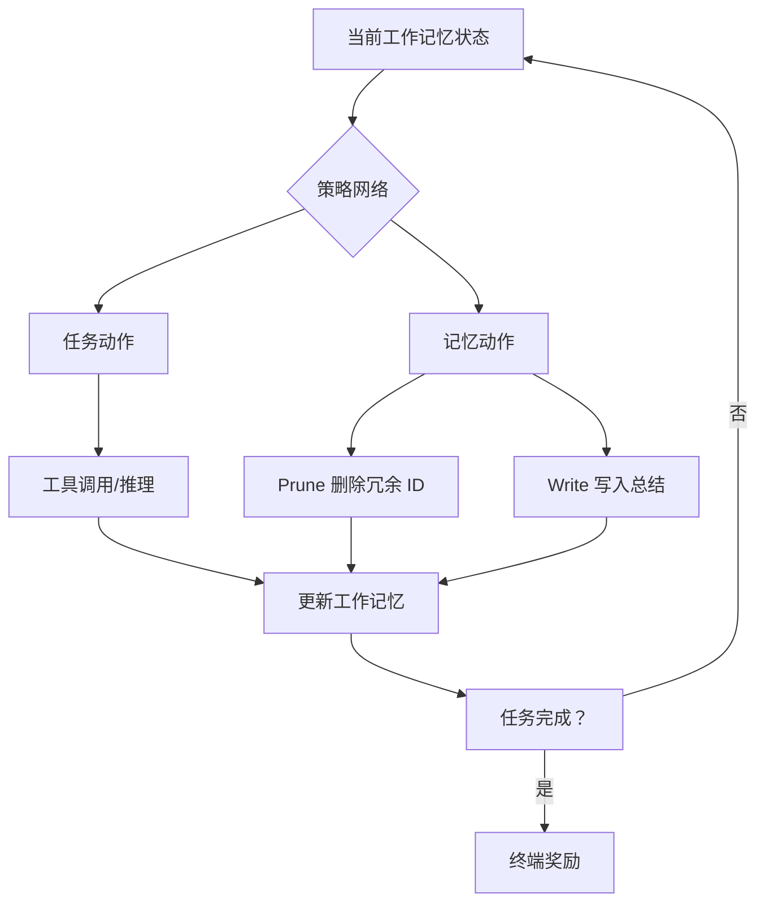

# 记忆即动作：长程代理任务的自主上下文策展

## 一、论文基础元数据
- 原文标题：Memory as Action: Autonomous Context Curation for Long-Horizon Agentic Tasks
- 中文译版：记忆即动作：长程代理任务的自主上下文策展
- 发表渠道（期刊/会议/预印本，标注等级）：预印本（arXiv）
- 发表时间：2025 年
- 链接（arXiv/DOI）：arXiv:2510.12635
- 作者及核心机构：Yuxiang Zhang, Jiangming Shu, Ye Ma, Xueyuan Lin, Shangxi Wu, Jitao Sang（机构待补充）
- 研究领域（一级领域 + 二级子领域）：人工智能 + 智能体系统/强化学习
- 关联数据集（名称/规模/语言/标注）：HotpotQA（多目标，最多 8 子目标）、2WikiMultihopQA、Bamboogle、Musique、Frames、BrowseComp-Plus（英语，任务标注）

## 二、论文综合评价
### 2.1 量化评分（1-5 分，5 分为最优）

| 评价维度 | 评分 | 备注 |
| -------- | ---- | ---- |
| 📚 理论基础 | ⭐⭐⭐⭐ | MDP 建模清晰，奖励设计合理 |
| 🎯 问题核心性 | ⭐⭐⭐⭐⭐ | 直击长程任务上下文爆炸痛点 |
| 💡 方法创新性 | ⭐⭐⭐⭐⭐ | 记忆管理内化为可学习动作 |
| ⚙️ 技术壁垒 | ⭐⭐⭐⭐ | DCPO 算法解决轨迹分段问题 |
| 🧪 实验严谨性 | ⭐⭐⭐⭐ | 多基线对比，消融实验完整 |
| 🔧 落地可行性 | ⭐⭐⭐⭐ | 小模型即可部署，成本显著降低 |
| 🚀 应用前景 | ⭐⭐⭐⭐⭐ | 适用于各类长程代理任务场景 |
| 📊 综合评分 | 4.4 | 方法论创新显著，实验验证充分 |

### 2.2 定性综合评价（≤300 字）
> 核心概括：研究定位、核心价值、差异化优势、关键结论

本研究将上下文记忆管理从固定规则转变为可学习的策略动作，提出 Memory-as-Action (MemAct) 框架。核心价值在于通过强化学习使智能体自主优化上下文修剪与总结，实现信息保留与任务性能的联合优化。差异化优势包括：14B 模型准确率超越 235B 大模型（59.1% vs 53.1%），上下文长度减少 51%，推理延迟降低 40%。关键结论证明上下文管理可作为核心推理能力被端到端学习，为长程代理任务提供可扩展的高精度记忆接口。

## 三、领域本体论映射
| 核心维度 | 具体内容 |
| -------- | -------- |
| 核心研究对象 | 长程代理任务中的工作记忆管理机制 |
| 核心技术路径 | 强化学习驱动的记忆动作策略优化（DCPO 算法） |
| 数据/载体形态 | 交互记录序列（工具调用、推理步骤、记忆内容） |
| 核心功能目标 | 平衡推理质量与上下文成本，解决注意力稀释问题 |
| 验证核心指标 | 任务准确率、上下文长度、Token 消耗、推理延迟 |

## 四、核心问题与解决方案
### 4.1 待解决的核心问题
1. **领域级根本问题**：长程代理任务中上下文窗口限制导致关键信息丢失或注意力稀释
2. **现有方法痛点**：依赖外部固定规则或启发式方法进行上下文修剪，无法与任务策略联合优化
3. **工程落地卡点**：大模型上下文成本高，小模型长程推理能力不足导致过早终止

### 4.2 核心解决方案
- 理论框架：将记忆管理建模为 MDP 中的可学习动作（状态=工作记忆，动作=任务动作 + 记忆动作）
- 核心架构：MemAct 框架，引入 Prune&Write 原语实现原地上下文编辑
- 关键技术：DCPO（Dynamic Context Policy Optimization）算法，轨迹分段解决上下文动态变化导致的训练错位
- 创新机制：记忆动作 inline 执行，避免外部系统额外推理 passes，提高缓存命中率

### 4.3 核心优势（量化 + 定性）
1. 性能优势：MemAct-RL-14B 准确率 59.1%，超越 16 倍参数量的 Qwen3-235B（53.1%）
2. 效率优势：平均上下文长度减少 51%，总 Token 消耗降低 51-57%，推理延迟降低 40%
3. 工程优势：小模型即可部署，记忆动作与推理过程同步，无需辅助推理步骤

## 五、方法与技术架构
### 5.1 核心架构设计

MemAct 框架将记忆管理内化为智能体策略的一部分。状态为当前工作记忆（交互记录序列），动作空间包含任务动作（如搜索）和记忆动作（指定删除 ID 及生成记忆内容），奖励为稀疏终端奖励（任务成功 +1.0，违规 -0.1）。训练分为 SFT 和 RL 两阶段，推理时记忆动作 inline 执行。

### 5.2 关键技术实现细节
| 技术模块 | 实现路径 | 工程注意事项 |
| -------- | -------- | ------------ |
| SFT 阶段 | 使用 DeepSeek-V3.1 合成数据，6 epochs，Batch 256，LR 5e-5 | 阶段性提示教模型基础记忆规则 |
| RL 阶段 | DCPO 算法，Batch 128，LR 1e-6，轨迹分段 N_seg=12 | 解决上下文动态变化导致的训练错位 |
| 记忆原语 | Prune&Write，指定删除 ID 并生成记忆内容 | 确保删除与写入原子性，避免信息不一致 |
| 依赖组件 | Qwen2.5-7B/14B-Instruct 基座，NVIDIA H100 硬件 | 任务最大 40 步，需控制轨迹长度 |

### 5.3 架构优缺点
- 优点：
  1. 记忆管理与任务策略联合优化，避免信息误删
  2. 小模型可获得接近大模型的性能，降低成本
  3. 上下文压缩显著，提高缓存命中率和推理速度
- 缺点：
  1. 压缩过程不可逆，总结后无法恢复原始细节
  2. 依赖稀疏终端奖励，信用分配困难
  3. 当前使用随机采样，可能在低信息段浪费资源

## 六、实验设计与结果分析
### 6.1 实验基础设置
| 维度 | 内容 |
| ---- | ---- |
| 数据集 | 多目标（HotpotQA 构建，最多 8 子目标）；单目标（2Wiki、Bamboogle、HotpotQA、Musique、Frames、BrowseComp-Plus） |
| 基线方法 | Qwen3-235B、Search-R1-14B、Search-R1-7B、原始 Qwen2.5 |
| 实验环境 | NVIDIA H100，任务最大 40 步 |
| 评价指标 | 任务准确率（LLM 评估共识）、Token 消耗、工具调用频率、延迟 |

### 6.2 核心实验结果
| 方法 | 核心指标 1（准确率） | 核心指标 2（上下文长度） | 工程指标（算力/耗时） |
| ---- | --------- | --------- | -------------------- |
| Qwen3-235B | 53.1% | 约 7000 tokens/步 | 基准 |
| Search-R1-14B | 51.4% | 约 8750 tokens/步 | 基准 |
| MemAct-RL-14B | 59.1% | 约 3500 tokens/步 | 延迟降低 40% |
| MemAct-RL-7B | 48.5% | 待补充 | Token 消耗降低 57% |

### 6.3 消融实验/鲁棒性分析
| 实验变体 | 指标变化 | 核心结论 |
| -------- | -------- | -------- |
| MemAct-SFT vs MemAct-RL | 多目标准确率 48.5%→59.1% | RL 优化显著提升复杂任务性能 |
| 固定间隔更新 vs MemAct | 8 目标任务性能下降 | 静态调度易删除关键信息 |
| 7B vs 14B 模型策略 | 7B 更激进修剪，14B 双模态 | 模型自动演化容量感知策略 |

### 6.4 实验结论（工程视角）
MemAct 框架在显著降低计算成本的同时实现更高准确率，证明主动上下文管理优于被动保留。小模型（7B/14B）通过 RL 可获得接近或超越大模型的性能，适合资源受限场景。记忆动作与推理过程同步执行，无需额外推理 passes，工程部署友好。

## 七、领域贡献与创新点
| 贡献层级 | 具体内容 |
| -------- | -------- |
| 理论贡献 | 证明上下文管理可作为核心推理能力被端到端学习 |
| 方法/架构贡献 | 提出 MemAct 框架，将记忆管理转化为可学习动作（Prune&Write） |
| 数据/工具贡献 | 使用 DeepSeek-V3.1 合成训练数据，构建多目标任务基准 |
| 实验/验证贡献 | 验证小模型通过记忆动作可媲美大模型性能（14B vs 235B） |
| 工程落地贡献 | 提供可扩展的高精度记忆接口，降低 51% 上下文成本和 40% 延迟 |

## 八、局限性与风险
| 维度 | 具体描述 | 应对思路 |
| ---- | -------- | -------- |
| 学术局限性 | 依赖稀疏终端奖励，信用分配困难；压缩不可逆限制记忆精度上限 | 探索密集奖励设计；研究可逆压缩或分层记忆 |
| 工程落地风险 | 随机采样未区分关键步骤，可能浪费资源；模型策略需针对任务调优 | 引入重要性采样；建立任务自适应策略库 |
| 伦理/合规风险 | 记忆压缩可能导致关键信息丢失，影响决策可解释性 | 保留关键决策日志；建立审计追溯机制 |

## 九、未来研究/落地方向
| 方向类型 | 具体内容 | 优先级 |
| -------- | -------- | ------ |
| 科研拓展 | 探索密集奖励设计改善信用分配；研究可逆记忆压缩机制 | 高 |
| 工程优化 | 引入重要性采样区分关键步骤；优化轨迹分段策略 | 高 |
| 跨领域适配 | 适配代码生成、多轮对话、长期规划等不同代理任务场景 | 中 |

## 十、关键词与术语表
| 语言 | 关键词 |
| ---- | ------ |
| 中文 | 记忆即动作、上下文策展、长程代理任务、动态上下文策略优化、工作记忆管理 |
| 英文 | Memory-as-Action, Context Curation, Long-Horizon Agentic Tasks, DCPO, Working Memory Management |
| 领域专属术语 | MemAct：记忆即动作框架，将记忆管理内化为可学习动作；DCPO：动态上下文策略优化算法，通过轨迹分段解决训练错位问题；Prune&Write：记忆原语，删除冗余 ID 并写入总结内容 |

## 十一、参考文献与关联资源
- 核心参考文献：待补充（原文未提供完整参考文献列表）
- 补充阅读：强化学习在智能体系统中的应用、上下文窗口优化技术、长程任务规划方法
- 开源代码/工具：待补充（论文发布时可能开源）

## 十二、阅读者批注
1. **科研启发**：将系统级优化问题（如上下文管理）内化为模型可学习动作的范式，可迁移至其他资源约束场景（如计算预算、API 调用限制）
2. **工程落地思考**：小模型+MemAct 组合可显著降低部署成本，适合边缘设备或高并发场景；需注意记忆压缩对可解释性的影响
3. **待验证/存疑点**：信用分配问题在更复杂任务中的影响程度；不同领域任务的策略泛化能力需进一步验证
4. **个人/团队应用场景**：适用于需要长程推理的智能客服、自动化研究助手、多步骤任务规划系统等场景

## 十三、阅读元信息
| 维度 | 内容 |
| ---- | ---- |
| 阅读日期 | 2026-04-09 02:12 |
| 阅读人 | xPaperReader AI |
| 文档编号 | arxiv-2510.12635 |
| 版本迭代 | v1.0 |