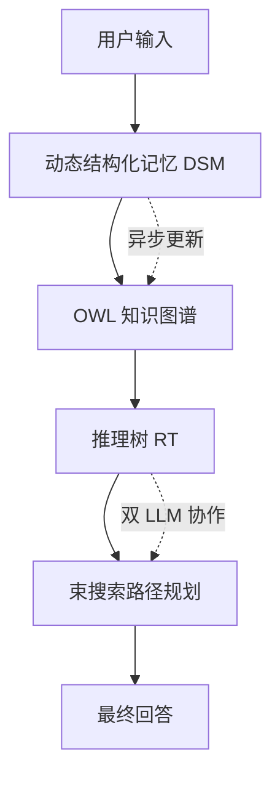

# D-SMART：通过动态结构化记忆与推理树增强 LLM 对话一致性

## 一、论文基础元数据
- 原文标题：D-SMART: Enhancing LLM Dialogue Consistency via Dynamic Structured Memory And Reasoning Tree
- 中文译版：D-SMART：通过动态结构化记忆与推理树增强 LLM 对话一致性
- 发表渠道：预印本（arXiv）
- 发表时间：2025 年
- 链接：arXiv:2510.13363
- 作者及核心机构：Xiang Lei, Qin Li, Min Zhang, Min Zhang（机构信息待补充）
- 研究领域：人工智能（自然语言处理 + 大模型对话系统）
- 关联数据集：MT-Bench-101（精选 25% 子集/多语言/人工标注复杂度）

## 二、论文综合评价
### 2.1 量化评分（1-5 分，5 分为最优）

| 评价维度 | 评分 | 备注 |
| -------- | ---- | ---- |
| 📚 理论基础 | ⭐⭐⭐⭐ | 结合知识图谱与思维树，理论扎实 |
| 🎯 问题核心性 | ⭐⭐⭐⭐⭐ | 直击长对话逻辑一致性核心痛点 |
| 💡 方法创新性 | ⭐⭐⭐⭐⭐ | 动态记忆与推理树协同机制新颖 |
| ⚙️ 技术壁垒 | ⭐⭐⭐⭐ | 神经符号流水线实现复杂度较高 |
| 🧪 实验严谨性 | ⭐⭐⭐⭐ | 指标创新，但仅使用精选子集验证 |
| 🔧 落地可行性 | ⭐⭐⭐ | 推理延迟显著增加，需异步优化 |
| 🚀 应用前景 | ⭐⭐⭐⭐ | 高可靠性场景应用价值巨大 |
| 📊 综合评分 | 4.1 | 架构创新显著，但工程开销需平衡 |

### 2.2 定性综合评价（≤300 字）
> 核心概括：研究定位、核心价值、差异化优势、关键结论
本研究定位为模型无关的对话一致性增强框架。核心价值在于通过动态结构化记忆（DSM）解决事实遗忘，利用推理树（RT）解决逻辑衰退。差异化优势在于引入神经符号流水线构建 OWL 知识图谱，并设计了基于 NLI 的一致性评估指标（CS/DER）。关键结论表明，该框架能显著提升开源模型性能（Qwen-8B 提升 10.1%），使其逼近大模型水平，且有效缓解长对话中的逻辑衰退，但代价是推理延迟增加。

## 三、领域本体论映射
| 核心维度 | 具体内容 |
| -------- | -------- |
| 核心研究对象 | 长轮次多轮对话中的逻辑与事实一致性 |
| 核心技术路径 | 动态知识图谱构建 + 显式推理树搜索 |
| 数据/载体形态 | 非结构化对话文本 → OWL 知识图谱 → 推理路径 |
| 核心功能目标 | 维持对话事实忠实性，增强逻辑可追溯性 |
| 验证核心指标 | 一致性分数 (CS)、对话蕴含率 (DER)、GPT Score |

## 四、核心问题与解决方案
### 4.1 待解决的核心问题
1. **领域级根本问题**：大语言模型在长上下文对话中难以维持逻辑连贯与事实一致。
2. **现有方法痛点**：静态预训练知识无法覆盖对话涌现事实；非结构化记忆易导致上下文歧义。
3. **工程落地卡点**：传统评估指标（如 GPT-4 评分）易忽略细微逻辑矛盾；长对话性能随轮次急剧下降。

### 4.2 核心解决方案
- 理论框架：模型无关的增强框架，分离记忆维护与响应生成。
- 核心架构：双组件协同（动态结构化记忆 DSM + 推理树 RT）。
- 关键技术：神经符号知识提取（AMR→OWL）、束搜索推理路径规划。
- 创新机制：基于 NLI 的一致性量化评估，异步记忆维护隐藏延迟。

### 4.3 核心优势（量化 + 定性）
1. 性能优势：Qwen-8B 集成后得分从 7.79 升至 8.58（+10.1%）。
2. 效率优势：记忆维护可异步执行，虽增加延迟但提升稳定性。
3. 工程优势：显著赋能中小模型，使其一致性表现接近大模型水平。

## 五、方法与技术架构
### 5.1 核心架构设计
> 文字描述：系统分为记忆维护与响应生成两阶段。用户输入首先触发 DSM 模块更新知识图谱，随后 RT 模块基于图谱进行多步推理搜索，最终生成回答。
> 架构图：

### 5.2 关键技术实现细节
| 技术模块 | 实现路径 | 工程注意事项 |
| -------- | -------- | ------------ |
| 动态结构化记忆 (DSM) | 文本→AMR→OWL 图谱，含冲突解决 | 需处理实体对齐与语义消歧 |
| 推理树 (RT) | 定义离散动作，双 LLM 策略 + 价值评分 | 需平衡搜索宽度与推理延迟 |
| 依赖组件 | SPRING(AMR), AMR2FRED, EWISER | 外部工具调用增加系统复杂度 |

### 5.3 架构优缺点
- 优点：事实可追溯，逻辑可验证，显著提升小模型能力。
- 缺点：推理延迟高（GPT-4o 从 3.5s 增至 9.8s），系统链路复杂。

## 六、实验设计与结果分析
### 6.1 实验基础设置
| 维度 | 内容 |
| ---- | ---- |
| 数据集 | MT-Bench-101（精选 25% 子集，侧重复杂度） |
| 基线方法 | Mem0, MemoryBank, COMEDY, GPT-4o(Static) |
| 实验环境 | GPT-4o, Qwen-8B, 温度参数 0.8/0.0 |
| 评价指标 | GPT Score, Consistency Score (CS), Dialogue Entailment Rate (DER) |

### 6.2 核心实验结果
| 方法 | 核心指标 1 (DER) | 核心指标 2 (GPT Score) | 工程指标（耗时/轮） |
| ---- | --------- | --------- | -------------------- |
| GPT-4o 基线 | 23.88% | 待补充 | 3.50s |
| Qwen-8B 基线 | 26.23% | 7.79 | 0.27s |
| 本文方法 (GPT-4o) | 38.51% | 待补充 | 9.80s |
| 本文方法 (Qwen-8B) | 38.73% | 8.58 | 1.27s |

### 6.3 消融实验/鲁棒性分析
| 实验变体 | 指标变化 | 核心结论 |
| -------- | -------- | -------- |
| 仅 DSM | 一致性提升有限 | 提供事实锚点，缺乏推理纪律 |
| 仅 RT | 逻辑性提升有限 | 提供推理过程，缺乏事实依据 |
| DSM+RT | 综合性能最优 | 两者协同不可或缺 (Symbiotically Indispensable) |

### 6.4 实验结论（工程视角）
结构化推理能有效支撑小模型逼近大模型性能，但需接受延迟增加的代价。记忆维护异步化是关键优化手段。

## 七、领域贡献与创新点
| 贡献层级 | 具体内容 |
| -------- | -------- |
| 理论贡献 | 提出对话一致性的神经符号建模范式 |
| 方法/架构贡献 | 设计 DSM 与 RT 双组件协同框架 |
| 数据/工具贡献 | 引入基于 NLI 的一致性评估指标 (CS/DER) |
| 实验/验证贡献 | 验证了结构化记忆对小模型的显著赋能效果 |
| 工程落地贡献 | 提供了异步记忆维护的延迟优化思路 |

## 八、局限性与风险
| 维度 | 具体描述 | 应对思路 |
| ---- | -------- | -------- |
| 学术局限性 | 依赖精选子集，全量数据集可能存在天花板效应 | 未来需在更广泛数据集上验证 |
| 工程落地风险 | 单轮推理延迟显著增加（约 3-4 倍） | 采用异步处理、启发式剪枝优化 |
| 伦理/合规风险 | 知识图谱可能存储敏感对话信息 | 需增加数据加密与访问控制机制 |

## 九、未来研究/落地方向
| 方向类型 | 具体内容 | 优先级 |
| -------- | -------- | ------ |
| 科研拓展 | 整合外部知识源，增强图谱丰富度 | 中 |
| 工程优化 | 通过启发式剪枝、批量并行生成降低延迟 | 高 |
| 跨领域适配 | 适配客服、医疗等高可靠性对话场景 | 高 |

## 十、关键词与术语表
| 语言 | 关键词 |
| ---- | ------ |
| 中文 | 动态结构化记忆，推理树，对话一致性，知识图谱 |
| 英文 | Dynamic Structured Memory, Reasoning Tree, Dialogue Consistency, Knowledge Graph |
| 领域专属术语 | DER（对话蕴含率）：衡量被分类为“蕴含”的轮次比例；CS（一致性分数）：量化蕴含与矛盾的概率差 |

## 十一、参考文献与关联资源
- 核心参考文献：待补充（原文未详细列出具体引用文献列表）
- 补充阅读：Tree-of-Thoughts, RAG, Neuro-symbolic AI
- 开源代码/工具：待补充（文中未提供具体仓库链接）

## 十二、阅读者批注
1. **科研启发**：将非结构化文本转化为结构化图谱再推理，是解决幻觉的有效路径。
2. **工程落地思考**：延迟是最大障碍，必须实现记忆更新的完全异步化，用户无感知。
3. **待验证/存疑点**：精选子集的结果是否能完全代表真实复杂场景下的泛化能力。
4. **个人/团队应用场景**：适用于对逻辑一致性要求高的智能客服或法律助手场景。

## 十三、阅读元信息
| 维度 | 内容 |
| ---- | ---- |
| 阅读日期 | 2026-04-09 02:26 |
| 阅读人 | xPaperReader AI |
| 文档编号 | arxiv-2510.13363 |
| 版本迭代 | v1.0 |