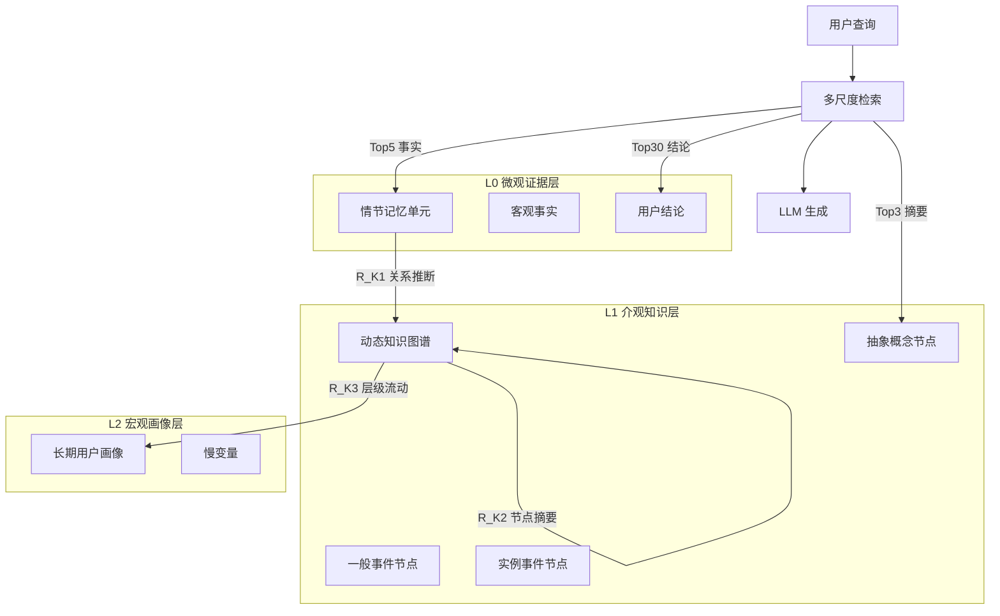

# RGMem：重整化群启发的语言智能体记忆演化

## 一、论文基础元数据
- 原文标题：RGMem: Renormalization Group-inspired Memory Evolution for Language Agents
- 中文译版：RGMem：重整化群启发的语言智能体记忆演化
- 发表渠道：预印本（arXiv）
- 发表时间：2025 年
- 链接（arXiv/DOI）：arXiv: 2510.16392
- 作者及核心机构：Ao Tian, Yunfeng Lu, Xinxin Fan, Changhao Wang, Lanzhi Zhou, Yeyao Zhang, Yanfang Liu（机构待补充）
- 研究领域（一级领域 + 二级子领域）：人工智能 / 语言智能体与长期记忆系统
- 关联数据集（名称/规模/语言/标注）：LOCOMO（长对话推理基准，约 600 轮/26k tokens）、PersonaMem（动态画像演化基准，128k tokens）

## 二、论文综合评价
### 2.1 量化评分（1-5 分，5 分为最优）

| 评价维度 | 评分 | 备注 |
| -------- | ---- | ---- |
| 📚 理论基础 | ⭐⭐⭐⭐⭐ | 物理学重整化群理论形式化证明 |
| 🎯 问题核心性 | ⭐⭐⭐⭐⭐ | 稳定性 - 可塑性困境是领域根本问题 |
| 💡 方法创新性 | ⭐⭐⭐⭐⭐ | 首次将 RG 理论引入记忆演化系统 |
| ⚙️ 技术壁垒 | ⭐⭐⭐⭐ | 多尺度动力学机制实现复杂度较高 |
| 🧪 实验严谨性 | ⭐⭐⭐⭐⭐ | 双基准测试 + 消融 + 动力学分析 |
| 🔧 落地可行性 | ⭐⭐⭐⭐ | 无需微调，兼容闭源 LLM |
| 🚀 应用前景 | ⭐⭐⭐⭐⭐ | 长对话个性化应用场景广泛 |
| 📊 综合评分 | 4.7 | 理论创新与实验验证俱佳，落地潜力大 |

### 2.2 定性综合评价（≤300 字）
> 核心概括：研究定位、核心价值、差异化优势、关键结论

**研究定位**：长期对话记忆管理系统，聚焦语言智能体的用户画像建模。**核心价值**：首次将物理学重整化群理论工程化为 AI 记忆管理策略，突破传统"检索质量 vs. 记忆组织"局限。**差异化优势**：通过阈值触发的相变机制和快慢变量分离，原则性解决稳定性与可塑性冲突，而非依赖启发式规则。**关键结论**：记忆演化机制比存储容量更重要；宏观用户画像呈现不动点收敛特性；多尺度组织可在有限上下文内实现接近全上下文的性能。

## 三、领域本体论映射
| 核心维度 | 具体内容 |
| -------- | -------- |
| 核心研究对象 | 长对话场景下的语言智能体长期记忆系统 |
| 核心技术路径 | 重整化群启发的多尺度记忆演化框架 |
| 数据/载体形态 | 分层知识图谱 + 情节记忆单元 + 抽象用户画像 |
| 核心功能目标 | 平衡记忆稳定性与可塑性，实现长期个性化 |
| 验证核心指标 | 推理准确率（单跳/多跳/时序）、宏观收敛性、Token 效率 |

## 四、核心问题与解决方案
### 4.1 待解决的核心问题
1. **领域级根本问题**：长对话个性化中的"稳定性 - 可塑性困境"——如何在保持长期用户画像稳定性的同时，灵活适应新的、甚至冲突的用户证据。
2. **现有方法痛点**：传统记忆系统将记忆视为静态检索问题，依赖暴力积累上下文或简单增量更新，无法有效过滤噪声且难以平衡新旧信息。
3. **工程落地卡点**：有限上下文窗口限制、频繁记忆更新导致的计算开销、冲突证据处理缺乏原则性机制。

### 4.2 核心解决方案
- **理论框架**：多尺度有效理论（Multi-Scale Effective Theory），将记忆系统建模为多尺度动力学系统。
- **核心架构**：三层记忆状态空间（L0 微观证据层、L1 介观知识层、L2 宏观画像层）。
- **关键技术**：重整化算子（$\mathcal{R}_{K1}$ 关系推断、$\mathcal{R}_{K2}$ 节点摘要、$\mathcal{R}_{K3}$ 层级流动）、阈值触发演化机制。
- **创新机制**：分层粗粒化、快慢变量分离、阈值非线性更新、宏观不变性约束。

### 4.3 核心优势（量化 + 定性）
1. **性能优势**：LOCOMO 基准 86.17%（+7.08% vs Zep），PersonaMem 基准 74.01%（+8.98% vs MemoryOS），多跳推理提升近 9%。
2. **效率优势**：使用更少 Token 取得更高准确率，阈值触发机制确保仅在证据充足时进行抽象演化操作。
3. **工程优势**：完全基于外部记忆构建，无需微调模型参数，兼容闭源 LLM（如 GPT-4），具有良好的落地潜力。

## 五、方法与技术架构
### 5.1 核心架构设计

**文字描述**：RGMem 将记忆演化分为三个层级。L0 层存储原始对话分段提取的客观事实和用户结论；L1 层构建动态知识图谱，包含抽象概念、一般事件、实例事件节点；L2 层生成稳定的长期用户画像。通过三个重整化算子驱动记忆跨尺度演化，采用多尺度检索策略在推理时混合检索不同层级信息。

### 5.2 关键技术实现细节

| 技术模块 | 实现路径 | 工程注意事项 |
| -------- | -------- | ------------ |
| L0 情节记忆 | 原始对话分段，提取事实和结论 | 需定义清晰的信息抽取规则 |
| L1 知识图谱 | 动态构建节点和边，支持增删改 | 图结构更新需保持拓扑一致性 |
| L2 用户画像 | 聚合下层信息生成稳定表征 | 避免过度抽象导致信息丢失 |
| 重整化算子 | 阈值触发（θ_inf=3, θ_sum=6） | 阈值需根据场景调优 |
| 多尺度检索 | BM25+ 图谱检索混合策略 | 检索结果需去重和排序 |
| 依赖组件 | 外部记忆存储、图数据库、LLM API | 需考虑延迟和成本 |

### 5.3 架构优缺点
- **优点**：
  1. 理论驱动而非启发式，具有原则性保障
  2. 快慢变量分离有效平衡稳定性与可塑性
  3. 阈值机制过滤噪声，避免频繁更新
  4. 分层结构提供可解释的记忆演化路径
  5. 无需模型微调，部署成本低

- **缺点**：
  1. 知识图谱构建和维护复杂度较高
  2. 阈值参数需根据具体场景调优
  3. 多尺度检索增加推理延迟
  4. 对开放域推理增益有限
  5. 长程依赖的图谱查询可能成为瓶颈

## 六、实验设计与结果分析
### 6.1 实验基础设置

| 维度 | 内容 |
| ---- | ---- |
| 数据集 | LOCOMO（长上下文推理）、PersonaMem（动态画像演化） |
| 基线方法 | LangMem, Mem0, Zep, RAG, Full-Context, A-Mem, MemoryOS |
| 实验环境 | gpt-4o-mini, gpt-4.1-mini, gpt-4.1 作为骨干模型 |
| 评价指标 | 准确率（单跳/多跳/时序/开放域）、宏观收敛性、Token 效率 |

### 6.2 核心实验结果

| 方法 | 核心指标 1（LOCOMO） | 核心指标 2（PersonaMem） | 工程指标（算力/耗时） |
| ---- | --------- | --------- | -------------------- |
| Full-Context | 87.52% | 待补充 | 高 Token 消耗 |
| Zep（最佳基线） | 79.09% | 待补充 | 中等 |
| MemoryOS | 待补充 | 65.03% | 中等 |
| 本文方法（RGMem） | 86.17% | 74.01% | 低 Token 消耗 |

### 6.3 消融实验/鲁棒性分析

| 实验变体 | 指标变化 | 核心结论 |
| -------- | -------- | -------- |
| w/o L0（移除事实层） | 全面退化 | 事实层是基础，不可缺失 |
| w/o L1（移除抽象层） | 多跳推理受损 | 抽象层支撑复杂推理 |
| w/o RG（移除动力学） | 无法平衡噪声与新证据 | RG 机制是核心创新 |
| θ_inf 过低 | 噪声敏感 | 阈值需达到临界点 |
| θ_inf 过高 | 表征僵化 | 阈值过高导致更新困难 |

### 6.4 实验结论（工程视角）
1. **性能验证**：RGMem 在有限上下文内实现接近 Oracle（Full-Context）的性能，证明多尺度组织的有效性。
2. **机制验证**：消融实验证实性能提升源于 RG 启发的动力学机制，而非架构冗余。
3. **参数鲁棒性**：对超参数变化具有鲁棒性，默认设置附近表现稳定，无需精细调优。
4. **收敛特性**：宏观用户画像余弦相似度迅速饱和至 1.0 附近，证实宏观不变性假设。

## 七、领域贡献与创新点
| 贡献层级 | 具体内容 |
| -------- | -------- |
| 理论贡献 | 首次将重整化群理论形式化应用于记忆系统，提出四大概念洞察（信息密度最大化、相变动力学、快慢变量分离、宏观不变性） |
| 方法/架构贡献 | 提出三层记忆状态空间和三个重整化算子，实现原则性的记忆演化机制 |
| 数据/工具贡献 | 待补充（论文未明确提及新数据集或开源工具发布） |
| 实验/验证贡献 | 在 LOCOMO 和 PersonaMem 双基准上验证，提供动力学分析和参数敏感性研究 |
| 工程落地贡献 | 无需微调、兼容闭源 LLM、阈值触发降低计算开销，具有实际部署可行性 |

## 八、局限性与风险
| 维度 | 具体描述 | 应对思路 |
| ---- | -------- | -------- |
| 学术局限性 | 开放域推理增益较小；理论证明依赖特定假设条件 | 扩展理论适用范围，增加更多基准测试 |
| 工程落地风险 | 知识图谱维护复杂度高；多尺度检索增加延迟 | 优化图数据库查询，引入缓存机制 |
| 伦理/合规风险 | 长期用户画像可能涉及隐私问题；记忆演化可能固化偏见 | 增加隐私保护机制，定期审计画像公平性 |

## 九、未来研究/落地方向
| 方向类型 | 具体内容 | 优先级 |
| -------- | -------- | ------ |
| 科研拓展 | 探索其他物理学理论（如统计力学）在记忆系统中的应用；形式化证明更多动力学性质 | 高 |
| 工程优化 | 优化知识图谱存储和查询效率；自适应阈值调节机制；分布式记忆存储 | 高 |
| 跨领域适配 | 应用于客服对话系统、个人助理、教育辅导等长交互场景；扩展到多模态记忆 | 中 |

## 十、关键词与术语表
| 语言 | 关键词 |
| ---- | ------ |
| 中文 | 重整化群、记忆演化、稳定性 - 可塑性困境、多尺度动力学、知识图谱、用户画像、粗粒化、阈值触发 |
| 英文 | Renormalization Group, Memory Evolution, Stability-Plasticity Dilemma, Multi-scale Dynamics, Knowledge Graph, User Profile, Coarse-graining, Thresholded Evolution |
| 领域专属术语 | 重整化算子（驱动记忆跨尺度演化的变换函数）；宏观不变性（长期用户画像超越事实稳定性的抽象规律）；快慢变量分离（快速变化的事实与缓慢演化的特质区分）；相变动力学（用户画像更新呈现的非线性动态特性） |

## 十一、参考文献与关联资源
- 核心参考文献：待补充（原文参考文献列表未提供）
- 补充阅读：重整化群理论相关物理文献、长期记忆系统综述、语言智能体架构研究
- 开源代码/工具：待补充（论文未明确提及代码开源情况）

## 十二、阅读者批注
1. **科研启发**：跨学科理论迁移（物理学→AI）的成功案例，提示可从其他成熟科学领域寻找灵感；"组织优于规模"的结论对当前大模型上下文扩展热潮有反思价值。
2. **工程落地思考**：阈值机制可作为通用设计模式应用于其他动态系统；知识图谱与向量检索的混合架构值得在实际项目中尝试；无需微调的特性降低部署门槛。
3. **待验证/存疑点**：阈值参数（θ_inf=3, θ_sum=6）在不同场景下的通用性；知识图谱规模增长后的查询效率；长周期（数月/年）记忆演化的实际表现。
4. **个人/团队应用场景**：客服对话系统的长期用户偏好追踪；个人助理的记忆管理模块；教育辅导系统的学生画像建模；医疗健康领域的长期病程跟踪。

## 十三、阅读元信息
| 维度 | 内容 |
| ---- | ---- |
| 阅读日期 | 2026-04-09 02:38 |
| 阅读人 | xPaperReader AI |
| 文档编号 | arxiv-2510.16392 |
| 版本迭代 | v1.0 |