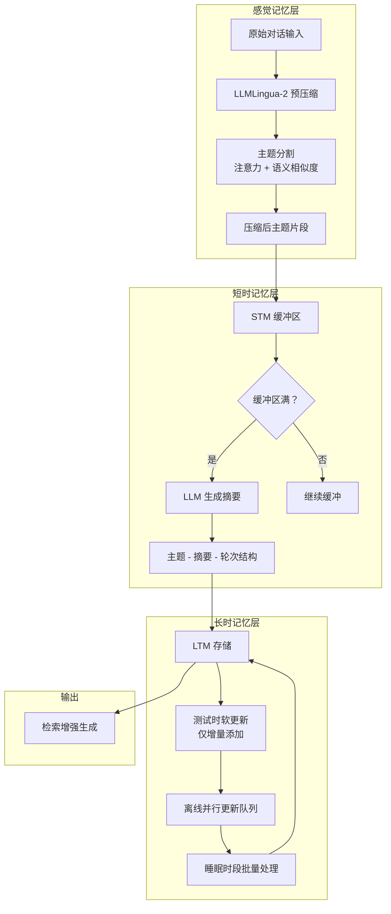

# LightMem：轻量级高效记忆增强生成系统

## 一、论文基础元数据
- 原文标题：LightMem: Lightweight and Efficient Memory-Augmented Generation
- 中文译版：LightMem：轻量级高效记忆增强生成系统
- 发表渠道：预印本（arXiv）
- 发表时间：2025 年
- 链接：https://arxiv.org/abs/2510.18866
- 作者及核心机构：Jizhan Fang, Xinle Deng, Haoming Xu 等；浙江大学及相关中国科研机构
- 研究领域：人工智能 + 大语言模型记忆系统
- 关联数据集：LongMemEval-S（长对话记忆）、LoCoMo（长范围对话记忆）；语言：英文；标注：任务导向型标注

## 二、论文综合评价
### 2.1 量化评分（1-5 分，5 分为最优）

| 评价维度 | 评分 | 备注 |
| -------- | ---- | ---- |
| 📚 理论基础 | ⭐⭐⭐⭐ | 借鉴人类记忆模型，理论依据充分 |
| 🎯 问题核心性 | ⭐⭐⭐⭐⭐ | 直击 LLM 记忆系统效率痛点 |
| 💡 方法创新性 | ⭐⭐⭐⭐ | 三阶段记忆 + 离线更新机制新颖 |
| ⚙️ 技术壁垒 | ⭐⭐⭐ | 主要整合现有技术，壁垒中等 |
| 🧪 实验严谨性 | ⭐⭐⭐⭐ | 多数据集多基线，实验设计完整 |
| 🔧 落地可行性 | ⭐⭐⭐⭐⭐ | 轻量级设计，工程部署友好 |
| 🚀 应用前景 | ⭐⭐⭐⭐ | 长对话场景应用潜力大 |
| 📊 综合评分 | 4.1 | 效率与效果平衡出色，落地价值高 |

### 2.2 定性综合评价（≤300 字）
> 核心概括：研究定位为大语言模型记忆系统的效率优化，核心价值在于通过模拟人类三阶段记忆机制（感觉记忆 - 短时记忆 - 长时记忆），实现记忆维护成本的大幅降低。差异化优势体现在预压缩去冗、主题感知分组和离线并行更新三大策略的协同设计。关键结论表明，该方法在提升准确率 2%-29% 的同时，将 Token 消耗和 API 调用降低 10-100 倍，实现了效率与效果的双重突破。

## 三、领域本体论映射
| 核心维度 | 具体内容 |
| -------- | -------- |
| 核心研究对象 | LLM 对话记忆系统的存储与检索机制 |
| 核心技术路径 | 三阶段记忆架构 + 压缩总结 + 离线更新 |
| 数据/载体形态 | 对话文本序列、主题摘要、记忆条目 |
| 核心功能目标 | 降低记忆维护成本，提升长对话记忆准确率 |
| 验证核心指标 | 准确率 (ACC)、Token 消耗、API 调用次数、运行时间 |

## 四、核心问题与解决方案
### 4.1 待解决的核心问题
1. **领域级根本问题**：
   LLM 代理在长对话场景中需要维护大量历史记忆，传统记忆系统计算开销过大，难以规模化部署。

2. **现有方法痛点**：
   - 冗余的感觉记忆：直接处理原始数据浪费资源
   - STM 效率与效果失衡：粒度过细增加延迟，过粗导致语义混淆
   - LTM 更新低效：测试时强制实时更新导致高延迟，更新过程串行

3. **工程落地卡点**：
   在线推理与记忆更新耦合，导致测试时延迟高、API 调用频繁、Token 消耗巨大。

### 4.2 核心解决方案
- **理论框架**：借鉴 Atkinson-Shiffrin 人类记忆模型（感觉记忆→短时记忆→长时记忆）
- **核心架构**：三模块解耦设计（Light1 感觉记忆 + Light2 短时记忆 + Light3 长时记忆）
- **关键技术**：
  - 迭代预压缩（LLMLingua-2）
  - 主题感知分割（注意力矩阵 + 语义相似度）
  - 缓冲触发总结（阈值控制）
  - 软更新机制（增量添加避免信息覆盖）
  - 离线并行更新（睡眠时段处理）
- **创新机制**：在线推理与离线更新解耦，打破"每轮必总结"的低效模式

### 4.3 核心优势（量化 + 定性）
1. **性能优势**：
   - LongMemEval 准确率超越最强基线 2.09%-7.67%
   - LoCoMo 准确率超越基线 4.41%-29.29%

2. **效率优势**：
   - Token 消耗降低 10×-38×（在线测试可达 100×）
   - API 调用减少 3.6×-30×（在线测试可达 159×-310×）
   - 运行时间加速 2.9×-12.4×

3. **工程优势**：
   - 仅引入轻量模型 LLMLingua-2（显存<2GB），overhead 可忽略
   - 测试时延迟显著降低（更新过程离线化）
   - 支持多种 backbone（GPT-4o-mini, Qwen3-30B, GLM-4.6）

## 五、方法与技术架构
### 5.1 核心架构设计

### 5.2 关键技术实现细节

| 技术模块 | 实现路径 | 工程注意事项 |
| -------- | -------- | ------------ |
| 感觉记忆压缩 | LLMLingua-2 轻量 BERT 架构，保留率 0.6-0.7 | 显存占用<2GB，压缩率需调优 |
| 主题分割 | 注意力矩阵峰值检测 + 语义相似度聚类 | 移除该模块准确率下降 5%-6% |
| STM 缓冲触发 | 容量阈值控制，满时触发摘要生成 | 阈值越大效率越高，准确率非单调 |
| LTM 软更新 | 测试时仅增量添加，避免硬更新覆盖 | 保留全局信息完整性 |
| 离线并行更新 | 睡眠时段批量处理更新队列 | 解决串行更新延迟问题 |
| 依赖组件 | LLMLingua-2、主流 LLM API | 需确保组件版本兼容性 |

### 5.3 架构优缺点
- **优点**：
  - 在线推理与离线更新解耦，测试时延迟显著降低
  - 三阶段记忆设计符合认知规律，语义感知能力强
  - 轻量级依赖，工程部署门槛低
  - 支持多种 backbone，兼容性好

- **缺点**：
  - 需要额外的睡眠时段进行离线更新，实时性有折衷
  - 压缩率、阈值等超参数需要针对场景调优
  - 主题分割依赖注意力矩阵，对某些模型可能不适用

## 六、实验设计与结果分析
### 6.1 实验基础设置

| 维度 | 内容 |
| ---- | ---- |
| 数据集 | LongMemEval-S、LoCoMo |
| 基线方法 | FullText, NaiveRAG, LangMem, A-MEM, MemoryOS, Mem0 |
| 实验环境 | 4×NVIDIA RTX 3090, 256GB RAM |
| 评价指标 | 准确率 (ACC)、Token 消耗、API 调用次数、运行时间 |

### 6.2 核心实验结果

| 方法 | 核心指标 1 (ACC 提升) | 核心指标 2 (Token 降低) | 工程指标（算力/耗时） |
| ---- | --------- | --------- | -------------------- |
| A-MEM (基线 1) | - | - | 基准 |
| MemoryOS (基线 2) | - | - | 基准 |
| 本文方法 | +2.09%-29.29% | 10×-38× | 加速 2.9×-12.4× |

### 6.3 消融实验/鲁棒性分析

| 实验变体 | 指标变化 | 核心结论 |
| -------- | -------- | -------- |
| 移除主题分割 | GPT -6.3%, Qwen -5.4% | 主题分割对语义单元感知必要 |
| 压缩率 0.6-0.7 | 准确率最佳 | 需根据 STM 阈值调优 |
| STM 阈值增大 | 效率提升，准确率非单调 | 需权衡 tuning |
| 硬更新 vs 软更新 | 软更新保留全局信息 | 避免非矛盾信息误删 |

### 6.4 实验结论（工程视角）
从工程部署角度，LightMem 在保持准确率提升的同时，将计算成本降低一个数量级，特别适合资源受限的长对话应用场景。离线更新机制虽引入一定延迟，但可通过睡眠时段批量处理有效缓解。超参数（压缩率、阈值）需根据具体场景调优，建议初始设置为压缩率 0.6-0.7、阈值中等。

## 七、领域贡献与创新点
| 贡献层级 | 具体内容 |
| -------- | -------- |
| 理论贡献 | 将人类三阶段记忆模型系统性地应用于 LLM 记忆系统设计 |
| 方法/架构贡献 | 提出预压缩 + 缓冲触发 + 软更新 + 离线并行的组合策略 |
| 数据/工具贡献 | 开源代码，支持多种 backbone 和数据集 |
| 实验/验证贡献 | 在两个长对话记忆数据集上验证，多基线对比完整 |
| 工程落地贡献 | 实现效率与效果的双重 SOTA，Token/API 降低 10-100 倍 |

## 八、局限性与风险
| 维度 | 具体描述 | 应对思路 |
| ---- | -------- | -------- |
| 学术局限性 | 实验主要集中在对话记忆任务，其他场景验证不足 | 扩展至多任务、多模态场景验证 |
| 工程落地风险 | 离线更新需要额外调度机制，增加系统复杂度 | 设计灵活的更新调度策略，支持配置化 |
| 伦理/合规风险 | 存储对话历史可能包含敏感用户数据；记忆可能吸收偏见或虚假信息 | 数据匿名化、用户同意机制、偏见缓解技术手段 |

## 九、未来研究/落地方向
| 方向类型 | 具体内容 | 优先级 |
| -------- | -------- | ------ |
| 科研拓展 | 集成轻量级知识图谱记忆，支持显式多跳推理和结构化检索 | 高 |
| 工程优化 | 通过离线预计算的 KV 缓存加速更新阶段，减少运行时开销 | 高 |
| 跨领域适配 | 扩展至多模态记忆（视觉、听觉、文本），适配具身智能及现实场景 | 中 |

## 十、关键词与术语表
| 语言 | 关键词 |
| ---- | ------ |
| 中文 | 记忆增强生成、轻量级、离线更新、主题分割、软更新、压缩总结 |
| 英文 | Memory-Augmented Generation, Lightweight, Offline Update, Topic Segmentation, Soft Update, Compressed Summary |
| 领域专属术语 | STM(短时记忆): 临时存储压缩后的主题片段缓冲区；LTM(长时记忆): 持久化存储主题 - 摘要 - 轮次结构；软更新：测试时仅增量添加新条目，避免硬更新导致的信息覆盖丢失；睡眠时段更新：离线阶段并行计算更新队列，解决串行更新延迟问题 |

## 十一、参考文献与关联资源
- 核心参考文献：待补充（原文引用列表未提供）
- 补充阅读：Atkinson-Shiffrin 人类记忆模型相关文献、LLMLingua-2 技术文档
- 开源代码/工具：https://github.com/zjunlp/LightMem

## 十二、阅读者批注
1. **科研启发**：将认知科学理论（人类记忆模型）系统性地应用于 LLM 系统设计是一个有前景的方向，可进一步探索其他认知机制的借鉴。

2. **工程落地思考**：离线更新机制在实际部署中需要设计合理的调度策略，建议支持配置化的更新频率和时段，适配不同业务场景的实时性需求。

3. **待验证/存疑点**：主题分割模块在不同语言（尤其是中文）场景下的表现需要进一步验证；压缩率 0.6-0.7 的最佳范围是否适用于所有对话类型存疑。

4. **个人/团队应用场景**：适合长对话客服系统、个人助手、心理咨询等需要维护长期记忆的场景，可显著降低部署成本。

## 十三、阅读元信息
| 维度 | 内容 |
| ---- | ---- |
| 阅读日期 | 2026-04-09 07:11 |
| 阅读人 | xPaperReader AI |
| 文档编号 | arxiv-2510.18866 |
| 版本迭代 | v1.0 |