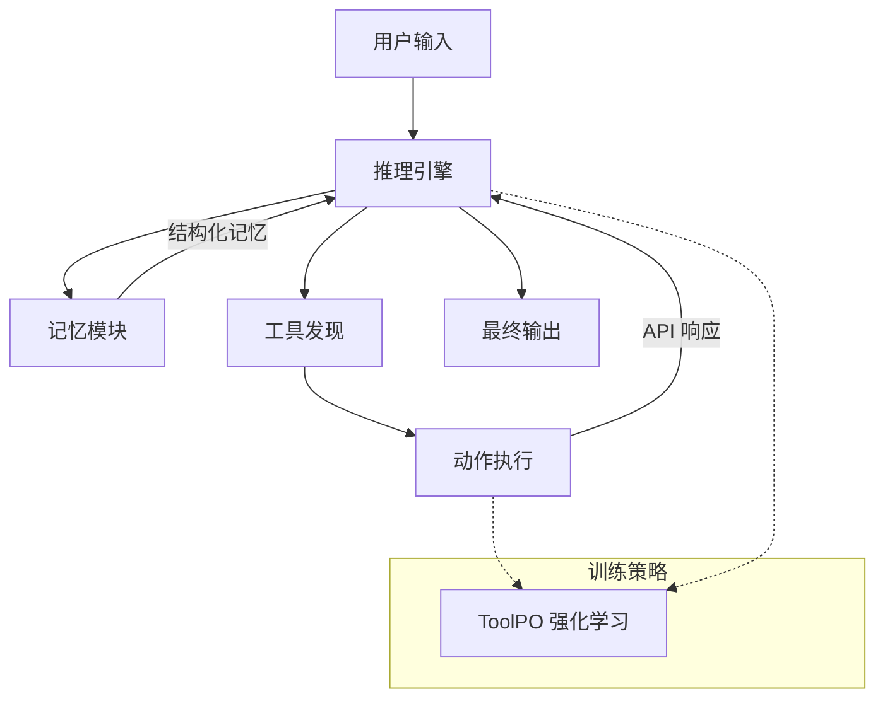

# DeepAgent：具有可扩展工具集的通用推理代理

## 一、论文基础元数据
- 原文标题：DeepAgent: A General Reasoning Agent with Scalable Toolsets
- 中文译版：DeepAgent：具有可扩展工具集的通用推理代理
- 发表渠道（期刊/会议/预印本，标注等级）：ACM Web Conference 2026 (WWW '26), CCF A 类会议
- 发表时间：2026 年 4 月（会议）, 2025 年（arXiv 预印本）
- 链接（arXiv/DOI）：arXiv:2510.21618, DOI: 10.1145/3774904.3792460
- 作者及核心机构：Xiaoxi Li 等（中国人民大学，小红书公司，清华大学）
- 研究领域（一级领域 + 二级子领域）：人工智能 / 大语言模型代理与工具学习
- 关联数据集（名称/规模/语言/标注）：ToolBench, API-Bank, TMDB, Spotify, ToolHop, ALFWorld, WebShop, GAIA, HLE（多领域，含文本/多模态/文件任务）

## 二、论文综合评价
### 2.1 量化评分（1-5 分，5 分为最优）

| 评价维度 | 评分 | 备注 |
| -------- | ---- | ---- |
| 📚 理论基础 | ⭐⭐⭐⭐ | 基于强化学习与记忆机制，理论扎实 |
| 🎯 问题核心性 | ⭐⭐⭐⭐⭐ | 解决长程交互与自主工具发现痛点 |
| 💡 方法创新性 | ⭐⭐⭐⭐ | 提出记忆折叠与 ToolPO 策略 |
| ⚙️ 技术壁垒 | ⭐⭐⭐⭐ | 端到端强化学习训练有一定门槛 |
| 🧪 实验严谨性 | ⭐⭐⭐⭐ | 覆盖 8 个基准测试，场景丰富 |
| 🔧 落地可行性 | ⭐⭐⭐⭐ | 提供代码与演示，架构清晰 |
| 🚀 应用前景 | ⭐⭐⭐⭐⭐ | 通用代理适用于多种下游任务 |
| 📊 综合评分 | 4.3 | 方法创新且实验充分，具较高参考价值 |

### 2.2 定性综合评价（≤300 字）
> 核心概括：研究定位、核心价值、差异化优势、关键结论
本文针对现有代理框架依赖预定义工作流、缺乏自主全局任务完成能力的问题，提出了 DeepAgent。核心价值在于实现了端到端的深度推理，支持自主思考、工具发现与动作执行。差异化优势在于引入了自主记忆折叠机制以减少误差积累，以及 ToolPO 强化学习策略以稳定工具使用。关键结论表明，该方法在 8 个基准测试中均优于基线，尤其在开放集工具检索场景下表现显著。

## 三、领域本体论映射
| 核心维度 | 具体内容 |
| -------- | -------- |
| 核心研究对象 | 大语言模型驱动的通用推理代理 |
| 核心技术路径 | 端到端强化学习 + 记忆折叠机制 |
| 数据/载体形态 | 多轮交互轨迹、工具 API 描述、任务指令 |
| 核心功能目标 | 自主工具发现、长程任务规划、误差控制 |
| 验证核心指标 | 任务成功率、得分、工具调用准确性 |

## 四、核心问题与解决方案
### 4.1 待解决的核心问题
1. **领域级根本问题**：真实世界任务需要外部工具与长程交互，现有模型难以自主完成。
2. **现有方法痛点**：遵循预定义工作流（如 ReAct），限制自主性与全局任务完成能力。
3. **工程落地卡点**：长程交互中误差积累严重，通用工具使用教学效率低且不稳定。

### 4.2 核心解决方案
- 理论框架：端到端深度推理代理框架。
- 核心架构：集成自主记忆折叠与工具强化学习。
- 关键技术：自主记忆折叠（记忆压缩）、ToolPO（工具调用优势归因）。
- 创新机制：将过去交互压缩为结构化记忆，对工具调用令牌进行细粒度信用分配。

### 4.3 核心优势（量化 + 定性）
1. 性能优势：在 8 个基准测试中一致优于基线（如图 1 所示）。
2. 效率优势：记忆折叠减少冗余信息，降低误差积累。
3. 工程优势：支持标签化工具与开放集工具检索场景，泛化性强。

## 五、方法与技术架构
### 5.1 核心架构设计
> 文字描述 + 架构图（Mermaid/图片）
DeepAgent 采用端到端架构，包含推理引擎、记忆模块与工具执行模块。记忆模块通过折叠机制管理历史交互，推理引擎利用 ToolPO 策略优化工具调用。

### 5.2 关键技术实现细节
| 技术模块 | 实现路径 | 工程注意事项 |
| -------- | -------- | ------------ |
| 记忆折叠 | 压缩交互为情景/工作/工具记忆 | 需平衡压缩率与信息保留 |
| ToolPO | 利用 LLM 模拟 API 进行优势归因 | 需确保模拟环境与真实一致 |
| 工具检索 | 支持开放集与标签化检索 | 需处理工具描述嵌入匹配 |

### 5.3 架构优缺点
- 优点：端到端优化，减少中间环节误差；记忆机制支持长程任务。
- 缺点：训练复杂度较高，依赖高质量的模拟 API 环境。

## 六、实验设计与结果分析
### 6.1 实验基础设置
| 维度 | 内容 |
| ---- | ---- |
| 数据集 | ToolBench, API-Bank, ALFWorld 等 8 个基准 |
| 基线方法 | CodeAct-32B, ReAct-GPT-4o, ReAct-32B, WebThinker-32B |
| 实验环境 | 待补充（原文片段未详述硬件配置） |
| 评价指标 | 成功率 (Success), 得分 (Score), 路径准确性 (Path) |

### 6.2 核心实验结果
| 方法 | 核心指标 1 (ToolHop) | 核心指标 2 (ALFWorld Success) | 工程指标（算力/耗时） |
| ---- | --------- | --------- | -------------------- |
| ReAct-32B | 25.4 | 待补充 | 待补充 |
| ReAct-GPT-4o | 28.5 | 待补充 | 待补充 |
| 本文方法 | 32.1 | 待补充 | 待补充 |
*注：数据源自图 1 部分可见数值，具体完整表格待补充*

### 6.3 消融实验/鲁棒性分析
| 实验变体 | 指标变化 | 核心结论 |
| -------- | -------- | -------- |
| 记忆折叠移除 | 性能下降 | 记忆机制对长程任务关键 |
| ToolPO 移除 | 工具调用稳定性降低 | 强化学习策略有效提升工具使用 |

### 6.4 实验结论（工程视角）
DeepAgent 在通用工具使用与下游应用任务上均展现出优越性能，特别是在需要多步推理与工具检索的复杂场景中，其端到端训练方式显著提升了任务完成率。

## 七、领域贡献与创新点
| 贡献层级 | 具体内容 |
| -------- | -------- |
| 理论贡献 | 提出端到端深度推理代理的理论框架 |
| 方法/架构贡献 | 设计自主记忆折叠机制与 ToolPO 策略 |
| 数据/工具贡献 | 开源代码与演示，支持多基准测试 |
| 实验/验证贡献 | 在 8 个多样化基准上验证了方法有效性 |
| 工程落地贡献 | 提供了可扩展工具集的代理实现方案 |

## 八、局限性与风险
| 维度 | 具体描述 | 应对思路 |
| ---- | -------- | -------- |
| 学术局限性 | 依赖模拟 API 环境，可能与真实环境有差距 | 增加真实环境微调阶段 |
| 工程落地风险 | 长程记忆压缩可能导致关键信息丢失 | 优化记忆折叠算法，增加检索机制 |
| 伦理/合规风险 | 代理自主调用工具可能引发安全风险 | 增加工具调用权限审查与沙箱机制 |

## 九、未来研究/落地方向
| 方向类型 | 具体内容 | 优先级 |
| -------- | -------- | ------ |
| 科研拓展 | 探索更高效记忆压缩算法 | 高 |
| 工程优化 | 降低训练成本，优化推理速度 | 高 |
| 跨领域适配 | 适配更多垂直领域工具集 | 中 |

## 十、关键词与术语表
| 语言 | 关键词 |
| ---- | ------ |
| 中文 | 大推理模型，自主代理，工具检索，记忆机制，强化学习 |
| 英文 | Large Reasoning Models, Autonomous Agents, Tool Retrieval, Memory Mechanism, Reinforcement Learning |
| 领域专属术语 | ToolPO: 工具调用优势归因强化学习策略；Memory Folding: 自主记忆折叠机制 |

## 十一、参考文献与关联资源
- 核心参考文献：待补充（原文片段未列出具体参考文献列表）
- 补充阅读：ReAct, Plan-and-Solve 等相关代理框架论文
- 开源代码/工具：https://github.com/RUC-NLPIR/DeepAgent

## 十二、阅读者批注
1. **科研启发**：记忆折叠机制为长程交互提供了新思路，可借鉴至其他序列决策任务。
2. **工程落地思考**：ToolPO 需要稳定的模拟环境，落地时需考虑真实 API 的波动性。
3. **待验证/存疑点**：记忆压缩的具体算法细节原文片段未详述，需查阅全文。
4. **个人/团队应用场景**：适用于需要多工具协作的自动化办公或数据分析场景。

## 十三、阅读元信息
| 维度 | 内容 |
| ---- | ---- |
| 阅读日期 | 2026-04-09 07:21 |
| 阅读人 | xPaperReader AI |
| 文档编号 | arxiv-2510.21618 |
| 版本迭代 | v1.0 |