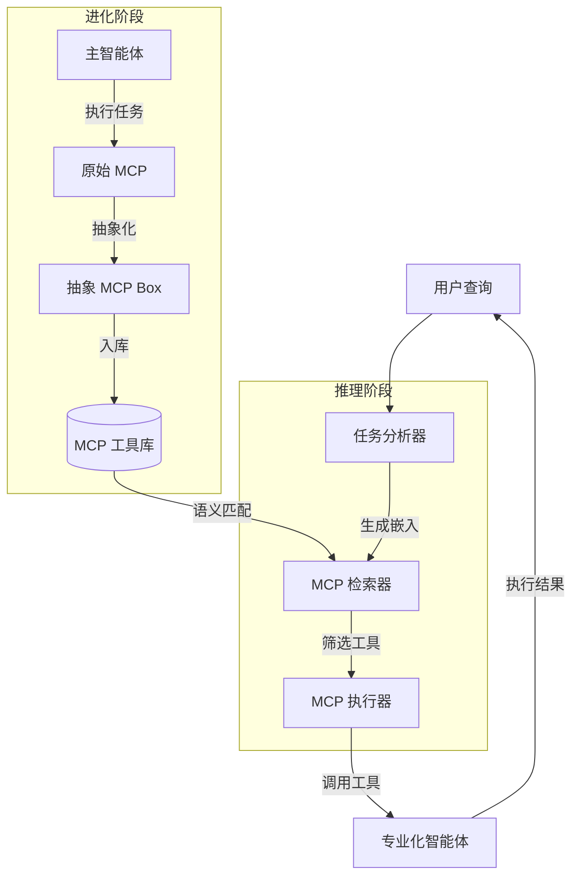

# Alita-G：用于智能体生成的自进化生成式智能体

## 一、论文基础元数据
- 原文标题：Alita-G: Self-Evolving Generative Agent for Agent Generation
- 中文译版：Alita-G：用于智能体生成的自进化生成式智能体
- 发表渠道：预印本（arXiv）
- 发表时间：2025 年
- 链接：arXiv:2510.23601
- 作者及核心机构：Jiahao Qiu, Xuan Qi, Hongru Wang 等（共 12 位作者）；机构信息待补充
- 研究领域：人工智能（一级）+ 智能体系统/大模型应用（二级）
- 关联数据集：GAIA（通用任务）、PathVQA（医疗视觉）、HLE（复杂推理）；规模/标注待补充

## 二、论文综合评价
### 2.1 量化评分（1-5 分，5 分为最优）

| 评价维度 | 评分 | 备注 |
| -------- | ---- | ---- |
| 📚 理论基础 | ⭐⭐⭐⭐ | 基于 RAG 与智能体演化理论，基础扎实 |
| 🎯 问题核心性 | ⭐⭐⭐⭐⭐ | 直击通用智能体缺乏领域专精痛点 |
| 💡 方法创新性 | ⭐⭐⭐⭐⭐ | 提出 MCP 抽象与自进化机制，新颖性强 |
| ⚙️ 技术壁垒 | ⭐⭐⭐⭐ | 涉及多智能体协作与工具抽象，实现复杂 |
| 🧪 实验严谨性 | ⭐⭐⭐⭐⭐ | 多基准测试且包含详细消融实验，论证充分 |
| 🔧 落地可行性 | ⭐⭐⭐⭐ | 依赖大模型 API，成本可控但需优化 |
| 🚀 应用前景 | ⭐⭐⭐⭐⭐ | 适用于垂直领域专家智能体构建，前景广阔 |
| 📊 综合评分 | 4.6 | 性能效率双优，自进化机制具行业颠覆潜力 |

### 2.2 定性综合评价（≤300 字）
> 核心概括：研究定位、核心价值、差异化优势、关键结论

本研究定位为**通用智能体向领域专家转化的自进化框架**。核心价值在于通过**MCP（模型上下文协议）工具库**的自动生成、抽象与策展，实现能力的积累与复用，而非仅依赖提示词优化。差异化优势体现在**任务驱动的 MCP 生成**与**双重检索策略**，解决了工具复用性差的问题。关键结论表明，该方法在 GAIA 基准上达到 83.03% Pass@1（SOTA），同时降低 15% Token 消耗，证明了性能与效率的双重优化路径可行。

## 三、领域本体论映射
| 核心维度 | 具体内容 |
| -------- | -------- |
| 核心研究对象 | 自进化生成式智能体（Self-Evolving Generative Agent） |
| 核心技术路径 | MCP 工具生成 + 抽象化 + RAG 检索增强 |
| 数据/载体形态 | 代码工具包（MCP Box）、任务轨迹、语义嵌入 |
| 核心功能目标 | 将通用大模型智能体转化为特定领域专家智能体 |
| 验证核心指标 | Pass@1 准确率、Token 消耗量、工具复用率 |

## 四、核心问题与解决方案
### 4.1 待解决的核心问题
1. **领域级根本问题**：通用大模型智能体缺乏特定领域的深度专业知识与高效工具链。
2. **现有方法痛点**：依赖提示词优化或记忆检索，能力无法积累，工具临时代码难以跨任务复用。
3. **工程落地卡点**：专用智能体构建需大量人工干预，推理成本高，工具选择准确率不足。

### 4.2 核心解决方案
- 理论框架：自进化生成式智能体框架（训练/进化阶段 + 推理阶段）。
- 核心架构：任务分析器 + MCP 检索器 + MCP 执行器。
- 关键技术：MCP 抽象化（参数泛化）、双重检索策略（阈值/Top-k）、复合上下文嵌入。
- 创新机制：通过主智能体执行任务提取子解决方案，封装为原始 MCP 并抽象为可复用 MCP Box。

### 4.3 核心优势（量化+定性）
1. 性能优势：GAIA 验证集 Pass@1 达 83.03%，较原始系统提升 10.3%。
2. 效率优势：平均每个示例 Token 消耗减少约 15%（12,305 降至 10,394）。
3. 工程优势：自动化构建专用代理，无需大量人工干预，支持工具跨任务复用。

## 五、方法与技术架构
### 5.1 核心架构设计
系统分为**进化阶段**与**推理阶段**。进化阶段由主智能体生成并抽象 MCP 工具库；推理阶段通过 RAG 检索相关工具辅助执行。

### 5.2 关键技术实现细节
| 技术模块 | 实现路径 | 工程注意事项 |
| -------- | -------- | ------------ |
| MCP 抽象化 | 利用大模型将硬编码值转为参数，标准化接口 | 需确保抽象后工具功能不丢失，文档需增强 |
| 双重检索策略 | 阈值模式（τ=0.7）与 Top-k 模式切换 | 阈值过高导致工具不足，过低引入噪声 |
| 复合上下文嵌入 | 结合 MCP“功能描述”与“生成用例”进行嵌入 | 描述提供通用语义，用例提供具体场景 |
| 依赖组件 | text-embedding-3-large, Claude-Sonnet-4, GPT-4.1 | 嵌入模型质量直接影响检索效果 |

### 5.3 架构优缺点
- 优点：
    1. 能力可积累：工具库随迭代不断丰富。
    2. 推理成本低：精准检索减少不必要的工具搜索。
    3. 泛化性强：抽象后的 MCP 可跨任务复用。
- 缺点：
    1. 初始冷启动成本高：需多次迭代生成高质量 MCP。
    2. 依赖外部模型：检索与执行依赖高质量 Embedding 及 LLM。
    3. 冗余风险：迭代过多可能导致工具库冗余（簇覆盖率下降）。

## 六、实验设计与结果分析
### 6.1 实验基础设置
| 维度 | 内容 |
| ---- | ---- |
| 数据集 | GAIA（通用）、PathVQA（医疗视觉）、HLE（复杂推理） |
| 基线方法 | 原始系统、ODR-smolagents |
| 实验环境 | 基于 Manager Agent (Claude-Sonnet-4) + Web Agent (GPT-4.1) |
| 评价指标 | Pass@1、Pass@3、Token 消耗量、错误修正率 |

### 6.2 核心实验结果
| 方法 | 核心指标 1 (GAIA Pass@1) | 核心指标 2 (Token 消耗) | 工程指标（算力/耗时） |
| ---- | --------- | --------- | -------------------- |
| 原始系统 | 75.15% | 12,305 | 基准 |
| ODR-smolagents | 55.15% | 待补充 | 待补充 |
| 本文方法 (3×) | 83.03% | 10,394 | 效率提升 15.5% |

### 6.3 消融实验/鲁棒性分析
| 实验变体 | 指标变化 | 核心结论 |
| -------- | -------- | -------- |
| 迭代次数 (1→3→5) | 80.00% → 83.03% → 83.63% | 3 次迭代最佳，后续边际效应递减 |
| RAG 内容 (描述/用例/组合) | 81.82% / 77.57% / 83.03% | 描述 + 用例组合效果最优 |
| 检索策略 (阈值/Top-k) | 阈值 0.7 优于其他 | 阈值过滤能保证工具质量 |
| 嵌入编码器 | Large 模型 (84.0%) 优于小型 | 高质量编码器至关重要 |

### 6.4 实验结论（工程视角）
1. **迭代平衡点**：3 次迭代是成本与效用的最佳平衡点，避免工具冗余。
2. **检索配置**：推荐使用 text-embedding-3-large 配合阈值 0.7 筛选。
3. **错误修正**：引入 MCP Box 后，Wrong→Right 数量随迭代增加，Right→Wrong 几乎为 0，系统鲁棒性强。

## 七、领域贡献与创新点
| 贡献层级 | 具体内容 |
| -------- | -------- |
| 理论贡献 | 提出从通用能力到领域专用能力的原则性自进化路径 |
| 方法/架构贡献 | 设计 MCP 抽象化与双重检索策略，实现工具跨任务复用 |
| 数据/工具贡献 | 构建可演进的 MCP 工具库（MCP Box） |
| 实验/验证贡献 | 在 GAIA、PathVQA、HLE 多基准验证有效性与鲁棒性 |
| 工程落地贡献 | 实现性能与效率双重优化，降低专用智能体构建门槛 |

## 八、局限性与风险
| 维度 | 具体描述 | 应对思路 |
| ---- | -------- | -------- |
| 学术局限性 | 迭代超过 3 次后性能饱和，冗余度增加 | 引入工具去重机制或动态修剪策略 |
| 工程落地风险 | 依赖高质量 Embedding 模型及商业 LLM API | 探索开源嵌入模型微调，优化 API 调用成本 |
| 伦理/合规风险 | 自动生成的代码工具可能存在安全漏洞 | 增加代码沙箱隔离与安全审计环节 |

## 九、未来研究/落地方向
| 方向类型 | 具体内容 | 优先级 |
| -------- | -------- | ------ |
| 科研拓展 | 探索超越当前框架的多维度协作增强机制 | 中 |
| 工程优化 | 优化工具库检索效率，降低冷启动成本 | 高 |
| 跨领域适配 | 将框架适配至医疗、法律等强垂直领域 | 高 |

## 十、关键词与术语表
| 语言 | 关键词 |
| ---- | ------ |
| 中文 | 自进化智能体、模型上下文协议、检索增强生成、工具抽象、专用代理 |
| 英文 | Self-Evolving Agent, MCP, RAG, Tool Abstraction, Specialized Agent |
| 领域专属术语 | MCP Box：经抽象化封装的可复用工具集；Threshold Mode：基于相似度阈值的检索模式 |

## 十一、参考文献与关联资源
- 核心参考文献：待补充（原文未提供具体引用列表）
- 补充阅读：关于 Model Context Protocol (MCP) 官方文档
- 开源代码/工具：待补充（暂无公开仓库链接）

## 十二、阅读者批注
1. **科研启发**：将“工具使用”从临时生成转变为“资产积累”，是智能体进化的关键一步。
2. **工程落地思考**：在实际系统中，需重点监控 MCP 库的冗余度，避免检索开销随库增大而线性增长。
3. **待验证/存疑点**：在极度冷门领域，初始 MCP 生成质量如何保证？冷启动问题需进一步验证。
4. **个人/团队应用场景**：适用于构建企业内部的知识库问答助手或自动化运维专家系统。

## 十三、阅读元信息
| 维度 | 内容 |
| ---- | ---- |
| 阅读日期 | 2026-04-09 07:34 |
| 阅读人 | xPaperReader AI |
| 文档编号 | arxiv-2510.23601 |
| 版本迭代 | v1.0 |