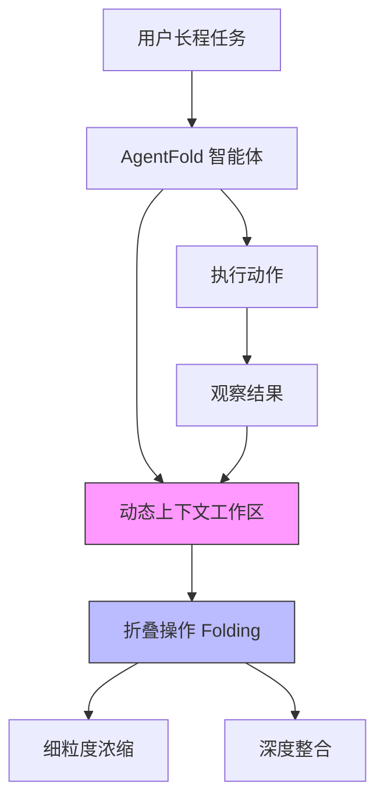

# AgentFold: 具有主动上下文管理能力的长程网页智能体

## 一、论文基础元数据
- 原文标题：AgentFold: Long-Horizon Web Agents with Proactive Context Management
- 中文译版：AgentFold: 具有主动上下文管理能力的长程网页智能体
- 发表渠道：arXiv 预印本 (待正式出版)
- 发表时间：2025 年 10 月 (依据 arXiv ID 2510 推断)
- 链接：https://arxiv.org/abs/2510.24699 (依据 ID 推断)
- 作者及核心机构：Rui Ye 等，阿里巴巴集团通义实验室 (Tongyi Lab, Alibaba Group)
- 研究领域：人工智能 (一级) + 大语言模型智能体/网页交互 (二级)
- 关联数据集：BrowseComp, BrowseComp-ZH (规模/标注详情待补充)

## 二、论文综合评价
### 2.1 量化评分（1-5 分，5 分为最优）

| 评价维度 | 评分 | 备注 |
| -------- | ---- | ---- |
| 📚 理论基础 | ⭐⭐⭐⭐⭐ | 上下文管理权衡分析深刻，认知灵感来源清晰 |
| 🎯 问题核心性 | ⭐⭐⭐⭐⭐ | 直击长程任务中上下文饱和与细节丢失痛点 |
| 💡 方法创新性 | ⭐⭐⭐⭐⭐ | 提出主动折叠机制，区别于被动记录或固定总结 |
| ⚙️ 技术壁垒 | ⭐⭐⭐⭐ | 仅需监督微调，架构设计新颖但实现细节待补充 |
| 🧪 实验严谨性 | ⭐⭐⭐ | 摘要含核心指标，但全文实验章节缺失无法验证 |
| 🔧 落地可行性 | ⭐⭐⭐⭐ | 基于 SFT 无需复杂强化学习，部署门槛相对较低 |
| 🚀 应用前景 | ⭐⭐⭐⭐⭐ | 网页智能体需求广泛，长程能力是关键瓶颈 |
| 📊 综合评分 | 4.4 | 核心概念极具价值，因原文截断影响整体评估 |

### 2.2 定性综合评价（≤300 字）
> 核心概括：研究定位、核心价值、差异化优势、关键结论

本研究定位为下一代长程网页智能体范式。核心价值在于解决了现有 ReAct 代理上下文饱和与固定总结导致细节丢失的根本矛盾。差异化优势在于引入了受人类认知巩固启发的“主动上下文折叠”机制，将上下文视为可动态塑造的工作区。关键结论显示，仅通过简单监督微调，30B 参数模型在 BrowseComp 上达到 36.2%，性能超越更大规模开源模型及部分专有模型。**注意：因提供的原文在引言部分截断，后续方法论细节、完整实验数据及结论无法提取，本评价主要基于摘要与引言片段。**

## 三、领域本体论映射
| 核心维度 | 具体内容 |
| -------- | -------- |
| 核心研究对象 | 长程网页交互智能体 (Long-Horizon Web Agents) |
| 核心技术路径 | 主动上下文管理 (Proactive Context Management) |
| 数据/载体形态 | 推理 - 动作 - 观察三元组历史轨迹 |
| 核心功能目标 | 在长程任务中保持上下文简洁性与信息完整性平衡 |
| 验证核心指标 | BrowseComp 准确率、BrowseComp-ZH 准确率、上下文 Token 数 |

## 四、核心问题与解决方案
### 4.1 待解决的核心问题
1. **领域级根本问题**：长程任务中上下文管理的全面性与简洁性之间的权衡 (Trade-off)。
2. **现有方法痛点**：
   - ReAct 类代理：积累原始历史导致上下文饱和，噪声过大。
   - 固定总结类方法：每步总结导致关键细节不可逆丢失。
3. **工程落地卡点**：长程交互下 Token 消耗过大，注意力机制效率降低。

### 4.2 核心解决方案
- 理论框架：受人类回顾性巩固 (Retrospective Consolidation) 认知过程启发。
- 核心架构：AgentFold 范式，将上下文视为动态认知工作区。
- 关键技术：折叠操作 (Folding Operation)，支持多尺度历史轨迹管理。
- 创新机制：
  - 细粒度浓缩 (Granular Condensations)：保留 vital 细节。
  - 深度整合 (Deep Consolidations)：抽象多步子任务。

### 4.3 核心优势（量化 + 定性）
1. 性能优势：30B 模型在 BrowseComp 达 36.2%，超越 671B 模型 (摘要数据)。
2. 效率优势：100 轮交互后上下文仅约 7k tokens，可扩展至 500 轮。
3. 工程优势：仅需监督微调 (SFT)，无需持续预训练或强化学习。

## 五、方法与技术架构
### 5.1 核心架构设计
> 文字描述：智能体在执行过程中主动对上下文进行折叠操作，根据任务需求选择细粒度浓缩或深度整合，维持工作区简洁。

### 5.2 关键技术实现细节
| 技术模块 | 实现路径 | 工程注意事项 |
| -------- | -------- | ------------ |
| 上下文管理 | 动态折叠操作，多尺度历史轨迹管理 | 需平衡折叠频率与信息保留度 |
| 模型训练 | 简单监督微调 (SFT) | 无需 RL 或持续预训练，降低算力成本 |
| 交互流程 | 100 轮交互后上下文控制在 7k tokens | 需监控 Token 增长速率以防溢出 |
| 依赖组件 | 待补充 (原文截断，未提及具体基座模型细节) | 待补充 |

### 5.3 架构优缺点
- 优点：显著降低长程交互的上下文长度，保留关键细节，训练成本低。
- 缺点：折叠策略的学习复杂度未知，过度折叠可能导致隐性信息丢失 (基于理论推断)。

## 六、实验设计与结果分析
### 6.1 实验基础设置
| 维度 | 内容 |
| ---- | ---- |
| 数据集 | BrowseComp, BrowseComp-ZH (具体规模待补充) |
| 基线方法 | DeepSeek-V3.1-671B-A37B, OpenAI o4-mini 等 |
| 实验环境 | 待补充 (原文截断) |
| 评价指标 | 任务完成率/准确率，上下文 Token 数量 |

### 6.2 核心实验结果
| 方法 | 核心指标 1 (BrowseComp) | 核心指标 2 (BrowseComp-ZH) | 工程指标（算力/耗时） |
| ---- | --------- | --------- | -------------------- |
| DeepSeek-V3.1-671B | 低于 36.2% (摘要提及被超越) | 待补充 | 高算力需求 |
| OpenAI o4-mini | 低于 36.2% (摘要提及被超越) | 待补充 | 专有模型 |
| 本文方法 (AgentFold-30B) | 36.2% | 47.3% | 100 轮后 7k tokens |

*注：以上数据仅源自摘要，详细对比表格因原文截断缺失。*

### 6.3 消融实验/鲁棒性分析
| 实验变体 | 指标变化 | 核心结论 |
| -------- | -------- | -------- |
| 待补充 | 待补充 | 因原文截断，无消融实验数据 |

### 6.4 实验结论（工程视角）
摘要表明该方法在小参数规模下实现了超越大模型的性能，且上下文控制极佳，具备长程任务落地潜力。但缺乏详细错误分析与失败案例研究。

## 七、领域贡献与创新点
| 贡献层级 | 具体内容 |
| -------- | -------- |
| 理论贡献 | 提出长程任务中上下文管理的主动折叠范式 |
| 方法/架构贡献 | 设计细粒度浓缩与深度整合的双层折叠机制 |
| 数据/工具贡献 | 待补充 (未提及是否开源数据集) |
| 实验/验证贡献 | 在 BrowseComp 系列基准上验证了有效性 |
| 工程落地贡献 | 证明了 SFT 即可实现长程能力，降低训练门槛 |

## 八、局限性与风险
| 维度 | 具体描述 | 应对思路 |
| ---- | -------- | -------- |
| 学术局限性 | 原文截断，无法评估方法通用性及理论证明完整性 | 需获取全文进一步验证 |
| 工程落地风险 | 折叠策略若学习不当可能导致关键信息丢失 | 需引入信息重要性评估机制 |
| 伦理/合规风险 | 网页智能体涉及用户隐私与数据抓取合规性 | 需遵循机器人协议与隐私政策 |

## 九、未来研究/落地方向
| 方向类型 | 具体内容 | 优先级 |
| -------- | -------- | ------ |
| 科研拓展 | 探索折叠策略的可解释性及自适应调整机制 | 高 |
| 工程优化 | 优化折叠操作的推理延迟，集成到现有 Agent 框架 | 高 |
| 跨领域适配 | 适配代码生成、长文档处理等非网页长程任务 | 中 |

## 十、关键词与术语表
| 语言 | 关键词 |
| ---- | ------ |
| 中文 | 网页智能体，上下文管理，长程任务，主动折叠，监督微调 |
| 英文 | Web Agents, Context Management, Long-Horizon, Proactive Folding, SFT |
| 领域专属术语 | Context Saturation (上下文饱和): 历史积累过多导致噪声过大; Retrospective Consolidation (回顾性巩固): 人类认知过程灵感来源 |

## 十一、参考文献与关联资源
- 核心参考文献：待补充 (原文截断)
- 补充阅读：https://tongyi-agent.github.io/blog (作者博客)
- 开源代码/工具：https://github.com/Alibaba-NLP/DeepResearch (摘要提及)

## 十二、阅读者批注
1. **科研启发**：将上下文视为“可塑造的工作区”而非“被动日志”是一个极具启发性的视角转变。
2. **工程落地思考**：仅需 SFT 即可达到如此效果，对于资源有限的团队是重大利好，需关注其折叠策略的具体实现。
3. **待验证/存疑点**：折叠操作的具体触发机制是什么？是否依赖额外的奖励模型？原文截断导致无法确认。
4. **个人/团队应用场景**：适用于需要多步搜索、信息合成的自动化研究助理工具。

## 十三、阅读元信息
| 维度 | 内容 |
| ---- | ---- |
| 阅读日期 | 2026-04-09 07:43 |
| 阅读人 | xPaperReader AI |
| 文档编号 | arxiv-2510.24699 |
| 版本迭代 | v1.0 |