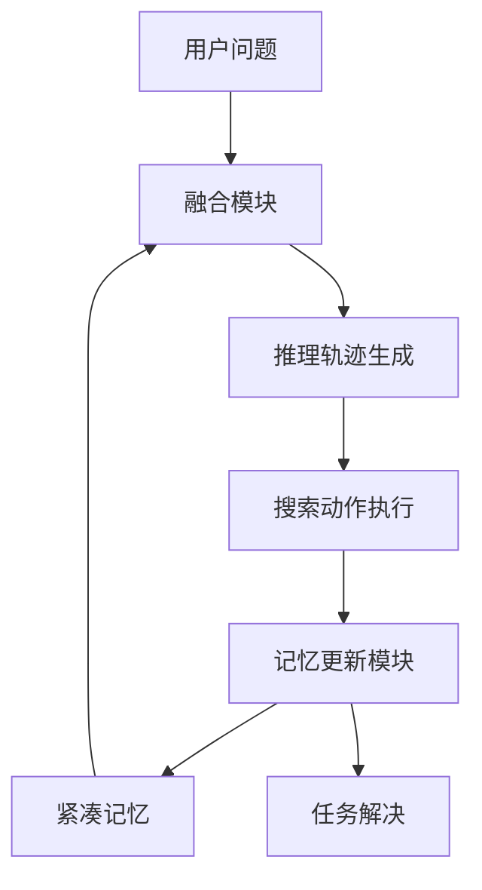

# MemSearcher: 通过端到端强化学习训练大语言模型进行推理、搜索和记忆管理

## 一、论文基础元数据
- 原文标题：MemSearcher: Training LLMs to Reason, Search and Manage Memory via End-to-End Reinforcement Learning
- 中文译版：MemSearcher: 通过端到端强化学习训练大语言模型进行推理、搜索和记忆管理
- 发表渠道：arXiv 预印本 (Under Review)
- 发表时间：2025 年 11 月 4 日 (根据 arXiv 版本号推断)
- 链接：arXiv:2511.02805
- 作者及核心机构：Qianhao Yuan 等 (中国科学院软件研究所，中国科学院大学，小红书)
- 研究领域（一级领域 + 二级子领域）：人工智能 + 大语言模型代理/强化学习
- 关联数据集（名称/规模/语言/标注）：提及与 Search-R1 相同数据集，具体名称待补充

## 二、论文综合评价
### 2.1 量化评分（1-5 分，5 分为最优）

| 评价维度 | 评分 | 备注 |
| -------- | ---- | ---- |
| 📚 理论基础 | ⭐⭐⭐⭐ | 结合 RL 与记忆管理，理论扎实 |
| 🎯 问题核心性 | ⭐⭐⭐⭐⭐ | 解决搜索代理上下文爆炸核心痛点 |
| 💡 方法创新性 | ⭐⭐⭐⭐ | 提出多上下文 GRPO 框架，新颖 |
| ⚙️ 技术壁垒 | ⭐⭐⭐ | 因原文截断，细节待验证 |
| 🧪 实验严谨性 | ⭐⭐⭐ | 摘要数据亮眼，但全文实验缺失 |
| 🔧 落地可行性 | ⭐⭐⭐⭐ | 强调效率与显存优化，利于落地 |
| 🚀 应用前景 | ⭐⭐⭐⭐⭐ | 搜索代理场景应用潜力巨大 |
| 📊 综合评分 | 4.1 | 摘要展示潜力大，但受限于原文截断 |

### 2.2 定性综合评价（≤300 字）
> 核心概括：研究定位、核心价值、差异化优势、关键结论
本文针对搜索代理中交互历史导致上下文无限增长的问题，提出 MemSearcher 工作流。核心价值在于通过迭代维护紧凑记忆，平衡信息完整性与计算效率。差异化优势在于引入多上下文 GRPO 端到端强化学习框架，联合优化推理、搜索与记忆管理。关键结论显示，3B 模型基于该方法可超越 7B 基线，平均提升 11%-12%，显著降低计算开销。因提供的原文截断，部分技术细节与完整实验数据无法验证，但摘要展示的研究方向具有高价值。

## 三、领域本体论映射
| 核心维度 | 具体内容 |
| -------- | -------- |
| 核心研究对象 | 搜索代理（Search Agents）与大语言模型（LLMs） |
| 核心技术路径 | 端到端强化学习（End-to-End RL）+ 记忆管理 |
| 数据/载体形态 | 多轮对话交互轨迹、搜索工具响应、紧凑记忆向量 |
| 核心功能目标 | 稳定上下文长度，提升多轮交互效率与准确率 |
| 验证核心指标 | 基准测试准确率提升百分比、计算/显存开销 |

## 四、核心问题与解决方案
### 4.1 待解决的核心问题
1. **领域级根本问题**：搜索代理中知识获取任务存在长尾和时效性知识不足。
2. **现有方法痛点**：ReAct 等范式将全部交互历史纳入上下文，导致上下文无界增长，显存与计算开销巨大。
3. **工程落地卡点**：信息完整性与计算效率之间的权衡（Trade-off）限制了搜索代理的可扩展性。

### 4.2 核心解决方案
- 理论框架：多上下文 GRPO（Group Relative Policy Optimization）端到端 RL 框架。
- 核心架构：MemSearcher 代理工作流（迭代维护紧凑记忆 + 当前轮次融合）。
- 关键技术：记忆更新机制（仅保留解决任务必需信息）、轨迹级优势传播。
- 创新机制：在不同上下文下采样轨迹组，并在组内所有对话间传播轨迹级优势。

### 4.3 核心优势（量化 + 定性）
1. 性能优势：在 7 个公共基准上显著优于强基线，3B 模型超越 7B 基线。
2. 效率优势：稳定多轮交互中的上下文长度，降低计算与显存成本。
3. 工程优势：无需牺牲准确率即可实现效率提升，代码模型将开源。

## 五、方法与技术架构
### 5.1 核心架构设计
> 文字描述 + 架构图（Mermaid/图片）
基于摘要描述，架构核心为记忆循环更新机制。用户问题与记忆融合，生成推理与搜索动作，随后更新记忆。

### 5.2 关键技术实现细节
| 技术模块 | 实现路径 | 工程注意事项 |
| -------- | -------- | ------------ |
| 记忆管理 | 迭代更新，仅保留必需信息 | 需防止关键信息丢失 |
| 强化学习 | 多上下文 GRPO 框架 | 轨迹采样与优势传播计算 |
| 上下文融合 | 当前轮次 + 紧凑记忆 | 控制融合后的长度上限 |
| 依赖组件 | 搜索引擎工具、LLM 骨干 | 工具调用延迟与稳定性 |

### 5.3 架构优缺点
- 优点：有效控制上下文长度，降低推理成本，支持长程任务。
- 缺点：因原文截断，记忆更新的具体策略与丢失风险未详细说明。

## 六、实验设计与结果分析
### 6.1 实验基础设置
| 维度 | 内容 |
| ---- | ---- |
| 数据集 | 与 Search-R1 相同的数据集（具体名称待补充） |
| 基线方法 | Search-R1, 典型搜索代理基线 |
| 实验环境 | 待补充（原文截断） |
| 评价指标 | 7 个公共基准测试准确率 |

### 6.2 核心实验结果
| 方法 | 核心指标 1 (3B 提升) | 核心指标 2 (7B 提升) | 工程指标（算力/耗时） |
| ---- | --------- | --------- | -------------------- |
| 基线 1 | 待补充 | 待补充 | 待补充 |
| 基线 2 | 待补充 | 待补充 | 待补充 |
| 本文方法 | +11% (相对平均增益) | +12% (相对平均增益) | 显存与计算开销降低 |

### 6.3 消融实验/鲁棒性分析
| 实验变体 | 指标变化 | 核心结论 |
| -------- | -------- | -------- |
| 因原文截断 | 无法提取 | 无法提取 |

### 6.4 实验结论（工程视角）
平衡信息完整性与效率可同时获得更高准确率与更低计算开销。3B 模型优化后可匹敌更大规模模型。

## 七、领域贡献与创新点
| 贡献层级 | 具体内容 |
| -------- | -------- |
| 理论贡献 | 提出多上下文 GRPO 强化学习优化框架 |
| 方法/架构贡献 | 设计 MemSearcher 迭代记忆管理工作流 |
| 数据/工具贡献 | 承诺开源代码与模型 |
| 实验/验证贡献 | 在 7 个公共基准上验证有效性 |
| 工程落地贡献 | 解决搜索代理上下文爆炸导致的成本问题 |

## 八、局限性与风险
| 维度 | 具体描述 | 应对思路 |
| ---- | -------- | -------- |
| 学术局限性 | 原文截断，无法评估记忆更新的具体逻辑 | 等待全文发布或查阅代码 |
| 工程落地风险 | 记忆压缩可能导致关键信息丢失 | 引入重要性评分机制 |
| 伦理/合规风险 | 搜索内容可能涉及敏感信息 | 增加内容过滤层 |

## 九、未来研究/落地方向
| 方向类型 | 具体内容 | 优先级 |
| -------- | -------- | ------ |
| 科研拓展 | 探索更高效的记忆压缩算法 | 高 |
| 工程优化 | 优化多上下文 GRPO 的训练稳定性 | 高 |
| 跨领域适配 | 适配代码生成或多模态搜索场景 | 中 |

## 十、关键词与术语表
| 语言 | 关键词 |
| ---- | ------ |
| 中文 | 搜索代理，记忆管理，强化学习，上下文长度，端到端 |
| 英文 | Search Agents, Memory Management, Reinforcement Learning, Context Length, End-to-End |
| 领域专属术语 | Multi-context GRPO（多上下文组相对策略优化）, MemSearcher（记忆搜索者） |

## 十一、参考文献与关联资源
- 核心参考文献：ReAct (Yao et al., 2023), Search-R1 (提及), LLM 相关 (Team, 2024; Achiam et al., 2023)
- 补充阅读：待补充（原文参考文献列表未提供）
- 开源代码/工具：https://github.com/icip-cas/MemSearcher (承诺公开)

## 十二、阅读者批注
1. **科研启发**：将记忆管理显式化为强化学习优化目标是一个很好的切入点，避免了手工设计规则。
2. **工程落地思考**：3B 模型超越 7B 基线意味着小模型在特定代理任务上具有极高性价比，适合部署。
3. **待验证/存疑点**：记忆更新的具体策略未知，如何保证“必需信息”不被误删是关键风险。
4. **个人/团队应用场景**：可应用于构建低成本的企业知识库问答代理或长程任务规划助手。

## 十三、阅读元信息
| 维度 | 内容 |
| ---- | ---- |
| 阅读日期 | 2026-04-09 07:54 |
| 阅读人 | xPaperReader AI |
| 文档编号 | arxiv-2511.02805 |
| 版本迭代 | v1.0 |