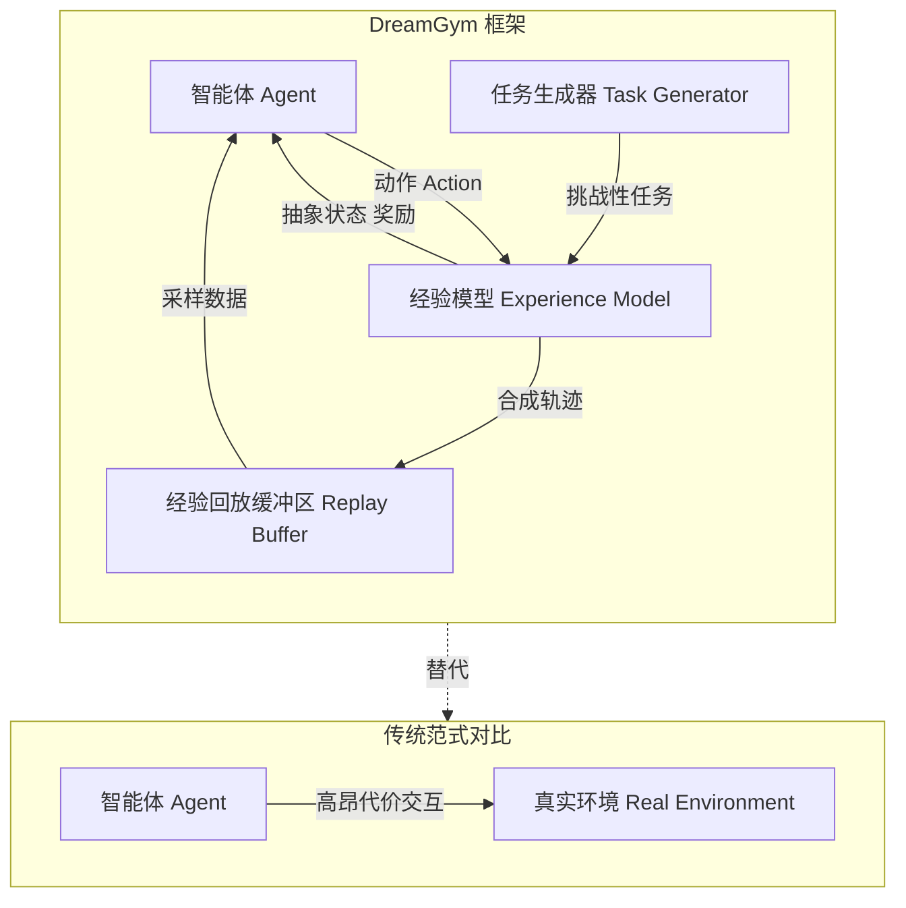

# 通过经验合成扩展智能体学习

## 一、论文基础元数据
- 原文标题：Scaling Agent Learning via Experience Synthesis
- 中文译版：通过经验合成扩展智能体学习
- 发表渠道：arXiv 预印本 (顶级机构 Meta/UC Berkeley 等联合)
- 发表时间：2025 年 11 月 7 日
- 链接：arXiv:2511.03773
- 作者及核心机构：Zhaorun Chen (Meta/UC), Zhuokai Zhao (Meta), Jason Weston (Meta), Dawn Song (UC Berkeley) 等；Meta Superintelligence Labs, FAIR, UChicago
- 研究领域（一级领域 + 二级子领域）：人工智能 -> 强化学习与智能体 (RL & Agents)
- 关联数据集（名称/规模/语言/标注）：WebArena (提及), 待补充 (具体合成数据集规模未详述)

## 二、论文综合评价
### 2.1 量化评分（1-5 分，5 分为最优）

| 评价维度 | 评分 | 备注 |
| -------- | ---- | ---- |
| 📚 理论基础 | 5 | 结合 RL 与经验回放，理论扎实 |
| 🎯 问题核心性 | 5 | 解决 Agent RL 训练成本高核心痛点 |
| 💡 方法创新性 | 5 | 提出 DreamGym 统一框架，经验合成新颖 |
| ⚙️ 技术壁垒 | 4 | 依赖推理模型质量，工程复杂度高 |
| 🧪 实验严谨性 | 4 | 摘要数据亮眼，细节待全文验证 |
| 🔧 落地可行性 | 4 | 提供 Sim-to-Real 策略，具备落地潜力 |
| 🚀 应用前景 | 5 | 通用智能体训练基础设施，前景广阔 |
| 📊 综合评分 | 4.6 | 框架创新性强，显著降低 RL 训练成本 |

### 2.2 定性综合评价（≤300 字）
> 核心概括：研究定位、核心价值、差异化优势、关键结论

本文针对大语言模型智能体在强化学习（RL）训练中面临的高成本、低样本效率及奖励信号不稳定问题，提出了 DreamGym 框架。其核心价值在于通过“经验合成”替代昂贵的真实环境交互，利用基于推理的经验模型生成状态转移和反馈。差异化优势在于统一了离线数据与在线交互，并引入自适应课程学习。关键结论显示，在 WebArena 等任务上性能提升超 30%，且能有效支持 Sim-to-Real 迁移，为通用 RL 智能体提供了可扩展的热启动策略。

## 三、领域本体论映射
| 核心维度 | 具体内容 |
| -------- | -------- |
| 核心研究对象 | 基于大语言模型的自主智能体 (LLM Agents) |
| 核心技术路径 | 经验合成 (Experience Synthesis) + 强化学习 (RL) |
| 数据/载体形态 | 合成经验轨迹、离线真实世界数据、抽象状态 |
| 核心功能目标 | 降低 RL 训练成本，提升样本效率与任务多样性 |
| 验证核心指标 | 任务成功率、与基线 (PPO/GRPO) 性能对比、交互成本 |

## 四、核心问题与解决方案
### 4.1 待解决的核心问题
1. **领域级根本问题**：自主智能体通过交互自我改进的 RL 范式在实际中难以扩展。
2. **现有方法痛点**：真实环境 Rollout 成本高、任务多样性有限、奖励信号不可靠、基础设施复杂。
3. **工程落地卡点**：难以收集可扩展的经验数据以支持有效的在线 RL 训练。

### 4.2 核心解决方案
- 理论框架：DreamGym 统一框架，旨在合成多样化经验以支持在线 RL 训练。
- 核心架构：基于推理的经验模型 (Reasoning-based Experience Model) 蒸馏环境动态。
- 关键技术：经验回放缓冲区 (离线初始化 + 在线丰富)、自适应任务生成 (课程学习)。
- 创新机制：用逐步推理推导一致的状态转移和反馈信号，替代真实交互。

### 4.3 核心优势（量化 + 定性）
1. 性能优势：在 WebArena 等非 RL 就绪任务上，超越所有基线超过 30%。
2. 效率优势：在昂贵设置中，仅使用合成交互即可匹配 GRPO 和 PPO 性能。
3. 工程优势：支持纯合成经验训练策略迁移至真实环境，大幅减少真实世界交互需求。

## 五、方法与技术架构
### 5.1 核心架构设计
> 文字描述 + 架构图（Mermaid/图片）

DreamGym 架构主要包含经验模型、回放缓冲区和任务生成器。它不依赖昂贵的真实环境 Rollout，而是通过推理模型生成抽象状态和奖励信号。

### 5.2 关键技术实现细节
| 技术模块 | 实现路径 | 工程注意事项 |
| -------- | -------- | ------------ |
| 经验模型 | 基于推理逐步推导状态转移与反馈 | 需保证推理逻辑的一致性，避免幻觉 |
| 回放缓冲区 | 离线真实数据初始化 + 在线新鲜交互丰富 | 需管理数据分布偏移，保持多样性 |
| 任务生成 | 自适应生成挑战当前策略的新任务 | 需平衡任务难度，避免课程学习失效 |
| 依赖组件 | LLM backbone, RL 算法 (PPO/GRPO 等) | 需适配不同智能体后端架构 |

### 5.3 架构优缺点
- 优点：大幅降低真实交互成本，支持非 RL 就绪环境训练，提供统一基础设施。
- 缺点：依赖经验模型的推理质量，合成数据与真实分布可能存在差异 (Sim-to-Real Gap)。

## 六、实验设计与结果分析
### 6.1 实验基础设置
| 维度 | 内容 |
| ---- | ---- |
| 数据集 | WebArena (非 RL 就绪), 其他多样环境 (待补充) |
| 基线方法 | GRPO, PPO, 其他传统 Agent 学习方法 |
| 实验环境 | 完全合成设置，Sim-to-Real 迁移场景 |
| 评价指标 | 任务成功率、性能提升百分比、真实交互次数 |

### 6.2 核心实验结果
| 方法 | 核心指标 1 (WebArena) | 核心指标 2 (RL 就绪设置) | 工程指标（算力/耗时） |
| ---- | --------- | --------- | -------------------- |
| 基线 1 (传统 RL) | 基准性能 | 高成本真实交互 | 高 |
| 基线 2 (GRPO/PPO) | 基准性能 | 需大量真实交互 | 高 |
| 本文方法 (DreamGym) | 超越基线>30% | 匹配 GRPO/PPO 性能 | 低 (合成交互) |

### 6.3 消融实验/鲁棒性分析
| 实验变体 | 指标变化 | 核心结论 |
| -------- | -------- | -------- |
| 纯合成经验 | 性能显著 | 验证了经验合成的有效性 |
| 混合回放缓冲区 | 稳定性提升 | 离线 + 在线数据结合更优 |
| 自适应任务生成 | 知识获取增强 | 课程学习提升了训练效率 |

### 6.4 实验结论（工程视角）
DreamGym 提供了一种可扩展的热启动策略，特别是在真实交互昂贵或不可用的场景下。工程上可显著减少对环境接口的依赖，降低调试成本。

## 七、领域贡献与创新点
| 贡献层级 | 具体内容 |
| -------- | -------- |
| 理论贡献 | 提出了通过经验合成扩展智能体学习的新范式 |
| 方法/架构贡献 | 设计了 DreamGym 统一框架，整合推理模型与 RL |
| 数据/工具贡献 | 实现了可扩展的经验数据合成机制 |
| 实验/验证贡献 | 验证了在非 RL 就绪任务上的显著性能提升 |
| 工程落地贡献 | 提供了 Sim-to-Real 迁移的高效暖启动策略 |

## 八、局限性与风险
| 维度 | 具体描述 | 应对思路 |
| ---- | -------- | -------- |
| 学术局限性 | 原文截断，详细算法公式与证明待补充 | 需等待全文发布或查阅后续版本 |
| 工程落地风险 | 经验模型推理错误可能累积误导智能体 | 引入验证机制或混合真实数据校验 |
| 伦理/合规风险 | 合成数据可能包含偏见或不安全内容 | 加强内容过滤与安全对齐检查 |

## 九、未来研究/落地方向
| 方向类型 | 具体内容 | 优先级 |
| -------- | -------- | ------ |
| 科研拓展 | 优化经验模型的推理准确性与一致性 | 高 |
| 工程优化 | 降低合成经验的计算开销，提升生成速度 | 高 |
| 跨领域适配 | 适配具身控制、多轮工具使用等更多场景 | 中 |

## 十、关键词与术语表
| 语言 | 关键词 |
| ---- | ------ |
| 中文 | 经验合成、强化学习、智能体、DreamGym、课程学习 |
| 英文 | Experience Synthesis, Reinforcement Learning, Agents, DreamGym, Curriculum Learning |
| 领域专属术语 | (术语 + 定义); Sim-to-Real Transfer: 将合成环境训练策略迁移至真实环境; Rollouts: 智能体与环境交互产生的轨迹数据 |

## 十一、参考文献与关联资源
- 核心参考文献：Schulman et al., 2017 (PPO); Silver and Sutton, 2025; Wang et al., 2024
- 补充阅读：关于 LLM Agent RL 训练的相关综述 (待补充)
- 开源代码/工具：待补充 (原文未提供具体链接)

## 十二、阅读者批注
1. **科研启发**：将环境动态蒸馏为推理模型是一个非常有前景的方向，解决了 RL 数据瓶颈。
2. **工程落地思考**：对于无法搭建真实仿真环境的业务场景，此方案可作为冷启动首选。
3. **待验证/存疑点**：经验模型生成的奖励信号是否足够可靠？长程任务中误差累积如何处理？
4. **个人/团队应用场景**：适用于客服对话智能体、自动化测试脚本生成等交互成本高的场景。

## 十三、阅读元信息
| 维度 | 内容 |
| ---- | ---- |
| 阅读日期 | 2026-04-09 08:04 |
| 阅读人 | xPaperReader AI |
| 文档编号 | arxiv-2511.03773 |
| 版本迭代 | v1.0 |