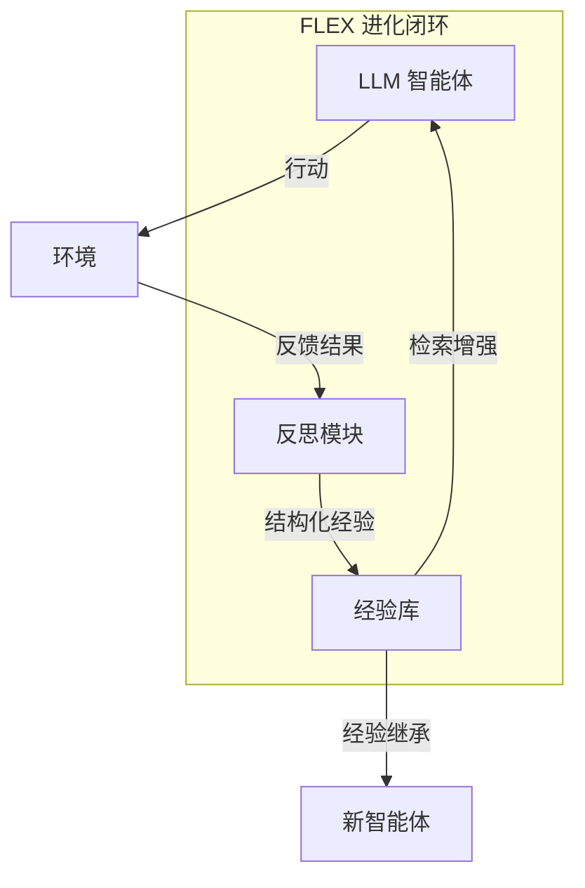

# FLEX：通过经验向前学习实现智能体持续进化

## 一、论文基础元数据
- 原文标题：FLEX: Continuous Agent Evolution via Forward Learning from Experience
- 中文译版：FLEX：通过经验向前学习实现智能体持续进化
- 发表渠道：arXiv 预印本 (cs.LG)
- 发表时间：2025 年 12 月 (v2)
- 链接：arXiv:2511.06449
- 作者及核心机构：Zhicheng Cai 等 (清华大学 AIR 研究院、ByteDance Seed、上海人工智能实验室等)
- 研究领域（一级领域 + 二级子领域）：人工智能 / 大语言模型智能体、持续学习
- 关联数据集（名称/规模/语言/标注）：AIME25 (数学)、USPTO50k (化学)、ProteinGym (生物)；具体规模原文未提及

## 二、论文综合评价
### 2.1 量化评分（1-5 分，5 分为最优）

| 评价维度 | 评分 | 备注 |
| -------- | ---- | ---- |
| 📚 理论基础 | ⭐⭐⭐⭐ | 提出无梯度向前学习范式，理论新颖 |
| 🎯 问题核心性 | ⭐⭐⭐⭐⭐ | 解决智能体部署后无法持续成长痛点 |
| 💡 方法创新性 | ⭐⭐⭐⭐⭐ | 区别于反向传播，构建经验库进化机制 |
| ⚙️ 技术壁垒 | ⭐⭐⭐⭐ | 依赖高质量反思与经验结构化能力 |
| 🧪 实验严谨性 | ⭐⭐⭐⭐ | 跨三领域验证，但片段未展示详细基线 |
| 🔧 落地可行性 | ⭐⭐⭐⭐⭐ | 单智能体训练评估成本低于 100 美元 |
| 🚀 应用前景 | ⭐⭐⭐⭐⭐ | 通用智能体持续进化具有广阔前景 |
| 📊 综合评分 | 4.6 | 创新性强且成本低，有望推动代理进化 |

### 2.2 定性综合评价（≤300 字）
> 核心概括：研究定位、核心价值、差异化优势、关键结论
本文针对大语言模型智能体部署后静态不可变的问题，提出 FLEX 范式。核心价值在于实现无需梯度更新的持续进化，通过结构化经验库积累成败反思。差异化优势在于“向前学习”机制与经验继承现象，打破了传统微调依赖。关键结论显示在数学、化学、生物三大科学领域性能显著提升（最高 23%），且发现经验增长缩放律，具备低成本落地潜力。

## 三、领域本体论映射
| 核心维度 | 具体内容 |
| -------- | -------- |
| 核心研究对象 | 基于大语言模型的自主智能体 (LLM Agents) |
| 核心技术路径 | 无梯度学习 (Gradient-free)、经验反思与库演化 |
| 数据/载体形态 | 结构化经验库 (Structured Experience Library) |
| 核心功能目标 | 智能体在部署阶段的持续进化与能力增长 |
| 验证核心指标 | 任务成功率/准确率 (AIME25, USPTO50k, ProteinGym) |

## 四、核心问题与解决方案
### 4.1 待解决的核心问题
1. **领域级根本问题**：现有 LLM 智能体训练后静态化，无法像生物智能一样在部署中通过经验成长。
2. **现有方法痛点**：传统梯度基于反向传播，成本高且难以在部署期持续更新；微调缺乏经验继承机制。
3. **工程落地卡点**：持续学习带来的灾难性遗忘及高昂的计算成本。

### 4.2 核心解决方案
- 理论框架：Forward Learning with EXperience (FLEX) 范式。
- 核心架构：交互环境 + 反思模块 + 结构化经验库 + 进化机制。
- 关键技术：无梯度优化、经验库的持续反思与更新、经验继承。
- 创新机制：将经验转化为可继承的结构化知识，实现缩放律增长。

### 4.3 核心优势（量化 + 定性）
1. 性能优势：数学推理提升 23%，化学逆合成提升 10%，蛋白质拟合提升 14%。
2. 效率优势：单智能体训练与评估总成本低于 100 美元。
3. 工程优势：无需梯度更新，支持跨智能体经验继承，易于部署。

## 五、方法与技术架构
### 5.1 核心架构设计
> 文字描述 + 架构图（Mermaid/图片）
FLEX 架构包含智能体与环境交互，通过反思模块将交互轨迹转化为结构化经验存入经验库。经验库随时间演化，支持新智能体继承旧经验，形成向前学习闭环。

### 5.2 关键技术实现细节
| 技术模块 | 实现路径 | 工程注意事项 |
| -------- | -------- | ------------ |
| 反思模块 | 对成功/失败轨迹进行自然语言总结 | 需保证反思内容的结构化与可检索性 |
| 经验库 | 存储结构化经验条目，支持版本演化 | 需设计高效的检索与更新机制防遗忘 |
| 依赖组件 | 大语言模型底座、环境交互接口 | 需控制 Token 消耗以维持低成本 |

### 5.3 架构优缺点
- 优点：无需反向传播，成本低，支持持续积累与继承。
- 缺点：依赖模型自身的反思能力，经验库膨胀可能影响检索效率。

## 六、实验设计与结果分析
### 6.1 实验基础设置
| 维度 | 内容 |
| ---- | ---- |
| 数据集 | AIME25 (数学), USPTO50k (化学), ProteinGym (生物) |
| 基线方法 | 强基线模型 (具体名称原文片段未提及) |
| 实验环境 | 原文未提及 (涉及超过 10 种模型) |
| 评价指标 | 任务准确率/成功率、成本 ($) |

### 6.2 核心实验结果
| 方法 | 核心指标 1 (数学) | 核心指标 2 (化学) | 工程指标（算力/耗时） |
| ---- | --------- | --------- | -------------------- |
| 基线 | 原文未提及 | 原文未提及 | 原文未提及 |
| 基线 | 原文未提及 | 原文未提及 | 原文未提及 |
| 本文方法 | +23% (AIME25) | +10% (USPTO50k) | < 100 美元 (单智能体) |

### 6.3 消融实验/鲁棒性分析
| 实验变体 | 指标变化 | 核心结论 |
| -------- | -------- | -------- |
| 经验缩放 | 性能随经验增长提升 | 发现经验增长的缩放律 |
| 经验继承 | 新智能体性能提升 | 验证了经验可跨智能体继承 |

### 6.4 实验结论（工程视角）
FLEX 在多个科学领域验证了有效性，且成本极低，证明了无梯度持续学习在工程上的可行性，适合资源受限场景下的智能体迭代。

## 七、领域贡献与创新点
| 贡献层级 | 具体内容 |
| -------- | -------- |
| 理论贡献 | 提出向前学习 (Forward Learning) 范式，区别于反向传播 |
| 方法/架构贡献 | 构建结构化经验库与持续反思机制 |
| 数据/工具贡献 | 开源项目页面 (flex-gensi-thuair.github.io) |
| 实验/验证贡献 | 跨数学、化学、生物三领域验证，发现经验缩放律 |
| 工程落地贡献 | 实现低成本 (<100$) 单智能体持续进化方案 |

## 八、局限性与风险
| 维度 | 具体描述 | 应对思路 |
| ---- | -------- | -------- |
| 学术局限性 | 片段未展示详细理论证明与基线对比数据 | 需阅读全文确认理论完备性 |
| 工程落地风险 | 经验库长期存储与检索效率可能随规模下降 | 引入向量数据库与经验剪枝策略 |
| 伦理/合规风险 | 智能体自主进化可能产生不可控行为 | 设置经验审核机制与安全护栏 |

## 九、未来研究/落地方向
| 方向类型 | 具体内容 | 优先级 |
| -------- | -------- | ------ |
| 科研拓展 | 探索经验压缩与知识蒸馏结合 | 高 |
| 工程优化 | 优化经验库检索延迟与存储成本 | 高 |
| 跨领域适配 | 迁移至代码生成、客服对话等通用领域 | 中 |

## 十、关键词与术语表
| 语言 | 关键词 |
| ---- | ------ |
| 中文 | 向前学习、经验库、智能体进化、无梯度、持续学习 |
| 英文 | Forward Learning, Experience Library, Agent Evolution, Gradient-free, Continuous Learning |
| 领域专属术语 | FLEX (Forward Learning with EXperience): 本文提出的核心范式 |

## 十一、参考文献与关联资源
- 核心参考文献：原文片段未列出具体参考文献列表
- 补充阅读：项目主页 https://flex-gensi-thuair.github.io
- 开源代码/工具：待补充 (项目页可能提供)

## 十二、阅读者批注
1. **科研启发**：无梯度学习为 LLM 代理提供了新的优化视角，避免了微调的高成本。
2. **工程落地思考**：低成本特性非常适合企业级私有化部署的智能体迭代。
3. **待验证/存疑点**：经验库规模增大后的检索效率及“灾难性遗忘”是否完全避免。
4. **个人/团队应用场景**：可尝试应用于内部知识库问答助手的持续优化。

## 十三、阅读元信息
| 维度 | 内容 |
| ---- | ---- |
| 阅读日期 | 2025-12-10 10:00 |
| 阅读人 | xPaperReader AI |
| 文档编号 | arxiv-2511.06449 |
| 版本迭代 | v1.0 |