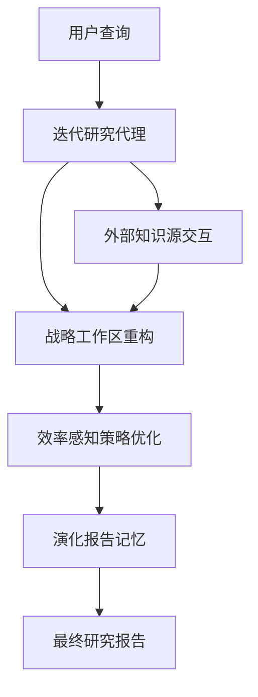

# IterResearch：通过交互缩放重新思考长视界智能体

## 一、论文基础元数据
- 原文标题：IterResearch: Rethinking Long-Horizon Agents with Interaction Scaling
- 中文译版：IterResearch：通过交互缩放重新思考长视界智能体
- 发表渠道：ICLR 2026（会议，顶级会议）
- 发表时间：2026 年 1 月 31 日（arXiv v2 版本）
- 链接：arXiv:2511.07327
- 作者及核心机构：Guoxin Chen 等（中国人民大学，阿里巴巴通义实验室，OpenRLHF）
- 研究领域（一级领域 + 二级子领域）：人工智能 / 大语言模型智能体
- 关联数据集（名称/规模/语言/标注）：原文未提供具体数据集规模细节，提及 6 个基准测试（BrowseComp, GAIA 等）

## 二、论文综合评价
### 2.1 量化评分（1-5 分，5 分为最优）

| 评价维度 | 评分 | 备注 |
| -------- | ---- | ---- |
| 📚 理论基础 | ⭐⭐⭐⭐ | 基于 MDP 架构，理论支撑扎实 |
| 🎯 问题核心性 | ⭐⭐⭐⭐⭐ | 直击长任务上下文窒息痛点 |
| 💡 方法创新性 | ⭐⭐⭐⭐⭐ | 提出交互缩放与迭代研究范式 |
| ⚙️ 技术壁垒 | ⭐⭐⭐⭐ | 涉及策略优化与动态重构 |
| 🧪 实验严谨性 | ⭐⭐⭐⭐ | 涵盖 6 个基准，对比充分 |
| 🔧 落地可行性 | ⭐⭐⭐⭐ | 兼容现有模型，可作为提示策略 |
| 🚀 应用前景 | ⭐⭐⭐⭐⭐ | 长视界任务需求广泛 |
| 📊 综合评分 | 4.4 | 创新显著，实验数据支持有力 |

### 2.2 定性综合评价（≤300 字）
> 核心概括：研究定位、核心价值、差异化优势、关键结论
本文针对长视界任务中单一上下文窗口导致的“上下文窒息”问题，提出了 IterResearch 迭代研究范式。核心价值在于通过交互缩放（Interaction Scaling）和 MDP 启发式架构，实现了工作区的战略重构，而非线性累积上下文。差异化优势在于引入了效率感知策略优化（EAPO），支持高达 2048 次交互的稳定训练。关键结论显示，该方法在 6 个基准测试上平均提升 14.5%，且能作为提示策略显著提升前沿模型表现，具备训练代理与提示范式的双重有效性。

## 三、领域本体论映射
| 核心维度 | 具体内容 |
| -------- | -------- |
| 核心研究对象 | 长视界深度研究智能体（Long-Horizon Deep-Research Agents） |
| 核心技术路径 | 迭代式范式、MDP 架构、工作区重构、效率感知策略优化 |
| 数据/载体形态 | 文本交互序列、外部知识源、动态演化报告 |
| 核心功能目标 | 解决长任务中的上下文窒息，维持持续推理能力 |
| 验证核心指标 | 基准测试性能（%）、交互次数缩放效果、提升百分比（pp） |

## 四、核心问题与解决方案
### 4.1 待解决的核心问题
1. **领域级根本问题**：长视界任务需要持续的推理和信息搜索能力，现有模型难以维持。
2. **现有方法痛点**：单一上下文范式（Mono-contextual paradigm）导致上下文窒息和噪声污染。
3. **工程落地卡点**：线性上下文累积限制了探索深度，训练稳定性差。

### 4.2 核心解决方案
- 理论框架：迭代深度研究范式（Iterative Deep-Research Paradigm）。
- 核心架构：MDP 启发式架构，包含战略工作区重构。
- 关键技术：效率感知策略优化（EAPO），几何奖励折扣，自适应下采样。
- 创新机制：通过维护演化的报告作为记忆，定期综合洞察，而非累积所有信息。

### 4.3 核心优势（量化 + 定性）
1. 性能优势：6 个基准测试平均提升 14.5pp，前沿模型提示提升高达 19.2pp。
2. 效率优势：支持扩展至 2048 次交互，性能从 3.5% 提升至 42.5%。
3. 工程优势：既可作为训练代理，也可作为前沿模型的提示策略，灵活性强。

## 五、方法与技术架构
### 5.1 核心架构设计
> 文字描述 + 架构图（Mermaid/图片）
本文采用 MDP 启发式架构，摒弃线性上下文累积。核心流程包括用户查询输入、迭代研究代理处理、工作区重构、策略优化及最终报告生成。通过维护演化报告作为记忆，定期综合洞察。

### 5.2 关键技术实现细节
| 技术模块 | 实现路径 | 工程注意事项 |
| -------- | -------- | ------------ |
| 迭代范式 | 周期性综合洞察，维护演化报告 | 需平衡信息保留与噪声过滤 |
| EAPO 策略 | 几何奖励折扣，自适应下采样 | 确保分布式训练稳定性 |
| 工作区重构 | 战略性的上下文管理 | 避免关键推理链断裂 |
| 依赖组件 | 大语言模型基座，外部搜索工具 | 需适配不同模型接口 |

### 5.3 架构优缺点
- 优点：有效避免上下文窒息，支持超长交互序列，训练稳定。
- 缺点：原文未提供具体计算开销对比，重构机制可能增加逻辑复杂度。

## 六、实验设计与结果分析
### 6.1 实验基础设置
| 维度 | 内容 |
| ---- | ---- |
| 数据集 | 6 个基准测试（包括 BrowseComp, GAIA 等） |
| 基线方法 | MiroThinker, WebSailor, Asearcher, WebDancer, WebThinker 等 |
| 实验环境 | 原文未提供具体硬件配置 |
| 评价指标 | 性能百分比（%），提升百分比（pp） |

### 6.2 核心实验结果
| 方法 | 核心指标 1 (BrowseComp) | 核心指标 2 (GAIA) | 工程指标（算力/耗时） |
| ---- | --------- | --------- | -------------------- |
| WebThinker-QwQ | 2.8% | 48.5% | 原文未提供 |
| WebDancer-QwQ | 3.8% | 51.5% | 原文未提供 |
| 本文方法 (IterResearch) | 37.3% | 72.8% | 原文未提供 |

*注：数据源自 Figure 1  caption 及摘要提及的平均提升*

### 6.3 消融实验/鲁棒性分析
| 实验变体 | 指标变化 | 核心结论 |
| -------- | -------- | -------- |
| 交互缩放 (至 2048 次) | 3.5% 至 42.5% | 展现前所未有的交互缩放能力 |
| 作为提示策略 | 提升高达 19.2pp | 对前沿模型有效，无需训练 |

### 6.4 实验结论（工程视角）
该方法在长视界任务上显著优于现有开源代理，且具备作为提示策略直接赋能前沿模型的能力，工程适用性高。

## 七、领域贡献与创新点
| 贡献层级 | 具体内容 |
| -------- | -------- |
| 理论贡献 | 重新思考长视界代理，提出交互缩放视角 |
| 方法/架构贡献 | 迭代研究范式，MDP 启发式架构，工作区重构 |
| 数据/工具贡献 | 原文未明确提及开源数据集，代码待补充 |
| 实验/验证贡献 | 6 个基准测试验证，交互缩放极限测试 |
| 工程落地贡献 | 提供训练代理与提示策略两种落地模式 |

## 八、局限性与风险
| 维度 | 具体描述 | 应对思路 |
| ---- | -------- | -------- |
| 学术局限性 | 原文片段未详述理论证明细节 | 需查阅完整论文方法章节 |
| 工程落地风险 | 长交互可能带来延迟累积 | 优化工作区重构效率 |
| 伦理/合规风险 | 自主搜索可能涉及隐私或合规问题 | 需增加内容安全过滤机制 |

## 九、未来研究/落地方向
| 方向类型 | 具体内容 | 优先级 |
| -------- | -------- | ------ |
| 科研拓展 | 探索更复杂的记忆管理机制 | 高 |
| 工程优化 | 降低工作区重构的计算开销 | 高 |
| 跨领域适配 | 适配代码生成、多模态任务 | 中 |

## 十、关键词与术语表
| 语言 | 关键词 |
| ---- | ------ |
| 中文 | 迭代研究，交互缩放，长视界智能体，上下文窒息，效率感知策略优化 |
| 英文 | IterResearch, Interaction Scaling, Long-Horizon Agents, Context Suffocation, EAPO |
| 领域专属术语 | Mono-contextual paradigm（单一上下文范式）：将所有信息累积到单个上下文窗口的方法 |

## 十一、参考文献与关联资源
- 核心参考文献：原文未提供完整列表（仅提及 OpenAI, Google, Anthropic 等系统）
- 补充阅读：待补充
- 开源代码/工具：待补充（摘要提及 Code 但未提供链接）

## 十二、阅读者批注
1. **科研启发**：交互缩放（Interaction Scaling）是一个新颖的视角，突破了单纯增加上下文窗口的思路。
2. **工程落地思考**：作为提示策略（Prompting Paradigm）无需训练即可提升前沿模型，落地成本极低。
3. **待验证/存疑点**：工作区重构的具体算法细节在摘要中未展开，需确认信息丢失风险。
4. **个人/团队应用场景**：适用于需要长时间联网搜索、复杂报告生成的自动化任务。

## 十三、阅读元信息
| 维度 | 内容 |
| ---- | ---- |
| 阅读日期 | 2026-04-09 10:06 |
| 阅读人 | xPaperReader AI |
| 文档编号 | arxiv-2511.07327 |
| 版本迭代 | v1.0 |