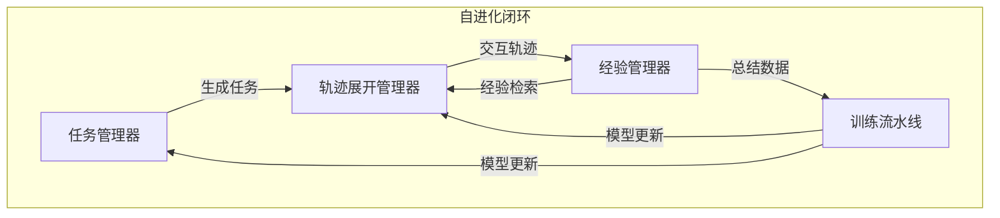

# AgentEvolver：迈向高效自进化智能体系统

## 一、论文基础元数据
- 原文标题：AgentEvolver: Towards Efficient Self-Evolving Agent System
- 中文译版：AgentEvolver：迈向高效自进化智能体系统
- 发表渠道：预印本（arXiv）
- 发表时间：2025 年
- 链接：arXiv:2511.10395
- 作者及核心机构：Yunpeng Zhai 等（机构信息待补充）
- 研究领域：人工智能（大模型智能体 + 强化学习）
- 关联数据集：AppWorld（任务完成率）、BFCL v3（多轮交互）、自合成任务数据

## 二、论文综合评价
### 2.1 量化评分（1-5 分，5 分为最优）

| 评价维度 | 评分 | 备注 |
| -------- | ---- | ---- |
| 📚 理论基础 | ⭐⭐⭐⭐ | 结合 RL 与 LLM 推理，理论扎实 |
| 🎯 问题核心性 | ⭐⭐⭐⭐⭐ | 直击数据稀缺与探索低效痛点 |
| 💡 方法创新性 | ⭐⭐⭐⭐⭐ | 提出三大自进化协同机制 |
| ⚙️ 技术壁垒 | ⭐⭐⭐⭐ | 系统架构复杂，工程实现难度大 |
| 🧪 实验严谨性 | ⭐⭐⭐⭐⭐ | 多基准测试，消融实验充分 |
| 🔧 落地可行性 | ⭐⭐⭐⭐ | 模块化设计，支持高并发部署 |
| 🚀 应用前景 | ⭐⭐⭐⭐⭐ | 适用于复杂工作流自动化场景 |
| 📊 综合评分 | 4.6 | 体系完整，显著提升样本效率与性能 |

### 2.2 定性综合评价（≤300 字）
> 核心概括：研究定位、核心价值、差异化优势、关键结论

本研究定位为构建高效自主进化的智能体系统，核心价值在于减少对人工标注数据和低效随机探索的依赖。差异化优势在于提出了自提问、自导航、自归因三大协同机制，形成闭环自我改进。关键结论显示，该框架在 AppWorld 和 BFCL 基准上显著优于基线，7B 模型性能提升约 30%，且样本效率大幅提高，证明了将 LLM 推理能力转化为训练信号的有效性。

## 三、领域本体论映射
| 核心维度 | 具体内容 |
| -------- | -------- |
| 核心研究对象 | 自进化智能体系统（Self-Evolving Agent System） |
| 核心技术路径 | 强化学习（RL）+ 大语言模型（LLM）+ 经验回放 |
| 数据/载体形态 | 合成任务轨迹、历史经验文本、环境交互日志 |
| 核心功能目标 | 自主生成任务、复用历史经验、细粒度信用分配 |
| 验证核心指标 | avg@8（平均完成率）、best@8（最佳完成率）、训练步数 |

## 四、核心问题与解决方案
### 4.1 待解决的核心问题
1. **领域级根本问题**：智能体训练依赖大量人工构建任务数据，成本高昂且难以覆盖长尾场景。
2. **现有方法痛点**：RL 训练初期随机探索效率低，奖励信号稀疏导致信用分配困难，收敛慢。
3. **工程落地卡点**：环境服务与 Agent 逻辑耦合度高，难以支持高并发与多种工作流扩展。

### 4.2 核心解决方案
- 理论框架：端到端服务化自进化闭环系统。
- 核心架构：四大模块（任务、轨迹、经验、训练）协同工作。
- 关键技术：环境 Profile 引导探索、经验混合 Rollout、复合奖励函数。
- 创新机制：自提问（任务生成）、自导航（经验复用）、自归因（细粒度奖励）。

### 4.3 核心优势（量化+定性）
1. 性能优势：14B 模型 avg@8 提升约 30%，显著优于 Zero-shot 及原始数据基线。
2. 效率优势：达到基线 90% 性能所需训练步数减少 55%-67%。
3. 工程优势：解耦架构支持高并发（Ray），模块化设计便于替换策略或算法。

## 五、方法与技术架构
### 5.1 核心架构设计
系统采用模块化设计，分为任务管理、轨迹展开、经验管理与训练流水线，通过主协调器形成闭环。

### 5.2 关键技术实现细节
| 技术模块 | 实现路径 | 工程注意事项 |
| -------- | -------- | ------------ |
| 自提问机制 | 利用环境 Profile 引导 LLM 高温探索，合成任务并过滤 | 需保证任务可行性，避免无效探索 |
| 自导航机制 | 经验池嵌入检索，混合无引导与经验引导轨迹 | 训练时移除经验 Token 防止过拟合 |
| 自归因机制 | LLM 评估每一步好坏，融合过程与结果奖励 | 需调整超参数平衡过程与结果权重 |
| 依赖组件 | Ray（并发）、veRL（训练栈）、HTTP 接口（环境） | 确保环境服务稳定性与低延迟 |

### 5.3 架构优缺点
- 优点：高度自动化，减少人工干预；样本效率高；支持多种 Agent 工作流。
- 缺点：系统复杂度高，初期搭建成本大；依赖 LLM 判断能力，存在误差传递风险。

## 六、实验设计与结果分析
### 6.1 实验基础设置
| 维度 | 内容 |
| ---- | ---- |
| 数据集 | AppWorld, BFCL v3, 自合成数据 |
| 基线方法 | Vanilla GRPO, Zero-shot, 原始数据训练 |
| 实验环境 | Ray 集群，解耦运行时与训练 |
| 评价指标 | avg@8, best@8, 训练步数收敛速度 |

### 6.2 核心实验结果
| 方法 | 核心指标 1 (7B avg@8) | 核心指标 2 (14B avg@8) | 工程指标（算力/耗时） |
| ---- | --------- | --------- | -------------------- |
| 基线 1 (Zero-shot) | 待补充 | 待补充 | 低 |
| 基线 2 (Vanilla GRPO) | 待补充 | 待补充 | 中 |
| 本文方法 | 提升 29.4% (达 45.2%) | 提升 27.8% (达 57.6%) | 样本效率提升 55%-67% |

### 6.3 消融实验/鲁棒性分析
| 实验变体 | 指标变化 | 核心结论 |
| -------- | -------- | -------- |
| 移除自提问 | 性能大幅下降 | 任务生成是强基线基础 |
| 移除自导航 | 性能下降 | 经验复用提升探索效率 |
| 移除自归因 | 性能下降 | 细粒度奖励优化学习信号 |
| 高α值 (0.30) | 早期快后期退化 | 需平衡过程与结果奖励权重 |

### 6.4 实验结论（工程视角）
框架在实际基准测试中表现稳健，显著降低了达到特定性能所需的计算成本。超参数α在 0.10-0.20 之间表现最佳，工程部署时需针对具体任务微调。

## 七、领域贡献与创新点
| 贡献层级 | 具体内容 |
| -------- | -------- |
| 理论贡献 | 提出自进化闭环理论，将 LLM 推理转化为训练信号 |
| 方法/架构贡献 | 设计三大协同机制（自提问、自导航、自归因） |
| 数据/工具贡献 | 构建高效合成数据流程，减少人工标注依赖 |
| 实验/验证贡献 | 在 AppWorld 和 BFCL 上验证了跨模型规模的有效性 |
| 工程落地贡献 | 提供模块化、高并发系统架构，支持多种工作流 |

## 八、局限性与风险
| 维度 | 具体描述 | 应对思路 |
| ---- | -------- | -------- |
| 学术局限性 | 依赖 LLM 判断能力，可能存在评估偏差 | 引入多模型投票或人工抽检机制 |
| 工程落地风险 | 系统复杂度高，维护成本大 | 标准化接口，简化模块依赖 |
| 伦理/合规风险 | 自主生成任务可能涉及敏感操作 | 增加安全过滤层与权限控制 |

## 九、未来研究/落地方向
| 方向类型 | 具体内容 | 优先级 |
| -------- | -------- | ------ |
| 科研拓展 | 探索更大规模模型下的自进化 Scaling Law | 高 |
| 工程优化 | 开发成本感知课程，优化计算 - 数据权衡 | 中 |
| 跨领域适配 | 面向企业工作流和安全关键任务适配 | 高 |

## 十、关键词与术语表
| 语言 | 关键词 |
| ---- | ------ |
| 中文 | 自进化智能体、自提问、自导航、自归因、强化学习 |
| 英文 | Self-Evolving Agent, Self-Questioning, Self-Navigating, Self-Attributing, RL |
| 领域专属术语 | 环境 Profile（环境结构化描述）、经验混合 Rollout（混合策略采样） |

## 十一、参考文献与关联资源
- 核心参考文献：待补充（原文未列出具体引用列表）
- 补充阅读：GRPO 算法相关论文、AppWorld 基准介绍
- 开源代码/工具：待补充（未提供具体仓库链接）

## 十二、阅读者批注
1. **科研启发**：将 LLM 的推理能力直接转化为训练信号是一个非常有前景的方向，避免了传统 RL 的信号稀疏问题。
2. **工程落地思考**：模块化设计非常适合企业级应用，可以独立升级任务生成或训练模块，但需注意环境服务的稳定性。
3. **待验证/存疑点**：在更大规模模型（如 70B+）上的效果是否依然显著？合成数据的质量上限在哪里？
4. **个人/团队应用场景**：适用于自动化测试生成、复杂 API 调用流程优化、客服机器人自我迭代。

## 十三、阅读元信息
| 维度 | 内容 |
| ---- | ---- |
| 阅读日期 | 2026-04-09 10:13 |
| 阅读人 | xPaperReader AI |
| 文档编号 | arxiv-2511.10395 |
| 版本迭代 | v1.0 |