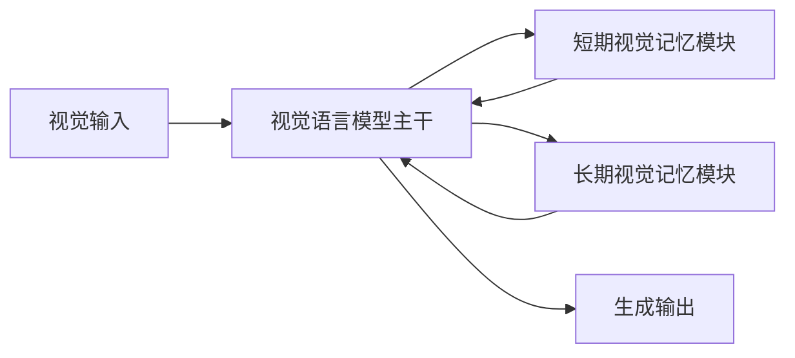

# VisMem：潜在视觉记忆释放视觉语言模型潜力

## 一、论文基础元数据
- 原文标题：VisMem: Latent Vision Memory Unlocks Potential of Vision-Language Models
- 中文译版：VisMem：潜在视觉记忆释放视觉语言模型潜力
- 发表渠道：预印本 (arXiv)
- 发表时间：2025 年 (根据 arXiv ID 推断)
- 链接：https://arxiv.org/abs/2511.11007 (推测链接) / 代码：https://github.com/YU-deep/VisMem.git
- 作者及核心机构：Xinlei Yu (NUS), Chengming Xu (Fudan), Guibin Zhang (NUS), Zhangquan Chen (Tsinghua) 等
- 研究领域：人工智能 / 多模态学习 (视觉 - 语言模型)
- 关联数据集：原文提及“多样视觉基准 (diverse visual benchmarks)"，具体名称原文未提供

## 二、论文综合评价
### 2.1 量化评分（1-5 分，5 分为最优）

| 评价维度 | 评分 | 备注 |
| -------- | ---- | ---- |
| 📚 理论基础 | ⭐⭐⭐⭐ | 借鉴人类认知记忆理论，理论基础扎实 |
| 🎯 问题核心性 | ⭐⭐⭐⭐⭐ | 直击 VLM 视觉处理瓶颈与记忆缺失痛点 |
| 💡 方法创新性 | ⭐⭐⭐⭐⭐ | 提出潜在空间长短时记忆机制，新颖性强 |
| ⚙️ 技术壁垒 | ⭐⭐⭐⭐ | 潜在空间记忆模块设计具有一定技术门槛 |
| 🧪 实验严谨性 | ⭐⭐⭐ | 原文片段未提供详细实验设置，待验证 |
| 🔧 落地可行性 | ⭐⭐⭐⭐ | 推理阶段无缝调用，工程集成难度适中 |
| 🚀 应用前景 | ⭐⭐⭐⭐⭐ | 显著提升生成一致性与理解能力，应用广 |
| 📊 综合评分 | 4.3 | 创新性强但实验细节缺失，整体潜力巨大 |

### 2.2 定性综合评价（≤300 字）
> 核心概括：研究定位、核心价值、差异化优势、关键结论

本文针对视觉语言模型（VLM）在长序列生成中丢失视觉证据的“视觉处理瓶颈”问题，提出 VisMem 框架。核心价值在于模仿人类认知记忆，设计动态潜在视觉记忆模块（短期感知保留 + 长期语义巩固）。差异化优势在于在潜在空间操作而非像素或令牌级别，平衡了效率与生成能力。关键结论显示该方法相对基线模型平均性能提升 11.0%，建立了潜在空间记忆增强的新范式。由于原文仅提供摘要与引言，实验细节待完整论文验证。

## 三、领域本体论映射
| 核心维度 | 具体内容 |
| -------- | -------- |
| 核心研究对象 | 视觉语言模型 (VLM) 的视觉记忆缺失问题 |
| 核心技术路径 | 潜在空间动态记忆机制 (短时长时双模块) |
| 数据/载体形态 | 连续潜在上下文 (Continuous Latent Contexts) |
| 核心功能目标 | 维持生成长序列中的感知保真度与语义一致性 |
| 验证核心指标 | 视觉理解、推理、生成任务的性能提升 (平均 11.0%) |

## 四、核心问题与解决方案
### 4.1 待解决的核心问题
1. **领域级根本问题**：
   VLM 在深度自回归解码过程中，倾向于优先积累文本上下文而忽视初始视觉证据，导致视觉记忆缺失。
2. **现有方法痛点**：
   直接训练易导致灾难性遗忘；图像级干预计算成本过高；令牌级操作缺乏生成能力；现有潜在空间方法依赖纯语言空间或辅助视觉数据。
3. **工程落地卡点**：
   如何在长生成序列中高效维持视觉 grounding 而不显著增加推理延迟。

### 4.2 核心解决方案
- 理论框架：基于人类认知记忆理论（短期视觉主导记忆 + 长期语义主导记忆）。
- 核心架构：VisMem 框架，包含动态潜在视觉记忆模块。
- 关键技术：短期模块用于细粒度感知保留，长期模块用于抽象语义巩固。
- 创新机制：记忆模块在推理期间无缝调用，无需额外视觉数据辅助。

### 4.3 核心优势（量化 + 定性）
1. 性能优势：相对 vanilla 模型平均性能提升 11.0%。
2. 效率优势：潜在空间操作，避免像素级合成的高计算成本。
3. 工程优势：推理阶段无缝集成，兼容现有 VLM 架构。

## 五、方法与技术架构
### 5.1 核心架构设计
> 文字描述 + 架构图（Mermaid/图片）

VisMem 架构在标准 VLM 基础上引入两个记忆模块。视觉输入进入 VLM 后，信息被分流至短期记忆模块（保留细粒度感知）和长期记忆模块（巩固抽象语义）。在生成过程中，这两个记忆模块动态更新并被 VLM 调用，以修正生成轨迹。

### 5.2 关键技术实现细节
| 技术模块 | 实现路径 | 工程注意事项 |
| -------- | -------- | ------------ |
| 短期记忆模块 | 细粒度感知保留，动态更新 | 需控制缓存大小以防显存溢出 |
| 长期记忆模块 | 抽象语义巩固，低频更新 | 需确保语义一致性不偏离视觉证据 |
| 依赖组件 | 标准 VLM 架构 (如 Transformer) | 需适配潜在空间接口 |

### 5.3 架构优缺点
- 优点：有效缓解视觉遗忘，提升长序列生成质量，计算开销相对像素级方法低。
- 缺点：引入额外记忆模块可能增加推理延迟，具体开销原文未提供。

## 六、实验设计与结果分析
### 6.1 实验基础设置
| 维度 | 内容 |
| ---- | ---- |
| 数据集 | 原文提及“多样视觉基准”，具体名称待补充 |
| 基线方法 | Vanilla 模型及现有潜在空间方法 (具体名称待补充) |
| 实验环境 | 原文未提供 |
| 评价指标 | 视觉理解、推理、生成任务性能指标 |

### 6.2 核心实验结果
| 方法 | 核心指标 1 (平均提升) | 核心指标 2 | 工程指标（算力/耗时） |
| ---- | --------- | --------- | -------------------- |
| 基线 1 (Vanilla) | 基准 | 待补充 | 待补充 |
| 基线 2 (现有方法) | 低于本文 | 待补充 | 待补充 |
| 本文方法 | +11.0% | 优于所有对应方法 | 待补充 |

### 6.3 消融实验/鲁棒性分析
| 实验变体 | 指标变化 | 核心结论 |
| -------- | -------- | -------- |
| 原文未提供 | 原文未提供 | 原文未提供 |

### 6.4 实验结论（工程视角）
该方法在多种视觉任务上均表现出显著增益，证明潜在记忆机制的有效性。但缺乏具体延迟数据，工程部署前需评估推理开销。

## 七、领域贡献与创新点
| 贡献层级 | 具体内容 |
| -------- | -------- |
| 理论贡献 | 将人类认知记忆理论引入 VLM 潜在空间建模 |
| 方法/架构贡献 | 提出 VisMem 双模块记忆框架 (短期 + 长期) |
| 数据/工具贡献 | 承诺开源代码 (GitHub) |
| 实验/验证贡献 | 验证了潜在空间记忆对多任务的性能提升 |
| 工程落地贡献 | 提供推理阶段无缝调用的记忆增强方案 |

## 八、局限性与风险
| 维度 | 具体描述 | 应对思路 |
| ---- | -------- | -------- |
| 学术局限性 | 原文片段未提供完整实验细节，泛化性待验证 | 等待完整论文发布及复现 |
| 工程落地风险 | 记忆模块可能增加推理延迟和显存占用 | 优化记忆压缩算法，量化评估开销 |
| 伦理/合规风险 | 通用 VLM 风险 (幻觉、偏见) 仍可能存在 | 结合对齐技术进行后续优化 |

## 九、未来研究/落地方向
| 方向类型 | 具体内容 | 优先级 |
| -------- | -------- | ------ |
| 科研拓展 | 探索记忆模块与不同 VLM 架构的兼容性 | 高 |
| 工程优化 | 优化记忆检索与更新效率，降低延迟 | 高 |
| 跨领域适配 | 适配视频理解、机器人控制等长序列任务 | 中 |

## 十、关键词与术语表
| 语言 | 关键词 |
| ---- | ------ |
| 中文 | 视觉语言模型，潜在视觉记忆，视觉处理瓶颈，认知记忆理论 |
| 英文 | Vision-Language Models, Latent Vision Memory, Visual Processing Bottleneck, Cognitive Memory Theory |
| 领域专属术语 | VisMem (本文提出的框架名称), Vanilla Model (基准模型) |

## 十一、参考文献与关联资源
- 核心参考文献：原文引言中提及 [1, 2, 4, 8, 11, 13, 16, 17, 21, 24, 25, 26, 28, 29, 30, 31, 35, 39, 44, 47, 48, 49, 50, 52, 55, 56, 63, 66, 68, 70, 75, 81, 87, 90] 等，具体列表待补充。
- 补充阅读：人类认知记忆理论相关文献。
- 开源代码/工具：https://github.com/YU-deep/VisMem.git

## 十二、阅读者批注
1. **科研启发**：将心理学记忆模型映射到神经网络潜在空间是一个极具潜力的方向，可拓展至其他模态。
2. **工程落地思考**：需重点关注记忆模块在长上下文中的显存占用增长曲线，是否支持流式推理。
3. **待验证/存疑点**：11.0% 的提升具体分布在哪些任务？短时长时记忆的具体更新策略数学表达是什么？
4. **个人/团队应用场景**：适用于需要长序列视觉生成的场景，如视觉故事生成、多步视觉推理助手。

## 十三、阅读元信息
| 维度 | 内容 |
| ---- | ---- |
| 阅读日期 | 2026-04-09 10:25 |
| 阅读人 | xPaperReader AI |
| 文档编号 | arxiv-2511.11007 |
| 版本迭代 | v1.0 |