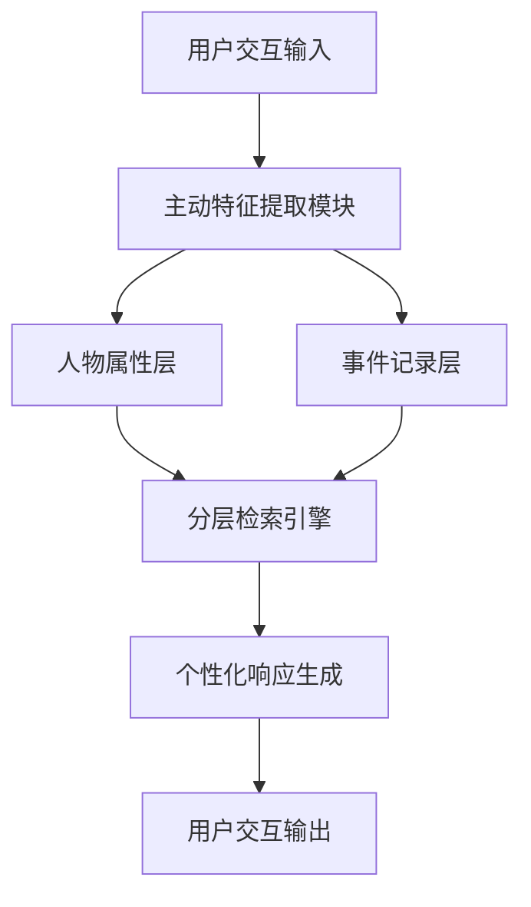

# O-Mem：面向个性化、长周期、自演化智能体的全向记忆系统

## 一、论文基础元数据
| 维度 | 内容 |
| ---- | ---- |
| 原文标题 | O-Mem: Omni Memory System for Personalized, Long Horizon, Self-Evolving Agents |
| 中文译版 | O-Mem：面向个性化、长周期、自演化智能体的全向记忆系统 |
| 发表渠道 | arXiv 预印本（未经同行评审） |
| 发表时间 | 2025 年 12 月 10 日（arXiv v3） |
| 链接 | arXiv:2511.13593 |
| 作者及核心机构 | Piaohong Wang 等 11 人；OPPO AI Agent Team |
| 研究领域 | 人工智能 + 智能体记忆系统/个性化交互 |
| 关联数据集 | LoCoMo（公开基准）、PERSONAMEM（公开基准）；规模/语言/标注待补充 |

## 二、论文综合评价
### 2.1 量化评分（1-5 分，5 分为最优）

| 评价维度 | 评分 | 备注 |
| -------- | ---- | ---- |
| 📚 理论基础 | ⭐⭐⭐⭐ | 基于主动用户画像理论，框架清晰 |
| 🎯 问题核心性 | ⭐⭐⭐⭐⭐ | 直击长周期交互一致性痛点 |
| 💡 方法创新性 | ⭐⭐⭐⭐ | 分层检索机制有差异化设计 |
| ⚙️ 技术壁垒 | ⭐⭐⭐⭐ | 动态提取更新机制具技术深度 |
| 🧪 实验严谨性 | ⭐⭐⭐ | 仅摘要提供结果，细节待补充 |
| 🔧 落地可行性 | ⭐⭐⭐⭐ | OPPO 团队背书，工程化潜力高 |
| 🚀 应用前景 | ⭐⭐⭐⭐⭐ | 个性化助手场景需求明确 |
| 📊 综合评分 | 4.1 | 方法创新突出，实验细节需完整验证 |

### 2.2 定性综合评价（≤300 字）
> **核心概括**：本研究针对 LLM 智能体长周期交互中的上下文一致性与动态个性化难题，提出 O-Mem 记忆框架。核心价值在于突破传统语义分组检索的局限，采用主动用户画像机制动态提取用户特征与事件记录。差异化优势体现为分层检索架构（人物属性 + 主题上下文）及帕累托最优的效率 - 性能平衡。关键结论：在 LoCoMo 基准达 51.67%（+3% vs LangMem），PERSONAMEM 达 62.99%（+3.5% vs A-Mem），同时降低 token 消耗与响应延迟。

## 三、领域本体论映射
| 核心维度 | 具体内容 |
| -------- | -------- |
| 核心研究对象 | LLM 驱动的智能体记忆系统 |
| 核心技术路径 | 主动用户画像 + 分层检索机制 |
| 数据/载体形态 | 用户交互日志、人物属性、事件记录 |
| 核心功能目标 | 长周期个性化交互、上下文一致性维护 |
| 验证核心指标 | LoCoMo 准确率、PERSONAMEM 准确率、延迟、token 消耗 |

## 四、核心问题与解决方案
### 4.1 待解决的核心问题
1. **领域级根本问题**：
   - LLM 智能体在复杂环境中难以维持长周期交互的上下文一致性
   - 动态个性化能力不足，无法适应用户情境变化

2. **现有方法痛点**：
   - 依赖语义分组进行检索，忽略语义无关但关键的用户信息（如健康状况、情境背景）
   - 引入检索噪声，降低响应质量
   - 效率与性能难以兼顾

3. **工程落地卡点**：
   - 记忆系统延迟高、token 消耗大
   - 用户特征动态更新机制不完善

### 4.2 核心解决方案
- **理论框架**：基于主动用户画像的记忆框架，从用户主动交互中动态提取特征
- **核心架构**：分层检索架构（人物属性层 + 主题相关上下文层）
- **关键技术**：用户特征动态提取、事件记录更新、分层检索机制
- **创新机制**：突破语义分组限制，保留语义无关但关键信息；实现效率 - 性能帕累托最优

### 4.3 核心优势（量化 + 定性）
1. **性能优势**：LoCoMo 51.67%（+3% vs LangMem）；PERSONAMEM 62.99%（+3.5% vs A-Mem）
2. **效率优势**：降低每交互平均延迟与 token 消耗（具体数值原文未提供）
3. **工程优势**：支持 FAISS-CPU 兼容，便于部署；分层检索降低检索噪声

## 五、方法与技术架构
### 5.1 核心架构设计
> 文字描述：O-Mem 采用分层记忆架构，包含用户画像层（存储人物属性）和事件记录层（存储交互上下文）。通过主动提取机制从用户交互中动态更新两层信息，检索时支持分层查询以平衡精度与效率。

### 5.2 关键技术实现细节
| 技术模块 | 实现路径 | 工程注意事项 |
| -------- | -------- | ------------ |
| 主动特征提取模块 | 从用户主动交互中动态提取特征 | 需定义特征提取触发条件 |
| 人物属性层 | 存储用户画像属性（健康状况等） | 属性更新频率需控制 |
| 事件记录层 | 存储主题相关交互上下文 | 需设置存储容量上限 |
| 分层检索引擎 | 支持属性层与事件层联合查询 | 检索优先级需调优 |
| 依赖组件 | FAISS（CPU 版本用于兼容性测试） | 生产环境可升级至 GPU 加速 |

### 5.3 架构优缺点
- **优点**：
  - 突破语义分组限制，保留关键非语义信息
  - 分层检索降低噪声，提升响应质量
  - 效率与性能达到帕累托最优平衡

- **缺点**：
  - 原文未提供完整架构细节（节选内容限制）
  - 动态更新机制的触发条件与频率未明确
  - 长周期存储的容量管理策略待补充

## 六、实验设计与结果分析
### 6.1 实验基础设置
| 维度 | 内容 |
| ---- | ---- |
| 数据集 | LoCoMo（公开基准）、PERSONAMEM（公开基准） |
| 基线方法 | LangMem（LoCoMo）、A-Mem（PERSONAMEM）、MemoryOS |
| 实验环境 | 原文未提供（仅摘要提及使用 GPT-4.1 进行 token 控制实验） |
| 评价指标 | 准确率（%）、每交互平均延迟、每交互平均 token 消耗 |

### 6.2 核心实验结果
| 方法 | 核心指标 1（LoCoMo 准确率） | 核心指标 2（PERSONAMEM 准确率） | 工程指标（算力/耗时） |
| ---- | --------- | --------- | -------------------- |
| LangMem | 约 48.67% | 待补充 | 待补充 |
| A-Mem | 待补充 | 约 59.49% | 待补充 |
| 本文方法 | 51.67% | 62.99% | 延迟与 token 消耗低于基线（具体数值待补充） |

### 6.3 消融实验/鲁棒性分析
| 实验变体 | 指标变化 | 核心结论 |
| -------- | -------- | -------- |
| 原文未提供 | 原文未提供 | 原文未提供（节选内容限制） |

### 6.4 实验结论（工程视角）
- O-Mem 在两个公开基准上均超越前 SOTA 方法，验证了分层检索机制的有效性
- 效率方面实现帕累托最优，适合对延迟敏感的生产环境
- Token 控制实验仅在 LoCoMo 的 GPT-4.1 上进行，其他模型与数据集未验证

## 七、领域贡献与创新点
| 贡献层级 | 具体内容 |
| -------- | -------- |
| 理论贡献 | 提出主动用户画像记忆理论，突破语义分组检索局限 |
| 方法/架构贡献 | 设计分层检索架构（人物属性 + 主题上下文） |
| 数据/工具贡献 | 开源代码与工具（Github、Huggingface 已开放） |
| 实验/验证贡献 | 在两个公开基准上验证有效性，提供效率 - 性能权衡分析 |
| 工程落地贡献 | FAISS-CPU 兼容设计，降低部署门槛 |

## 八、局限性与风险
| 维度 | 具体描述 | 应对思路 |
| ---- | -------- | -------- |
| 学术局限性 | 预印本未经同行评审；实验细节不完整（节选内容限制） | 等待正式发表后补充验证 |
| 工程落地风险 | 动态更新机制触发条件未明确；长周期存储容量管理策略待补充 | 需在实际场景中调参优化 |
| 伦理/合规风险 | 用户画像涉及隐私数据，需符合数据保护法规 | 实施数据脱敏与用户授权机制 |

## 九、未来研究/落地方向
| 方向类型 | 具体内容 | 优先级 |
| -------- | -------- | ------ |
| 科研拓展 | 探索多模态交互下的记忆系统扩展；研究记忆遗忘与压缩机制 | 高 |
| 工程优化 | 完善动态更新触发策略；优化分层检索的优先级调度 | 高 |
| 跨领域适配 | 适配客服、健康助手、教育等垂直场景 | 中 |

## 十、关键词与术语表
| 语言 | 关键词 |
| ---- | ------ |
| 中文 | 智能体记忆系统、主动用户画像、分层检索、长周期交互、个性化 |
| 英文 | Agent Memory System, Active User Profiling, Hierarchical Retrieval, Long Horizon Interaction, Personalization |
| 领域专属术语 | 主动用户画像：从用户主动交互中动态提取特征；分层检索：人物属性层与事件记录层联合查询；帕累托最优：效率与性能无法同时进一步优化的平衡状态 |

## 十一、参考文献与关联资源
- **核心参考文献**：原文引用 41 篇文献（节选内容未完整列出）
- **补充阅读**：Memory OS [10]、Agentic Memory [39]、Mem0 [5]、LangMem、A-Mem
- **开源代码/工具**：Github（已开放）、Huggingface（已开放）；具体链接待补充

## 十二、阅读者批注
1. **科研启发**：主动用户画像机制为记忆系统研究提供新方向，可探索与其他记忆架构的融合
2. **工程落地思考**：分层检索设计适合生产环境，但需关注存储容量与更新频率的工程调优
3. **待验证/存疑点**：消融实验细节缺失；动态更新触发条件未明确；其他模型上的 token 控制实验未进行
4. **个人/团队应用场景**：适用于客服机器人、个人助手、健康咨询等需要长周期记忆的场景

## 十三、阅读元信息
| 维度 | 内容 |
| ---- | ---- |
| 阅读日期 | 2026-04-09 10:36 |
| 阅读人 | xPaperReader AI |
| 文档编号 | arxiv-2511.13593 |
| 版本迭代 | v1.0 |

---

**内容完整性说明**：本简报基于论文节选内容（约 4000 字符，含摘要、图 1 说明、引言部分）生成。实验细节、完整方法架构、消融实验等内容在节选中未提供，已显式标注"原文未提供"或"待补充"，遵循防御性阅读策略，避免幻觉生成。