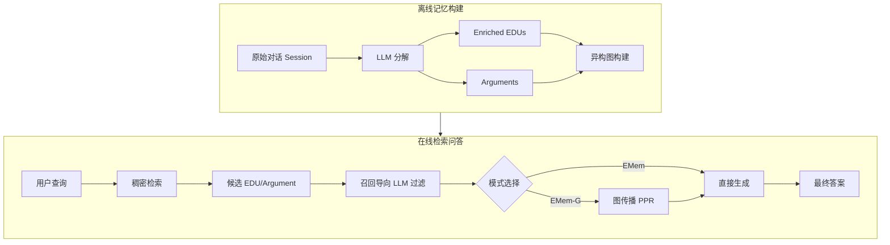

# 大语言模型代理长期对话记忆的简单而强效基线

## 一、论文基础元数据
- 原文标题：A Simple Yet Strong Baseline for Long-Term Conversational Memory of LLM Agents
- 中文译版：大语言模型代理长期对话记忆的简单而强效基线
- 发表渠道：预印本 (arXiv)
- 发表时间：2025 年
- 链接：https://arxiv.org/abs/2511.17208
- 作者及核心机构：Sizhe Zhou, Jiawei Han (机构待补充)
- 研究领域：人工智能 (一级) + 大语言模型代理/记忆机制 (二级)
- 关联数据集：LoCoMo (规模待补充/多语言/人工标注), LongMemEval (规模待补充/多语言/人工标注)

## 二、论文综合评价
### 2.1 量化评分（1-5 分，5 分为最优）

| 评价维度 | 评分 | 备注 |
| -------- | ---- | ---- |
| 📚 理论基础 | ⭐⭐⭐⭐ | 基于新戴维森事件语义学，理论扎实 |
| 🎯 问题核心性 | ⭐⭐⭐⭐⭐ | 直击长程对话记忆丢失与碎片化痛点 |
| 💡 方法创新性 | ⭐⭐⭐⭐ | 事件中心表示与召回导向过滤结合 |
| ⚙️ 技术壁垒 | ⭐⭐⭐⭐ | 架构简洁但逻辑严密，复现难度适中 |
| 🧪 实验严谨性 | ⭐⭐⭐⭐ | 多数据集验证，消融实验充分 |
| 🔧 落地可行性 | ⭐⭐⭐⭐⭐ | 轻量级设计，无需复杂图数据库依赖 |
| 🚀 应用前景 | ⭐⭐⭐⭐ | 适用于长程代理、多跳推理场景 |
| 📊 综合评分 | 4.3 | 简单有效的强基线，工程与理论平衡佳 |

### 2.2 定性综合评价（≤300 字）
> 核心概括：研究定位、核心价值、差异化优势、关键结论

本研究定位为 LLM 代理长期对话记忆的强效基线。核心价值在于提出“事件中心”记忆框架（EMem），拒绝有损压缩，保留事件完整性。差异化优势在于利用新戴维森语义将对话重构为 enriched EDUs，配合召回导向的 LLM 过滤机制，在无需复杂图传播（EMem 变体）下即可实现优异性能。关键结论表明，结构简单的事件级记忆配合推理时努力，优于传统摘要或知识图谱方法，尤其在多跳与时序推理任务上表现强劲，为后续研究确立了实用标准。

## 三、领域本体论映射
| 核心维度 | 具体内容 |
| -------- | -------- |
| 核心研究对象 | LLM 代理的长期对话记忆管理 |
| 核心技术路径 | 事件中心表示 + 稠密检索 + 召回导向过滤 |
| 数据/载体形态 | Enriched EDUs（基本话语单元）、异构图 |
| 核心功能目标 | 解决长程对话信息丢失，支持多跳与时序推理 |
| 验证核心指标 | 问答准确率 (Accuracy)、多跳推理得分 |

## 四、核心问题与解决方案
### 4.1 待解决的核心问题
1. **领域级根本问题**：LLM 代理在长程对话中因上下文限制导致的历史信息丢失。
2. **现有方法痛点**：传统方法依赖聚类、摘要等有损压缩，丢失细粒度细节；或推理负担前置导致写入缓慢。
3. **工程落地卡点**：记忆检索的准确性与上下文预算之间的平衡，多跳推理能力不足。

### 4.2 核心解决方案
- 理论框架：新戴维森事件语义（neo-Davidsonian event semantics）。
- 核心架构：离线记忆构建（EDU 提取 + 图构建）与在线检索问答（检索 + 过滤 + 生成）。
- 关键技术：Enriched EDU 提取、召回导向的 LLM 过滤、个性化 PageRank (EMem-G)。
- 创新机制：无损存储原则，依赖推理时努力管理相关性；双视图提取（原子 + 结构化摘要）。

### 4.3 核心优势（量化+定性）
1. 性能优势：在 LoCoMo 和 LongMemEval 上匹配或超越 HippoRAG 2 等强基线。
2. 效率优势：系统对检索数量不敏感，EMem 变体无需图传播，效率高。
3. 工程优势：上下文预算适中，记忆图谱稀疏且可解释，便于调试与部署。

## 五、方法与技术架构
### 5.1 核心架构设计
系统分为离线记忆构建与在线检索问答两阶段。离线阶段将对话分解为 EDU 并构建异构图；在线阶段根据需求选择 EMem（高效）或 EMem-G（强推理）模式，通过稠密检索与 LLM 过滤获取上下文。

### 5.2 关键技术实现细节
| 技术模块 | 实现路径 | 工程注意事项 |
| -------- | -------- | ------------ |
| EDU 提取 | 指令 LLM 生成自包含、标准化的事件单元 | 需处理长 Assistant 回复，采用原子 + 结构化块双视图 |
| 检索过滤 | 嵌入相似度检索 + LLM 相关性筛选 | 过滤策略偏向高召回，保留边界候选供后续去噪 |
| 图传播 | 个性化 PageRank 在异构图上传播分数 | 仅在 EMem-G 模式启用，增加推理耗时但提升多跳能力 |
| 依赖组件 | 嵌入模型、LLM 推理引擎、图算法库 | 需优化 LLM 调用成本，确保过滤阶段延迟可控 |

### 5.3 架构优缺点
- 优点：无损存储保留细节，检索策略鲁棒，双变体适应不同场景，可解释性强。
- 缺点：纯事件中心表示难以捕捉细粒度用户偏好与风格，图构建增加离线开销。

## 六、实验设计与结果分析
### 6.1 实验基础设置
| 维度 | 内容 |
| ---- | ---- |
| 数据集 | LoCoMo, LongMemEvalS |
| 基线方法 | HippoRAG 2, Mem0, Nemori, MemOS 等 |
| 实验环境 | 待补充 (通常为标准 GPU 集群) |
| 评价指标 | 问答准确率、多跳推理得分、上下文长度 |

### 6.2 核心实验结果
| 方法 | 核心指标 1 (LoCoMo) | 核心指标 2 (LongMemEval) | 工程指标（算力/耗时） |
| ---- | --------- | --------- | -------------------- |
| 基线 1 (HippoRAG 2) | 待补充 | 待补充 | 待补充 |
| 基线 2 (Mem0) | 待补充 | 待补充 | 待补充 |
| 本文方法 (EMem-G) | 匹配或超越基线 | 匹配或超越基线 | 上下文预算适中 |

### 6.3 消融实验/鲁棒性分析
| 实验变体 | 指标变化 | 核心结论 |
| -------- | -------- | -------- |
| 移除 LLM 过滤器 | 0.780 → 0.733 | 过滤器最关键，移除后多跳性能受损严重 |
| 移除图传播 (PPR) | 轻微下降 | 图传播仅在最难推理案例中提供额外增益 |
| 移除 QA CoT | 多 Session 问题下降 | 思维链对复杂问题推理影响较大 |

### 6.4 实验结论（工程视角）
系统对检索数量超参数不敏感（20-40 范围内稳定），便于部署。LLM 过滤器是性能瓶颈与核心增益点，需保证其在高召回下的稳定性。图传播可根据场景按需开启以平衡性能与成本。

## 七、领域贡献与创新点
| 贡献层级 | 具体内容 |
| -------- | -------- |
| 理论贡献 | 验证了事件中心记忆观优于传统摘要或三元组方法 |
| 方法/架构贡献 | 提出 EMem/EMem-G 框架，引入召回导向过滤机制 |
| 数据/工具贡献 | 开源代码库，提供可复现的强基线实现 |
| 实验/验证贡献 | 在多个长程记忆基准上确立了新性能标准 |
| 工程落地贡献 | 证明了轻量级事件记忆在实际部署中的可行性 |

## 八、局限性与风险
| 维度 | 具体描述 | 应对思路 |
| ---- | -------- | -------- |
| 学术局限性 | 纯事件表示难以捕捉用户个性化偏好与风格 | 未来结合用户画像及交互模式模型 |
| 工程落地风险 | LLM 过滤环节增加在线延迟与 Token 成本 | 优化过滤模型大小，或采用缓存机制 |
| 伦理/合规风险 | 长期记忆可能存储敏感用户隐私信息 | 实施数据加密与隐私删除机制 |

## 九、未来研究/落地方向
| 方向类型 | 具体内容 | 优先级 |
| -------- | -------- | ------ |
| 科研拓展 | 混合记忆模型（事件 + 用户画像） | 高 |
| 工程优化 | 降低 LLM 过滤延迟，优化图构建效率 | 高 |
| 跨领域适配 | 扩展至工具增强型代理与多文档推理场景 | 中 |

## 十、关键词与术语表
| 语言 | 关键词 |
| ---- | ------ |
| 中文 | 长期对话记忆，事件中心，基本话语单元，召回导向过滤 |
| 英文 | Long-Term Conversational Memory, Event-Centric, EDU, Recall-oriented Filtering |
| 领域专属术语 | Enriched EDU：包含文本、来源索引及时间戳的丰富化基本话语单元 |
| 领域专属术语 | Neo-Davidsonian Semantics：用于表示事件及其论元的语义学框架 |

## 十一、参考文献与关联资源
- 核心参考文献：待补充 (原文未列出具体引用列表)
- 补充阅读：关于新戴维森语义学的相关文献
- 开源代码/工具：https://github.com/KevinSRR/EMem

## 十二、阅读者批注
1. **科研启发**：拒绝有损压缩的记忆设计思路值得借鉴，推理时努力换取存储简洁性。
2. **工程落地思考**：召回导向过滤是双刃剑，需监控其带来的 Token 消耗与延迟增加。
3. **待验证/存疑点**：在超大规模对话历史（如数月）下的图传播效率未明确验证。
4. **个人/团队应用场景**：适用于客服代理、个人助理等需要长期上下文记忆的场景。

## 十三、阅读元信息
| 维度 | 内容 |
| ---- | ---- |
| 阅读日期 | 2026-04-09 10:48 |
| 阅读人 | xPaperReader AI |
| 文档编号 | arxiv-2511.17208 |
| 版本迭代 | v1.0 |