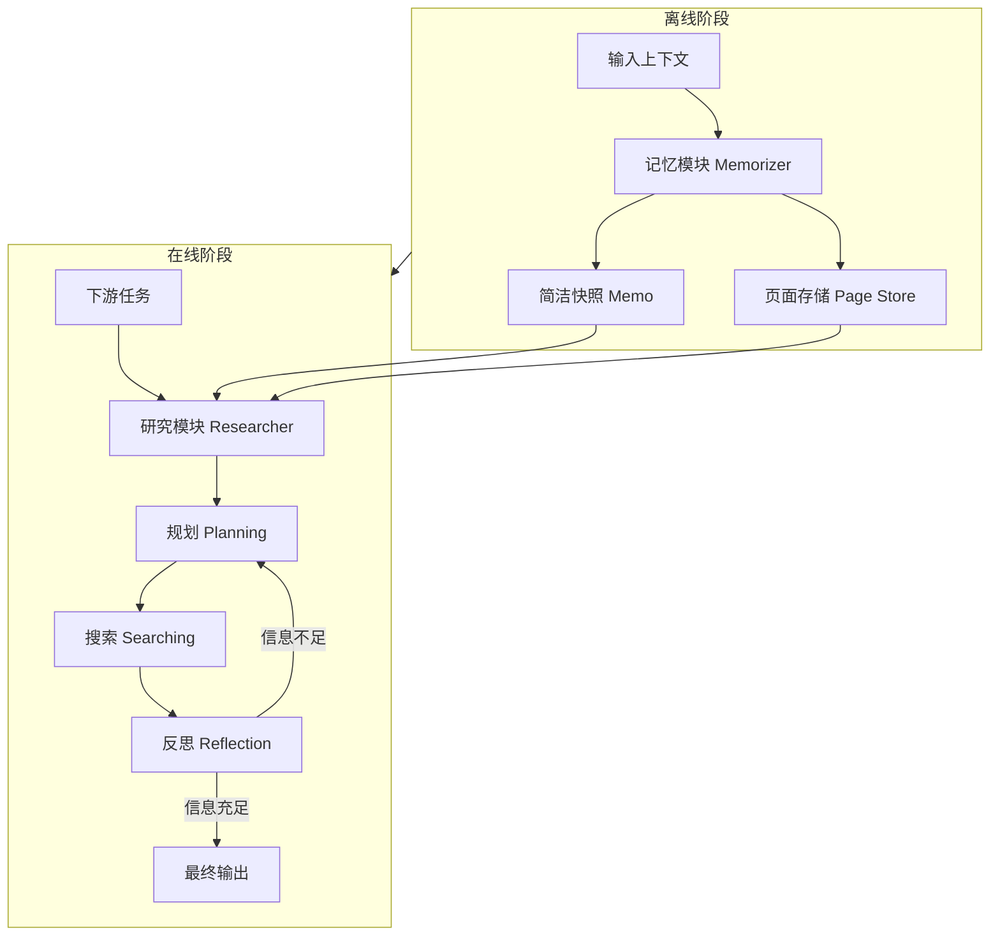

# 基于深度研究的通用智能体记忆

## 一、论文基础元数据
- 原文标题：General Agentic Memory Via Deep Research
- 中文译版：基于深度研究的通用智能体记忆
- 发表渠道：预印本（arXiv）
- 发表时间：2025 年
- 链接：arXiv:2511.18423
- 作者及核心机构：B.Y. Yan, Chaofan Li, Hongjin Qian, Shuqi Lu, Zheng Liu（机构待补充）
- 研究领域：人工智能（一级）+ 大语言模型智能体/记忆系统（二级）
- 关联数据集：LoCoMo（对话记忆）、HotpotQA（多跳问答）、RULER（长上下文理解）、NarrativeQA（长文问答）

## 二、论文综合评价
### 2.1 量化评分（1-5 分，5 分为最优）

| 评价维度 | 评分 | 备注 |
| -------- | ---- | ---- |
| 📚 理论基础 | ⭐⭐⭐⭐ | 引入即时编译理念，理论扎实 |
| 🎯 问题核心性 | ⭐⭐⭐⭐⭐ | 直击长上下文信息丢失痛点 |
| 💡 方法创新性 | ⭐⭐⭐⭐⭐ | 离线记忆加在线研究双架构 |
| ⚙️ 技术壁垒 | ⭐⭐⭐⭐ | 强化学习优化策略有一定门槛 |
| 🧪 实验严谨性 | ⭐⭐⭐⭐⭐ | 多数据集验证，消融实验充分 |
| 🔧 落地可行性 | ⭐⭐⭐ | 在线推理耗时略高，需优化 |
| 🚀 应用前景 | ⭐⭐⭐⭐⭐ | 智能体记忆需求广泛，前景好 |
| 📊 综合评分 | 4.4 | 架构创新显著，性能效率平衡佳 |

### 2.2 定性综合评价（≤300 字）
> 核心概括：研究定位、核心价值、差异化优势、关键结论

本研究定位为通用智能体记忆系统，核心价值在于解决了长上下文代理中的信息丢失与效率矛盾。差异化优势在于提出基于“即时编译”原则的 GAM 框架，采用离线轻量记忆与在线深度研究的双阶段架构。关键结论表明，研究模块对模型规模敏感（需 7B+），而记忆模块鲁棒性强。通过端到端强化学习优化，该系统在多种记忆依赖任务中显著优于现有基线，实现了质量与效率的有效平衡，为构建高效智能体记忆提供了新范式。

## 三、领域本体论映射
| 核心维度 | 具体内容 |
| -------- | -------- |
| 核心研究对象 | 长上下文场景下的智能体记忆系统 |
| 核心技术路径 | 离线记忆构建 + 在线即时深度研究 |
| 数据/载体形态 | 文本会话轨迹、页面存储、简洁快照 |
| 核心功能目标 | 最小化上下文大小同时最大化任务性能 |
| 验证核心指标 | F1 分数、Token 消耗、推理耗时 |

## 四、核心问题与解决方案
### 4.1 待解决的核心问题
1. **领域级根本问题**：长轨迹导致上下文溢出、成本过高及性能下降。
2. **现有方法痛点**：传统静态记忆系统存在严重信息丢失，预构建记忆局限性大。
3. **工程落地卡点**：上下文腐烂现象严重，多步检索与推理任务表现不佳。

### 4.2 核心解决方案
- 理论框架：基于即时编译 (JIT Compilation) 原则的优化问题。
- 核心架构：双组件设计（Memorizer 离线阶段 + Researcher 在线阶段）。
- 关键技术：增量记忆更新、页面存储、思维链规划、并行搜索、反思迭代。
- 创新机制：端到端强化学习优化记忆生成与上下文检索策略。

### 4.3 核心优势（量化 + 定性）
1. 性能优势：在多种记忆依赖任务中显著优于基线模型 (A-mem, Mem0 等)。
2. 效率优势：在线服务时间相对稳定，整体耗时性价比最优。
3. 工程优势：具备工作流灵活性，支持测试时计算扩展 (Test-Time Scaling)。

## 五、方法与技术架构
### 5.1 核心架构设计
> 文字描述 + 架构图（Mermaid/图片）

GAM 框架分为离线与在线两个阶段。离线阶段由 Memorizer 负责生成会话快照和页面存储；在线阶段由 Researcher 基于记忆进行规划、搜索和反思，动态构建优化上下文。

### 5.2 关键技术实现细节
| 技术模块 | 实现路径 | 工程注意事项 |
| -------- | -------- | ------------ |
| 记忆模块 | 生成会话快照，增量更新记忆 | 小模型即可胜任，节省资源 |
| 研究模块 | 思维链推理，并行搜索，迭代反思 | 需 7B 以上模型，保证推理能力 |
| 依赖组件 | 检索器 (BGE-M3), 骨干模型 (GPT-4o-mini/Qwen) | 注意检索工具组合效果最佳 |

### 5.3 架构优缺点
- 优点：平衡了信息保留与上下文长度，支持动态扩展，性能鲁棒。
- 缺点：在线推理耗时略高于轻量级记忆方法，研究模块依赖大模型。

## 六、实验设计与结果分析
### 6.1 实验基础设置
| 维度 | 内容 |
| ---- | ---- |
| 数据集 | LoCoMo, HotpotQA, RULER, NarrativeQA |
| 基线方法 | A-Mem, Mem0, MemoryOS, Long-LLM, RAG |
| 实验环境 | GPT-4o-mini, Qwen2.5-14B, 128K 上下文 |
| 评价指标 | F1 分数，Token 消耗，推理耗时 |

### 6.2 核心实验结果
| 方法 | 核心指标 1 | 核心指标 2 | 工程指标（算力/耗时） |
| ---- | --------- | --------- | -------------------- |
| 基线 1 (MemoryOS) | 较低 | 较低 | 耗时低 |
| 基线 2 (A-Mem) | 中等 | 中等 | 耗时高 |
| 本文方法 (GAM) | Avg F1 53.18 | 多跳追踪>90% | 在线 12-18s |

### 6.3 消融实验/鲁棒性分析
| 实验变体 | 指标变化 | 核心结论 |
| -------- | -------- | -------- |
| 无研究模块 | F1 降至 27.50 | 证明研究模块核心地位 |
| 无记忆模块 | F1 降至 48.27 | 记忆对有效探索至关重要 |
| 研究模块 0.5B | F1 降至 9.08 | 研究模块需大模型支持 |
| 集成仅结果 | F1 53.18 (106 Tokens) | 高效优选方案 |

### 6.4 实验结论（工程视角）
实验证明 GAM 有效解决了长上下文中的信息丢失与推理难题。部署时应优先保障研究模块模型容量（建议 7B+），记忆模块可使用小模型。若追求效率，推荐使用"Integration Only"输出格式。

## 七、领域贡献与创新点
| 贡献层级 | 具体内容 |
| -------- | -------- |
| 理论贡献 | 定义记忆系统为上下文大小与任务性能优化问题 |
| 方法/架构贡献 | 提出基于即时编译原则的 GAM 双阶段架构 |
| 数据/工具贡献 | 修正了 LocoMo 数据集基线类别标签映射错误 |
| 实验/验证贡献 | 验证了测试时扩展性及模块敏感性差异 |
| 工程落地贡献 | 提供了高效、通用的智能体记忆系统新范式 |

## 八、局限性与风险
| 维度 | 具体描述 | 应对思路 |
| ---- | -------- | -------- |
| 学术局限性 | 研究模块对模型规模敏感度高 | 探索更高效的小模型推理架构 |
| 工程落地风险 | 在线推理耗时（12-18s）略高 | 优化搜索并行度，缓存常用记忆 |
| 伦理/合规风险 | 长上下文可能包含隐私信息 | 增加隐私过滤机制，合规存储 |

## 九、未来研究/落地方向
| 方向类型 | 具体内容 | 优先级 |
| -------- | -------- | ------ |
| 科研拓展 | 研究模块的小模型化与蒸馏技术 | 高 |
| 工程优化 | 降低在线推理延迟，优化检索策略 | 高 |
| 跨领域适配 | 适配多模态记忆与跨任务通用记忆 | 中 |

## 十、关键词与术语表
| 语言 | 关键词 |
| ---- | ------ |
| 中文 | 智能体记忆，即时编译，深度研究，强化学习 |
| 英文 | Agentic Memory, JIT Compilation, Deep Research, RL |
| 领域专属术语 | 上下文腐烂 (Context Rot): 长上下文中信息效用下降现象 |

## 十一、参考文献与关联资源
- 核心参考文献：待补充（原文未提供具体列表）
- 补充阅读：关于长上下文模型、RAG 技术的相关研究
- 开源代码/工具：待补充（原文未提供链接）

## 十二、阅读者批注
1. **科研启发**：即时编译理念应用于记忆系统是一个非常有价值的切入点，值得借鉴到其他动态资源管理场景。
2. **工程落地思考**：模块解耦设计允许独立优化记忆和研究模块，便于根据成本约束调整模型大小。
3. **待验证/存疑点**：在不同语言环境下的泛化能力未详细说明，需进一步验证。
4. **个人/团队应用场景**：适用于需要长期记忆支持的客服助手、个人助理等智能体应用。

## 十三、阅读元信息
| 维度 | 内容 |
| ---- | ---- |
| 阅读日期 | 2026-04-09 11:01 |
| 阅读人 | xPaperReader AI |
| 文档编号 | arxiv-2511.18423 |
| 版本迭代 | v1.0 |