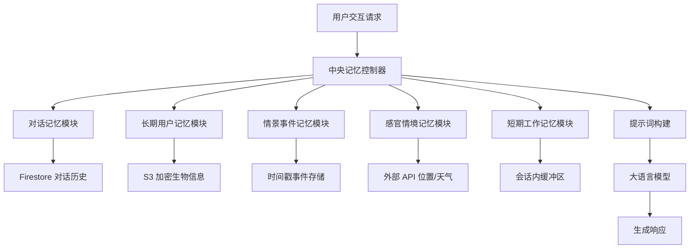

# 混合记忆增强生成：面向大语言模型应用的 MMAG 框架

## 一、论文基础元数据
- 原文标题：MMAG: Mixed Memory-Augmented Generation for Large Language Models Applications
- 中文译版：混合记忆增强生成：面向大语言模型应用的 MMAG 框架
- 发表渠道：预印本（arXiv）
- 发表时间：2025 年
- 链接：arXiv:2512.01710
- 作者及核心机构：Stefano Zeppieri（机构待补充）
- 研究领域：人工智能 + 大语言模型应用/智能体记忆管理
- 关联数据集：Heero 应用用户交互数据（规模待补充/私有数据/多语言/未明确标注）

## 二、论文综合评价
### 2.1 量化评分（1-5 分，5 分为最优）

| 评价维度 | 评分 | 备注 |
| -------- | ---- | ---- |
| 📚 理论基础 | ⭐⭐⭐⭐ | 借鉴认知心理学记忆分类，理论扎实 |
| 🎯 问题核心性 | ⭐⭐⭐⭐⭐ | 解决 LLM 跨会话连续性核心痛点 |
| 💡 方法创新性 | ⭐⭐⭐⭐ | 五层记忆架构设计具有结构化创新 |
| ⚙️ 技术壁垒 | ⭐⭐⭐ | 主要基于现有存储与检索技术集成 |
| 🧪 实验严谨性 | ⭐⭐⭐⭐ | 基于真实应用部署，指标多维度高 |
| 🔧 落地可行性 | ⭐⭐⭐⭐⭐ | 已在 Heero 应用验证，工程路径清晰 |
| 🚀 应用前景 | ⭐⭐⭐⭐⭐ | 适用于教育、助手等多类智能体场景 |
| 📊 综合评分 | 4.3 | 工程落地效果显著，架构设计具普适性 |

### 2.2 定性综合评价（≤300 字）
> 核心概括：研究定位、核心价值、差异化优势、关键结论

本研究定位为提升 LLM 智能体的长期交互能力，核心价值在于提出了结构化的五层记忆架构（MMAG），超越了传统的 RAG 或单纯上下文扩展。差异化优势在于将认知心理学记忆分类映射为具体技术组件，并解决了记忆协调与隐私问题。关键结论显示，该框架在真实语言学习应用（Heero）中显著提升了用户留存率（+20%）和对话时长（+30%），且未增加系统延迟，证明了记忆增强在工程落地中的可行性与商业价值。

## 三、领域本体论映射
| 核心维度 | 具体内容 |
| -------- | -------- |
| 核心研究对象 | 大语言模型应用中的记忆管理系统 |
| 核心技术路径 | 模块化记忆编排 + 多源存储检索 + 提示工程注入 |
| 数据/载体形态 | 文本对话、加密用户生物信息、事件时间戳、环境传感器数据 |
| 核心功能目标 | 实现跨会话连续性、个性化交互及情境感知能力 |
| 验证核心指标 | 用户留存率、平均对话时长、系统延迟、检索准确性 |

## 四、核心问题与解决方案
### 4.1 待解决的核心问题
1. **领域级根本问题**：LLM 缺乏跨会话的连续性与个性化，无法像人类一样利用多种记忆形式交互。
2. **现有方法痛点**：单提示词或短期窗口限制，缺乏情境感知，记忆管理混乱导致信息过载或丢失。
3. **工程落地卡点**：记忆检索延迟高、隐私安全风险、主动交互与侵入性之间的平衡难以把控。

### 4.2 核心解决方案
- 理论框架：受认知心理学启发的五层记忆分类体系（对话、长期、情景、感官、工作）。
- 核心架构：中央记忆控制器统一编排模块化记忆服务，分离存储与检索接口。
- 关键技术：异步记忆更新、基于 Token 的修剪机制、信封加密存储。
- 创新机制：冲突解决策略（近期性、用户中心加权、任务驱动）与动态记忆注入。

### 4.3 核心优势（量化+定性）
1. 性能优势：用户留存率提升 20%，平均对话时长增加 30%。
2. 效率优势：引入记忆层后未增加对话延迟（异步处理与缓存）。
3. 工程优势：模块化设计支持无缝集成新记忆类型，后端存储可切换。

## 五、方法与技术架构
### 5.1 核心架构设计
系统采用中央控制器协调五类记忆模块，数据持久化至不同存储后端，最终整合注入 LLM。

### 5.2 关键技术实现细节
| 技术模块 | 实现路径 | 工程注意事项 |
| -------- | -------- | ------------ |
| 记忆控制器 | 模块化编排，内置优先级与冲突解决策略 | 需平衡响应速度与记忆完整性 |
| 存储后端 | Firestore 追加只写，S3 加密存储 | 确保数据一致性与访问权限控制 |
| 工作记忆 | 基于 Token 修剪机制（阈值 90k） | 防止上下文溢出，模拟人类遗忘 |
| 隐私保护 | 信封加密，支持用户选择性遗忘 | 需符合合规要求，提供用户接口 |

### 5.3 架构优缺点
- 优点：高扩展性（易新增记忆类型），类人性强（贴合认知机制），低延迟（异步操作）。
- 缺点：系统复杂度增加，多模块协调逻辑维护成本高，隐私管理责任重。

## 六、实验设计与结果分析
### 6.1 实验基础设置
| 维度 | 内容 |
| ---- | ---- |
| 数据集 | Heero 语言学习应用用户交互数据 |
| 基线方法 | 无记忆增强模式（标准对话窗口） |
| 实验环境 | 生产环境部署（Firestore, S3, LLM API） |
| 评价指标 | 用户留存率、对话时长、延迟、准确性、舒适度 |

### 6.2 核心实验结果
| 方法 | 核心指标 1 | 核心指标 2 | 工程指标（算力/耗时） |
| ---- | --------- | --------- | -------------------- |
| 基线 1 | 留存率基准 | 对话时长基准 | 延迟基准 |
| 基线 2 | 待补充 | 待补充 | 待补充 |
| 本文方法 | 留存率 +20% | 对话时长 +30% | 延迟无增加 |

### 6.3 消融实验/鲁棒性分析
| 实验变体 | 指标变化 | 核心结论 |
| -------- | -------- | -------- |
| 轻量级修剪 + 丰富长期记忆 | 参与度提升，延迟可控 | 最佳平衡策略，维持教育效果 |
| 全量记忆无修剪 | 延迟增加，体验下降 | 需控制上下文长度以保性能 |

### 6.4 实验结论（工程视角）
MMAG 框架在实际生产环境中验证有效，通过异步处理和缓存策略成功解决了记忆模块常见的延迟问题。用户中心指标（留存、时长）的显著提升证明了记忆增强对用户体验的正向影响，且未牺牲系统性能。

## 七、领域贡献与创新点
| 贡献层级 | 具体内容 |
| -------- | -------- |
| 理论贡献 | 提出基于认知心理学的五层 LLM 记忆分类法 |
| 方法/架构贡献 | 设计中央控制器协调多源记忆的模块化架构 |
| 数据/工具贡献 | 验证了加密存储与选择性遗忘的工程实现路径 |
| 实验/验证贡献 | 提供了真实应用（Heero）中的长期用户行为数据验证 |
| 工程落地贡献 | 证明了记忆增强可在不增加延迟前提下提升商业指标 |

## 八、局限性与风险
| 维度 | 具体描述 | 应对思路 |
| ---- | -------- | -------- |
| 学术局限性 | 实验主要集中在教育场景，泛化性需进一步验证 | 拓展至医疗、客服等其他领域测试 |
| 工程落地风险 | 系统复杂度增加，多模块协调维护成本高 | 标准化接口，自动化监控记忆泄露 |
| 伦理/合规风险 | 隐私泄露风险，主动交互可能被视为侵入 | 强化加密，赋予用户完全数据控制权 |

## 九、未来研究/落地方向
| 方向类型 | 具体内容 | 优先级 |
| -------- | -------- | ------ |
| 科研拓展 | 多模态记忆整合（视觉、听觉传感器数据） | 高 |
| 工程优化 | 利用大上下文窗口管理更多记录而不牺牲延迟 | 中 |
| 跨领域适配 | 动态记忆嵌入，捕捉用户目标与进展 | 高 |

## 十、关键词与术语表
| 语言 | 关键词 |
| ---- | ------ |
| 中文 | 混合记忆增强生成、中央记忆控制器、选择性遗忘、信封加密 |
| 英文 | MMAG, Memory-Augmented Generation, Central Memory Controller, Selective Forgetting |
| 领域专属术语 | 工作记忆（会话内缓冲区）、情景记忆（时空定位事件）、生物记忆（加密用户特征） |

## 十一、参考文献与关联资源
- 核心参考文献：待补充（原文未提供具体列表）
- 补充阅读：认知心理学记忆分类相关文献
- 开源代码/工具：待补充（未提供公开仓库链接）

## 十二、阅读者批注
1. **科研启发**：将心理学记忆模型映射为技术组件是一个非常好的跨学科创新点，值得在其他智能体设计中借鉴。
2. **工程落地思考**：异步处理记忆更新是解决延迟的关键，生产环境中必须考虑存储成本与检索速度的权衡。
3. **待验证/存疑点**：具体基线方法的细节未明确，留存率提升是否完全归因于记忆模块需排除其他干扰因素。
4. **个人/团队应用场景**：可应用于客服机器人长期用户偏好管理，或个性化教育助手的状态追踪。

## 十三、阅读元信息
| 维度 | 内容 |
| ---- | ---- |
| 阅读日期 | 2026-04-09 11:16 |
| 阅读人 | xPaperReader AI |
| 文档编号 | arxiv-2512.01710 |
| 版本迭代 | v1.0 |