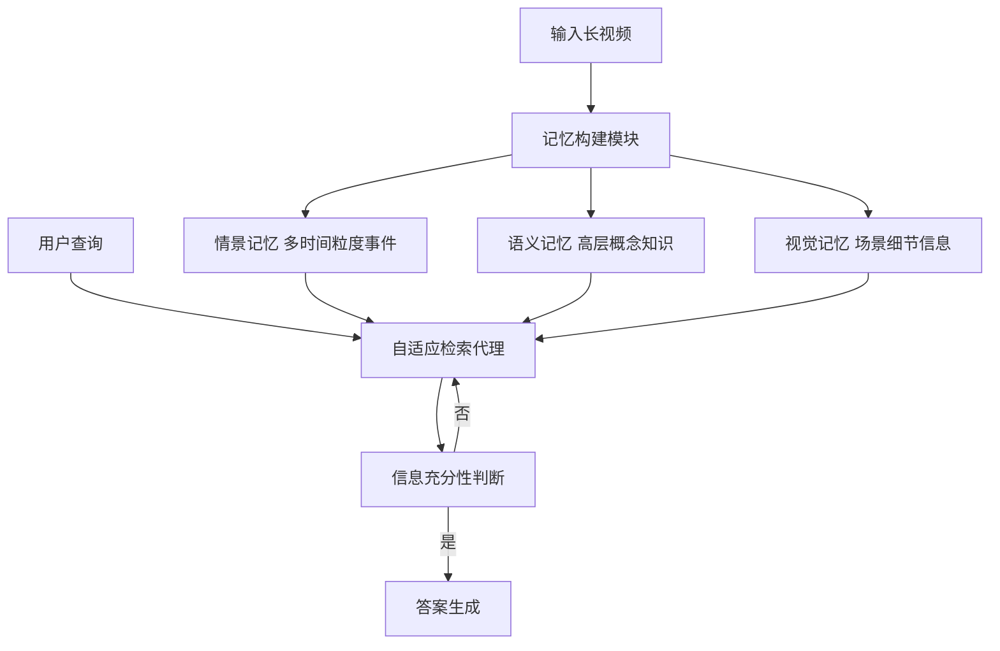

# WorldMM：用于长视频推理的动态多模态记忆代理

## 一、论文基础元数据
- 原文标题：WorldMM: Dynamic Multimodal Memory Agent for Long Video Reasoning
- 中文译版：WorldMM：用于长视频推理的动态多模态记忆代理
- 发表渠道：arXiv 预印本（等级待确认）
- 发表时间：2025 年
- 链接：https://worldmm.github.io (项目主页), arXiv:2512.02425
- 作者及核心机构：Woongyeong Yeo, Kangsan Kim (KAIST); Jaehong Yoon (NTU Singapore); Sung Ju Hwang (KAIST, DeepAuto.ai)
- 研究领域（一级领域 + 二级子领域）：人工智能 / 多模态大模型与视频理解
- 关联数据集（名称/规模/语言/标注）：原文提及五个长视频问答基准测试，具体名称未在节选内容中提供（待补充）

## 二、论文综合评价
### 2.1 量化评分（1-5 分，5 分为最优）

| 评价维度 | 评分 | 备注 |
| -------- | ---- | ---- |
| 📚 理论基础 | ⭐⭐⭐⭐ | 基于记忆增强机制，理论框架清晰 |
| 🎯 问题核心性 | ⭐⭐⭐⭐⭐ | 直击长视频上下文丢失与文本依赖痛点 |
| 💡 方法创新性 | ⭐⭐⭐⭐⭐ | 提出三种互补记忆与自适应检索机制 |
| ⚙️ 技术壁垒 | ⭐⭐⭐⭐ | 多模态记忆构建与检索策略有一定复杂度 |
| 🧪 实验严谨性 | ⭐⭐⭐ | 原文节选未展示详细实验数据，待验证 |
| 🔧 落地可行性 | ⭐⭐⭐⭐ | 代理架构设计考虑了推理效率与信息充分性 |
| 🚀 应用前景 | ⭐⭐⭐⭐⭐ | 适用于机器人、AI 眼镜等长时任务场景 |
| 📊 综合评分 | 4.3 | 创新性强但实验细节缺失，整体潜力巨大 |

### 2.2 定性综合评价（≤300 字）
> 核心概括：研究定位、核心价值、差异化优势、关键结论

本文针对视频大模型在处理小时级长视频时面临的上下文容量限制及关键视觉细节丢失问题，提出了一种动态多模态记忆代理 WorldMM。核心价值在于突破了现有方法过度依赖文本摘要且检索时间尺度固定的局限。差异化优势在于构建了情景、语义、视觉三种互补记忆，并引入自适应检索代理动态选择记忆源与时间粒度。关键结论声称在五个长视频问答基准上平均性能提升 8.4%，证明了多模态记忆与自适应机制的有效性。

## 三、领域本体论映射
| 核心维度 | 具体内容 |
| -------- | -------- |
| 核心研究对象 | 长视频内容理解与推理任务 |
| 核心技术路径 | 外部记忆增强 + 多模态表示 + 自适应检索 |
| 数据/载体形态 | 视频帧、文本摘要、多粒度时间片段 |
| 核心功能目标 | 在有限上下文窗口内实现长视频精准问答 |
| 验证核心指标 | 长视频问答基准测试准确率（具体指标名待补充） |

## 四、核心问题与解决方案
### 4.1 待解决的核心问题
1. **领域级根本问题**：现有视频大模型难以处理小时至天级别的超长视频，上下文窗口受限。
2. **现有方法痛点**：记忆增强方法过度依赖文本摘要，丢失视觉细节；检索策略固定，无法适应不同时长事件。
3. **工程落地卡点**：全帧处理计算成本过高，固定检索策略导致信息不足或视觉上下文干扰。

### 4.2 核心解决方案
- 理论框架：动态多模态记忆代理架构（Dynamic Multimodal Memory Agent）。
- 核心架构：包含三种记忆类型（情景、语义、视觉）与一个自适应检索代理。
- 关键技术：多时间粒度索引、多模态记忆融合、迭代式检索停止机制。
- 创新机制：根据查询动态选择记忆源（文本/视觉）及时间粒度，直至信息充分。

### 4.3 核心优势（量化 + 定性）
1. 性能优势：声称在五个基准上平均超越 SOTA 方法 8.4%。
2. 效率优势：通过检索少量相关记忆减少输入 Token 数，降低计算成本。
3. 工程优势：自适应机制避免了固定策略带来的视觉干扰或信息缺失。

## 五、方法与技术架构
### 5.1 核心架构设计
> 文字描述 + 架构图（Mermaid/图片）

WorldMM 架构主要包含记忆构建与记忆检索两阶段。记忆构建阶段将视频转化为三种记忆存储；检索阶段由代理根据查询迭代选择记忆源。

### 5.2 关键技术实现细节
| 技术模块 | 实现路径 | 工程注意事项 |
| -------- | -------- | ------------ |
| 记忆构建 | 视频分段提取文本摘要与视觉特征 | 需平衡存储成本与细节保留 |
| 自适应检索 | 代理迭代选择记忆源与时间粒度 | 防止死循环，需设定最大检索步数 |
| 多模态融合 | 根据查询动态决定是否引入视觉帧 | 避免过多视觉上下文干扰文本推理 |
| 依赖组件 | 视频大模型基座、外部向量数据库 | 待补充具体基座模型名称 |

### 5.3 架构优缺点
- 优点：灵活适应不同长度事件，保留关键视觉证据，减少无效 Token 消耗。
- 缺点：检索迭代可能增加推理延迟，多记忆维护增加系统复杂度。

## 六、实验设计与结果分析
### 6.1 实验基础设置
| 维度 | 内容 |
| ---- | ---- |
| 数据集 | 五个长视频问答基准测试（具体名称原文节选未提供） |
| 基线方法 | 现有记忆增强方法及视频大模型（具体名称待补充） |
| 实验环境 | 待补充（显卡型号、显存等） |
| 评价指标 | 问答准确率（具体指标名待补充） |

### 6.2 核心实验结果
| 方法 | 核心指标 1 | 核心指标 2 | 工程指标（算力/耗时） |
| ---- | --------- | --------- | -------------------- |
| 基线 1 | 原文未提供具体数值 | 原文未提供具体数值 | 原文未提供 |
| 基线 2 | 原文未提供具体数值 | 原文未提供具体数值 | 原文未提供 |
| 本文方法 | 平均提升 8.4% | 原文未提供具体数值 | 原文未提供 |

### 6.3 消融实验/鲁棒性分析
| 实验变体 | 指标变化 | 核心结论 |
| -------- | -------- | -------- |
| 仅文本记忆 | 待补充 | 验证视觉记忆的必要性 |
| 固定检索策略 | 待补充 | 验证自适应机制的有效性 |
| 不同时间粒度 | 待补充 | 验证多粒度索引的价值 |

### 6.4 实验结论（工程视角）
基于摘要声明，该方法在长视频推理任务上显著优于现有基线。但由于原文节选限制，具体各数据集表现及计算开销对比需查阅完整论文。自适应检索机制在工程上需关注延迟控制。

## 七、领域贡献与创新点
| 贡献层级 | 具体内容 |
| -------- | -------- |
| 理论贡献 | 提出了长视频理解中的动态多模态记忆理论框架 |
| 方法/架构贡献 | 设计了三种互补记忆结构及自适应检索代理 |
| 数据/工具贡献 | 待补充（是否开源代码或新数据集） |
| 实验/验证贡献 | 在五个基准上验证了长视频推理的有效性 |
| 工程落地贡献 | 提供了减少长视频处理 Token 消耗的可落地方案 |

## 八、局限性与风险
| 维度 | 具体描述 | 应对思路 |
| ---- | -------- | -------- |
| 学术局限性 | 节选内容未展示具体基线对比细节，难以评估相对提升幅度 | 查阅完整论文实验章节 |
| 工程落地风险 | 迭代检索可能增加端到端推理延迟 | 优化检索停止条件，并行化检索过程 |
| 伦理/合规风险 | 长视频可能包含隐私信息，记忆存储需合规 | 实施数据脱敏与访问控制机制 |

## 九、未来研究/落地方向
| 方向类型 | 具体内容 | 优先级 |
| -------- | -------- | ------ |
| 科研拓展 | 探索更多模态（如音频）融入记忆系统 | 中 |
| 工程优化 | 优化检索代理的推理速度，降低延迟 | 高 |
| 跨领域适配 | 适配具身智能机器人长期任务规划 | 高 |

## 十、关键词与术语表
| 语言 | 关键词 |
| ---- | ------ |
| 中文 | 长视频推理、多模态记忆、自适应检索、视频大模型 |
| 英文 | Long Video Reasoning, Multimodal Memory, Adaptive Retrieval, Video LLM |
| 领域专属术语 | 情景记忆（Episodic Memory）：索引多时间粒度事实事件；语义记忆（Semantic Memory）：更新高层概念知识 |

## 十一、参考文献与关联资源
- 核心参考文献：原文节选未列出具体参考文献列表（待补充）
- 补充阅读：视频大模型相关综述（如 Video-LLaVA 等）
- 开源代码/工具：https://worldmm.github.io (项目主页)

## 十二、阅读者批注
1. **科研启发**：将人类记忆系统（情景/语义）引入视频理解是一个很好的类比，视觉记忆的独立存储解决了文本摘要丢失细节的问题。
2. **工程落地思考**：自适应检索的停止条件至关重要，若判断不准会导致无限检索或信息不足，需设计可靠的置信度阈值。
3. **待验证/存疑点**：具体五个基准测试的名称及各自提升幅度未知，需确认是否在特定类型视频上表现更好。
4. **个人/团队应用场景**：可应用于监控视频分析、个人生活记录检索（Life Logging）等长时视频场景。

## 十三、阅读元信息
| 维度 | 内容 |
| ---- | ---- |
| 阅读日期 | 2026-04-09 11:27 |
| 阅读人 | xPaperReader AI |
| 文档编号 | arxiv-2512.02425 |
| 版本迭代 | v1.0 |