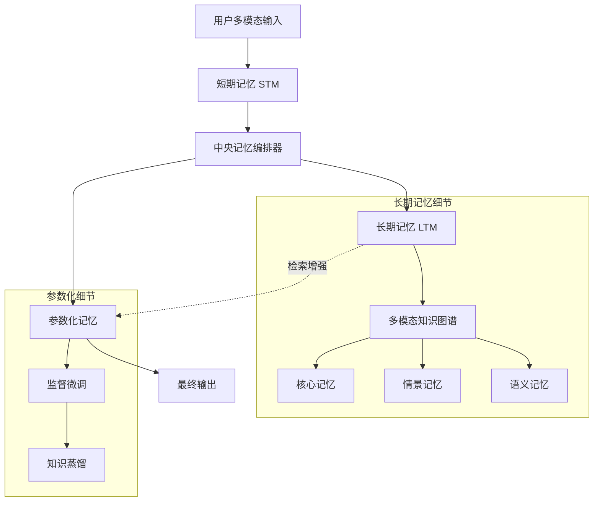

# MemVerse：面向终身学习代理的多模态记忆

## 一、论文基础元数据
- 原文标题：MemVerse: Multimodal Memory for Lifelong Learning Agents
- 中文译版：MemVerse：面向终身学习代理的多模态记忆
- 发表渠道：预印本（arXiv）
- 发表时间：2025 年
- 链接：arXiv:2512.03627
- 作者及核心机构：Junming Liu, Yifei Sun 等（具体机构待补充）
- 研究领域：人工智能（多模态学习 + 终身学习）
- 关联数据集：ScienceQA（多模态推理）、LoCoMo（长程对话）、MSR-VTT（视频检索）

## 二、论文综合评价
### 2.1 量化评分（1-5 分，5 分为最优）

| 评价维度 | 评分 | 备注 |
| -------- | ---- | ---- |
| 📚 理论基础 | ⭐⭐⭐⭐ | 结合认知科学与记忆机制，理论扎实 |
| 🎯 问题核心性 | ⭐⭐⭐⭐⭐ | 直击代理遗忘与长程推理痛点 |
| 💡 方法创新性 | ⭐⭐⭐⭐⭐ | 双轨记忆与图谱结构化创新显著 |
| ⚙️ 技术壁垒 | ⭐⭐⭐⭐ | 多模块协同与蒸馏机制实现复杂 |
| 🧪 实验严谨性 | ⭐⭐⭐ | 数据集丰富，但具体数值细节待补充 |
| 🔧 落地可行性 | ⭐⭐⭐⭐ | 即插即用设计，工程适配性较强 |
| 🚀 应用前景 | ⭐⭐⭐⭐⭐ | 终身学习代理核心组件，潜力巨大 |
| 📊 综合评分 | 4.3 | 架构设计卓越，实证细节需进一步完善 |

### 2.2 定性综合评价（≤300 字）
> 核心概括：研究定位、核心价值、差异化优势、关键结论

MemVerse 定位为模型无关的即插即用多模态记忆框架，旨在解决 AI 代理在终身学习中的灾难性遗忘与长程推理难题。其核心价值在于融合了快速参数化回忆与分层检索记忆，通过多模态知识图谱结构化长期记忆，并利用蒸馏机制将知识内化。差异化优势在于“图谱结构化 + 参数内化”的双轨机制，平衡了可解释性与推理速度。关键结论表明，可扩展的记忆机制比单纯增大模型规模对持续学习更为关键，显著提升了多模态推理准确性与长程连贯性。

## 三、领域本体论映射
| 核心维度 | 具体内容 |
| -------- | -------- |
| 核心研究对象 | 终身学习 AI 代理的多模态记忆系统 |
| 核心技术路径 | 分层检索记忆 + 参数化记忆蒸馏 |
| 数据/载体形态 | 多模态知识图谱（文本、图像、视频嵌入） |
| 核心功能目标 | 消除灾难性遗忘，支持长程多跳推理 |
| 验证核心指标 | 推理准确性、稳定性、长程连贯性 |

## 四、核心问题与解决方案
### 4.1 待解决的核心问题
1. **领域级根本问题**：AI 代理缺乏可靠记忆，无法适应复杂动态任务，存在灾难性遗忘。
2. **现有方法痛点**：参数化记忆更新成本高，非参数化记忆检索慢且缺乏结构化推理能力。
3. **工程落地卡点**：多模态长上下文处理困难，记忆无限增长导致效率下降。

### 4.2 核心解决方案
- 理论框架：模仿人类“直觉”与“深思”互补的双路径记忆模型。
- 核心架构：三层记忆系统（短期记忆 STM、长期记忆 LTM、参数化记忆）。
- 关键技术：多模态知识图谱构建、动态记忆扩展与知识蒸馏。
- 创新机制：检索增强与参数内化同步进化，无需全量重训练。

### 4.3 核心优势（量化 + 定性）
1. 性能优势：显著提升多模态推理准确性与长程对话连贯性（具体数值待补充）。
2. 效率优势：滑动窗口缓存避免频繁更新长期存储，检索速度快。
3. 工程优势：模型无关、即插即用，支持跨扩展交互。

## 五、方法与技术架构
### 5.1 核心架构设计
MemVerse 通过中央记忆编排器管理三个核心组件：短期记忆捕获近期上下文，长期记忆以知识图谱存储结构化经验，参数化记忆通过蒸馏内化知识。

### 5.2 关键技术实现细节
| 技术模块 | 实现路径 | 工程注意事项 |
| -------- | -------- | ------------ |
| 短期记忆 (STM) | 滑动窗口缓存最近 K 个查询 | 需合理设置窗口大小 K 以平衡上下文与成本 |
| 长期记忆 (LTM) | 分层多模态知识图谱 (MMKG) | 实体关系提取需保证准确性，支持多跳推理 |
| 参数化记忆 | 轻量级神经网络 (Qwen2.5-7B 微调) | 定期使用检索对进行 SFT，避免灾难性遗忘 |
| 依赖组件 | 预训练 MLLM (图像/音频编码) | 模态对齐质量直接影响图谱构建效果 |

### 5.3 架构优缺点
- 优点：支持可解释性推理，记忆可追溯，推理速度快，避免记忆无限膨胀。
- 缺点：图谱构建与维护成本较高，蒸馏过程需定期触发，增加系统复杂度。

## 六、实验设计与结果分析
### 6.1 实验基础设置
| 维度 | 内容 |
| ---- | ---- |
| 数据集 | ScienceQA, LoCoMo, MSR-VTT |
| 基线方法 | GPT, Qwen, BLIP-2, CLIP 系列，VaLiK |
| 实验环境 | 单卡 A100，Qwen2.5-7B 骨干 |
| 评价指标 | 推理准确性、稳定性、长程连贯性 |

### 6.2 核心实验结果
| 方法 | 核心指标 1 | 核心指标 2 | 工程指标（算力/耗时） |
| ---- | --------- | --------- | -------------------- |
| 基线 1 (Qwen) | 待补充 | 待补充 | 待补充 |
| 基线 2 (VaLiK) | 待补充 | 待补充 | 待补充 |
| 本文方法 | 显著优于基线 | 显著优于基线 | 单卡 A100 训练 |

*注：原文摘要未提供具体数值表格，此处基于定性描述填写。*

### 6.3 消融实验/鲁棒性分析
| 实验变体 | 指标变化 | 核心结论 |
| -------- | -------- | -------- |
| 不同更新间隔 | 影响稳定性与保留能力 | 需平衡更新频率与记忆稳定性 |
| 主模型缩放 | 记忆效率与准确率演变 | 记忆机制比模型规模更关键 |

### 6.4 实验结论（工程视角）
在单卡 A100 环境下验证了可行性，证明轻量级微调配合外部记忆可有效提升性能，无需大规模算力堆叠。

## 七、领域贡献与创新点
| 贡献层级 | 具体内容 |
| -------- | -------- |
| 理论贡献 | 提出终身多模态智能的双轨记忆理论框架 |
| 方法/架构贡献 | 设计三层记忆系统与多模态知识图谱构建方法 |
| 数据/工具贡献 | 整合多模态基准用于记忆系统评估 |
| 实验/验证贡献 | 验证了记忆机制相对于模型规模的重要性 |
| 工程落地贡献 | 提供模型无关、即插即用的记忆框架实现 |

## 八、局限性与风险
| 维度 | 具体描述 | 应对思路 |
| ---- | -------- | -------- |
| 学术局限性 | 具体实验数值细节在摘要中未完全展示 | 需查阅全文获取详细数据表格 |
| 工程落地风险 | 知识图谱构建与维护成本较高 | 优化实体提取算法，引入自动化维护 |
| 伦理/合规风险 | 长期记忆可能存储敏感用户数据 | 增加数据加密与隐私删除机制 |

## 九、未来研究/落地方向
| 方向类型 | 具体内容 | 优先级 |
| -------- | -------- | ------ |
| 科研拓展 | 探索更自适应的记忆控制策略 | 高 |
| 工程优化 | 优化图谱构建效率与检索速度 | 高 |
| 跨领域适配 | 在开放世界环境中部署验证 | 中 |

## 十、关键词与术语表
| 语言 | 关键词 |
| ---- | ------ |
| 中文 | 终身学习，多模态记忆，知识图谱，参数化记忆，灾难性遗忘 |
| 英文 | Lifelong Learning, Multimodal Memory, Knowledge Graph, Parametric Memory, Catastrophic Forgetting |
| 领域专属术语 | （MMKG：多模态知识图谱，存储结构化长期记忆） |

## 十一、参考文献与关联资源
- 核心参考文献：待补充（需查阅全文参考文献列表）
- 补充阅读：关于 RAG、知识图谱构建、持续学习的相关研究
- 开源代码/工具：待补充（关注作者后续代码开源情况）

## 十二、阅读者批注
1. **科研启发**：记忆机制的结构化设计比单纯增加模型参数更能解决长程依赖问题。
2. **工程落地思考**：即插即用特性使其易于集成到现有 Agent 框架，但需评估图谱维护的延迟。
3. **待验证/存疑点**：具体性能提升百分比未明确，需验证在不同规模模型下的泛化性。
4. **个人/团队应用场景**：适用于需要长期用户画像保持的智能客服或个人助理系统。

## 十三、阅读元信息
| 维度 | 内容 |
| ---- | ---- |
| 阅读日期 | 2026-04-09 11:41 |
| 阅读人 | xPaperReader AI |
| 文档编号 | arxiv-2512.03627 |
| 版本迭代 | v1.0 |