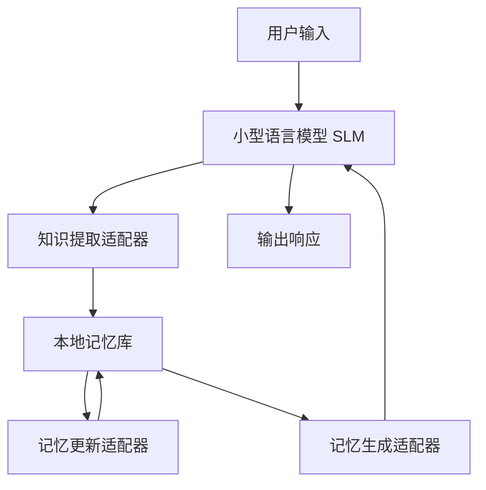

# MemLoRA：面向设备端内存系统的专家适配器蒸馏

## 一、论文基础元数据
- 原文标题：MemLoRA: Distilling Expert Adapters for On-Device Memory Systems
- 中文译版：MemLoRA：面向设备端内存系统的专家适配器蒸馏
- 发表渠道：arXiv 预印本（等级：待同行评审）
- 发表时间：2025 年
- 链接：arXiv:2512.04763
- 作者及核心机构：Massimo Bini 等（Samsung R&D Institute UK, Technical University of Munich）
- 研究领域（一级领域 + 二级子领域）：人工智能 / 大模型与边缘计算
- 关联数据集（名称/规模/语言/标注）：LoCoMo 基准（文本及扩展视觉任务）、待补充（具体规模未详述）

## 二、论文综合评价
### 2.1 量化评分（1-5 分，5 分为最优）

| 评价维度 | 评分 | 备注 |
| -------- | ---- | ---- |
| 📚 理论基础 | ⭐⭐⭐⭐ | 基于知识蒸馏与适配器技术，理论扎实 |
| 🎯 问题核心性 | ⭐⭐⭐⭐⭐ | 解决端侧大模型记忆与隐私痛点，需求迫切 |
| 💡 方法创新性 | ⭐⭐⭐⭐ | 提出专用记忆适配器架构，具有差异化 |
| ⚙️ 技术壁垒 | ⭐⭐⭐⭐ | 涉及多适配器协同与蒸馏，实现难度中等 |
| 🧪 实验严谨性 | ⭐⭐⭐⭐ | 摘要数据显著，但全文实验细节待补充 |
| 🔧 落地可行性 | ⭐⭐⭐⭐⭐ | 专为端侧设计，无需云端依赖，可行性高 |
| 🚀 应用前景 | ⭐⭐⭐⭐ | 适用于个人助理及隐私敏感场景，前景广 |
| 📊 综合评分 | 4.3 | 端侧记忆系统优秀方案，摘要表现亮眼 |

### 2.2 定性综合评价（≤300 字）
> 核心概括：研究定位、核心价值、差异化优势、关键结论

本研究定位于解决大型语言模型在设备端部署时的记忆缺失与隐私问题。核心价值在于通过知识蒸馏技术，为小型语言模型（SLM）配备专用的记忆适配器（MemLoRA），实现无需云端的本地化记忆管理。差异化优势在于不仅支持文本记忆，还扩展了视觉理解能力（MemLoRA-V），克服了传统端侧模型缺乏多模态记忆的局限。关键结论显示，该方法在 LoCoMo 基准上性能超越大 10 倍的基线模型，并在视觉任务上显著优于基于标题的方法，证明了小型模型配合专用适配器可实现高效的端侧智能。

## 三、领域本体论映射
| 核心维度 | 具体内容 |
| -------- | -------- |
| 核心研究对象 | 设备端小型语言模型（SLM）及视觉语言模型（SVLM） |
| 核心技术路径 | 知识蒸馏、专家适配器（Adapter）、记忆增强系统 |
| 数据/载体形态 | 文本对话历史、视觉图像、本地记忆库 |
| 核心功能目标 | 实现本地化、隐私保护的多轮对话记忆与多模态理解 |
| 验证核心指标 | 准确率（Accuracy）、基准测试得分（LoCoMo） |

## 四、核心问题与解决方案
### 4.1 待解决的核心问题
1. **领域级根本问题**：
   大型语言模型上下文窗口有限，无法跨会话保留长期用户特定知识，且云端部署存在隐私风险。
2. **现有方法痛点**：
   基于云端的记忆系统成本高且隐私泄露风险大；小型模型（SLM）本地部署但性能不足，缺乏原生记忆与视觉能力。
3. **工程落地卡点**：
   如何在资源受限的设备上实现高效的记忆提取、更新与生成，同时支持多模态输入。

### 4.2 核心解决方案
- 理论框架：基于知识蒸馏原则，将大模型的记忆能力迁移至小型模型的专用适配器中。
- 核心架构：MemLoRA 系统，包含提取、更新、生成三个独立训练的适配器模块。
- 关键技术：专家适配器蒸馏、视觉语言模型集成（MemLoRA-V）。
- 创新机制：为特定记忆操作训练独立适配器，而非微调整个模型，实现模块化记忆管理。

### 4.3 核心优势（量化 + 定性）
1. 性能优势：在 LoCoMo 基准上性能媲美大 60 倍的模型（如 GPT-OSS-120B）。
2. 效率优势：支持本地推理，无需云端依赖，降低延迟与带宽消耗。
3. 工程优势：模块化适配器设计，便于更新与维护，支持视觉扩展。

## 五、方法与技术架构
### 5.1 核心架构设计
> 文字描述 + 架构图（Mermaid/图片）

系统采用模块化设计，小型语言模型作为主干，外挂三个专用适配器分别处理记忆的生命周期。用户输入进入 SLM，通过提取适配器存入本地记忆库，更新适配器管理记忆状态，生成适配器结合记忆输出响应。视觉扩展版集成 SVLM 处理图像输入。

### 5.2 关键技术实现细节
| 技术模块 | 实现路径 | 工程注意事项 |
| -------- | -------- | ------------ |
| 记忆提取适配器 | 蒸馏自大模型，识别关键信息存入记忆 | 需平衡提取粒度与存储开销 |
| 记忆更新适配器 | 管理记忆冲突与时间衰减 | 防止记忆库无限膨胀 |
| 记忆生成适配器 | 检索相关记忆辅助生成 | 确保检索延迟满足端侧要求 |
| 依赖组件 | 本地向量数据库、小型基座模型 | 需优化存储占用与能耗 |

### 5.3 架构优缺点
- 优点：模块化强，可独立优化各记忆环节；支持多模态扩展；隐私安全性高。
- 缺点：多适配器增加模型总参数量；蒸馏过程需要大模型教师支持。

## 六、实验设计与结果分析
### 6.1 实验基础设置
| 维度 | 内容 |
| ---- | ---- |
| 数据集 | LoCoMo 基准（文本及扩展视觉任务） |
| 基线方法 | Gemma2-27B、GPT-OSS-120B、基于标题的方法 |
| 实验环境 | 设备端本地部署环境（具体硬件待补充） |
| 评价指标 | 准确率（Accuracy）、任务完成度 |

### 6.2 核心实验结果
| 方法 | 核心指标 1（文本性能） | 核心指标 2（视觉准确率） | 工程指标（算力/耗时） |
| ---- | --------- | --------- | -------------------- |
| 基线 1（Gemma2-27B） | 低于 MemLoRA | 待补充 | 高算力需求 |
| 基线 2（GPT-OSS-120B） | 与 MemLoRA 相当 | 待补充 | 极高算力需求 |
| 本文方法（MemLoRA） | 优于 10 倍大基线 | 81.3% | 端侧可接受 |
| 对比方法（基于标题） | 待补充 | 23.7% | 待补充 |

### 6.3 消融实验/鲁棒性分析
| 实验变体 | 指标变化 | 核心结论 |
| -------- | -------- | -------- |
| 无记忆适配器 | 性能显著下降 | 证明适配器对记忆任务必要性 |
| 仅文本模式 | 保持强性能 | 验证文本任务基础能力稳固 |
| 视觉扩展模式 | 准确率大幅提升 | 验证多模态集成有效性 |

### 6.4 实验结论（工程视角）
该方法在显著降低模型规模的前提下，实现了与超大模型相当的记忆性能，且视觉理解能力远超传统基于标题的方法，证明其在端侧设备上的工程落地价值极高，适合隐私敏感型应用。

## 七、领域贡献与创新点
| 贡献层级 | 具体内容 |
| -------- | -------- |
| 理论贡献 | 提出端侧记忆系统的蒸馏框架，验证小模型记忆潜力 |
| 方法/架构贡献 | 设计提取、更新、生成三模块专用适配器架构 |
| 数据/工具贡献 | 扩展 LoCoMo 基准至视觉问答任务 |
| 实验/验证贡献 | 证明小模型配合适配器可超越大 10 倍基线 |
| 工程落地贡献 | 实现无云端依赖的本地多模态记忆系统 |

## 八、局限性与风险
| 维度 | 具体描述 | 应对思路 |
| ---- | -------- | -------- |
| 学术局限性 | 原文截断，详细理论推导与对比待补充 | 等待全文发布后进一步验证 |
| 工程落地风险 | 多适配器可能增加端侧内存占用 | 优化适配器参数量与量化技术 |
| 伦理/合规风险 | 本地记忆存储需符合数据保护法规 | 实施加密存储与用户授权机制 |

## 九、未来研究/落地方向
| 方向类型 | 具体内容 | 优先级 |
| -------- | -------- | ------ |
| 科研拓展 | 探索更高效的蒸馏策略与适配器共享机制 | 高 |
| 工程优化 | 进一步压缩模型体积以适应更低功耗设备 | 高 |
| 跨领域适配 | 迁移至医疗、金融等垂直领域私有化部署 | 中 |

## 十、关键词与术语表
| 语言 | 关键词 |
| ---- | ------ |
| 中文 | 记忆增强、知识蒸馏、适配器、端侧部署、多模态 |
| 英文 | Memory-augmented, Knowledge Distillation, Adapter, On-Device, Multimodal |
| 领域专属术语 | MemLoRA（记忆低秩适配器）、LoCoMo（长上下文记忆基准） |

## 十一、参考文献与关联资源
- 核心参考文献：原文引用了关于外部记忆、RAG、时间衰减机制等相关工作（具体列表待补充）
- 补充阅读：关于 Small Language Models (SLMs) 与 Vision-Language Models (VLMs) 的基础综述
- 开源代码/工具：待补充（通常伴随 arXiv 发布）

## 十二、阅读者批注
1. **科研启发**：将记忆功能模块化而非整体微调，是提升小模型能力的有效路径，值得在其他任务中复用。
2. **工程落地思考**：端侧内存管理是关键，需关注记忆库的序列化与检索效率，避免拖慢推理速度。
3. **待验证/存疑点**：适配器的具体参数量占比未详述，需确认是否真的符合“小型”设备的资源限制。
4. **个人/团队应用场景**：适用于开发隐私保护的本地个人助理应用，特别是涉及用户历史偏好记忆的场景。

## 十三、阅读元信息
| 维度 | 内容 |
| ---- | ---- |
| 阅读日期 | 2026-04-09 11:52 |
| 阅读人 | xPaperReader AI |
| 文档编号 | arxiv-2512.04763 |
| 版本迭代 | v1.0 |