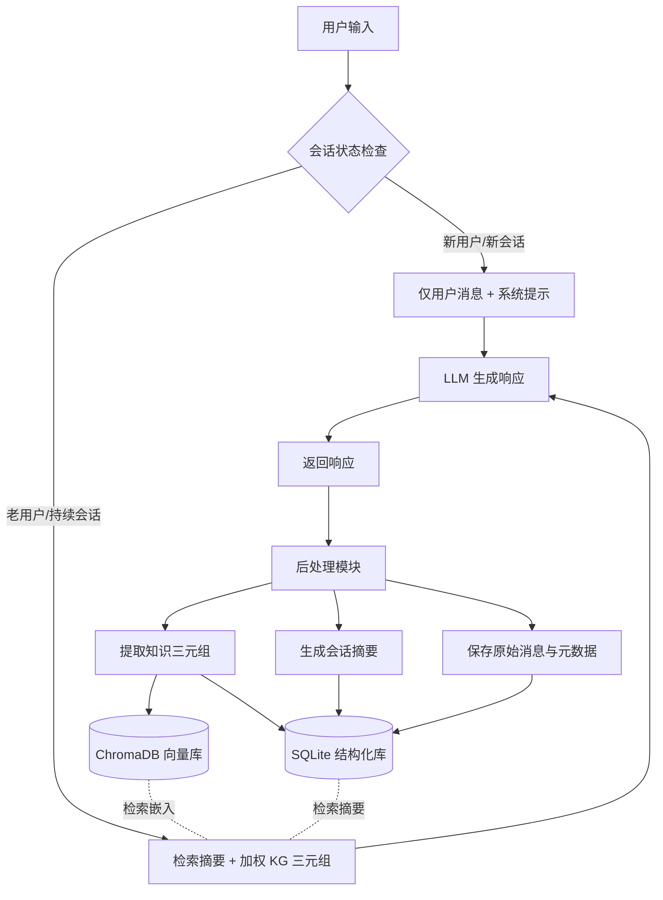

# Memoria：一种用于个性化对话 AI 的可扩展代理记忆框架

## 一、论文基础元数据
- 原文标题：Memoria: A Scalable Agentic Memory Framework for Personalized Conversational AI
- 中文译版：Memoria：一种用于个性化对话 AI 的可扩展代理记忆框架
- 发表渠道：预印本（arXiv）
- 发表时间：2025 年
- 链接：arXiv:2512.12686
- 作者及核心机构：Samarth Sarin, Lovepreet Singh, Bhaskarjit Sarmah, Dhagash Mehta（机构待补充）
- 研究领域（一级领域 + 二级子领域）：人工智能 + 自然语言处理（对话系统/记忆增强）
- 关联数据集（名称/规模/语言/标注）：LongMemEvals（商业场景长对话/平均 115k tokens/英文/人工或合成标注）

## 二、论文综合评价
### 2.1 量化评分（1-5 分，5 分为最优）

| 评价维度 | 评分 | 备注 |
| -------- | ---- | ---- |
| 📚 理论基础 | ⭐⭐⭐⭐ | 基于成熟记忆理论，工程整合性强 |
| 🎯 问题核心性 | ⭐⭐⭐⭐⭐ | 直击 LLM 无状态与个性化缺失痛点 |
| 💡 方法创新性 | ⭐⭐⭐⭐ | 双组件架构与时效权重机制新颖 |
| ⚙️ 技术壁垒 | ⭐⭐⭐ | 依赖现有组件，集成难度较低 |
| 🧪 实验严谨性 | ⭐⭐⭐⭐ | 基线对比充分，指标覆盖准确率与效率 |
| 🔧 落地可行性 | ⭐⭐⭐⭐⭐ | 轻量化部署，无需 GPU，兼容性强 |
| 🚀 应用前景 | ⭐⭐⭐⭐⭐ | 个性化助手、客服等场景需求巨大 |
| 📊 综合评分 | 4.3 | 工程价值极高，理论创新适中，落地性强 |

### 2.2 定性综合评价（≤300 字）
> 核心概括：研究定位、核心价值、差异化优势、关键结论

Memoria 定位为轻量级、可插拔的代理记忆框架，旨在解决 LLM 对话系统的无状态与个性化缺失问题。其核心价值在于通过“动态会话摘要”与“加权知识图谱”的双组件架构，实现了跨会话的长期记忆保持。差异化优势在于引入了基于指数衰减的时效性权重机制，有效解决记忆冲突与更新问题，且无需微调模型参数。关键结论表明，该方法在保持高准确率（87.1%）的同时，显著降低了 Token 消耗与延迟，为资源受限环境下的个性化 AI 提供了工业级解决方案。

## 三、领域本体论映射
| 核心维度 | 具体内容 |
| -------- | -------- |
| 核心研究对象 | 无状态 LLM 对话系统的长期记忆与个性化能力 |
| 核心技术路径 | 外部记忆存储（SQL+ 向量库）+ 知识图谱 + 检索增强 |
| 数据/载体形态 | 结构化对话日志、知识三元组、会话摘要、向量嵌入 |
| 核心功能目标 | 实现跨会话记忆保留、用户偏好捕捉、上下文连贯性 |
| 验证核心指标 | 单次会话准确率、知识更新准确率、Token 压缩率、延迟 |

## 四、核心问题与解决方案
### 4.1 待解决的核心问题
1. **领域级根本问题**：传统 LLM 对话系统缺乏持久记忆，每次交互孤立，导致对话不连贯、重复且缺乏个性化。
2. **现有方法痛点**：向量存储缺乏可解释性，图谱系统难以处理时效性与扩展性，少有框架能有效整合短期与长期记忆。
3. **工程落地卡点**：全上下文输入导致 Token 成本高昂且延迟大，现有记忆方案难以在资源受限环境下部署。

### 4.2 核心解决方案
- 理论框架：代理记忆理论（Agentic Memory），区分情景记忆与语义记忆。
- 核心架构：双组件架构（动态会话摘要 + 加权知识图谱）。
- 关键技术：用户专属 KG 构建、指数衰减权重机制（EWA）、混合存储策略（SQLite+ChromaDB）。
- 创新机制：仅从用户输入提取三元组确保准确性，归一化处理防止旧数据权重过早归零，优先高权重信息解决冲突。

### 4.3 核心优势（量化 + 定性）
1. 性能优势：单次会话准确率 87.1%，优于 A-Mem 的 84.2%；知识更新准确率 80.8%。
2. 效率优势：提示长度从 115K 降至<400 Tokens，延迟降低最高达 38.7%。
3. 工程优势：无需本地 GPU，基于 API 调用，模块化设计可无缝集成到现有系统。

## 五、方法与技术架构
### 5.1 核心架构设计
Memoria 采用分层架构，分为交互层、记忆管理层与存储层。交互层负责接收用户输入与返回响应；记忆管理层核心包含会话摘要生成器与知识图谱构建器，并实施时效性加权检索；存储层采用 SQLite 存储结构化日志与三元组，ChromaDB 存储向量嵌入。

### 5.2 关键技术实现细节
| 技术模块 | 实现路径 | 工程注意事项 |
| -------- | -------- | ------------ |
| 会话摘要模块 | 基于 Session ID 增量更新，维持短期连贯性 | 需控制摘要长度，避免超出上下文窗口 |
| 知识图谱构建 | 仅从用户输入提取三元组，排除助手回复 | 确保提取准确性，避免噪声污染用户画像 |
| 时效性权重 | 采用指数衰减函数计算权重，归一化处理 | 调整衰减率参数，平衡近期与长期记忆 |
| 混合存储 | SQLite 存结构化数据，ChromaDB 存向量 | 需维护两者间的数据一致性与会话 ID 关联 |

### 5.3 架构优缺点
- 优点：轻量级部署，无需模型微调；记忆更新可解释；支持跨会话无缝继续对话。
- 缺点：依赖外部 API 进行三元组提取与摘要生成，增加额外延迟；知识图谱构建质量依赖提取模型能力。

## 六、实验设计与结果分析
### 6.1 实验基础设置
| 维度 | 内容 |
| ---- | ---- |
| 数据集 | LongMemEvals（商业场景长对话，平均 115k tokens） |
| 基线方法 | Full Context, A-Mem (ST), A-Mem (OA) |
| 实验环境 | GPT-4.1-mini, OpenAI embedding, SQLite3, ChromaDB, 无 GPU |
| 评价指标 | 准确率（单次会话/知识更新）、Token 消耗、延迟 |

### 6.2 核心实验结果
| 方法 | 核心指标 1 | 核心指标 2 | 工程指标（算力/耗时） |
| ---- | --------- | --------- | -------------------- |
| 基线 1 (Full Context) | 85.7% (单次) | 78.2% (更新) | 115K Tokens, 391 秒 |
| 基线 2 (A-Mem OA) | 84.2% (单次) | 79.4% (更新) | 900+ Tokens, 待补充 |
| 本文方法 (Memoria) | 87.1% (单次) | 80.8% (更新) | <400 Tokens, 260 秒 |

### 6.3 消融实验/鲁棒性分析
| 实验变体 | 指标变化 | 核心结论 |
| -------- | -------- | -------- |
| 无时间衰减机制 | 准确率下降 | 证明时效性权重对解决信息冲突至关重要 |
| 检索原始消息 vs 三元组 | Token 用量增加 | 结构化三元组显著降低上下文负载 |
| 不同衰减率参数 | 性能波动 | 需根据场景调整衰减率以平衡新旧记忆 |

### 6.4 实验结论（工程视角）
智能记忆策展优于全量回忆。在保持高准确率的同时，Memoria 大幅降低了计算开销与货币成本，适合资源受限环境部署。时间感知权重机制有效解决了信息矛盾，确保回复的时效性与一致性。

## 七、领域贡献与创新点
| 贡献层级 | 具体内容 |
| -------- | -------- |
| 理论贡献 | 明确了代理记忆在对话系统中的结构化实现路径 |
| 方法/架构贡献 | 提出动态会话摘要与加权知识图谱的双组件架构 |
| 数据/工具贡献 | 即将开源 Python 包，提供可插拔记忆增强层 |
| 实验/验证贡献 | 在长对话场景下验证了记忆框架的准确率与效率优势 |
| 工程落地贡献 | 实现了无需 GPU 的轻量化部署方案，降低落地门槛 |

## 八、局限性与风险
| 维度 | 具体描述 | 应对思路 |
| ---- | -------- | -------- |
| 学术局限性 | 缺乏对记忆足迹增长与负载下检索延迟的深层评估 | 未来扩展系统评估指标，增加压力测试 |
| 工程落地风险 | 依赖外部 API 提取三元组，存在成本与延迟波动 | 优化提取模型，或尝试本地小模型进行提取 |
| 伦理/合规风险 | 用户隐私数据存储于外部数据库，存在泄露风险 | 加强数据加密，提供用户记忆删除与管理功能 |

## 九、未来研究/落地方向
| 方向类型 | 具体内容 | 优先级 |
| -------- | -------- | ------ |
| 科研拓展 | 延伸至时序推理、用户偏好追踪及跨会话连贯性研究 | 高 |
| 工程优化 | 扩展对内存足迹增长、负载下检索延迟的评估 | 中 |
| 跨领域适配 | 适配基于检索的推荐系统、生产力工具等代理系统 | 高 |

## 十、关键词与术语表
| 语言 | 关键词 |
| ---- | ------ |
| 中文 | 代理记忆、知识图谱、指数衰减、会话摘要、个性化对话 |
| 英文 | Agentic Memory, Knowledge Graph, Exponential Decay, Session Summary, Personalized Conversational AI |
| 领域专属术语 | 情景记忆（Episodic Memory）：针对特定事件或对话片段的记忆；语义记忆（Semantic Memory）：针对事实、概念及用户偏好的一般性知识 |

## 十一、参考文献与关联资源
- 核心参考文献：待补充（文中提及 A-Mem 作为基线，未列详细参考文献列表）
- 补充阅读：关于 LLM 记忆机制、知识图谱构建的相关研究
- 开源代码/工具：即将作为开源 Python 包发布（具体链接待补充）

## 十二、阅读者批注
1. **科研启发**：将记忆分为短期摘要与长期图谱是一种有效的解耦策略，值得在其他序列任务中借鉴。
2. **工程落地思考**：无需微调即可增强现有系统，非常适合企业快速构建个性化客服或助手产品。
3. **待验证/存疑点**：三元组提取的准确性在复杂对话场景下的表现需进一步验证，是否存在噪声累积问题。
4. **个人/团队应用场景**：可应用于内部知识库问答系统，增强对用户历史提问偏好的记忆与理解。

## 十三、阅读元信息
| 维度 | 内容 |
| ---- | ---- |
| 阅读日期 | 2026-04-09 12:32 |
| 阅读人 | xPaperReader AI |
| 文档编号 | arxiv-2512.12686 |
| 版本迭代 | v1.0 |