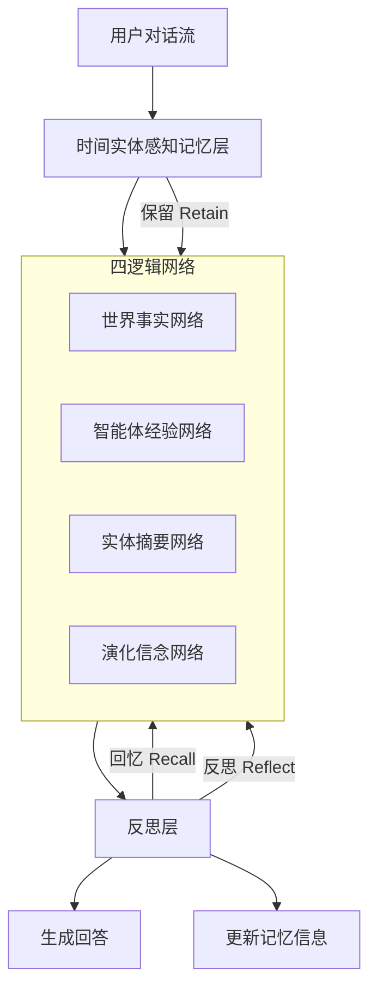

# 事后清晰：构建具备保留、回忆与反思能力的智能体记忆系统

## 一、论文基础元数据
- 原文标题：Hindsight is 20/20: Building Agent Memory that Retains, Recalls, and Reflects
- 中文译版：事后清晰：构建具备保留、回忆与反思能力的智能体记忆系统
- 发表渠道：arXiv 预印本 (技术报告)
- 发表时间：2025 年 12 月 14 日
- 链接：arXiv:2512.12818
- 作者及核心机构：Chris Latimer 等 (Vectorize.io, The Washington Post, Virginia Tech)
- 研究领域（一级领域 + 二级子领域）：人工智能 / 大语言模型智能体与记忆系统
- 关联数据集（名称/规模/语言/标注）：LongMemEval, LoCoMo (多会话/开放域问答)

## 二、论文综合评价
### 2.1 量化评分（1-5 分，5 分为最优）

| 评价维度 | 评分 | 备注 |
| -------- | ---- | ---- |
| 📚 理论基础 | ⭐⭐⭐⭐ | 记忆作为结构化推理基底理论扎实 |
| 🎯 问题核心性 | ⭐⭐⭐⭐⭐ | 直击智能体长程记忆与一致性痛点 |
| 💡 方法创新性 | ⭐⭐⭐⭐⭐ | 四网络架构与三操作机制设计新颖 |
| ⚙️ 技术壁垒 | ⭐⭐⭐⭐ | 涉及复杂实体感知与反思层实现 |
| 🧪 实验严谨性 | ⭐⭐⭐⭐⭐ | 多基准测试且对比强基线包括 GPT-4o |
| 🔧 落地可行性 | ⭐⭐⭐⭐ | 开源模型即可实现但架构较复杂 |
| 🚀 应用前景 | ⭐⭐⭐⭐⭐ | 长期伴侣型智能体关键基础设施 |
| 📊 综合评分 | 4.6 | 架构创新显著，实验效果提升巨大，极具参考价值 |

### 2.2 定性综合评价（≤300 字）
> 核心概括：研究定位、核心价值、差异化优势、关键结论

本文定位为智能体记忆架构的技术报告，核心解决现有记忆系统模糊证据与推断、长程组织困难及推理不可解释的问题。其核心价值在于提出将记忆视为结构化推理基底，而非外部检索层。差异化优势在于设计了区分世界事实、经验、实体摘要和信念的四逻辑网络，配合保留、回忆、反思三操作。关键结论显示，该方法在 LongMemEval 上将准确率从 39% 提升至 83.6%，甚至超越全上下文 GPT-4o，证明了结构化记忆对长程任务的决定性作用。

## 三、领域本体论映射
| 核心维度 | 具体内容 |
| -------- | -------- |
| 核心研究对象 | 大语言模型智能体的长期记忆系统 |
| 核心技术路径 | 结构化记忆基底 + 四逻辑网络 + 反思层 |
| 数据/载体形态 | 对话流、实体感知记忆库、结构化信念 |
| 核心功能目标 | 保留 (Retain)、回忆 (Recall)、反思 (Reflect) |
| 验证核心指标 | 准确率 (Accuracy)、长程记忆基准得分 |

## 四、核心问题与解决方案
### 4.1 待解决的核心问题
1. **领域级根本问题**：智能体难以像人类一样积累经验、跨会话适应及维持稳定视角。
2. **现有方法痛点**：记忆被视为外部层，模糊证据与推断界限，难以组织长程信息，缺乏推理可解释性。
3. **工程落地卡点**：偏好一致性差，全局响应不一致，难以区分观察内容与信念。

### 4.2 核心解决方案
- 理论框架：将记忆视为推理的结构化一级基底 (Structured First-Class Substrate)。
- 核心架构：四逻辑网络 (世界事实、智能体经验、合成实体摘要、演化信念)。
- 关键技术：时间实体感知记忆层 (Temporal Entity-Aware Memory Layer)、反思层 (Reflection Layer)。
- 创新机制：三核心操作 (保留、回忆、反思) 管控信息的添加、访问与更新。

### 4.3 核心优势（量化 + 定性）
1. 性能优势：LongMemEval 准确率从 39% 提升至 83.6%，超越全上下文 GPT-4o。
2. 效率优势：结构化记忆库支持可追溯更新，避免全上下文冗余计算。
3. 工程优势：支持多会话和开放域问题，保持偏好一致性与推理风格稳定。

## 五、方法与技术架构
### 5.1 核心架构设计
> 文字描述 + 架构图（Mermaid/图片）

HINDSIGHT 架构将记忆分为四个逻辑网络，通过时间实体感知层将对话流转化为结构化记忆库，再由反思层进行推理和更新。

### 5.2 关键技术实现细节
| 技术模块 | 实现路径 | 工程注意事项 |
| -------- | -------- | ------------ |
| 四逻辑网络 | 区分事实、经验、摘要、信念四类存储结构 | 需定义清晰的分类边界避免污染 |
| 时间实体层 | 增量处理对话流，提取实体与时间戳 | 需处理实体消歧与时间对齐 |
| 反思层 | 基于记忆库推理，生成答案并追踪更新 | 需保证更新操作的可追溯性 |
| 三操作机制 | 保留 (添加)、回忆 (访问)、反思 (更新) | 需设计原子操作保证一致性 |

### 5.3 架构优缺点
- 优点：结构清晰，支持长程推理，可解释性强，性能提升显著。
- 缺点：架构复杂度高于普通 RAG，维护四个网络需要额外计算开销。

## 六、实验设计与结果分析
### 6.1 实验基础设置
| 维度 | 内容 |
| ---- | ---- |
| 数据集 | LongMemEval, LoCoMo |
| 基线方法 | 全上下文基线 (同骨干), 全上下文 GPT-4o, 最强开源 prior 系统 |
| 实验环境 | 原文未提及 (基于开源 20B 模型及更大规模骨干) |
| 评价指标 | 准确率 (Accuracy) |

### 6.2 核心实验结果
| 方法 | 核心指标 1 (LongMemEval) | 核心指标 2 (LoCoMo) | 工程指标（算力/耗时） |
| ---- | --------- | --------- | -------------------- |
| 全上下文基线 (20B) | 39% | 原文未提及 | 原文未提及 |
| 全上下文 GPT-4o | 原文未提及 (低于本文) | 原文未提及 (低于本文) | 高成本 |
| 最强 prior 开源系统 | 原文未提及 | 75.78% | 原文未提及 |
| 本文方法 (20B) | 83.6% | 原文未提及 | 原文未提及 |
| 本文方法 (缩放骨干) | 91.4% | 89.61% | 成本增加 |

### 6.3 消融实验/鲁棒性分析
| 实验变体 | 指标变化 | 核心结论 |
| -------- | -------- | -------- |
| 原文未提及 | 原文未提及 | 原文未提及 |

### 6.4 实验结论（工程视角）
结构化记忆架构能显著提升长程对话任务的性能，即使使用较小的开源模型 (20B) 也能超越全上下文的大模型 (GPT-4o)，证明了记忆结构优化的重要性优于单纯扩大模型规模。

## 七、领域贡献与创新点
| 贡献层级 | 具体内容 |
| -------- | -------- |
| 理论贡献 | 提出记忆作为结构化推理基底而非外部检索层的理论 |
| 方法/架构贡献 | 设计四逻辑网络与三操作 (保留/回忆/反思) 机制 |
| 数据/工具贡献 | 在 LongMemEval 和 LoCoMo 基准上验证了新架构 |
| 实验/验证贡献 | 证明了开源模型 + 结构化记忆可超越闭源全上下文模型 |
| 工程落地贡献 | 提供了可追溯的记忆更新机制，利于调试与一致性维护 |

## 八、局限性与风险
| 维度 | 具体描述 | 应对思路 |
| ---- | -------- | -------- |
| 学术局限性 | 原文片段未提供详细消融实验数据 | 需阅读全文确认各模块贡献 |
| 工程落地风险 | 四网络维护复杂度高，可能增加延迟 | 优化实体提取与网络同步机制 |
| 伦理/合规风险 | 记忆包含用户隐私与信念，需防止泄露 | 实施严格的访问控制与加密存储 |

## 九、未来研究/落地方向
| 方向类型 | 具体内容 | 优先级 |
| -------- | -------- | ------ |
| 科研拓展 | 探索更多逻辑网络类型以适应特定领域 | 中 |
| 工程优化 | 降低反思层计算开销，实现实时响应 | 高 |
| 跨领域适配 | 应用于客服、个人助理等长程交互场景 | 高 |

## 十、关键词与术语表
| 语言 | 关键词 |
| ---- | ------ |
| 中文 | 智能体记忆、结构化基底、反思层、实体感知、长程对话 |
| 英文 | Agent Memory, Structured Substrate, Reflection Layer, Entity-Aware, Long-Horizon |
| 领域专属术语 | 四逻辑网络 (Four Logical Networks): 事实/经验/摘要/信念; 三操作 (Three Operations): 保留/回忆/反思 |

## 十一、参考文献与关联资源
- 核心参考文献：MemGPT (Packer et al., 2023), Zep (Rasmussen et al., 2025)
- 补充阅读：原文未提及更多具体引用细节
- 开源代码/工具：原文未提及具体代码库链接 (技术报告通常后续发布)

## 十二、阅读者批注
1. **科研启发**：记忆结构的精细化设计比单纯增加上下文窗口更有效，值得深入研究“信念网络”的实现。
2. **工程落地思考**：在实际系统中，如何低成本地维护四个网络的一致性是关键挑战。
3. **待验证/存疑点**：反思层的具体计算开销未详细说明，需评估实时性。
4. **个人/团队应用场景**：适用于需要长期用户画像维护的客服机器人或个人助手项目。

## 十三、阅读元信息
| 维度 | 内容 |
| ---- | ---- |
| 阅读日期 | 2026-04-09 12:42 |
| 阅读人 | xPaperReader AI |
| 文档编号 | arxiv-2512.12818 |
| 版本迭代 | v1.0 |