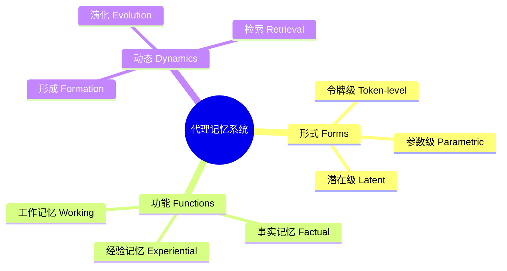

# 人工智能代理时代的记忆：形式、功能与动态综述

## 一、论文基础元数据
- 原文标题：Memory in the Age of AI Agents: A Survey
- 中文译版：人工智能代理时代的记忆：形式、功能与动态综述
- 发表渠道：arXiv 预印本 (计算机科学 - 计算语言学)
- 发表时间：2026 年 1 月 13 日 (v2 版本)
- 链接：arXiv:2512.13564
- 作者及核心机构：Yuyang Hu 等 40+ 作者；核心机构包括新加坡国立大学、中国人民大学、复旦大学、北京大学、牛津大学等
- 研究领域（一级领域 + 二级子领域）：人工智能 / AI 代理与记忆系统
- 关联数据集（名称/规模/语言/标注）：原文未提及具体自有数据集，主要汇总现有基准（待补充具体列表）

## 二、论文综合评价
### 2.1 量化评分（1-5 分，5 分为最优）

| 评价维度 | 评分 | 备注 |
| -------- | ---- | ---- |
| 📚 理论基础 | ⭐⭐⭐⭐⭐ | 提出形式/功能/动态三维分类体系，理论扎实 |
| 🎯 问题核心性 | ⭐⭐⭐⭐⭐ | 直击代理记忆领域碎片化与术语混乱痛点 |
| 💡 方法创新性 | ⭐⭐⭐⭐ | 超越传统长短期记忆，提出细粒度分类 |
| ⚙️ 技术壁垒 | ⭐⭐⭐ | 综述类论文，侧重整合而非新技术突破 |
| 🧪 实验严谨性 | ⭐⭐⭐ | 汇总现有基准，缺乏统一实证对比实验 |
| 🔧 落地可行性 | ⭐⭐⭐⭐ | 提供开源框架总结，指导工程实践 |
| 🚀 应用前景 | ⭐⭐⭐⭐⭐ | AI 代理为核心趋势，记忆是关键基础设施 |
| 📊 综合评分 | 4.1 | 理论贡献突出，为领域提供重要概念基础 |

### 2.2 定性综合评价（≤300 字）
> 核心概括：研究定位、核心价值、差异化优势、关键结论
本文是一篇针对 AI 代理记忆系统的全面综述。核心价值的在于解决了当前研究领域碎片化、术语定义模糊的问题。差异化优势在于提出了“形式 - 功能 - 动态”的统一分析视角，超越了传统的长/短期记忆分类。关键结论包括识别出三种主要记忆形式（令牌级、参数级、潜在级）和三种功能类型（事实、经验、工作记忆）。文章不仅整合了现有基准与开源框架，还展望了自动化设计、多模态记忆等前沿方向，为未来代理智能设计提供了概念基础。

## 三、领域本体论映射
| 核心维度 | 具体内容 |
| -------- | -------- |
| 核心研究对象 | 基于基础模型的 AI 代理记忆系统 (Agent Memory) |
| 核心技术路径 | 形式（存储形态）、功能（用途）、动态（演化过程）三维分析 |
| 数据/载体形态 | 令牌级上下文、模型参数、潜在空间向量 |
| 核心功能目标 | 支持长程推理、持续适应、复杂环境交互 |
| 验证核心指标 | 原文未提及具体数值指标，侧重基准汇总与框架分类 |

## 四、核心问题与解决方案
### 4.1 待解决的核心问题
1. **领域级根本问题**：代理记忆研究迅速扩张但日益碎片化，缺乏统一概念框架。
2. **现有方法痛点**：现有分类（如长/短期记忆）不足以捕捉当代代理记忆系统的多样性与动态性；术语定义松散导致概念混淆。
3. **工程落地卡点**：缺乏对现有开源框架与基准的系统性总结，开发者难以选型。

### 4.2 核心解决方案
- 理论框架：建立“形式 (Forms) - 功能 (Functions) - 动态 (Dynamics)"统一分析透镜。
- 核心架构：无具体模型架构，提供分类学架构。
- 关键技术：区分令牌级、参数级、潜在记忆；区分事实、经验、工作记忆。
- 创新机制：将记忆视为未来代理智能设计中的“一等原始概念 (first-class primitive)"。

### 4.3 核心优势（量化 + 定性）
1. 性能优势：原文未提及具体性能提升数据（综述性质）。
2. 效率优势：通过分类学帮助研究者快速定位相关技术与基准。
3. 工程优势：汇总了代表性基准与开源记忆框架，降低开发门槛。

## 五、方法与技术架构
### 5.1 核心架构设计
> 文字描述 + 架构图（Mermaid/图片）
本文提出三维分类架构。形式维关注记忆存储在哪里（令牌、参数、潜在空间）；功能维关注记忆用来做什么（事实检索、经验学习、工作缓存）；动态维关注记忆如何随时间变化（形成、演化、检索）。

### 5.2 关键技术实现细节
| 技术模块 | 实现路径 | 工程注意事项 |
| -------- | -------- | ------------ |
| 记忆形式分类 | 依据存储介质区分（上下文窗口 vs 权重 vs 向量） | 需明确不同形式的读写成本差异 |
| 记忆功能分类 | 依据任务需求区分（知识问答 vs 技能学习 vs 临时状态） | 避免功能重叠导致的冗余存储 |
| 动态机制 | 分析交互过程中的记忆生命周期 | 关注遗忘机制与一致性维护 |
| 依赖组件 | 依赖基础模型 (LLM)、向量数据库、外部存储 | 需考虑系统延迟与上下文窗口限制 |

### 5.3 架构优缺点
- 优点：分类粒度更细，覆盖全面，逻辑清晰，有助于统一领域术语。
- 缺点：作为综述，缺乏统一的实证框架来验证分类的有效性；部分边界可能随技术发展模糊。

## 六、实验设计与结果分析
### 6.1 实验基础设置
| 维度 | 内容 |
| ---- | ---- |
| 数据集 | 汇总现有代表性基准（具体名称原文未详列） |
| 基线方法 | 涵盖现有各类记忆增强代理方法 |
| 实验环境 | 原文未提及 |
| 评价指标 | 原文未提及具体数值，侧重定性分析与框架对比 |

### 6.2 核心实验结果
| 方法 | 核心指标 1 | 核心指标 2 | 工程指标（算力/耗时） |
| ---- | --------- | --------- | -------------------- |
| 基线 1 | 原文未提及 | 原文未提及 | 原文未提及 |
| 基线 2 | 原文未提及 | 原文未提及 | 原文未提及 |
| 本文方法 | 不适用 (综述) | 不适用 (综述) | 不适用 (综述) |

### 6.3 消融实验/鲁棒性分析
| 实验变体 | 指标变化 | 核心结论 |
| -------- | -------- | -------- |
| 无 | 无 | 原文未提及具体消融实验 |

### 6.4 实验结论（工程视角）
本文主要贡献在于理论梳理与资源汇总，而非提出新算法并通过实验验证。工程视角结论体现在对开源框架的推荐与基准的选择指导上，建议开发者根据任务类型（事实/经验/工作）选择合适的记忆形式。

## 七、领域贡献与创新点
| 贡献层级 | 具体内容 |
| -------- | -------- |
| 理论贡献 | 提出形式 - 功能 - 动态三维分类学，澄清模糊术语 |
| 方法/架构贡献 | 定义令牌级、参数级、潜在记忆三种主导实现形式 |
| 数据/工具贡献 | 编译了代表性基准与开源记忆框架列表（附 GitHub 仓库） |
| 实验/验证贡献 | 对现有评估协议进行了分析与对比 |
| 工程落地贡献 | 提出自动化记忆设计、多智能体共享记忆等落地建议 |

## 八、局限性与风险
| 维度 | 具体描述 | 应对思路 |
| ---- | -------- | -------- |
| 学术局限性 | 文献增长迅速，可能存在遗漏（作者自述） | 通过 GitHub 仓库持续更新论文列表 |
| 工程落地风险 | 不同记忆形式集成复杂度高，延迟问题 | 结合具体场景权衡读写效率与容量 |
| 伦理/合规风险 | 记忆中的隐私数据与信任问题 | 关注文中提到的可信度 (Trustworthiness) 研究方向 |

## 九、未来研究/落地方向
| 方向类型 | 具体内容 | 优先级 |
| -------- | -------- | ------ |
| 科研拓展 | 强化学习与记忆系统的深度融合、多模态记忆 | 高 |
| 工程优化 | 面向自动化的记忆设计、多智能体共享记忆 | 高 |
| 跨领域适配 | 记忆系统的可信度与安全性研究 | 中 |

## 十、关键词与术语表
| 语言 | 关键词 |
| ---- | ------ |
| 中文 | AI 代理、记忆系统、分类学、长程推理、持续适应 |
| 英文 | AI Agents, Agent Memory, Taxonomy, Long-horizon Reasoning, Continual Adaptation |
| 领域专属术语 | 令牌级记忆 (Token-level Memory)：存储在上下文窗口中的信息；参数级记忆 (Parametric Memory)：存储在模型权重中的知识；潜在记忆 (Latent Memory)：存储在潜在空间向量中的信息 |

## 十一、参考文献与关联资源
- 核心参考文献：原文未列出具体参考文献列表（仅提及编译了总结）
- 补充阅读：建议访问 GitHub 仓库获取完整论文列表
- 开源代码/工具：https://github.com/Shichun-Liu/Agent-Memory-Paper-List

## 十二、阅读者批注
1. **科研启发**：三维分类法（形式/功能/动态）非常适合作为新入局者的研究地图，可据此寻找未被充分探索的组合（如潜在记忆 + 经验功能）。
2. **工程落地思考**：在实际构建 Agent 时，不应盲目堆砌记忆模块，需根据任务需求（事实查询 vs 技能学习）选择对应的记忆形式以优化成本。
3. **待验证/存疑点**：文中提到的“潜在记忆”具体实现形态在不同论文中可能差异巨大，需进一步阅读具体子文献确认。
4. **个人/团队应用场景**：适用于团队内部构建企业级知识库 Agent 时的技术选型参考，避免重复造轮子。

## 十三、阅读元信息
| 维度 | 内容 |
| ---- | ---- |
| 阅读日期 | 2026-04-09 13:19 |
| 阅读人 | xPaperReader AI |
| 文档编号 | arxiv-2512.13564 |
| 版本迭代 | v1.0 |