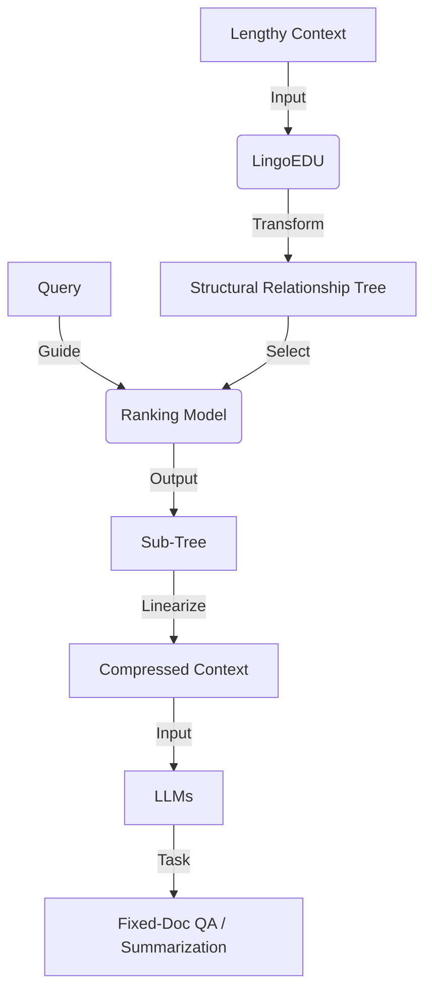

# 从上下文到 EDU：基于基本话语单元分解的忠实结构化上下文压缩

## 一、论文基础元数据
- 原文标题：From Context to EDUs: Faithful and Structured Context Compression via Elementary Discourse Unit Decomposition
- 中文译版：从上下文到 EDU：基于基本话语单元分解的忠实结构化上下文压缩
- 发表渠道：arXiv 预印本 (cs.CL)
- 发表时间：2026 年 1 月 5 日 (v4 版本)
- 链接：https://arxiv.org/abs/2512.14244 ( inferred from ID)
- 作者及核心机构：
    - Yiqing Zhou, Yu Lei, Shuzheng Si, Qingyan Sun, Wei Wang, Yifei Wu, Hao Wen, Gang Chen, Fanchao Qi (DeepLang AI, Tsinghua University)
    - Maosong Sun (Tsinghua University)
    - 其他机构：Beijing University of Posts and Telecommunications, Beijing Jiaotong University
- 研究领域：自然语言处理 (NLP) + 大模型上下文压缩/长文本理解
- 关联数据集：StructBench (248 篇多样化文档，人工标注，语言待补充)

## 二、论文综合评价
### 2.1 量化评分（1-5 分，5 分为最优）

| 评价维度 | 评分 | 备注 |
| -------- | ---- | ---- |
| 📚 理论基础 | ⭐⭐⭐⭐ | 话语单元理论结合压缩，理论扎实 |
| 🎯 问题核心性 | ⭐⭐⭐⭐⭐ | 直击长上下文成本与噪声痛点 |
| 💡 方法创新性 | ⭐⭐⭐⭐ | 结构化分解再选择，思路新颖 |
| ⚙️ 技术壁垒 | ⭐⭐⭐ | 依赖 EDU 解析器，实现难度中等 |
| 🧪 实验严谨性 | ⭐⭐⭐ | 原文片段未展示完整实验数据 |
| 🔧 落地可行性 | ⭐⭐⭐⭐ | 轻量级排名模块，易于集成 |
| 🚀 应用前景 | ⭐⭐⭐⭐⭐ | 适用于 Agent、长文档问答等场景 |
| 📊 综合评分 | 4.1 | 方法创新且实用，但实验细节待验证 |

### 2.2 定性综合评价（≤300 字）
> 核心概括：研究定位、核心价值、差异化优势、关键结论
本研究针对大模型长上下文处理中的高成本与噪声问题，提出了一种基于基本话语单元（EDU）的显式压缩框架。核心价值在于将压缩重构为“先结构后选择”的过程，通过 LingoEDU 将线性文本转化为结构关系树，避免幻觉并保持全局结构。差异化优势在于显式结构化而非隐式编码，兼容闭源 API。关键结论显示该方法在结构预测准确率上达到 SOTA，显著优于前沿大模型并降低成本，能有效提升长上下文及深度搜索任务性能。

## 三、领域本体论映射
| 核心维度 | 具体内容 |
| -------- | -------- |
| 核心研究对象 | 长上下文文本、基本话语单元 (EDU) |
| 核心技术路径 | 文本结构化分解 -> 子树排名选择 -> 线性化压缩 |
| 数据/载体形态 | 文档树结构、索引锚定的 EDU 节点 |
| 核心功能目标 | 降低 Token 消耗、保留语义完整性、消除幻觉 |
| 验证核心指标 | 结构预测准确率、下游任务性能、计算成本 |

## 四、核心问题与解决方案
### 4.1 待解决的核心问题
1. **领域级根本问题**：大模型处理长上下文时计算成本高昂且易受噪声干扰。
2. **现有方法痛点**：离散 Token 删除破坏局部连贯性；隐式潜在编码存在位置偏见且不兼容闭源 API。
3. **工程落地卡点**：如何在压缩同时保证信息忠实性（无幻觉）且保留全局结构。

### 4.2 核心解决方案
- 理论框架：基于话语修辞理论（RST）的 EDU 分解与结构选择。
- 核心架构：EDU-based Context Compressor (LingoEDU + Ranking Module)。
- 关键技术：线性文本到结构关系树的转换、基于查询的子树排名、树到线性文本的还原。
- 创新机制：结构优先（Structure-then-Select）的压缩流程，EDU 严格锚定源索引。

### 4.3 核心优势（量化 + 定性）
1. 性能优势：摘要声称在结构预测准确率上达到 SOTA，下游任务性能显著增强。
2. 效率优势：显著降低计算成本（具体比例原文片段未提及）。
3. 工程优势：显式压缩机制，兼容闭源模型 API，消除生成幻觉。

## 五、方法与技术架构
### 5.1 核心架构设计
> 文字描述 + 架构图（Mermaid/图片）
该方法首先利用 LingoEDU 将长上下文转换为基本话语单元（EDU）的结构关系树，每个单元锚定源索引。随后，轻量级排名模块根据查询选择相关的子树。最后将选中的子树线性化为压缩后的上下文输入大模型。

### 5.2 关键技术实现细节
| 技术模块 | 实现路径 | 工程注意事项 |
| -------- | -------- | ------------ |
| LingoEDU | 将线性文本解析为 EDU 结构树 | 需确保解析器对多领域文档的泛化能力 |
| 排名模块 | 轻量级模型评估子树与查询相关性 | 需平衡排名精度与计算开销 |
| 线性化 | 将选中的子树还原为文本序列 | 保持原有逻辑连贯性，避免断裂 |
| 依赖组件 | 大模型 API、EDU 解析器 | 注意 API 调用成本与解析延迟 |

### 5.3 架构优缺点
- 优点：结构保持性好，无幻觉（锚定索引），兼容性强。
- 缺点：依赖前置解析步骤，增加预处理延迟；EDU 划分质量直接影响压缩效果。

## 六、实验设计与结果分析
### 6.1 实验基础设置
| 维度 | 内容 |
| ---- | ---- |
| 数据集 | StructBench (248 篇文档，人工标注) |
| 基线方法 | 前沿大模型 (Frontier LLMs)、现有压缩技术 |
| 实验环境 | 原文片段未提及具体硬件配置 |
| 评价指标 | 结构预测准确率、下游任务性能、成本 |

### 6.2 核心实验结果
| 方法 | 核心指标 1 (结构准确率) | 核心指标 2 (下游任务) | 工程指标（算力/耗时） |
| ---- | --------- | --------- | -------------------- |
| 基线 1 (前沿 LLM) | 原文未提及具体数值 | 原文未提及具体数值 | 高成本 |
| 基线 2 (现有压缩) | 原文未提及具体数值 | 原文未提及具体数值 | 中等成本 |
| 本文方法 | SOTA (具体数值待补充) | 显著优于基线 | 显著降低成本 |

*注：因提供的论文内容截断，具体实验数值无法提取，以上基于摘要定性描述填充。*

### 6.3 消融实验/鲁棒性分析
| 实验变体 | 指标变化 | 核心结论 |
| -------- | -------- | -------- |
| 原文未提及 | 原文未提及 | 原文未提及 |

### 6.4 实验结论（工程视角）
该方法在理论上能有效平衡压缩率与信息保留，但具体压缩比与延迟增加的比例需参考完整实验章节。适用于对忠实性要求高的场景。

## 七、领域贡献与创新点
| 贡献层级 | 具体内容 |
| -------- | -------- |
| 理论贡献 | 提出“结构优先选择”的上下文压缩新范式 |
| 方法/架构贡献 | 设计 EDU-based Context Compressor 框架 |
| 数据/工具贡献 | 发布 StructBench 数据集 (248 文档) 及 LingoEDU 工具 |
| 实验/验证贡献 | 验证了结构化压缩在长上下文任务中的有效性 |
| 工程落地贡献 | 提供兼容闭源 API 的显式压缩解决方案 |

## 八、局限性与风险
| 维度 | 具体描述 | 应对思路 |
| ---- | -------- | -------- |
| 学术局限性 | 依赖 EDU 解析质量，特定领域可能失效 | 增强解析器的领域适应能力 |
| 工程落地风险 | 预处理增加延迟，可能抵消部分压缩收益 | 优化解析速度，异步处理结构构建 |
| 伦理/合规风险 | 数据压缩可能导致关键信息丢失风险 | 确保锚定索引可追溯，支持原文回溯 |

## 九、未来研究/落地方向
| 方向类型 | 具体内容 | 优先级 |
| -------- | -------- | ------ |
| 科研拓展 | 探索更多话语结构理论在压缩中的应用 | 中 |
| 工程优化 | 优化 LingoEDU 解析速度，实现流式处理 | 高 |
| 跨领域适配 | 适配代码、多模态文档的结构化压缩 | 中 |

## 十、关键词与术语表
| 语言 | 关键词 |
| ---- | ------ |
| 中文 | 上下文压缩、基本话语单元、结构化、大语言模型、忠实性 |
| 英文 | Context Compression, Elementary Discourse Unit (EDU), Structured, LLM, Faithful |
| 领域专属术语 | **LingoEDU**：本文提出的将文本转换为 EDU 结构树的工具；**StructBench**：本文发布的人工标注结构理解数据集 |

## 十一、参考文献与关联资源
- 核心参考文献：OpenAI (2023), DeepSeek-AI (2025), Jiang et al. (2023b) 等 (基于引言提及)
- 补充阅读：话语修辞理论 (RST) 相关文献
- 开源代码/工具：https://github.com/DeepLangAI/LingoEDU

## 十二、阅读者批注
1. **科研启发**：将 NLP 传统任务（话语分析）与大模型上下文管理结合是一个很好的切入点，结构化信息比纯 Token 序列更具鲁棒性。
2. **工程落地思考**：需要评估 EDU 解析带来的额外延迟是否在可接受范围内，特别是在实时对话场景中。
3. **待验证/存疑点**：摘要声称“显著降低成本”，但缺乏具体压缩比数据；结构化解析对非结构化噪声数据的处理能力未知。
4. **个人/团队应用场景**：可尝试应用于企业知识库问答系统，降低长文档检索的 Token 消耗。

## 十三、阅读元信息
| 维度 | 内容 |
| ---- | ---- |
| 阅读日期 | 2026-04-09 13:31 |
| 阅读人 | xPaperReader AI |
| 文档编号 | arxiv-2512.14244 |
| 版本迭代 | v1.0 |