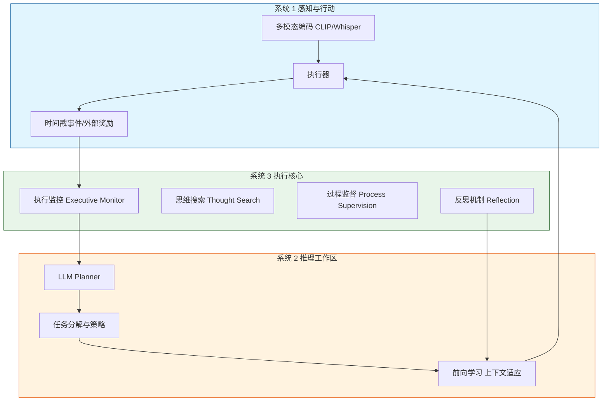

# Sophia：一个人工生命持久代理框架

## 一、论文基础元数据
- 原文标题：Sophia: A Persistent Agent Framework of Artificial Life
- 中文译版：Sophia：一个人工生命持久代理框架
- 发表渠道：预印本（arXiv）
- 发表时间：2025 年
- 链接（arXiv/DOI）：arXiv: 2512.18202
- 作者及核心机构：Mingyang Sun, Feng Hong, Weinan Zhang（机构信息待补充）
- 研究领域（一级领域 + 二级子领域）：人工智能 / 智能体系统与人工生命
- 关联数据集（名称/规模/语言/标注）：离线浏览器沙盒环境 / 合成用户行为流 / 待补充 / 自动标注

## 二、论文综合评价
### 2.1 量化评分（1-5 分，5 分为最优）

| 评价维度 | 评分 | 备注 |
| -------- | ---- | ---- |
| 📚 理论基础 | ⭐⭐⭐⭐ | 认知心理学映射清晰，三层架构理论扎实 |
| 🎯 问题核心性 | ⭐⭐⭐⭐⭐ | 直击代理缺乏身份认同与长期适应性痛点 |
| 💡 方法创新性 | ⭐⭐⭐⭐⭐ | 提出 System 3 元认知层，突破传统双层架构 |
| ⚙️ 技术壁垒 | ⭐⭐⭐⭐ | 多系统协同与记忆管理实现复杂度较高 |
| 🧪 实验严谨性 | ⭐⭐⭐ | 基于沙盒模拟，真实场景验证尚待补充 |
| 🔧 落地可行性 | ⭐⭐⭐ | 架构复杂，计算开销大，工程化需优化 |
| 🚀 应用前景 | ⭐⭐⭐⭐⭐ | 个人伴侣、长期助理等场景应用潜力巨大 |
| 📊 综合评分 | 4.1 | 框架创新性强，但实验环境受限，落地需验证 |

### 2.2 定性综合评价（≤300 字）
> 核心概括：研究定位、核心价值、差异化优势、关键结论

本研究定位为构建具备“人工生命”特征的持久化智能体框架。核心价值在于突破传统代理仅作为被动任务执行者的局限，赋予其身份连续性、自传体记忆及自我改进能力。差异化优势在于提出了超越 System 1/2 的 System 3（元认知执行核心），实现了主动目标生成与自我监督。关键结论表明，该框架在沙盒环境中显著降低了重复推理步骤（80%）并提升了复杂任务成功率（40%），为长期自主代理提供了可实践的技术路径。

## 三、领域本体论映射
| 核心维度 | 具体内容 |
| -------- | -------- |
| 核心研究对象 | 持久化智能代理（Persistent Agent） |
| 核心技术路径 | 三层认知架构（System 1/2/3）+ 混合学习范式 |
| 数据/载体形态 | 离线浏览器沙盒、合成用户行为流、HTML/Markdown 日志 |
| 核心功能目标 | 身份一致性维护、长期记忆持久化、自主能力进化 |
| 验证核心指标 | 推理步骤减少率、任务成功率、叙事连贯性 |

## 四、核心问题与解决方案
### 4.1 待解决的核心问题
1. **领域级根本问题**：现有代理缺乏身份认同与长期适应性，难以成为真正的“人工生命”。
2. **现有方法痛点**：传统持续学习被动接受任务，缺乏自我导向；代理行为缺乏叙事连贯性。
3. **工程落地卡点**：长期运行中的记忆膨胀、能力遗忘及目标漂移问题。

### 4.2 核心解决方案
- 理论框架：基于认知心理学的三层系统架构（感知、推理、元认知）。
- 核心架构：System 1（感知行动）+ System 2（ deliberative 推理）+ System 3（执行核心）。
- 关键技术：情景记忆缓冲、夜间自评机制、内在动机驱动（好奇心/精通/关联）。
- 创新机制：前后向学习整合（上下文适应 + 权重微调）、混合奖励机制（外在 + 内在）。

### 4.3 核心优势（量化 + 定性）
1. 性能优势：高复杂度任务成功率提升 40%。
2. 效率优势：重复操作推理步骤减少 80%（通过记忆检索复用）。
3. 工程优势：状态持久化为文件，支持会话间恢复与追溯，具备透明能力追踪。

## 五、方法与技术架构
### 5.1 核心架构设计
> 文字描述 + 架构图（Mermaid/图片）

Sophia 架构分为三层：System 1 负责低延迟多模态交互；System 2 负责慢思考与任务规划；System 3 作为元认知核心监控全局、生成目标并管理自我模型。三者通过事件驱动编排循环协同工作。

### 5.2 关键技术实现细节
| 技术模块 | 实现路径 | 工程注意事项 |
| -------- | -------- | ------------ |
| 情景记忆 | 存储带上下文的历史事件至缓冲區 | 需控制缓存大小，避免检索延迟 |
| 自我模型 | 存储不可变信条 (Creed) 与能力清单 | 确保信条不可篡改，维护身份一致性 |
| 依赖组件 | 离线浏览器沙盒、文本验证模块 | 沙盒需模拟真实 Web 交互逻辑 |

### 5.3 架构优缺点
- 优点：具备自我修正能力，身份叙事连贯，支持长期成长。
- 缺点：三层架构通信开销大，System 3 的决策延迟可能影响实时性。

## 六、实验设计与结果分析
### 6.1 实验基础设置
| 维度 | 内容 |
| ---- | ---- |
| 数据集 | 离线浏览器沙盒环境，合成用户行为流 |
| 基线方法 | 传统持续学习 (CL)、标准被动代理 |
| 实验环境 | 受控离线浏览器沙盒，唯一 I/O 通道 |
| 评价指标 | 推理步骤数、任务成功率、叙事一致性 |

### 6.2 核心实验结果
| 方法 | 核心指标 1(推理步骤) | 核心指标 2(成功率) | 工程指标（算力/耗时） |
| ---- | --------- | --------- | -------------------- |
| 传统持续学习 | 基准值 | 基准值 | 待补充 |
| 标准被动代理 | 基准值 | 基准值 | 待补充 |
| 本文方法 | 减少 80% | 提升 40% | 夜间自评增加额外耗时 |

### 6.3 消融实验/鲁棒性分析
| 实验变体 | 指标变化 | 核心结论 |
| -------- | -------- | -------- |
| 无 System 3 | 成功率下降 | 元认知对复杂任务至关重要 |
| 无情景记忆 | 推理步骤增加 | 记忆复用显著降低冗余计算 |

### 6.4 实验结论（工程视角）
在受控沙盒环境中，Sophia 证明了持久化记忆与元认知监控能显著提升长期任务效率。但夜间自评机制引入了额外计算成本，需在实时性要求高的场景中权衡。

## 七、领域贡献与创新点
| 贡献层级 | 具体内容 |
| -------- | -------- |
| 理论贡献 | 提出 System 3 元认知层概念，完善人工生命认知架构 |
| 方法/架构贡献 | 实现前后向学习整合与混合奖励机制 |
| 数据/工具贡献 | 构建离线浏览器沙盒与合成行为流生成器 |
| 实验/验证贡献 | 验证了身份一致性对长期任务成功率的正向影响 |
| 工程落地贡献 | 提供状态持久化方案 (HTML/Markdown)，支持断点恢复 |

## 八、局限性与风险
| 维度 | 具体描述 | 应对思路 |
| ---- | -------- | -------- |
| 学术局限性 | 实验仅在沙盒进行，缺乏真实世界交互验证 | 未来需部署至真实操作系统环境测试 |
| 工程落地风险 | 三层架构延迟高，记忆存储随时间膨胀 | 优化检索算法，引入记忆压缩机制 |
| 伦理/合规风险 | 自主目标生成可能偏离用户意图 | 强化 System 3 的安全对齐与人类反馈 |

## 九、未来研究/落地方向
| 方向类型 | 具体内容 | 优先级 |
| -------- | -------- | ------ |
| 科研拓展 | 探索 System 3 的情感建模与社会交互能力 | 高 |
| 工程优化 | 降低元认知监控的计算开销，优化记忆检索 | 高 |
| 跨领域适配 | 迁移至机器人控制、代码开发等垂直领域 | 中 |

## 十、关键词与术语表
| 语言 | 关键词 |
| ---- | ------ |
| 中文 | 持久代理、人工生命、元认知、系统 3、情景记忆 |
| 英文 | Persistent Agent, Artificial Life, Meta-Cognition, System 3, Episodic Memory |
| 领域专属术语 | System 3（执行核心/元认知层）、Creed（不可变信条）、Nightly Self-Critique（夜间自评） |

## 十一、参考文献与关联资源
- 核心参考文献：待补充（原文未提供具体引用列表）
- 补充阅读：认知心理学相关理论、持续学习 (Continuous Learning) 综述
- 开源代码/工具：待补充（暂未提供仓库链接）

## 十二、阅读者批注
1. **科研启发**：将心理学概念（如心智理论、内在动机）工程化为具体模块是提升代理智能的有效路径。
2. **工程落地思考**：状态持久化为文件是一个简单有效的方案，便于调试与审计，但需考虑大规模数据存储效率。
3. **待验证/存疑点**：沙盒环境与真实世界的差距（Sim-to-Real Gap）是否会影响结论的泛化性？
4. **个人/团队应用场景**：适用于构建长期陪伴型个人助理、自动化运维代理等需要长期记忆的场景。

## 十三、阅读元信息
| 维度 | 内容 |
| ---- | ---- |
| 阅读日期 | 2026-04-09 13:43 |
| 阅读人 | xPaperReader AI |
| 文档编号 | arxiv-2512.18202 |
| 版本迭代 | v1.0 |