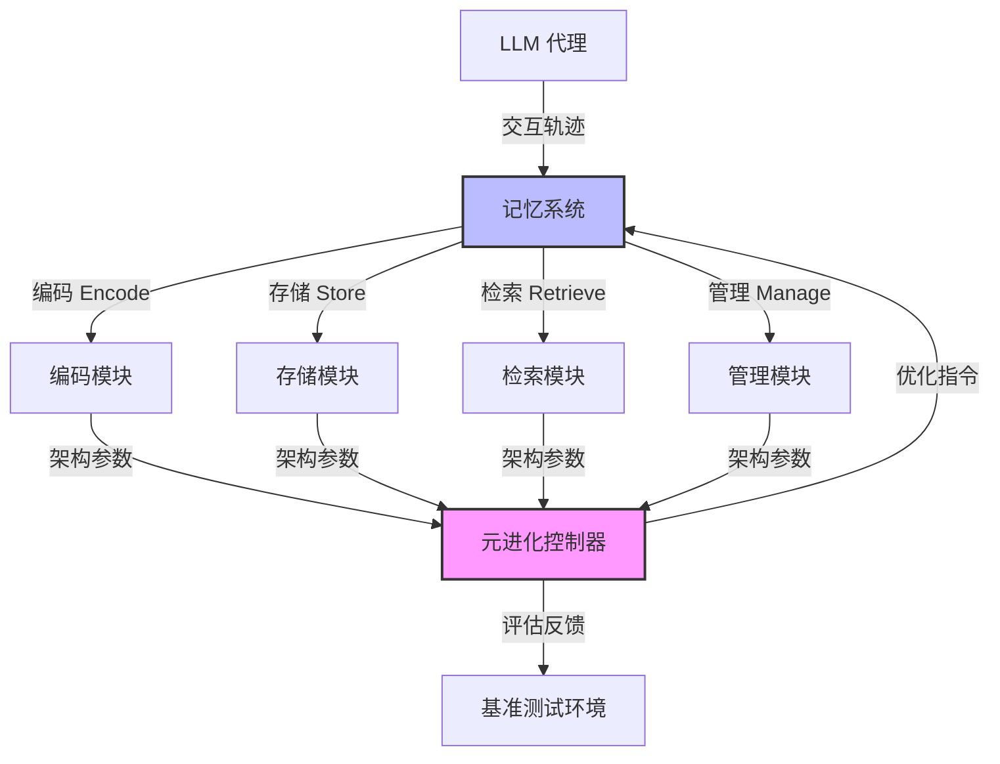

# MemEvolve：代理记忆系统的元进化

## 一、论文基础元数据
- 原文标题：MemEvolve: Meta-Evolution of Agent Memory Systems
- 中文译版：MemEvolve：代理记忆系统的元进化
- 发表渠道：arXiv 预印本 (计算机科学 - 计算语言学)
- 发表时间：2025 年 12 月 21 日 (arXiv), 2025 年 12 月 23 日 (文档日期)
- 链接：arXiv:2512.18746
- 作者及核心机构：Guibin Zhang 等 (OPPO AI Agent Team, LV-NUS lab)
- 研究领域：人工智能 (一级) + 大语言模型代理/记忆系统 (二级)
- 关联数据集：EvolveLab (统一代码库), xbench-DS, WebWalkerQA, GAIA

## 二、论文综合评价
### 2.1 量化评分（1-5 分，5 分为最优）

| 评价维度 | 评分 | 备注 |
| -------- | ---- | ---- |
| 📚 理论基础 | ⭐⭐⭐⭐ | 记忆进化范式理论扎实，类比人类学习 |
| 🎯 问题核心性 | ⭐⭐⭐⭐⭐ | 直击静态记忆架构限制代理进化痛点 |
| 💡 方法创新性 | ⭐⭐⭐⭐⭐ | 提出记忆架构与经验知识联合元进化 |
| ⚙️ 技术壁垒 | ⭐⭐⭐ | 原文未提及具体算法细节，实现难度未知 |
| 🧪 实验严谨性 | ⭐⭐⭐⭐ | 四大基准测试，但全文细节暂未展示 |
| 🔧 落地可行性 | ⭐⭐⭐⭐ | 模块化设计空间利于标准化实施 |
| 🚀 应用前景 | ⭐⭐⭐⭐⭐ | 通用代理系统自我演进潜力巨大 |
| 📊 综合评分 | 4.3 | 创新性强且痛点精准，细节待全文验证 |

### 2.2 定性综合评价（≤300 字）
> 核心概括：研究定位、核心价值、差异化优势、关键结论
本文定位为解决 LLM 代理记忆系统静态性限制的根本问题。核心价值在于提出“元进化”范式，使代理不仅能积累经验，还能优化学习经验的方式。差异化优势在于联合进化经验知识与记忆架构，而非仅优化单一维度。关键结论显示在多个基准测试中性能提升显著（最高 17.06%），且具备跨任务与跨模型泛化能力。提供了 EvolveLab 统一代码库，促进了该领域的标准化与开放性。

## 三、领域本体论映射
| 核心维度 | 具体内容 |
| -------- | -------- |
| 核心研究对象 | 大语言模型 (LLM) 基于的代理记忆系统 |
| 核心技术路径 | 元进化框架 (Meta-Evolutionary Framework) |
| 数据/载体形态 | 交互轨迹、蒸馏经验、可复用工具、模块化记忆空间 |
| 核心功能目标 | 实现记忆架构随任务上下文的元适应与自我优化 |
| 验证核心指标 | 任务性能提升率、跨任务/跨模型泛化能力 |

## 四、核心问题与解决方案
### 4.1 待解决的核心问题
1. **领域级根本问题**：现有记忆系统架构本身是静态的，无法适应多样化的任务上下文。
2. **现有方法痛点**：依赖人工设计的记忆架构，仅支持代理级进化，不支持记忆架构级的元适应。
3. **工程落地卡点**：缺乏统一的自我进化记忆代码库，实验基准不标准化。

### 4.2 核心解决方案
- 理论框架：元进化框架 (Meta-Evolutionary Framework)，类比人类适应性学习。
- 核心架构：联合进化代理的经验知识 (Experiential Knowledge) 与记忆架构 (Memory Architecture)。
- 关键技术：模块化设计空间 (编码、存储、检索、管理)。
- 创新机制：引入 EvolveLab 统一代码库，蒸馏 12 种代表性记忆系统。

### 4.3 核心优势（量化 + 定性）
1. 性能优势：在挑战性代理基准测试中，框架性能提升高达 17.06%。
2. 效率优势：支持记忆架构的渐进式优化，提高学习效率。
3. 工程优势：提供标准化实现基底与公平实验竞技场 (EvolveLab)。

## 五、方法与技术架构
### 5.1 核心架构设计
> 文字描述 + 架构图（Mermaid/图片）
MemEvolve 架构包含代理交互层与元进化层。代理层负责任务执行与经验积累，元进化层负责评估记忆效果并调整记忆架构模块（编码、存储、检索、管理）。

### 5.2 关键技术实现细节
| 技术模块 | 实现路径 | 工程注意事项 |
| -------- | -------- | ------------ |
| 元进化控制器 | 联合优化知识表示与架构超参数 | 需平衡探索与利用，避免过度拟合 |
| 模块化记忆空间 | 标准化编码、存储、检索、管理接口 | 确保各模块解耦，便于替换与进化 |
| EvolveLab 代码库 | 蒸馏 12 种代表性系统为统一基底 | 保持接口一致性，确保公平比较 |
| 依赖组件 | LLM  backbone (如 GPT-5-Mini), 基准环境 | 需适配不同模型上下文窗口与 API 限制 |

### 5.3 架构优缺点
- 优点：灵活性高，可适应不同任务；标准化程度高，利于社区贡献。
- 缺点：元进化过程可能增加计算开销；架构搜索空间大，收敛难度未知 (原文未提及具体优化算法)。

## 六、实验设计与结果分析
### 6.1 实验基础设置
| 维度 | 内容 |
| ---- | ---- |
| 数据集 | xbench-DS, WebWalkerQA, GAIA 等四个挑战性基准 |
| 基线方法 | SmolAgent, Flash-Searcher, 及其他 12 种记忆系统 |
| 实验环境 | 基于 EvolveLab 统一代码库 |
| 评价指标 | 任务成功率/准确率、性能提升百分比、泛化能力 |

### 6.2 核心实验结果
| 方法 | 核心指标 1(性能提升) | 核心指标 2(泛化性) | 工程指标（算力/耗时） |
| ---- | --------- | --------- | -------------------- |
| 基线 1 (SmolAgent) | 基准 | 跨任务一般 | 原文未提及 |
| 基线 2 (Flash-Searcher) | 基准 | 跨模型一般 | 原文未提及 |
| 本文方法 (MemEvolve) | 最高提升 17.06% | 强跨任务/跨模型泛化 | 原文未提及 |

### 6.3 消融实验/鲁棒性分析
| 实验变体 | 指标变化 | 核心结论 |
| -------- | -------- | -------- |
| 仅进化知识 | 性能提升有限 | 证明架构进化的必要性 |
| 仅进化架构 | 适应性不足 | 证明联合进化的优越性 |
| 全文未提及详细消融数据 | 原文未提及 | 需查阅完整论文确认 |

### 6.4 实验结论（工程视角）
MemEvolve 在多种基准上均表现出显著的性能增益，证明了记忆架构动态调整的必要性。跨模型泛化能力表明该方法不依赖特定 backbone，具有较好的工程迁移潜力。

## 七、领域贡献与创新点
| 贡献层级 | 具体内容 |
| -------- | -------- |
| 理论贡献 | 提出代理记忆系统的元进化范式，类比人类适应性学习 |
| 方法/架构贡献 | 设计联合进化经验知识与记忆架构的框架 |
| 数据/工具贡献 | 发布 EvolveLab 统一自我进化记忆代码库 |
| 实验/验证贡献 | 在四个挑战性基准上验证了有效性与泛化性 |
| 工程落地贡献 | 提供标准化实现基底，降低后续研究门槛 |

## 八、局限性与风险
| 维度 | 具体描述 | 应对思路 |
| ---- | -------- | -------- |
| 学术局限性 | 原文节选未展示完整消融实验与理论证明 | 查阅完整论文补充验证细节 |
| 工程落地风险 | 元进化过程可能引入额外延迟与计算成本 | 优化进化频率，采用轻量级搜索策略 |
| 伦理/合规风险 | 自我进化系统可能产生不可控的行为模式 | 引入人类反馈约束与安全性监控机制 |

## 九、未来研究/落地方向
| 方向类型 | 具体内容 | 优先级 |
| -------- | -------- | ------ |
| 科研拓展 | 探索更高效的架构搜索算法，减少进化开销 | 高 |
| 工程优化 | 将 EvolveLab 集成至主流代理开发框架 | 中 |
| 跨领域适配 | 应用于具身智能、代码生成等特定垂直领域 | 中 |

## 十、关键词与术语表
| 语言 | 关键词 |
| ---- | ------ |
| 中文 | 元进化、代理记忆系统、自我进化、大语言模型代理、模块化设计 |
| 英文 | Meta-Evolution, Agent Memory Systems, Self-Evolving, LLM Agents, Modular Design |
| 领域专属术语 | **EvolveLab**: 统一自我进化记忆代码库，蒸馏 12 种系统；**元适应 (Meta-Adapted)**: 记忆架构随任务上下文动态调整的能力 |

## 十一、参考文献与关联资源
- 核心参考文献：Qin et al., 2025 (Flash-Searcher); Zhang et al., 2024b (Agent Memory); Wang et al., 2024a (Scaffolding)
- 补充阅读：LangChain (2023); Team et al., 2025a,b (Foundation Models)
- 开源代码/工具：https://github.com/bingreeky/MemEvolve (基于摘要信息)

## 十二、阅读者批注
1. **科研启发**：将“记忆架构”本身作为进化对象是一个新颖的视角，突破了仅优化记忆内容的传统思路。
2. **工程落地思考**：EvolveLab 的模块化设计非常关键，实际落地时需关注各模块接口的标准化定义。
3. **待验证/存疑点**：元进化的具体触发机制与计算开销在节选中未详细说明，需确认是否影响实时性。
4. **个人/团队应用场景**：可尝试在内部客服代理或自动化测试代理中引入动态记忆架构优化。

## 十三、阅读元信息
| 维度 | 内容 |
| ---- | ---- |
| 阅读日期 | 2026-04-09 14:01 |
| 阅读人 | xPaperReader AI |
| 文档编号 | arxiv-2512.18746 |
| 版本迭代 | v1.0 |