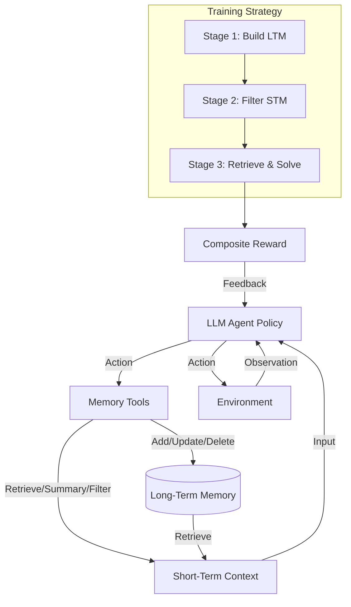

# 代理记忆：学习大语言模型代理的统一长短期记忆管理

## 一、论文基础元数据
- 原文标题：Agentic Memory: Learning Unified Long-Term and Short-Term Memory Management for Large Language Model Agents
- 中文译版：代理记忆：学习大语言模型代理的统一长短期记忆管理
- 发表渠道：预印本（arXiv）
- 发表时间：2025 年
- 链接：arXiv:2601.01885
- 作者及核心机构：Yi Yu, Liuyi Yao 等（机构信息待补充）
- 研究领域：人工智能 + 大语言模型代理/记忆管理
- 关联数据集：ALFWorld, SciWorld, PDDL, BabyAI, HotpotQA（5 个基准，规模/标注待补充）

## 二、论文综合评价
### 2.1 量化评分（1-5 分，5 分为最优）

| 评价维度 | 评分 | 备注 |
| -------- | ---- | ---- |
| 📚 理论基础 | ⭐⭐⭐⭐ | 强化学习与记忆理论结合扎实 |
| 🎯 问题核心性 | ⭐⭐⭐⭐⭐ | 直击 Agent 长程上下文受限痛点 |
| 💡 方法创新性 | ⭐⭐⭐⭐⭐ | 统一长短期记忆的端到端 RL 框架 |
| ⚙️ 技术壁垒 | ⭐⭐⭐⭐ | 三阶段渐进式 RL 训练复杂度较高 |
| 🧪 实验严谨性 | ⭐⭐⭐⭐⭐ | 5 个数据集验证，消融实验充分 |
| 🔧 落地可行性 | ⭐⭐⭐⭐ | 工具化接口清晰，但 RL 训练成本高 |
| 🚀 应用前景 | ⭐⭐⭐⭐⭐ | 自主代理长期推理能力关键突破 |
| 📊 综合评分 | 4.6 | 统一记忆管理方案卓越，显著提升长程任务性能 |

### 2.2 定性综合评价（≤300 字）
> 核心概括：研究定位、核心价值、差异化优势、关键结论
本研究定位为大语言模型代理的长程记忆管理问题。核心价值在于提出 AgeMem 框架，首次通过强化学习统一优化长期记忆（LTM）与短期记忆（STM）。差异化优势在于摒弃启发式规则，采用工具化动作让代理自主决定存储、检索与遗忘。关键结论显示，该方法在 5 个基准上显著优于现有基线（最高提升 21.7%），且能有效降低 Token 消耗并提升记忆质量，验证了端到端策略学习的必要性。

## 三、领域本体论映射
| 核心维度 | 具体内容 |
| -------- | -------- |
| 核心研究对象 | 大语言模型代理（LLM Agents） |
| 核心技术路径 | 强化学习（RL）+ 工具化记忆操作 |
| 数据/载体形态 | 文本交互轨迹、结构化记忆存储 |
| 核心功能目标 | 长程任务中的上下文效率与记忆质量优化 |
| 验证核心指标 | 任务成功率 (SR)、记忆质量 (MQ)、Token 消耗 |

## 四、核心问题与解决方案
### 4.1 待解决的核心问题
1. **领域级根本问题**：LLM 代理在长程任务中受限于上下文窗口，难以维持长期一致性。
2. **现有方法痛点**：长时记忆 (LTM) 和短时记忆 (STM) 分离管理，依赖手工启发式规则，缺乏自适应性。
3. **工程落地卡点**：记忆操作与任务策略割裂，无法端到端优化，导致信用分配困难。

### 4.2 核心解决方案
- 理论框架：将记忆管理视为 Agent 策略的一部分，统一建模为马尔可夫决策过程。
- 核心架构：AgeMem 系统，包含 6 种记忆工具接口（Add, Update, Delete, Retrieve, Summary, Filter）。
- 关键技术：三阶段渐进式强化学习（构建 - 过滤 - 推理）。
- 创新机制：Step-wise GRPO 算法，通过终端优势广播解决长程信用分配问题。

### 4.3 核心优势（量化+定性）
1. 性能优势：相比基线平均提升 4.82 至 8.57 个百分点，最高提升 21.7%。
2. 效率优势：相比纯 RAG 方法减少 5.1% 的 Prompt Token 消耗。
3. 工程优势：工具化接口清晰，支持跨模型泛化（Qwen2.5-7B/Qwen3-4B 均有效）。

## 五、方法与技术架构
### 5.1 核心架构设计
> 文字描述 + 架构图（Mermaid/图片）
AgeMem 架构由代理策略核心与记忆存储模块组成。代理通过调用 6 种工具与记忆模块交互。训练过程分为三个阶段：阶段 1 构建 LTM，阶段 2 管理 STM（过滤/总结），阶段 3 检索记忆完成任务。奖励信号通过 Step-wise GRPO 广播至全轨迹。

### 5.2 关键技术实现细节
| 技术模块 | 实现路径 | 工程注意事项 |
| -------- | -------- | ------------ |
| 记忆工具接口 | 定义 6 种具体 API 动作（增删改查滤总） | 需确保工具描述清晰，避免幻觉调用 |
| 三阶段 RL | 分阶段生成轨迹，统一经验缓冲池 | 阶段切换需平滑，避免分布偏移 |
| 优势计算 | 终端优势广播至所有时间步 (Step-wise GRPO) | 需处理不同任务间奖励尺度差异 |
| 策略优化 | KL 散度正则化防止策略崩溃 | 参考策略需定期更新或固定 |

### 5.3 架构优缺点
- 优点：端到端优化记忆策略，自适应性强，显式控制上下文噪音。
- 缺点：训练成本较高（需多阶段 Rollout），工具集固定限制了细粒度控制。

## 六、实验设计与结果分析
### 6.1 实验基础设置
| 维度 | 内容 |
| ---- | ---- |
| 数据集 | ALFWorld, SciWorld, PDDL, BabyAI, HotpotQA |
| 基线方法 | No-Memory, LangMem, A-Mem, Mem0, Mem0g, AgeMem-noRL |
| 实验环境 | Qwen2.5-7B-Instruct, Qwen3-4B-Instruct |
| 评价指标 | 成功率 (SR), 记忆质量 (MQ), Token 消耗 (TN) |

### 6.2 核心实验结果
| 方法 | 核心指标 1 (SR%) | 核心指标 2 (MQ) | 工程指标（算力/耗时） |
| ---- | --------- | --------- | -------------------- |
| 基线 1 (No-Mem) | 28.0 (Qwen2.5) | 待补充 | 低 |
| 基线 2 (Mem0) | 37.1 (Qwen2.5) | 待补充 | 中 |
| 本文方法 | 41.96 (Qwen2.5) | 0.605 (Qwen3) | 高 (RL 训练) |

### 6.3 消融实验/鲁棒性分析
| 实验变体 | 指标变化 | 核心结论 |
| -------- | -------- | -------- |
| 去除 RL (AgeMem-noRL) | 性能下降 8.5%-8.7% | 验证了策略学习的必要性 |
| 仅任务奖励 (Answer-Only) | 收敛慢，记忆质量低 | 全返回奖励 (All-Returns) 更优 |
| 去除 STM 管理 | 性能显著下降 | 证明长短期记忆统一管理有效 |

### 6.4 实验结论（工程视角）
RL 微调是性能提升的关键，显式奖励记忆行为能优化记忆组织。工具式操作比纯 RAG 更节省 Token 且质量更高。该方法在不同模型规模上泛化性良好，适合资源受限但需长程推理的场景。

## 七、领域贡献与创新点
| 贡献层级 | 具体内容 |
| -------- | -------- |
| 理论贡献 | 提出记忆管理即策略学习的统一理论框架 |
| 方法/架构贡献 | 设计 6 种记忆工具及三阶段渐进式 RL 训练 |
| 数据/工具贡献 | 待补充（未明确发布新数据集） |
| 实验/验证贡献 | 在 5 个主流基准上验证了统一记忆管理的有效性 |
| 工程落地贡献 | 提供了可泛化的 Agent 记忆优化范式，减少 Token 消耗 |

## 八、局限性与风险
| 维度 | 具体描述 | 应对思路 |
| ---- | -------- | -------- |
| 学术局限性 | 任务和环境覆盖范围仍可扩大 | 未来需在更多样化场景中验证 |
| 工程落地风险 | RL 训练成本高，工具集固定 | 优化采样效率，支持动态工具扩展 |
| 伦理/合规风险 | 代理自主记忆可能存储敏感信息 | 增加记忆审计与隐私过滤机制 |

## 九、未来研究/落地方向
| 方向类型 | 具体内容 | 优先级 |
| -------- | -------- | ------ |
| 科研拓展 | 支持更细粒度的记忆控制操作 | 高 |
| 工程优化 | 降低 RL 训练成本，探索离线 RL | 中 |
| 跨领域适配 | 适配多模态代理及代码生成场景 | 中 |

## 十、关键词与术语表
| 语言 | 关键词 |
| ---- | ------ |
| 中文 | 代理记忆，强化学习，长短期记忆，工具学习，信用分配 |
| 英文 | Agentic Memory, Reinforcement Learning, LTM/STM, Tool Learning, Credit Assignment |
| 领域专属术语 | Step-wise GRPO（逐步组相对策略优化）：将终端奖励广播至轨迹所有步骤的算法 |
| 领域专属术语 | All-Returns（全返回奖励）：包含中间返回信息的复合奖励策略 |

## 十一、参考文献与关联资源
- 核心参考文献：待补充（原文未提供具体引用列表）
- 补充阅读：LangMem, A-Mem, Mem0 相关论文
- 开源代码/工具：待补充（需关注作者后续发布）

## 十二、阅读者批注
1. **科研启发**：将记忆管理从“模块”转变为“策略动作”是解决长程依赖的新思路，值得借鉴到其他控制问题。
2. **工程落地思考**：虽然效果好，但 RL 训练成本是瓶颈，实际应用中可考虑蒸馏策略到小模型或使用离线数据预训练。
3. **待验证/存疑点**：在极长上下文（如 100k+）下的表现未明确提及，工具调用的延迟对实时性的影响需评估。
4. **个人/团队应用场景**：适用于需要长期用户画像维护的客服代理，或复杂流程自动化的代码 Agent。

## 十三、阅读元信息
| 维度 | 内容 |
| ---- | ---- |
| 阅读日期 | 2026-04-09 14:14 |
| 阅读人 | xPaperReader AI |
| 文档编号 | arxiv-2601.01885 |
| 版本迭代 | v1.0 |