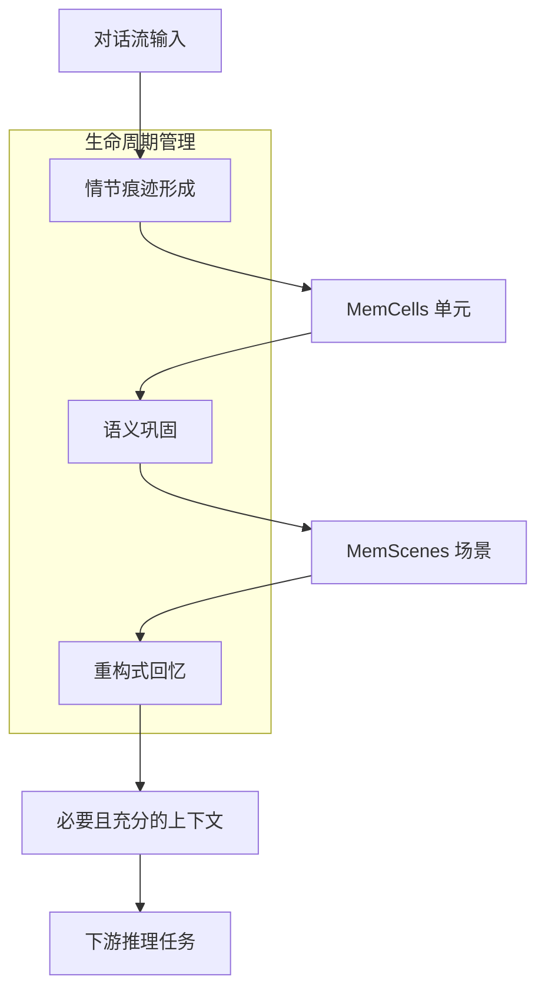

# EverMemOS：用于结构化长程推理的自组织记忆操作系统

## 一、论文基础元数据
- 原文标题：EverMemOS: A Self-Organizing Memory Operating System for Structured Long-Horizon Reasoning
- 中文译版：EverMemOS：用于结构化长程推理的自组织记忆操作系统
- 发表渠道：arXiv 预印本 (cs.AI)
- 发表时间：2025 年 (arXiv v2 2026-01-09)
- 链接：https://arxiv.org/abs/2601.02163
- 作者及核心机构：Chuanrui Hu 等 (EverMind, Shanda Group)
- 研究领域：人工智能 (一级) + 大模型记忆系统/智能体 (二级)
- 关联数据集：LoCoMo, Long-MemEval, PersonaMem-v2 (规模/语言/标注：原文未提及具体细节)

## 二、论文综合评价
### 2.1 量化评分（1-5 分，5 分为最优）

| 评价维度 | 评分 | 备注 |
| -------- | ---- | ---- |
| 📚 理论基础 | ⭐⭐⭐⭐ | 借鉴记忆印迹理论，理论基础较扎实 |
| 🎯 问题核心性 | ⭐⭐⭐⭐⭐ | 直击长程交互中记忆碎片化核心痛点 |
| 💡 方法创新性 | ⭐⭐⭐⭐ | 提出 MemCells 与 MemScenes 分层结构 |
| ⚙️ 技术壁垒 | ⭐⭐⭐ | 系统架构复杂，工程实现难度中等 |
| 🧪 实验严谨性 | ⭐⭐⭐ | 基于主流基准，但原文细节展示不足 |
| 🔧 落地可行性 | ⭐⭐⭐⭐ | 代码已开源，架构模块化程度较高 |
| 🚀 应用前景 | ⭐⭐⭐⭐ | 适用于长程智能体与个性化服务场景 |
| 📊 综合评分 | 3.9 | 架构设计新颖，但长文细节待完整验证 |

### 2.2 定性综合评价（≤300 字）
> 核心概括：研究定位、核心价值、差异化优势、关键结论
本文针对大模型长程交互中记忆碎片化与一致性缺失问题，提出 EverMemOS 记忆操作系统。核心价值在于引入类脑“印迹”生命周期，将离散记录转化为结构化知识。差异化优势在于设计了“情节追踪 - 语义巩固 - 重构回忆”三阶段机制，解决了现有方法仅存储孤立记录的局限。关键结论显示其在 LoCoMo 等基准上优于 SOTA 方法，支持更稳定的长程推理与用户建模，为长期智能体提供了可行的记忆基础设施。

## 三、领域本体论映射
| 核心维度 | 具体内容 |
| -------- | -------- |
| 核心研究对象 | 大语言模型长程交互记忆系统 |
| 核心技术路径 | 自组织记忆生命周期管理 (生成 - 巩固 - 检索) |
| 数据/载体形态 | MemCells (情节单元), MemScenes (语义场景) |
| 核心功能目标 | 维持长期一致性，支持结构化长程推理 |
| 验证核心指标 | 记忆增强推理任务准确率 (原文未提及具体数值) |

## 四、核心问题与解决方案
### 4.1 待解决的核心问题
1. **领域级根本问题**：大模型上下文窗口有限，难以在长程交互中维持连贯行为与一致的人格/用户模型。
2. **现有方法痛点**：现有记忆系统多存储孤立记录，缺乏对演变经验的整合与冲突解决能力，导致记忆碎片化。
3. **工程落地卡点**：超长上下文导致性能下降（如“中间丢失”现象）且计算成本过高。

### 4.2 核心解决方案
- 理论框架：受记忆印迹 (Engram) 启发的计算记忆生命周期。
- 核心架构：三阶段流水线（情节形成、语义巩固、重构回忆）。
- 关键技术：MemCells 原子事实捕捉、MemScenes 主题结构蒸馏、MemScene 引导的代理检索。
- 创新机制：将碎片化情节体验转化为连贯稳定的知识结构，支持时间有界的预见性。

### 4.3 核心优势（量化 + 定性）
1. 性能优势：在 LoCoMo, Long-MemEval 等基准上显著优于最先进方法 (具体提升比例原文未提及)。
2. 效率优势：避免全量上下文输入，通过结构化检索减少计算开销。
3. 工程优势：模块化设计 (存储、检索、过滤、更新统一)，支持代码开源复用。

## 五、方法与技术架构
### 5.1 核心架构设计
> 文字描述 + 架构图（Mermaid/图片）
系统采用三阶段流水线：首先将对话流转化为包含情节痕迹的 MemCells；其次将 MemCells 组织为主题化的 MemScenes 以巩固语义；最后基于 MemScene 引导进行重构式检索，为推理提供必要上下文。

### 5.2 关键技术实现细节
| 技术模块 | 实现路径 | 工程注意事项 |
| -------- | -------- | ------------ |
| 情节痕迹形成 | 对话流转为 MemCells，捕捉原子事实与时间预见 | 需定义时间边界与事实原子性标准 |
| 语义巩固 | 组织 MemCells 为 MemScenes，更新用户画像 | 需处理语义冲突与结构稳定性 |
| 重构式回忆 | MemScene 引导的代理检索，组合上下文 | 需平衡检索覆盖率与上下文长度 |
| 依赖组件 | 大语言模型 (如 GPT-4.1-mini) | 依赖基座模型的推理与生成能力 |

### 5.3 架构优缺点
- 优点：结构化存储利于长程一致性，类脑机制符合认知逻辑，模块化易于扩展。
- 缺点：多阶段处理可能增加延迟，语义巩固过程若出错可能导致错误传播。

## 六、实验设计与结果分析
### 6.1 实验基础设置
| 维度 | 内容 |
| ---- | ---- |
| 数据集 | LoCoMo, Long-MemEval, PersonaMem-v2 |
| 基线方法 | 现有最先进记忆增强方法 (具体名称原文未详述) |
| 实验环境 | 基于 GPT-4.1-mini (图 1 标注) |
| 评价指标 | 记忆增强推理任务准确率/性能 |

### 6.2 核心实验结果
| 方法 | 核心指标 1 (LoCoMo) | 核心指标 2 (Long-MemEval) | 工程指标（算力/耗时） |
| ---- | --------- | --------- | -------------------- |
| 基线 1 | 原文未提及具体数值 | 原文未提及具体数值 | 原文未提及 |
| 基线 2 | 原文未提及具体数值 | 原文未提及具体数值 | 原文未提及 |
| 本文方法 | 显著优于 SOTA(无数值) | 显著优于 SOTA(无数值) | 原文未提及 |

### 6.3 消融实验/鲁棒性分析
| 实验变体 | 指标变化 | 核心结论 |
| -------- | -------- | -------- |
| 原文未提及 | 原文未提及 | 原文未提及 |

### 6.4 实验结论（工程视角）
实验证明 EverMemOS 在主流长程记忆基准上有效，但受限于原文截断，缺乏具体消融数据支持各模块贡献度，工程落地需进一步验证延迟与成本。

## 七、领域贡献与创新点
| 贡献层级 | 具体内容 |
| -------- | -------- |
| 理论贡献 | 提出计算记忆印迹生命周期理论框架 |
| 方法/架构贡献 | 设计 EverMemOS 三阶段自组织记忆架构 |
| 数据/工具贡献 | 开源代码库，支持社区复现与扩展 |
| 实验/验证贡献 | 在多个长程记忆基准上验证了有效性 |
| 工程落地贡献 | 提供了统一存储、检索、过滤、更新的操作系统范式 |

## 八、局限性与风险
| 维度 | 具体描述 | 应对思路 |
| ---- | -------- | -------- |
| 学术局限性 | 原文截断，缺乏详细方法论与消融实验数据 | 等待完整版本或参考开源代码补充 |
| 工程落地风险 | 多阶段处理可能增加系统延迟与复杂度 | 优化检索算法，异步处理巩固阶段 |
| 伦理/合规风险 | 长期用户画像存储涉及隐私数据保护 | 实施数据加密与用户授权机制 |

## 九、未来研究/落地方向
| 方向类型 | 具体内容 | 优先级 |
| -------- | -------- | ------ |
| 科研拓展 | 探索更高效的语义巩固算法，减少幻觉 | 高 |
| 工程优化 | 优化检索延迟，支持高并发智能体场景 | 高 |
| 跨领域适配 | 适配垂直领域（如医疗、法律）的长程记忆需求 | 中 |

## 十、关键词与术语表
| 语言 | 关键词 |
| ---- | ------ |
| 中文 | 记忆操作系统，长程推理，自组织，语义巩固，情节痕迹 |
| 英文 | Memory Operating System, Long-Horizon Reasoning, Self-Organizing, Semantic Consolidation, Episodic Trace |
| 领域专属术语 | MemCells (记忆细胞：捕捉情节痕迹的原子单元), MemScenes (记忆场景：主题化语义结构) |

## 十一、参考文献与关联资源
- 核心参考文献：Liu et al., 2024 (Lost-in-the-Middle); Wu et al., 2025; Li et al., 2025 (Memory OS)
- 补充阅读：关于大模型长上下文窗口限制的相关研究
- 开源代码/工具：https://github.com/EverMind-AI/EverMemOS

## 十二、阅读者批注
1. **科研启发**：将生物学记忆印迹理论引入计算系统是一个很好的跨学科切入点，值得深入研究其数学形式化。
2. **工程落地思考**：三阶段流水线在实际高并发服务中如何保证一致性？需要关注状态锁机制。
3. **待验证/存疑点**：原文截断导致无法确认“时间有界预见性”的具体实现逻辑，需查阅完整版。
4. **个人/团队应用场景**：可尝试应用于长期陪伴型智能体或个性化教育助手场景。

## 十三、阅读元信息
| 维度 | 内容 |
| ---- | ---- |
| 阅读日期 | 2026-04-09 14:29 |
| 阅读人 | xPaperReader AI |
| 文档编号 | arxiv-2601.02163 |
| 版本迭代 | v1.0 |