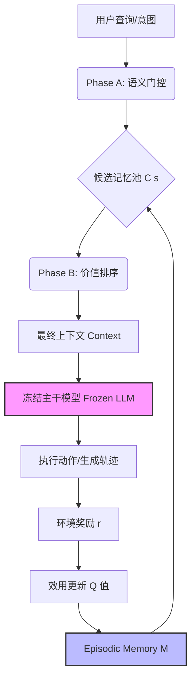

# MemRL：基于 episodic memory 运行时强化学习的自进化智能体

## 一、论文基础元数据
- 原文标题：MemRL: Self-Evolving Agents via Runtime Reinforcement Learning on Episodic Memory
- 中文译版：MemRL：基于 episodic memory 运行时强化学习的自进化智能体
- 发表渠道：预印本（arXiv）
- 发表时间：2025 年
- 链接：https://arxiv.org/abs/2601.03192
- 作者及核心机构：Shengtao Zhang 等 14 人（机构信息待补充）
- 研究领域：人工智能（大模型代理/强化学习/持续学习）
- 关联数据集：HLE, BigCodeBench, ALFWorld, Lifelong Agent Bench（多领域/多语言/自动标注）

## 二、论文综合评价
### 2.1 量化评分（1-5 分，5 分为最优）

| 评价维度 | 评分 | 备注 |
| -------- | ---- | ---- |
| 📚 理论基础 | ⭐⭐⭐⭐ | 基于 GEM 框架证明收敛性与方差有界 |
| 🎯 问题核心性 | ⭐⭐⭐⭐⭐ | 直击代理持续学习中的稳定性 - 可塑性困境 |
| 💡 方法创新性 | ⭐⭐⭐⭐⭐ | 首次将 RL 价值函数应用于外部记忆检索排序 |
| ⚙️ 技术壁垒 | ⭐⭐⭐⭐ | 双阶段检索与效用更新机制实现复杂度高 |
| 🧪 实验严谨性 | ⭐⭐⭐⭐⭐ | 覆盖四个基准测试，包含消融与迁移验证 |
| 🔧 落地可行性 | ⭐⭐⭐⭐⭐ | 冻结主干模型，算法开销可忽略，易部署 |
| 🚀 应用前景 | ⭐⭐⭐⭐⭐ | 适用于企业级多代理协作与长周期任务场景 |
| 📊 综合评分 | 4.7 | 非参数化自进化范式，兼具理论保证与工程价值 |

### 2.2 定性综合评价（≤300 字）
> 核心概括：研究定位、核心价值、差异化优势、关键结论

MemRL 定位为一种非参数化的代理自进化框架，核心价值在于解耦了“稳定推理”与“动态经验积累”。其差异化优势在于将记忆检索从被动语义匹配升级为主动基于效用的决策过程，通过运行时强化学习更新记忆 Q 值，无需微调模型权重。关键结论表明，该方法在显著降低遗忘率（0.041）的同时，实现了跨模型的知识迁移，为资源受限下的代理持续优化提供了新范式。

## 三、领域本体论映射
| 核心维度 | 具体内容 |
| -------- | -------- |
| 核心研究对象 | 大语言模型代理（LLM Agents）的持续学习过程 |
| 核心技术路径 | 冻结主干模型 + 外部 Episodic Memory + 运行时 RL 优化 |
| 数据/载体形态 | 结构化三元组记忆（意图 - 经验 - 效用） |
| 核心功能目标 | 实现部署后的自我进化，平衡稳定性与可塑性 |
| 验证核心指标 | 任务成功率（SR）、遗忘率、Q 值预测相关性、累积成功率 |

## 四、核心问题与解决方案
### 4.1 待解决的核心问题
1. **领域级根本问题**：AI 代理在部署后如何持续学习新任务而不遗忘旧知识（稳定性 - 可塑性困境）。
2. **现有方法痛点**：微调成本高且易灾难性遗忘；传统 RAG 仅基于语义相似度，无法区分高价值策略与噪声。
3. **工程落地卡点**：运行时学习带来的延迟开销与记忆更新的安全性（奖励黑客）。

### 4.2 核心解决方案
- 理论框架：将记忆交互形式化为马尔可夫决策过程（MDP），基于广义期望最大化（GEM）证明收敛。
- 核心架构：双阶段检索机制（语义门控 + 价值排序）+ 效用驱动更新机制。
- 关键技术：非参数化 RL（仅更新记忆 Q 值）、Intent-Experience-Utility 三元组结构。
- 创新机制：基于复合评分（相似度+Q 值）的检索策略，蒙特卡洛风格效用更新。

### 4.3 核心优势（量化 + 定性）
1. 性能优势：累积成功率比 MemP 高 11.2%，遗忘率降低至 0.041。
2. 效率优势：算法开销可忽略（检索为向量点积，更新为 O(1) 标量操作）。
3. 工程优势：支持跨模型记忆迁移，弱模型增益显著（成功率提升 3 倍+），无需重新训练。

## 五、方法与技术架构
### 5.1 核心架构设计
MemRL 架构分为记忆交互与更新两个闭环。查询进入双阶段检索模块，获取高效用记忆辅助生成，执行后根据环境奖励更新记忆 Q 值。

### 5.2 关键技术实现细节
| 技术模块 | 实现路径 | 工程注意事项 |
| -------- | -------- | ------------ |
| 记忆结构 | 存储 (z_i, e_i, Q_i) 三元组，z 为意图嵌入 | 需确保意图嵌入与查询嵌入空间一致 |
| 双阶段检索 | 先余弦相似度粗筛，后 (1-λ)sim + λQ 精排 | λ 建议设为 0.5 以平衡探索与利用 |
| 效用更新 | Q_new ← Q_old + α(r - Q_old)，蒙特卡洛风格 | 步长α需调整以防震荡，注意奖励信号噪声 |
| 依赖组件 | 向量数据库（存储记忆）、奖励模型/验证器 | 奖励验证器准确性直接影响 Q 值可靠性 |

### 5.3 架构优缺点
- 优点：无需反向传播，计算成本极低；记忆可模块化合并，支持多任务共存；具备跨模型迁移能力。
- 缺点：依赖高质量奖励信号，存在奖励黑客风险；多记忆引用时信用分配模糊；低任务密度下效果受限。

## 六、实验设计与结果分析
### 6.1 实验基础设置
| 维度 | 内容 |
| ---- | ---- |
| 数据集 | HLE, BigCodeBench, ALFWorld, Lifelong Agent Bench |
| 基线方法 | No Memory, RAG, Self-RAG, Mem0, MemP |
| 实验环境 | 多模型对比（Gemini, Qwen, GPT 等），API 调用环境 |
| 评价指标 | 成功率 (SR)、累积成功率 (CSR)、遗忘率、Q 值相关性 |

### 6.2 核心实验结果
| 方法 | 核心指标 1 (遗忘率) | 核心指标 2 (CSR 增益) | 工程指标（算力/耗时） |
| ---- | --------- | --------- | -------------------- |
| MemP | 0.051 | 基准 | 低开销 |
| No Memory | 待补充 | -12.6% (相对 MemRL) | 最低开销 |
| 本文方法 | 0.041 | +11.2% (相对 MemP) | 毫秒级检索，O(1) 更新 |

### 6.3 消融实验/鲁棒性分析
| 实验变体 | 指标变化 | 核心结论 |
| -------- | -------- | -------- |
| 仅语义检索 | 性能显著下降 | 证明价值排序（Q 值）至关重要 |
| 跨模型迁移 | 成功率提升 10.6% | 记忆捕获了模型无关的解题模式 |
| 记忆合并 | 性能波动 <0.4% | 支持模块化扩展，干扰可忽略 |

### 6.4 实验结论（工程视角）
MemRL 在多步复杂任务中增益最大，适合长周期任务场景。算法延迟主要在 API 调用而非检索本身，具备实际部署可行性。跨模型迁移特性允许企业构建共享记忆池服务于不同规模模型。

## 七、领域贡献与创新点
| 贡献层级 | 具体内容 |
| -------- | -------- |
| 理论贡献 | 证明基于 GEM 框架的收敛性与方差有界性，提供理论保证 |
| 方法/架构贡献 | 提出非参数化运行时 RL 框架，解耦推理与经验积累 |
| 数据/工具贡献 | 构建结构化 Intent-Experience-Utility 记忆三元组 |
| 实验/验证贡献 | 在四个多样化基准上验证，包含跨模型迁移与记忆合并实验 |
| 工程落地贡献 | 提供低开销、低遗忘、可迁移的代理进化方案 |

## 八、局限性与风险
| 维度 | 具体描述 | 应对思路 |
| ---- | -------- | -------- |
| 学术局限性 | 长程轨迹步级更新可能引入高方差噪声 | 未来探索多步更新或周期性记忆巩固 |
| 工程落地风险 | 奖励黑客（Reward Hacking），错误高 Q 值传播 | 引入更鲁棒的验证器，设置 Q 值上限或置信度阈值 |
| 伦理/合规风险 | 记忆库可能存储敏感交互数据 | 实施记忆加密、访问控制及定期清洗机制 |

## 九、未来研究/落地方向
| 方向类型 | 具体内容 | 优先级 |
| -------- | -------- | ------ |
| 科研拓展 | 引入 Shapley 方法解决多记忆信用分配问题 | 高 |
| 工程优化 | 探索“定期微调 + 运行时 MemRL"混合架构 | 中 |
| 跨领域适配 | 适配多智能体记忆共享场景，构建企业级记忆池 | 高 |

## 十、关键词与术语表
| 语言 | 关键词 |
| ---- | ------ |
| 中文 | 运行时强化学习、episodic memory、自进化代理、稳定性 - 可塑性困境 |
| 英文 | Runtime RL, Episodic Memory, Self-Evolving Agents, Stability-Plasticity Dilemma |
| 领域专属术语 | Intent-Experience-Utility 三元组：记忆的结构化表示形式；广义期望最大化 (GEM)：用于证明收敛性的理论框架 |

## 十一、参考文献与关联资源
- 核心参考文献：待补充（原文未提供完整列表）
- 补充阅读：RAG, Self-RAG, MemP 相关论文
- 开源代码/工具：待补充（目前为预印本状态）

## 十二、阅读者批注
1. **科研启发**：将 RL 从优化模型参数转向优化外部记忆，为持续学习提供了新视角，值得在非参数化学习领域推广。
2. **工程落地思考**：非常适合构建企业级知识库助手，尤其是当基座模型固定但业务场景频繁变化时，可低成本实现适配。
3. **待验证/存疑点**：奖励信号的获取成本在实际场景中可能较高，自动化验证器的准确率对系统性能影响需进一步评估。
4. **个人/团队应用场景**：可用于内部代码生成助手，积累高质量代码片段记忆，提升重复任务解决效率。

## 十三、阅读元信息
| 维度 | 内容 |
| ---- | ---- |
| 阅读日期 | 2026-04-09 14:43 |
| 阅读人 | xPaperReader AI |
| 文档编号 | arxiv-2601.03192 |
| 版本迭代 | v1.0 |