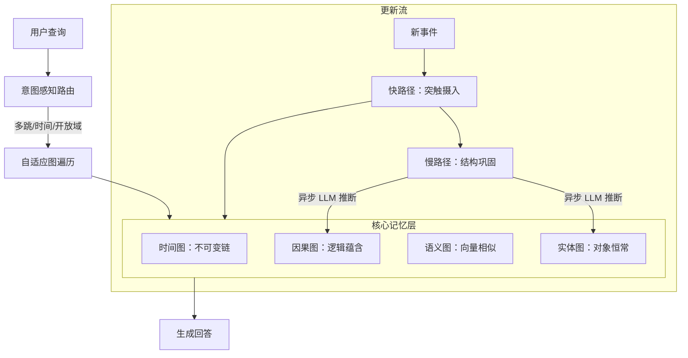

# MAGMA：基于多图的智能体记忆架构

## 一、论文基础元数据
- 原文标题：MAGMA: A Multi-Graph based Agentic Memory Architecture for AI Agents
- 中文译版：MAGMA：基于多图的智能体记忆架构
- 发表渠道：预印本（arXiv）
- 发表时间：2025 年
- 链接：arXiv:2601.03236
- 作者及核心机构：Dongming Jiang, Yi Li, Guanpeng Li, Bingzhe Li（机构待补充）
- 研究领域：人工智能（一级）+ AI 智能体/记忆架构（二级）
- 关联数据集：LoCoMo（长对话，~9K tokens）、LongMemEval（压力测试，>100K tokens）

## 二、论文综合评价
### 2.1 量化评分（1-5 分，5 分为最优）

| 评价维度 | 评分 | 备注 |
| -------- | ---- | ---- |
| 📚 理论基础 | ⭐⭐⭐⭐ | 图论与记忆理论结合扎实，正交表示新颖 |
| 🎯 问题核心性 | ⭐⭐⭐⭐⭐ | 直击长程推理中信息纠缠与丢失痛点 |
| 💡 方法创新性 | ⭐⭐⭐⭐⭐ | 多图正交结构与双流进化机制具突破性 |
| ⚙️ 技术壁垒 | ⭐⭐⭐⭐ | 多图维护与异步巩固增加工程复杂度 |
| 🧪 实验严谨性 | ⭐⭐⭐⭐ | 引入 LLM-as-a-Judge，评估维度更全面 |
| 🔧 落地可行性 | ⭐⭐⭐ | 相比纯向量系统，存储与计算开销较高 |
| 🚀 应用前景 | ⭐⭐⭐⭐⭐ | 为长周期智能体记忆提供高效新范式 |
| 📊 综合评分 | 4.3 | 架构创新显著，平衡了准确率与效率 |

### 2.2 定性综合评价（≤300 字）
> 核心概括：研究定位、核心价值、差异化优势、关键结论

本研究定位为 AI 智能体长期记忆架构，核心价值在于解决现有记忆增强生成（MAG）系统依赖单一语义检索导致的信息纠缠问题。差异化优势在于提出多图正交表示（语义、时间、因果、实体）与双流进化机制（快路径摄入、慢路径巩固）。关键结论表明，MAGMA 在保持低推理延迟（1.47 秒）的同时，显著提升了长程推理准确率（Judge Score 0.700），有效克服了时间幻觉与信息丢失，为 Agent 长期记忆提供了可解释且高效的新范式。

## 三、领域本体论映射
| 核心维度 | 具体内容 |
| -------- | -------- |
| 核心研究对象 | AI 智能体的长期记忆存储与检索机制 |
| 核心技术路径 | 多图结构正交表示 + 策略引导的图遍历 |
| 数据/载体形态 | 时间变异有向多图（$\mathcal{G}_t$） |
| 核心功能目标 | 实现长程推理中的信息准确召回与因果解析 |
| 验证核心指标 | LLM-as-a-Judge 语义评分、查询延迟、Token 消耗 |

## 四、核心问题与解决方案
### 4.1 待解决的核心问题
1. **领域级根本问题**：长程推理中时间、因果和实体信息相互纠缠，导致推理准确性下降。
2. **现有方法痛点**：单一语义相似度检索无法区分时间顺序与因果逻辑，易产生幻觉。
3. **工程落地卡点**：复杂图结构构建耗时，影响实时交互体验，写入阻塞严重。

### 4.2 核心解决方案
- 理论框架：多图谱记忆理论，解耦记忆表示与检索逻辑。
- 核心架构：MAGMA 架构，包含数据结构层、记忆进化层、检索机制层。
- 关键技术：四图正交表示（时间/因果/语义/实体）、双流更新机制、自适应遍历策略。
- 创新机制：意图感知路由动态调整图遍历权重，异步后台结构巩固。

### 4.3 核心优势（量化+定性）
1. 性能优势：LoCoMo 基准得分 0.700，显著优于 Full Context (0.481) 及 Nemori (0.59)。
2. 效率优势：查询延迟 1.47 秒，比次优基线快约 40%；上下文开销减少 95% 以上。
3. 工程优势：双流架构平衡构建时间与查询效率，无阻塞 LLM 推理。

## 五、方法与技术架构
### 5.1 核心架构设计
MAGMA 采用双流架构处理记忆摄入与巩固，底层存储为四种正交关系图。查询时通过意图路由动态遍历图谱。

### 5.2 关键技术实现细节
| 技术模块 | 实现路径 | 工程注意事项 |
| -------- | -------- | ------------ |
| 多图谱构建 | 构建时间变异有向多图，四图正交存储 | 需确保节点 ID 在不同图间的一致性映射 |
| 双流更新 | 快路径即时索引，慢路径异步 LLM 推断因果 | 慢路径需控制频率，避免资源耗尽 |
| 自适应遍历 | 根据查询类型动态调整边权重（如因果权重） | 权重策略需经实验调优，防止过拟合 |
| 时间 Grounding | 构建期间标准化相对日期为具体日期 | 需处理时区与模糊时间表达式的解析 |

### 5.3 架构优缺点
- 优点：信息解耦清晰，支持复杂推理，检索效率高，可解释性强。
- 缺点：多图维护存储开销大，依赖底层 LLM 提取质量，工程复杂度高。

## 六、实验设计与结果分析
### 6.1 实验基础设置
| 维度 | 内容 |
| ---- | ---- |
| 数据集 | LoCoMo（长对话）、LongMemEval（超长上下文） |
| 基线方法 | Full Context, A-MEM, MemoryOS, Nemori |
| 实验环境 | 待补充（通常为标准 GPU 服务器） |
| 评价指标 | LLM-as-a-Judge 语义评分、F1、延迟、Token 消耗 |

### 6.2 核心实验结果
| 方法 | 核心指标 1 (Judge Score) | 核心指标 2 (Overall F1) | 工程指标（算力/耗时） |
| ---- | --------- | --------- | -------------------- |
| Full Context | 0.481 | 待补充 | 101k tokens 上下文 |
| Nemori | 0.590 | 0.502 | 构建时间优于 MAGMA |
| 本文方法 | 0.700 | 0.467 | 1.47 秒延迟，3.37k tokens |

### 6.3 消融实验/鲁棒性分析
| 实验变体 | 指标变化 | 核心结论 |
| -------- | -------- | -------- |
| 移除因果图 | 得分下降 | 因果推理能力显著受损 |
| 移除时间图 | 得分下降 | 时间定位准确性降低 |
| 单流架构 | 延迟增加 | 写入阻塞影响查询响应速度 |

### 6.4 实验结论（工程视角）
MAGMA 在语义准确性上取得最佳平衡，虽传统 F1 略低于部分基线，但更符合实际推理需求。查询延迟最优，适合对实时性要求高的 Agent 场景，但需承担更高的存储与维护成本。

## 七、领域贡献与创新点
| 贡献层级 | 具体内容 |
| -------- | -------- |
| 理论贡献 | 提出记忆正交表示理论，解耦语义、时间、因果与实体 |
| 方法/架构贡献 | 设计 MAGMA 双流架构与策略引导的图遍历机制 |
| 数据/工具贡献 | 验证了 LLM-as-a-Judge 在记忆任务中的有效性 |
| 实验/验证贡献 | 在 LoCoMo 与 LongMemEval 上确立新 SOTA 语义评分 |
| 工程落地贡献 | 提供异步结构巩固方案，解决图构建阻塞问题 |

## 八、局限性与风险
| 维度 | 具体描述 | 应对思路 |
| ---- | -------- | -------- |
| 学术局限性 | 评估主要集中在文本对话，多模态场景未验证 | 未来扩展至视觉 - 语言多模态记忆图 |
| 工程落地风险 | 多图子结构带来较高存储与工程开销 | 优化图压缩算法，采用分层存储策略 |
| 伦理/合规风险 | 依赖 LLM 推断因果，可能存在偏见传播 | 增加人工校验环节，限制敏感领域自动推断 |

## 九、未来研究/落地方向
| 方向类型 | 具体内容 | 优先级 |
| -------- | -------- | ------ |
| 科研拓展 | 探索多模态异构观察流的图谱适配 | 高 |
| 工程优化 | 降低图存储开销，优化异步巩固调度 | 高 |
| 跨领域适配 | 应用于法律、医疗等强因果推理领域 | 中 |

## 十、关键词与术语表
| 语言 | 关键词 |
| ---- | ------ |
| 中文 | 智能体记忆、多图架构、长程推理、双流更新、语义评分 |
| 英文 | Agentic Memory, Multi-Graph, Long-horizon Reasoning, Dual-stream, LLM-as-a-Judge |
| 领域专属术语 | 时间 Grounding（时间锚定）、正交表示（Orthogonal Representation）、虚假奖励（False Rewards） |

## 十一、参考文献与关联资源
- 核心参考文献：待补充（原文未提供具体引用列表）
- 补充阅读：RAG 相关综述、知识图谱构建技术
- 开源代码/工具：待补充（若开源需跟踪 arXiv 页面）

## 十二、阅读者批注
1. **科研启发**：记忆结构的正交解耦思路可迁移至其他多任务学习场景，避免任务间干扰。
2. **工程落地思考**：双流架构中的慢路径异步处理是降低延迟的关键，实际部署需注意消息队列稳定性。
3. **待验证/存疑点**：传统 F1 指标略低的原因是否因语义评分标准过松？需进一步对比人工评估。
4. **个人/团队应用场景**：适用于需要长期上下文记忆的客服助手或个人知识管理 Agent。

## 十三、阅读元信息
| 维度 | 内容 |
| ---- | ---- |
| 阅读日期 | 2026-04-09 14:55 |
| 阅读人 | xPaperReader AI |
| 文档编号 | arxiv-2601.03236 |
| 版本迭代 | v1.0 |