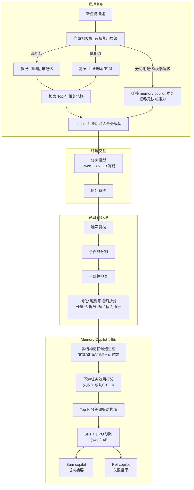

# 学习如何记忆：一种面向结构化与可迁移智能体记忆的元认知管理方法

## 一、论文基础元数据

- **原文标题**：Learning How to Remember: A Meta-Cognitive Management Method for Structured and Transferable Agent Memory
- **中文译版**：学习如何记忆：一种面向结构化与可迁移智能体记忆的元认知管理方法
- **发表渠道**：arXiv 预印本（标注等级：待补充，暂无同行评审信息）
- **发表时间**：2025 年
- **链接**：arXiv:2601.07470
- **作者及核心机构**：Sirui Liang、Pengfei Cao、Jian Zhao、Wenhao Teng、Xiangwen Liao、Jun Zhao、Kang Liu（核心机构待补充，推测为中国科学院自动化研究所/相关高校团队）
- **研究领域**：
  - 一级领域：人工智能 / 大语言模型
  - 二级子领域：LLM Agent 记忆管理、元认知学习、长时程决策与迁移学习
- **关联数据集**：
  - **ALFWorld**：家庭具身长时程交互任务，含 Seen / Unseen 划分；语言：英文；标注：环境提供稀疏成功奖励
  - **ScienceWorld**：多步科学推理交互任务，含 Dev / Test 划分；语言：英文；标注：子目标完成度 reward
  - **BabyAI**：2D 网格世界导航任务，用于跨域迁移评估；语言：英文；标注：任务成功信号
  - 规模信息：待补充（论文汇总中未提供具体样本数量）

---

## 二、论文综合评价

### 2.1 量化评分

| 评价维度 | 评分 | 备注 |
| -------- | ---- | ---- |
| 📚 理论基础 | ⭐⭐⭐⭐ | 元认知+记忆解耦理论框架清晰，借鉴偏好优化成熟范式 |
| 🎯 问题核心性 | ⭐⭐⭐⭐⭐ | 直击 Agent 记忆"如何抽象复用"这一核心痛点 |
| 💡 方法创新性 | ⭐⭐⭐⭐⭐ | 将记忆管理升格为可学习元技能，解耦任务与记忆 |
| ⚙️ 技术壁垒 | ⭐⭐⭐⭐ | 轨迹树化+DPO偏好对构造+层级复用，工程链路较长 |
| 🧪 实验严谨性 | ⭐⭐⭐⭐ | 三环境+多骨干+跨模型迁移，但缺方差/显著性检验 |
| 🔧 落地可行性 | ⭐⭐⭐⭐ | 小模型 copilot+冻结大模型，成本可控易复现 |
| 🚀 应用前景 | ⭐⭐⭐⭐⭐ | 通用 Agent 记忆基础设施，跨闭源模型迁移已验证 |
| 📊 综合评分 | 4.4 | 理论扎实、创新突出，实验覆盖广但严谨性有提升空间 |

### 2.2 定性综合评价（≤300字）

> 本研究定位为 LLM Agent 记忆范式的变革性工作，将"记忆如何抽象、组织与复用"从固定的检索式流程升格为**可学习的元认知技能**。核心价值在于提出 **MCMA** 框架：通过冻结任务模型、独立训练轻量 memory copilot，以 SFT+DPO 优化记忆的抽象与结构化策略，并利用连续抽象参数 α 与层级结构实现跨任务、跨模型迁移。差异化优势有三：其一，记忆结构与粒度不再预设，由 copilot 自适应组合（文本/键值/链/树）；其二，成功摘要与失败反思互补，显著提升长时程决策；其三，可迁移的是"记忆管理能力"本身而非具体知识，已验证可从 Qwen3-32B 迁移至 GPT-4o-mini 等闭源模型。关键结论：在 ALFWorld、ScienceWorld、BabyAI 上同时实现成功率、效率与泛化性的同步提升，尤其利于小模型与未见环境，标志着 Agent 记忆研究由"检索复用"迈向"学会记忆"。

---

## 三、领域本体论映射

| 核心维度 | 具体内容 |
| -------- | -------- |
| 核心研究对象 | LLM Agent 的长时程交互轨迹与其结构化、可迁移记忆表示 |
| 核心技术路径 | 元认知记忆抽象（MCMA）：冻结任务模型 + 可学习 memory copilot + SFT/DPO 偏好优化 |
| 数据/载体形态 | 文本化交互轨迹（转换/剪枝/切分为树）→ 多结构复合记忆（文本、键值、链、树） |
| 核心功能目标 | 学习"如何记忆"：自动抽象、组织和复用经验以提升长时程决策与跨域泛化 |
| 验证核心指标 | ALFWorld 成功率 Acc%、平均步数；ScienceWorld reward；BabyAI 迁移 reward |

---

## 四、核心问题与解决方案

### 4.1 待解决的核心问题

1. **领域级根本问题**：
   Agent 能否学会"如何记住"和"如何抽象经验"，而不仅仅是被动"记住什么"？现有记忆系统缺乏对记忆管理过程本身的元认知学习能力。

2. **现有方法痛点**：
   - 内容检索式（轨迹级/子任务级/步骤级）与执行指导式（程序模式/启发式规则）均采用**固定的记忆表示和检索粒度**；
   - 抽象层级预定义或隐式固定，无法适应不同任务；
   - 容易过拟合表面相似性，在环境/任务变化时产生**负迁移**。

3. **工程落地卡点**：
   - 若记忆管理与任务模型耦合训练，需改动大模型参数，成本高且破坏原有能力；
   - 记忆复用策略需跨模型、跨任务泛化，难以在不重训的情况下迁移；
   - 成功经验的盲目复用反而有害（ScienceWorld 场景下已验证）。

### 4.2 核心解决方案

- **理论框架**：元认知记忆抽象（Meta-Cognitive Memory Abstraction, MCMA）——将经验复用视为可学习问题，通过"记忆副驾驶"独立承担记忆管理角色。
- **核心架构**：
  - **冻结任务模型**（Qwen3-8B / Qwen3-32B）：仅负责推理执行；
  - **可训练 memory copilot**（统一 Qwen3-4B）：负责记忆的抽象、组织与复用；
  - 二者解耦，学习集中在 copilot。
- **关键技术**：
  1. 轨迹预处理：噪声剪枝 → 子任务分割 → 一致性检查 → 树化（长度 ≥3 递归粗到细拆分，短片段为原子叶）；
  2. 多结构记忆生成：从结构原语（文本/键值/链/树）组合候选记忆，引入连续抽象参数 α 控制抽象层级；
  3. Memory Copilot 进化：对候选记忆下游任务打分（失败 0，成功 0.1–1.0），选 Top-K 分差对训练 SFT+DPO；
  4. 双层 copilot：Sum copilot（成功摘要）+ Ref copilot（失败反思）；
  5. 层级复用：新任务按任务描述向量相似度选择抽象层级；极端分布偏移时迁移 copilot 本身。
- **创新机制**：将"记忆抽象策略"从具体的轨迹知识中剥离，实现**元认知能力的独立训练与迁移**。

### 4.3 核心优势（量化+定性）

1. **性能优势**：
   - Qwen3-32B 在 ALFWorld 上：MCMA(Sum+Ref) Seen 90.71%、Unseen 90.30%，显著优于无记忆基线（+近 25%）；
   - ScienceWorld + Qwen3-8B 获得近 10% 绝对增益；
   - 跨模型迁移（Qwen3-32B copilot → Gemini-2.5-Flash / GPT-4o-mini）性能接近原生。
2. **效率优势**：
   - 显著减少平均执行步数（ALFWorld Seen 17.78 / Unseen 18.00），动作序列更简洁；
   - memory copilot 仅用 Qwen3-4B 承担元认知角色，训练/推理成本低。
3. **工程优势**：
   - 任务模型完全冻结，避免破坏原有能力，无需微调大模型；
   - 记忆策略可跨模型迁移（已验证向闭源模型迁移），适配不同 backbone；
   - 结构与抽象层级自适应，无需人工预设记忆 schema。

---

## 五、方法与技术架构

### 5.1 核心架构设计

> MCMA 的核心思想是：将任务模型与记忆管理彻底解耦，让 memory copilot 通过偏好优化学习"如何抽象与复用经验"。整体流程为：原始轨迹经预处理形成树结构 → copilot 生成多结构候选记忆 → 下游任务打分构造偏好对 → SFT+DPO 训练 copilot → 推理时按任务相似度检索并注入任务模型。

### 5.2 关键技术实现细节

| 技术模块 | 实现路径 | 工程注意事项 |
| -------- | -------- | ------------ |
| 轨迹预处理 | 噪声剪枝→子任务分割→一致性检查→递归树化，长度≥3 动作继续拆分，短片段作原子叶 | 需设定剪枝阈值与最小片段长度，避免过度切分丢失关键上下文 |
| 多结构记忆生成 | 从结构原语（自然文本/键值对/链/树）组合候选复合结构；连续抽象参数 α 控层 | α 过小保留细节易负迁移，α 过大过度抽象丢关键信息，需按域调优 |
| 下游打分与偏好对构造 | 失败=0 分，成功按执行长度给 0.1–1.0 分；选分差最大 Top-K 对 | 打分需稳定可复现；偏好对筛选需平衡正负样本，避免噪声对污染 DPO |
| SFT + DPO 训练 | 成功轨迹训练 Sum copilot，失败轨迹训练 Ref copilot，分别进行偏好优化 | DPO 训练需足够多样的偏好对；未训练的 copilot 在 unseen 上明显退化（-7.13%） |
| 层级检索与复用 | 任务描述向量相似度决定使用低层细节或高层抽象；Top-N 轨迹检索 | 相似度阈值设定关键；高相似→低层/低相似→高层的映射需按域验证 |
| 跨域 copilot 迁移 | 迁移 memory copilot（而非轨迹）到新任务/新模型（含闭源），实现元认知能力转移 | 模型间接口格式需兼容；不同 backbone 对注入格式敏感度不同 |
| 依赖组件 | Qwen3-4B（copilot）、Qwen3-8B/32B（任务模型）、Gemini-2.5-Flash / GPT-4o-mini（迁移验证） | 需统一记忆注入模板；闭环反馈需记录 copilot 版本与训练数据来源 |

### 5.3 架构优缺点

- **优点**：
  1. 任务模型与记忆管理解耦，任务模型完全冻结，不破坏原始能力、无需微调大模型；
  2. 记忆结构与抽象层级自适应，摆脱人工 schema 设计；
  3. memory copilot 轻量（Qwen3-4B），训练与推理成本低；
  4. 元认知能力可跨任务、跨模型（含闭源）迁移，具备通用基础设施潜力；
  5. 成功摘要与失败反思互补，兼顾"该做什么"与"该避免什么"。
- **缺点**：
  1. 训练流程长：需轨迹树化、候选生成、下游打分、偏好对构造、SFT+DPO 多阶段；
  2. 依赖下游任务反馈构造偏好对，冷启动与反馈噪声影响大；
  3. 抽象参数 α、Top-K、Top-N 等多个超参需按域调优；
  4. 成功记忆并非总是有益（ScienceWorld 中反而有害），需按环境选择性启用；
  5. 实验仅覆盖文本交互环境，多模态/真实具身场景未验证。

---

## 六、实验设计与结果分析

### 6.1 实验基础设置

| 维度 | 内容 |
| ---- | ---- |
| 数据集 | ALFWorld（Seen/Unseen）、ScienceWorld（Dev/Test）、BabyAI（跨域迁移） |
| 基线方法 | No Memory、ReAct、Raw Trajectory、TRAD、ExpeL |
| 实验环境 | 任务模型 Qwen3-8B / Qwen3-32B（冻结）；memory copilot Qwen3-4B；迁移至 Gemini-2.5-Flash、GPT-4o-mini |
| 评价指标 | ALFWorld：成功率 Acc%、平均步数；ScienceWorld：平均任务 reward；BabyAI：成功率与 reward |

### 6.2 核心实验结果

| 方法 | 核心指标1（ALFWorld Seen Acc） | 核心指标2（ALFWorld Unseen Acc / 步数） | 工程指标（算力/耗时） |
| ---- | --------- | --------- | -------------------- |
| No Memory | 待补充（基线对照，推测约 65–75%） | 待补充 | 无记忆、无额外训练 |
| ReAct | 待补充 | 待补充 | 无额外训练 |
| Raw Trajectory | 待补充 | 待补充 | 检索式，无训练 |
| TRAD | 待补充 | 待补充 | 检索式，无训练 |
| ExpeL | 待补充 | 待补充 | 启发式提取，无训练 |
| MCMA(Base) | 83.58% | 待补充 | 无 DPO，仅基础 copilot |
| MCMA(Gemini) | 86.56% | 待补充 | 使用 Gemini 生成候选 |
| **MCMA(DPO, Sum+Ref)** | **90.71%** | **90.30% / 18.00 步** | Qwen3-4B copilot + SFT+DPO |

> 注：原始论文汇总未提供全部基线的具体数值，上表部分字段标注为"待补充"，仅保留汇总中明确给出的数据。

### 6.3 消融实验/鲁棒性分析

| 实验变体 | 指标变化 | 核心结论 |
| -------- | -------- | -------- |
| MCMA(Sum+Ref) vs Sum-only / Ref-only | 全组件显著优于单组件 | 成功摘要与失败反思互补，缺一不可 |
| MCMA(Sum+Ref) vs Natural Language Know / Chain Know | 结构化记忆优于单一结构 | 多结构复合记忆优于固定结构 |
| MCMA(DPO) vs MCMA(Base) vs MCMA(Gemini) | 83.58% → 86.56% → 90.71% | DPO 训练对可迁移抽象能力至关重要 |
| 未训练 Qwen3-4B / Gemini-2.5-flash 在 unseen | Acc 分别下降 7.13% 和 4.15% | 训练必要性明确，泛化依赖 copilot 学习 |
| 结构化知识条数 4–5 条 | 效果最佳 | 过少信息不足，过多增加上下文负担 |
| 顶层结构：Tree≈70% / Chain≈20% | 结构替换性能下降 | copilot 自动选择的结构策略有效 |
| ALFWorld → BabyAI：Abstract Level 1 | 13.54%（-3.13%） | 低层细节易负迁移 |
| ALFWorld → BabyAI：Abstract Level 2 | 17.71%（+1.04%），reward 15.33 | 高层抽象利于跨域泛化 |
| 跨域 Copilot 迁移（ALFWorld ↔ ScienceWorld） | Base 19.18 / 56.33 → Sci Copilot 29.17 / 61.19；ALF Copilot 27.43 / 71.64；Mix Copilot 29.85 / 69.40 | 迁移的是记忆组织与抽象元认知能力，非具体知识 |

### 6.4 实验结论（工程视角）

1. **解耦架构有效**：任务模型冻结、copilot 独立训练，既保护原有能力，又让记忆能力可独立演进；
2. **DPO 训练不可省略**：未经训练的 copilot 在 unseen 场景下明显退化，说明元认知记忆必须通过偏好优化显式学习；
3. **多结构优于固定结构**：Tree 主导（约 70%）+ Chain（约 20%）+ 嵌套 Key-Value/文本的组合效果最好，结构选择本身即策略；
4. **抽象层级需动态选择**：高相似任务用低层细节、低相似任务用高层抽象，可避免负迁移；
5. **成功记忆需谨慎使用**：ScienceWorld 环境可变性高，仅用失败反思表现更好，说明记忆策略需按域调整；
6. **元认知能力可迁移**：同一 copilot 从 Qwen3-32B 迁移到闭源 Gemini-2.5-Flash / GPT-4o-mini 保持增益，具备工程复用价值。

---

## 七、领域贡献与创新点

| 贡献层级 | 具体内容 |
| -------- | -------- |
| 理论贡献 | 提出"记忆管理是可学习的元认知技能"这一新视角，将记忆抽象从固定规则升格为可学习对象 |
| 方法/架构贡献 | MCMA 框架：冻结任务模型 + 可训练 memory copilot 的解耦架构；多结构记忆生成 + 连续抽象参数 α + 层级复用机制 |
| 数据/工具贡献 | 轨迹树化预处理流水线、多结构候选记忆构造与下游效用打分机制（具体开源情况待补充） |
| 实验/验证贡献 | 在 ALFWorld/ScienceWorld/BabyAI 三环境系统验证性能、泛化、跨域迁移与跨模型迁移；给出成功/失败记忆互补、结构条数最优区间等实证结论 |
| 工程落地贡献 | 提供低成本（Qwen3-4B copilot）、可迁移（含闭源模型）、不破坏任务模型（冻结）的 Agent 记忆基础设施方案 |

---

## 八、局限性与风险

| 维度 | 具体描述 | 应对思路 |
| ---- | -------- | -------- |
| 学术局限性 | 仅覆盖两个主要文本交互基准（ALFWorld、ScienceWorld）及 BabyAI；未给出置信区间、方差或显著性检验；未详细说明 copilot 训练数据构造与计算成本 | 扩大多模态与真实具身环境验证；补充统计显著性检验；公开训练数据与成本分析 |
| 工程落地风险 | 训练流程多阶段（树化→候选生成→打分→DPO），流水线长；偏好对构造依赖下游反馈，噪声敏感；α、Top-K、Top-N 等超参按域调优成本高 | 建立自动化超参搜索与反馈去噪机制；沉淀跨域默认超参配置；引入在线反馈校正 |
| 伦理/合规风险 | 记忆跨任务迁移可能携带敏感信息或不良行为模式；通过 GPT-4o-mini 等闭源模型迁移存在数据外泄风险 | 记忆内容脱敏与访问审计；跨模型迁移前进行安全对齐与内容过滤；明确数据使用合规边界 |

---

## 九、未来研究/落地方向

| 方向类型 | 具体内容 | 优先级 |
| -------- | -------- | ------ |
| 科研拓展 | 扩展至多模态、真实具身、多智能体协作场景；研究记忆抽象的可解释性与形式化理论；探索在线/持续学习下的 copilot 更新机制 | 高 |
| 工程优化 | 压缩训练流水线（端到端偏好优化）；自动超参搜索；构建跨域通用 copilot 基线版本；降低偏好对构造对下游反馈的依赖 | 高 |
| 跨领域适配 | 迁移至代码智能体、数据库/浏览器 Agent、医疗/法律等领域专用助手；验证向更多闭源与国产模型（含非 Qwen 系）的迁移效果 | 中 |

---

## 十、关键词与术语表

| 语言 | 关键词 |
| ---- | ------ |
| 中文 | 元认知、记忆管理、智能体记忆、结构化记忆、可迁移性、偏好优化、长时程决策、记忆副驾驶、抽象层级、负迁移 |
| 英文 | Meta-Cognition, Memory Management, Agent Memory, Structured Memory, Transferability, Preference Optimization, Long-Horizon Decision Making, Memory Copilot, Abstraction Level, Negative Transfer |
| 领域专属术语 | **MCMA**（Meta-Cognitive Memory Abstraction）：元认知记忆抽象框架，将记忆管理解耦为可学习技能；**Memory Copilot**：独立训练的记忆管理模型，负责抽象与复用记忆；**Sum copilot / Ref copilot**：分别处理成功摘要与失败反思的两个 copilot；**α（连续抽象参数）**：控制记忆抽象层级的连续变量；**DPO**（Direct Preference Optimization）：直接偏好优化，用于训练 copilot 区分优质/劣质记忆；**Tree/Chain/Key-Value 结构原语**：构成复合记忆的基本结构单元 |

---

## 十一、参考文献与关联资源

- **核心参考文献**：
  - ReAct（推理-行动协同范式）
  - TRAD（轨迹抽象/复用方法）
  - ExpeL（经验学习型 Agent）
  - DPO（Direct Preference Optimization, Rafailov et al.）
- **补充阅读**：
  - ALFWorld、ScienceWorld、BabyAI 环境原始论文
  - LLM Agent 长期记忆综述类工作
- **开源代码/工具**：待补充（论文汇总中未提及开源仓库地址）

---

## 十二、阅读者批注

1. **科研启发**：
   "把记忆管理作为一等公民的可学习对象"是本工作最深刻的洞察。它启发我们：Agent 的能力边界不只在"推理"和"行动"，还在"如何组织经验"。可进一步探索：元认知层是否可扩展至工具选择、规划策略、自我反思等其他"元技能"。

2. **工程落地思考**：
   任务模型冻结 + 轻量 copilot 的架构非常适合生产环境——无需重训大模型即可升级记忆能力，且 copilot 可跨模型复用（已验证向闭源迁移）。但训练流水线长、超参多，工程化需重点解决"自动化流水线 + 稳定反馈"两大问题。建议先在小规模专用域（如客服工单、代码修复）验证再推广。

3. **待验证/存疑点**：
   - 论文汇总未提供全部基线具体数值与显著性检验，结论强度需核验原文表格；
   - α、Top-K、Top-N 的敏感性分析未在汇总中体现；
   - 跨模型迁移只测了两个闭源模型，是否具备普适性存疑；
   - copilot 长期使用后是否会漂移、需要何种更新机制尚未讨论；
   - ScienceWorld 中成功记忆有害的具体边界条件需进一步刻画。

4. **个人/团队应用场景**：
   - 长期运行的客服/运维 Agent：复用"失败反思"提高故障排除成功率；
   - 代码修复 Agent：积累跨项目的过程抽象脚本；
   - 企业知识助手：将分散操作经验结构化沉淀为层级记忆，新员工快速上手；
   - 多模型异构部署环境：以轻量 copilot 统一记忆管理，屏蔽底层 backbone 差异。

---

## 十三、阅读元信息

| 维度 | 内容 |
| ---- | ---- |
| 阅读日期 | 2026-09-30 20:34 |
| 阅读人 | xPaperReader AI |
| 文档编号 | arxiv-2601.07470 |
| 版本迭代 | v1.0 |