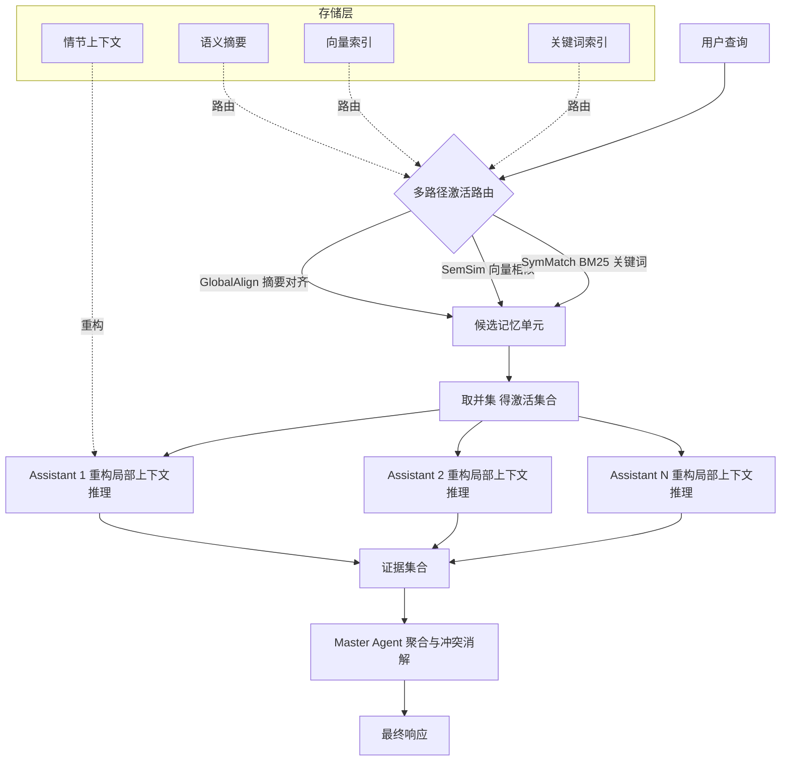

# E-mem：面向LLM智能体记忆的基于多智能体的情景上下文重构方法

## 一、论文基础元数据
- **原文标题**：E-mem: Multi-agent based Episodic Context Reconstruction for LLM Agent Memory
- **中文译版**：E-mem：面向LLM智能体记忆的基于多智能体的情景上下文重构方法
- **发表渠道**：arXiv 预印本（等级：待补充，尚未确认正式发表会议/期刊）
- **发表时间**：2025年（arXiv ID 标注 2601.21714，日期存疑，需核验）
- **链接**：arXiv:2601.21714（待核验）
- **作者及核心机构**：Kaixiang Wang, Yidan Lin, Jiong Lou, Zhaojiacheng Zhou, Bunyod Suvonov, Jie Li（核心机构待补充）
- **研究领域**：
  - 一级领域：人工智能 / 大语言模型
  - 二级子领域：LLM Agent 记忆系统、长上下文推理、多智能体协作
- **关联数据集**：
  - LoCoMo（长期对话记忆推理基准，用于多跳/时序记忆评估）
  - HotpotQA（多跳问答基准）
  - AMA（动态环境记忆评测，具体规模/语言/标注待补充）

## 二、论文综合评价

### 2.1 量化评分（1-5分，5分为最优）

| 评价维度 | 评分 | 备注 |
| -------- | ---- | ---- |
| 📚 理论基础 | ⭐⭐⭐⭐ | 借鉴生物engram与System 2认知理论，框架清晰 |
| 🎯 问题核心性 | ⭐⭐⭐⭐⭐ | 直击LLM Agent长期记忆去情境化核心痛点 |
| 💡 方法创新性 | ⭐⭐⭐⭐ | 范式从"记忆预处理"转向"情景上下文重构" |
| ⚙️ 技术壁垒 | ⭐⭐⭐⭐ | 多智能体分层+多路径路由，工程集成门槛较高 |
| 🧪 实验严谨性 | ⭐⭐⭐⭐ | LoCoMo/HotpotQA/AMA多基准，含多组消融 |
| 🔧 落地可行性 | ⭐⭐⭐ | 延迟偏高、多智能体协调与存储开销较大 |
| 🚀 应用前景 | ⭐⭐⭐⭐ | 法律/金融/医疗等高精度长时序场景价值大 |
| 📊 综合评分 | 4.0 | 创新性强、实验充分、定位精准，工程落地需权衡延迟 |

### 2.2 定性综合评价（≤300字）
> 本文提出 E-mem——一种面向 LLM Agent 长期记忆的异构多智能体框架，核心思想是以"情景上下文重构"取代传统"压缩+top-k 检索"的去情境化范式。架构上，Master Agent 负责全局规划、路由与证据聚合，若干 SLM Assistant Agents 各自持有未压缩的情节上下文与语义摘要，支持休眠存储与按需激活；多路径激活路由（全局对齐+语义向量+符号匹配）保证召回完整性，时序锚定证据支持多跳与状态变化推理。在 LoCoMo 上总体 F1 达 54.17，多跳 42.64，时序 59.82，全面超越 GAM、Mem0、RAG、HippoRAG、AriGraph 与 GPT-5.1 长上下文方案，总成本较 GAM 降低约 71%。差异优势在于兼顾高保真记忆与可扩展访问，以延迟换精度；局限为延迟较高、多智能体协同与存储开销增加，未来拟融合标准 RAG 形成快慢双模式框架。

## 三、领域本体论映射

| 核心维度 | 具体内容 |
| -------- | -------- |
| 核心研究对象 | LLM Agent 的长期情景记忆（episodic memory）与复杂多跳/时序推理 |
| 核心技术路径 | 异构分层多智能体 + 双表示记忆 + 多路径激活路由 + 情景上下文重构 |
| 数据/载体形态 | 滑动窗口分段的情节文本片段、语义摘要、稠密向量索引、符号/关键词索引 |
| 核心功能目标 | 在高保真上下文重构下完成长期、多跳、时序一致的记忆检索与推理 |
| 验证核心指标 | Overall F1、Multi-hop F1、Temporal F1、总成本（token）、延迟、抗幻觉 F1、终生记忆保持率 |

## 四、核心问题与解决方案

### 4.1 待解决的核心问题

1. **领域级根本问题**：LLM Agent 在长期交互中，如何在高保真地保留原始上下文的同时，实现可扩展、可路由、低成本的记忆访问，以支撑多跳与状态变化类复杂推理。
2. **现有方法痛点**：
   - RAG / 向量检索 / 图记忆 / 摘要记忆均需将上下文**预处理压缩**，导致**去情境化**，丢失时序依赖、实体链与多跳证据。
   - 典型失败案例：LoCoMo "Caroline 4 年前从哪搬来？"——向量检索命中 Session 3 的"moved from home country"，但漏掉 Session 4 的关键补充"Sweden"，因为 Session 4 语义被"项链/礼物"主导。
   - 直接全上下文输入成本过高、不可扩展。
3. **工程落地卡点**：
   - 完整情景重构带来**更高推理延迟**，不适配实时简单 factoid 查询。
   - 多智能体协调、原始上下文持久化带来**存储与协同开销**。
   - 隐私、数据治理、记忆更新/遗忘与对齐机制未展开。

### 4.2 核心解决方案

- **理论框架**：受生物 **engram（记忆印迹）** 启发，将记忆视为可被"重新激活-重构-再体验"的情景单元，而非被动检索的静态向量；强调 System 2 式显式状态跟踪、时序锚定与冲突消解。
- **核心架构**：协作元组 \(\mathcal{F}=\langle \mathcal{A}_{master}, \{\mathcal{A}_{asst}^{(i)}\}_{i=1}^{N}, \mathcal{R}\rangle\)
  - Master Agent：中央规划器与合成器，不保留原始记忆，在稀疏全局规划空间工作。
  - Assistant Agents：由 SLM 实例化，各自持有双表示 \(\mathcal{S}_i=\langle \mathcal{E}_i, s_i\rangle\)（完整情节上下文 + 精简语义摘要），休眠存储、按需激活。
- **关键技术**：
  - 滑动窗口 + 重叠分段（窗口 L，步长 S，重叠 δ=L−S），保留边界时序依赖；
  - 多路径激活路由：GlobalAlign（摘要对齐）+ SemSim（向量相似）+ SymMatch（BM25/关键词/实体）取并集；
  - 两阶段级联路由：阈值覆盖 + 加权 top-k 填充；
  - 时序锚定证据元组 \(\langle c_i, \tau_i \rangle\)，Master 按时间戳聚合、消解冲突；
  - 支持直接推理与迭代 Refine-and-Query 推理两种模式。
- **创新机制**：从"记忆预处理"转向"**情景上下文重构**"；双表示记忆兼顾保真推理与高效路由；多路径并集提升召回鲁棒性；O(1) 增量更新支持终生记忆。

### 4.3 核心优势（量化+定性）

1. **性能优势**：
   - LoCoMo Overall F1 **54.17**，较 GAM 45.31 提升 **+8.86**；多跳 F1 **42.64**（GAM 34.84，Mem0 38.72）；时序 F1 **59.82**（GAM 53.91）。
   - 强长上下文对比中 E-mem 54.17 > GPT-5.1 52.31 > GPT-4o 48.92；图基线对比中 E-mem 54.17 > HippoRAG 46.91 > AriGraph 45.76。
   - 抗幻觉对抗子集峰值 F1 达 **95.74%**。
2. **效率优势**：
   - 总成本 **3621**，较 GAM 12540 降低约 **71%**。
   - 通过 SLM 做局部推理、预计算索引/摘要路由，主 LLM 不处理全量原始上下文。
   - 休眠 agent 存储约 30KB，活跃 agent 约 10GB VRAM，可选 KV cache 额外约 2GB。
3. **工程优势**：
   - 模块化异构分层设计，便于扩展记忆单元与路由策略；
   - 支持终生记忆无重置（E-mem 51.75 vs 重置 54.17，退化幅度远小于 RAG 44.76→33.65 与 Mem0 45.10→37.03）；
   - 8K 内存粒度最佳（Overall 50.70，Temporal 66.91），参数可调。

## 五、方法与技术架构

### 5.1 核心架构设计

E-mem 采用"主-从多智能体"异构分层架构。Master Agent 只做全局规划、路由与证据聚合；每个 Assistant Agent 作为一个独立"记忆单元"，同时保存完整情节上下文 \(\mathcal{E}_i\) 与语义摘要 \(s_i\)，并建立向量索引 \(v_i\) 与关键词索引 \(k_i\)。查询时，多路径路由从全部休眠记忆中筛出激活集合 \(\mathcal{A}^*\)，被激活的 Assistant 在本地原始上下文上推理，输出时序锚定证据；Master 聚合证据并消解冲突，给出最终答案。整体形成"**路由—激活—重构—推理—聚合**"的闭环。

### 5.2 关键技术实现细节

| 技术模块 | 实现路径 | 工程注意事项 |
| -------- | -------- | ------------ |
| 记忆构建与封装 | 滑动窗口 L + 步长 S + 重叠 δ=L−S 切分流数据 X，封装为情节上下文 \(\mathcal{E}_i\)，生成摘要 \(s_i\)，建立向量索引 \(v_i\) 与关键词索引 \(k_i\) | 窗口/L、S、δ 需与领域文本粒度匹配；重叠过大会增加存储与激活冗余 |
| 多路径激活路由 | GlobalAlign(q,{s_i}) + SemSim(q,{v_i}) + SymMatch(q,{k_i}) 三路取并集，两阶段级联（阈值覆盖+加权 top-k） | 阈值与权重需调优，否则可能激活过多或漏召；建议按领域定制 |
| 双表示记忆 | \(\mathcal{S}_i=\langle \mathcal{E}_i, s_i\rangle\)，原始上下文供高保真推理，摘要供轻量路由 | 摘要质量影响路由召回；原始上下文需保证不可变与版本一致性 |
| 局部情景推理 | 在被激活 Assistant（SLM）上执行 LocalReason(q\|E_k)，输出时序锚定证据 \(\langle c_i,\tau_i\rangle\) | SLM 能力上限决定局部推理质量；需显式时序锚定避免状态混淆 |
| 协同响应与冲突消解 | Master 执行 Aggregate(q,E)，按时间戳消解冲突并合成答案 | 冲突消解策略需可解释；建议保留证据溯源链 |
| 依赖组件 | 稠密 embedding 模型、BM25/稀疏检索器、SLM 实例、向量库、KV cache（可选） | 同用 OpenAI embedding 时 E-mem F1 仍达 55.46，说明增益来自架构而非检索器 |

### 5.3 架构优缺点

- **优点**：
  - 兼顾高保真记忆与可扩展访问，避免全上下文输入的高成本与纯摘要/向量的信息损失。
  - 多路径并集提升召回鲁棒性与时序/实体覆盖。
  - 异构分层、模块化设计，便于扩展；主 LLM 负担低。
  - 支持终生记忆无重置，退化幅度显著小于 RAG/Mem0。
- **缺点**：
  - 完整情景重构带来较高推理延迟，不适合实时简单 factoid 查询。
  - 多智能体协调、原始上下文持久化带来存储与管理开销。
  - 依赖摘要质量、索引质量、路由召回率与 SLM 局部推理能力上限。
  - 多路径并集存在"激活过多或漏召"的双向风险，需精细调参。

## 六、实验设计与结果分析

### 6.1 实验基础设置

| 维度 | 内容 |
| ---- | ---- |
| 数据集 | LoCoMo（长期对话记忆）、HotpotQA（多跳问答）、AMA（动态环境） |
| 基线方法 | GAM、Mem0、RAG、HippoRAG、AriGraph、Longcontext、GPT-4o、GPT-5.1 |
| 实验环境 | 待补充（论文未在给定文本中给出硬件与超参细节） |
| 评价指标 | Overall F1、Multi-hop F1、Temporal F1、总成本（token）、延迟（s）、抗幻觉 F1 |

### 6.2 核心实验结果

| 方法 | Overall F1 | Multi-hop / Temporal F1 | 工程指标（成本/耗时） |
| ---- | --------- | --------- | -------------------- |
| RAG | 44.73 | 待补充 | 待补充 |
| Mem0 | 45.10 | Multi-hop 38.72 | 待补充 |
| GAM | 45.31 | Multi-hop 34.84 / Temporal 53.91 | 成本 12540，延迟 14.71s |
| HippoRAG | 46.91 | 待补充 | 待补充 |
| AriGraph | 45.76 | 待补充 | 待补充 |
| GPT-4o（长上下文） | 48.92 | 待补充 | 待补充 |
| GPT-5.1（长上下文） | 52.31 | 待补充 | 待补充 |
| **E-mem（本文）** | **54.17** | **Multi-hop 42.64 / Temporal 59.82** | **成本 3621，延迟 11.25s** |

> 补充：AMA 动态环境 E-mem Avg **69.84**，Longcontext 51.35；终生记忆无重置 E-mem 51.75（重置 54.17），RAG 44.76→33.65，Mem0 45.10→37.03。

### 6.3 消融实验/鲁棒性分析

| 实验变体 | 指标变化 | 核心结论 |
| -------- | -------- | -------- |
| 检索器消融（统一 OpenAI embedding） | E-mem F1 55.46 | 增益来自架构设计而非检索器选择 |
| 内存粒度 8K vs 32K | 8K Overall 50.70 / Temporal 66.91；32K 明显下降 | 粒度适中最佳，过大反而干扰推理 |
| 终生记忆无重置 | E-mem 54.17→51.75；RAG→33.65；Mem0→37.03 | E-mem 记忆退化最小，长期鲁棒 |
| 抗幻觉对抗子集 | 峰值 F1 95.74% | 情景重构有效抑制幻觉 |
| 多路径路由并集 | 待补充 | 需进一步量化单路 vs 并集贡献 |

### 6.4 实验结论（工程视角）

从工程视角看，E-mem 在**精度-成本-延迟**三维上给出一个明确的可选点：**F1 最高、token 成本最低、延迟略高但整体可接受**（相对 GAM 延迟 11.25s vs 14.71s）。在需要多跳、时序推理且对错误容忍度低的任务中，E-mem 是更优选择；对毫秒级简单事实查询则不宜使用。架构增益独立于检索器选择（同用 OpenAI embedding 下仍领先 55.46），说明收益主要来自框架设计而非组件调优，便于工程复制与迁移。

## 七、领域贡献与创新点

| 贡献层级 | 具体内容 |
| -------- | -------- |
| 理论贡献 | 提出从"记忆预处理/去情境化压缩"到"**情景上下文重构**"的范式转变，受生物 engram 与 System 2 认知启发 |
| 方法/架构贡献 | 异构分层主-从多智能体架构（Master 规划聚合 + SLM Assistant 情景持有）；双表示记忆（原始情节 + 摘要）；多路径激活路由（摘要/向量/符号三路并集）；时序锚定证据与冲突消解；O(1) 增量更新 |
| 数据/工具贡献 | 待补充（论文未在给定内容中声明开源数据集或工具） |
| 实验/验证贡献 | 在 LoCoMo、HotpotQA、AMA 上系统验证多跳/时序/终生记忆/抗幻觉/粒度/检索器多维性能，给出完整成本-延迟权衡数据 |
| 工程落地贡献 | 明确"延迟换精度"的适用场景与边界（法律取证、金融分析、医疗诊断、科学综述），提出未来 Fast Mode + Deep Research Mode 双模式框架蓝图 |

## 八、局限性与风险

| 维度 | 具体描述 | 应对思路 |
| ---- | -------- | -------- |
| 学术局限性 | 延迟相对轻量检索更高，不适合实时简单 factoid 查询；依赖摘要质量、索引质量、路由召回率与 SLM 局部推理能力；多路径并集可能激活过多或漏召关键记忆 | 引入自适应阈值与动态路由；研究单路 vs 并集贡献；补充更多领域基准 |
| 工程落地风险 | 多智能体协调与原始上下文持久化带来存储、管理与协同开销；延迟成本未在文本中量化；双模式框架尚未实现 | 分级缓存与冷热存储；SLM 蒸馏/量化；Fast/Deep 双模式先行原型验证 |
| 伦理/合规风险 | 长期持久化原始情景上下文存在隐私与数据治理风险；抗幻觉能力有限，仍可能产生错误证据；记忆更新/遗忘机制未展开 | 引入记忆脱敏、访问控制与遗忘机制；证据溯源与人工复核；对齐与安全评估 |

## 九、未来研究/落地方向

| 方向类型 | 具体内容 | 优先级 |
| -------- | -------- | ------ |
| 科研拓展 | 自适应双模式框架（Fast Mode 基于标准 RAG + Deep Research Mode 启用 E-mem），实现 System 1/System 2 动态切换 | 高 |
| 工程优化 | 延迟量化与优化、多智能体协同调度、记忆更新与遗忘机制、存储分层与压缩 | 高 |
| 跨领域适配 | 法律取证、金融分析、医疗诊断、科学综述等高精度长时序场景的领域定制 | 中 |

## 十、关键词与术语表

| 语言 | 关键词 |
| ---- | ------ |
| 中文 | 大语言模型智能体、情景记忆、上下文重构、多智能体系统、多路径激活路由、长上下文推理、时序锚定、冲突消解 |
| 英文 | LLM Agent, Episodic Memory, Context Reconstruction, Multi-agent System, Multi-Pathway Routing, Long-Context Reasoning, Temporal Anchoring, Conflict Resolution |
| 领域专属术语 | **Engram（记忆印迹）**：生物神经