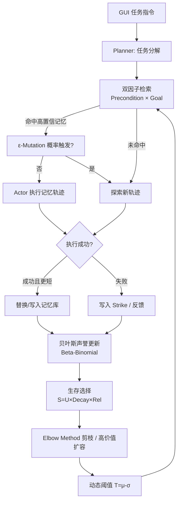

# 达尔文记忆：面向GUI智能体进化的免训练自调节记忆系统

## 一、论文基础元数据
- **原文标题**：Darwinian Memory: A Training-Free Self-Regulating Memory System for GUI Agent Evolution
- **中文译版**：达尔文记忆：面向GUI智能体进化的免训练自调节记忆系统
- **发表渠道**：arXiv 预印本（arXiv ID: 2601.22528，非同行评审版本，等级待补充）
- **发表时间**：2025 年
- **链接**：https://arxiv.org/abs/2601.22528
- **作者及核心机构**：Hongze Mi, Yibo Feng, WenJie Lu, Song Cao, Jinyuan Li, Yanming Li, Xuelin Zhang, Haotian Luo, Songyang Peng, He Cui, Tengfei Tian, Jun Fang, Hua Chai, Naiqiang Tan（核心机构待补充，需查看首页署名）
- **研究领域**：
  - 一级领域：人工智能 / 大模型智能体
  - 二级子领域：GUI Agent 记忆系统、终身学习、多模态大模型推理
- **关联数据集**：
  - **AndroidWorld**：Android GUI 任务自动化基准，任务含长程、跨应用交互；其他规模/语言/标注细节待补充。

## 二、论文综合评价
### 2.1 量化评分（1-5分，5分为最优）

| 评价维度 | 评分 | 备注 |
| -------- | ---- | ---- |
| 📚 理论基础 | ⭐⭐⭐⭐ | 用随机流与贝叶斯建模记忆纯度，理论扎实 |
| 🎯 问题核心性 | ⭐⭐⭐⭐⭐ | 直击长程GUI记忆负迁移这一关键瓶颈 |
| 💡 方法创新性 | ⭐⭐⭐⭐ | 达尔文式记忆生态范式新颖，非微调路线 |
| ⚙️ 技术壁垒 | ⭐⭐⭐ | 免训练降低门槛，但多模块协同调参复杂 |
| 🧪 实验严谨性 | ⭐⭐⭐⭐ | AndroidWorld多模型验证+充分消融；显著性待补充 |
| 🔧 落地可行性 | ⭐⭐⭐⭐ | 无需训练、即插即用，工程改造量适中 |
| 🚀 应用前景 | ⭐⭐⭐⭐⭐ | GUI自动化+终身学习刚需，商业化前景广 |
| 📊 综合评分 | 4.1 | 问题、创新与实验兼具，理论完备，落地潜力高 |

### 2.2 定性综合评价（≤300字）
> 本文面向通用 MLLM 驱动的 GUI Agent 在长程、跨应用任务中因上下文窗口受限而产生的遗忘、幻觉与负迁移问题，提出 **Darwinian Memory System（DMS）**——一种免训练、自调节的进化式记忆系统。其核心价值在于将记忆从"静态轨迹库"重构为"可拆分、可检索、可变异、可淘汰的生态单元"，通过结构化子任务记忆、双因子检索、ε-变异替换、自适应生存选择与贝叶斯反馈调节，形成闭环自优化。差异化优势是**无需模型训练、无需架构改动**即可对多个通用 MLLM 生效。在 AndroidWorld 上四款模型成功率平均提升约 18.0%，稳定性提升 33.9%，内存稳定在约 5 MB 量级，证明该范式在真实 GUI 场景中的实用价值。

## 三、领域本体论映射
| 核心维度 | 具体内容 |
| -------- | -------- |
| 核心研究对象 | 通用 MLLM 驱动的 GUI Agent 长期记忆与进化机制 |
| 核心技术路径 | 结构化记忆单元 + 双因子检索 + ε-变异 + 生存选择 + 贝叶斯反馈 |
| 数据/载体形态 | GUI 交互轨迹的子任务单元 \(m=(p,\tau,s_{meta})\)，预条件/目标自然语言描述 |
| 核心功能目标 | 提升长程 GUI 任务成功率、执行稳定性与推理效率，抑制负迁移 |
| 验证核心指标 | SR（成功率）、SRR（稳定性）、执行延迟、内存占用、记忆复用率 |

## 四、核心问题与解决方案
### 4.1 待解决的核心问题
1. **领域级根本问题**：在长程、跨应用 GUI 任务中，MLLM 上下文窗口有限，无法积累并复用历史经验，导致相同错误重复发生、难以规模化落地。
2. **现有方法痛点**：
   - **单体范式僵化**：整条轨迹存储使"意图"与"底层执行路径"强耦合，环境一旦变化，整段记忆失效。
   - **静态存储停滞**：过时、冗余、有毒先验持续累积，污染上下文，引发负迁移和低效。
3. **工程落地卡点**：微调成本高、通用性差；静态记忆库膨胀导致上下文与存储双重压力；缺乏自动毒性记忆淘汰机制。

### 4.2 核心解决方案
- **理论框架**：将记忆库视为随机流生态系统，定义"纯度 \(Q_t\)"、"污染流入/流出率"与"稳态纯度比"，证明降低验证假阴性率 \(P_{FN}\) 是提升纯度的关键路径。
- **核心架构**：Planner-Actor 框架 + 动态记忆生态，记忆被拆解为独立可复用子任务单元并纳入生存-变异-淘汰闭环。
- **关键技术**：
  - 结构化记忆单元 \(p_i=\langle Precondition, Goal\rangle\)；
  - 双因子检索（precondition 与 goal 余弦相似度乘积）；
  - ε-Mutation 进化替换（小概率探索，更新更短且成功的轨迹）；
  - 生存值 \(S = Utility \times Adaptive Decay \times Reliability\) + Elbow Method 剪枝；
  - Beta-Binomial 声誉建模 + 动态阈值 \(T_i=\mu_i-\sigma_i\) 抑制高风险计划。
- **创新机制**：K-Verification Policy 使有效假阴性率 \(P_{FN}^{\text{effective}}\approx(P_{FN})^K\)，即使验证器一般也能保证 \(Q_{ss}\to 1\)。

### 4.3 核心优势（量化+定性）
1. **性能优势**：AndroidWorld 上平均成功率 **+18.0%**；Qwen2.5-VL-72B 从 41.0%→66.4%（+25.4）；执行稳定性 SRR **+33.9%**。
2. **效率优势**：记忆库长期稳定在 **~5 MB**（峰值 <8 MB）；记忆复用率从冷启动约 12% 升至 30%–36%；任务延迟降低。
3. **工程优势**：**完全免训练**、即插即用，适配多种通用 MLLM（Qwen2.5-VL、Qwen3-VL、GLM-4.5V、Seed1.6-VL），无需改动模型架构。

## 五、方法与技术架构
### 5.1 核心架构设计
> DMS 运行在 Planner-Actor 框架之上，将历史经验解构为子任务单元并纳入生态系统。检索命中后执行任务；若命中失败或触发 ε-变异，则探索新路径并回写记忆；贝叶斯反馈调节用于动态风险评估与阈值控制；生存选择负责周期性剪枝与扩容。

### 5.2 关键技术实现细节
| 技术模块 | 实现路径 | 工程注意事项 |
| -------- | -------- | ------------ |
| 记忆构造 | 将长轨迹拆解为 \(\langle Precondition, Goal\rangle\) 子任务，过滤原子单步动作 | 子任务粒度需与任务复杂度匹配，过细会降低复用率 |
| 双因子检索 | precondition 与 goal 余弦相似度乘积作为匹配分数 | 单一 goal-based key 会引发严重负迁移（实验中降至 29.7%） |
| ε-Mutation 进化 | 即使命中高置信记忆也以小概率 ε 探索；新路径更短且成功即替换 | ε 在稳态比例中抵消，但显著影响收敛速度，需谨慎设置 |
| 生存选择 | \(S = Utility \times Adaptive Decay \times Reliability\)，Elbow Method 剪枝长尾 | 需平衡剪枝阈值与扩容时机，防止高价值记忆被误删 |
| 贝叶斯反馈 | Beta-Binomial 建模计划声誉，动态阈值 \(T_i=\mu_i-\sigma_i\) 抑制高风险 | 先验敏感度需调优；去掉动态阈值性能下降 29.8% |
| 依赖组件 | 通用 MLLM（Planner + Actor）、向量相似度计算、轻量级状态存储 | 无需 GPU 训练资源；需保证相似度计算延迟可控 |

### 5.3 架构优缺点
- **优点**：
  - 免训练、即插即用，跨模型通用；
  - 通过 K-Verification 从理论上保证记忆纯度趋近 1；
  - 内存/存储开销极低，适合长时运行；
  - 自调节机制可自动淘汰有毒先验，抑制负迁移。
- **缺点**：
  - 对高粒度原子动作或强逻辑验证任务，DMS 会过滤单步记忆，复用率可能为 0；
  - 困难任务需要较长经验积累期才能收敛；
  - 多模块（ε、K、动态阈值）协同调参复杂，超参敏感度未充分披露；
  - 论文自述不保证完美执行准确率，安全与隐私仍是挑战。

## 六、实验设计与结果分析
### 6.1 实验基础设置
| 维度 | 内容 |
| ---- | ---- |
| 数据集 | AndroidWorld（GUI 自动化基准，具体任务数/语言/标注待补充） |
| 基线方法 | 无记忆基线；仅 goal-based key 记忆；去除反馈调节 / 动态阈值 / 自调节等变体 |
| 实验环境 | 待补充（论文正文中有详细说明） |
| 评价指标 | SR（成功率）、SRR（执行稳定性）、任务延迟、内存/磁盘占用、记忆复用率 |

### 6.2 核心实验结果
| 方法 | 核心指标1（SR） | 核心指标2（SRR） | 工程指标（算力/耗时） |
| ---- | --------- | --------- | -------------------- |
| Qwen2.5-VL-72B + 无记忆基线 | 41.0% | 基线 | 待补充 |
| Qwen2.5-VL-72B + DMS | **66.4%** | 显著提升 | 延迟降低、内存 ~5 MB |
| Qwen3-VL-30B + 无记忆基线 | 25.0% | 基线 | 待补充 |
| Qwen3-VL-30B + DMS | **44.0%** | 显著提升 | 同上 |
| GLM-4.5V + DMS | **50.4%**（+12.4） | 显著提升 | 同上 |
| Seed1.6-VL + DMS | **56.0%**（+15.0） | 显著提升 | 同上 |
| **平均提升** | **+18.0%** | **+33.9%** | 内存稳定 ~5 MB，峰值 <8 MB |

### 6.3 消融实验/鲁棒性分析
| 实验变体 | 指标变化 | 核心结论 |
| -------- | -------- | -------- |
| 移除反馈调节 | -26.3% | 贝叶斯反馈是抑制风险计划的核心 |
| 移除动态阈值 | -29.8% | 动态阈值 \(T=\mu-\sigma\) 对稳定性至关重要 |
| 仅使用 goal-based key | 降至 29.7%（低于无记忆 41.0%） | 单因子检索会引发严重负迁移 |
| 移除自调节 | -27.2%；内存/磁盘 +258%；时间 +18.8% | 生存选择兼顾性能与资源效率 |
| 记忆复用率 | 12% → 30%–36% | 系统在长期运行中持续稳定复用 |

### 6.4 实验结论（工程视角）
DMS 在 AndroidWorld 上对多个主流 MLLM 均获得显著增益，且内存/存储开销极低（~5 MB），说明"外挂式进化记忆"是当前通用 MLLM 提升 GUI 任务能力的**低门槛、高性价比路径**。消融实验清晰定位了三大关键模块（反馈调节、动态阈值、自调节）的独立贡献，并揭示单因子检索会导致负迁移——这对实际部署中记忆键的设计具有直接指导价值。存在困难任务收敛慢、特殊任务复用率为 0 的边界问题，需在工程侧配合任务分层策略。

## 七、领域贡献与创新点
| 贡献层级 | 具体内容 |
| -------- | -------- |
| 理论贡献 | 建立记忆生态的随机流模型与稳态纯度公式，证明 K-Verification 可使有效假阴性率指数衰减 |
| 方法/架构贡献 | 提出结构化记忆单元范式与 DMS 自进化生态（检索-变异-生存-反馈闭环） |
| 数据/工具贡献 | 待补充（论文未强调新数据集/工具开源） |
| 实验/验证贡献 | 在 AndroidWorld 上对 4 款主流 MLLM 做了完整对比与消融，量化各模块贡献 |
| 工程落地贡献 | 免训练、即插即用、内存开销 ~5 MB，为通用 MLLM 部署 GUI Agent 提供可直接复用的记忆层 |

## 八、局限性与风险
| 维度 | 具体描述 | 应对思路 |
| ---- | -------- | -------- |
| 学术局限性 | 对高粒度原子动作或强逻辑验证任务过滤单步记忆，复用率可能为 0；困难任务收敛慢 | 引入分层记忆（步骤级 + 子任务级），对特殊任务保留单步记忆通道 |
| 工程落地风险 | ε、K、动态阈值等多超参需联合调优；验证器假阴性率直接影响纯度 | 提供默认超参 + 自动超参搜索；引入更鲁棒的多信号验证器 |
| 伦理/合规风险 | 未保证完美执行准确率，GUI 任务可能涉及敏感操作、隐私数据 | 部署时叠加人工确认/权限校验层；对敏感应用场景增加沙箱隔离 |

## 九、未来研究/落地方向
| 方向类型 | 具体内容 | 优先级 |
| -------- | -------- | ------ |
| 科研拓展 | 记忆单元粒度的自适应学习；变异策略的理论收敛性分析 | 高 |
| 工程优化 | 超参自动化；跨版本 GUI（换肤、改版）的鲁棒性；与其他 Agent 记忆框架的集成 | 高 |
| 跨领域适配 | 迁移到 Web GUI、桌面应用、RPA 工作流；迁移至代码 Agent / 工具调用 Agent | 中 |

## 十、关键词与术语表
| 语言 | 关键词 |
| ---- | ------ |
| 中文 | 达尔文记忆、GUI 智能体、免训练、自调节、进化式记忆、负迁移抑制、贝叶斯反馈、生存选择 |
| 英文 | Darwinian Memory, GUI Agent, Training-Free, Self-Regulating, Evolutionary Memory, Negative Transfer, Bayesian Feedback, Survival Selection |
| 领域专属术语 | **DMS**：Darwinian Memory System，达尔文记忆系统；**SR**：Success Rate，任务成功率；**SRR**：Success Retention Rate / 执行稳定性指标（SRR 在摘要中未展开定义，待补充）；**ε-Mutation**：以概率 ε 强制探索新轨迹的变异机制；**K-Verification Policy**：需要累计 K 次 strike 才删除记忆的策略；**生存值 S**：\(Utility \times Adaptive Decay \times Reliability\)；**动态阈值 T**：\(T_i=\mu_i-\sigma_i\)，用于抑制高风险计划 |

## 十一、参考文献与关联资源
- **核心参考文献**：待补充（正文中涉及的 GUI Agent、记忆系统与贝叶斯反馈相关工作）
- **补充阅读**：AndroidWorld 基准论文；Planner-Actor 类 GUI Agent 框架相关文献
- **开源代码/工具**：待补充（未见明确开源声明）

## 十二、阅读者批注
1. **科研启发**：将"记忆"从静态库升级为"进化生态"的思路可迁移至其他长程 Agent（Web Agent、代码 Agent、工具调用 Agent）；K-Verification 理论化为"低质量验证器仍可保持高纯度"提供了简洁有力的数学论证，值得借鉴。
2. **工程落地思考**：~5 MB 的内存占用 + 免训练特性使其非常适合作为现有 GUI Agent 产品的"外挂记忆层"；但 ε 与 K 的调优需要经验，建议先用保守默认值上线再迭代。
3. **待验证/存疑点**：SRR 的确切定义、实验环境的硬件配置、跨 GUI 平台（Web/桌面）泛化能力、长期运行（>1000 周期）下的纯度漂移、与微调路线的成本-效果对照，均需正文进一步验证。
4. **个人/团队应用场景**：可作为企业级 RPA + MLLM 方案的记忆组件，用于客服、测试自动化、企业办公等重复度高、长程性强的 GUI 任务场景。

## 十三、阅读元信息
| 维度 | 内容 |
| ---- | ---- |
| 阅读日期 | 2026-09-30 20:40 |
| 阅读人 | xPaperReader AI |
| 文档编号 | arxiv-2601.22528 |
| 版本迭代 | v1.0 |