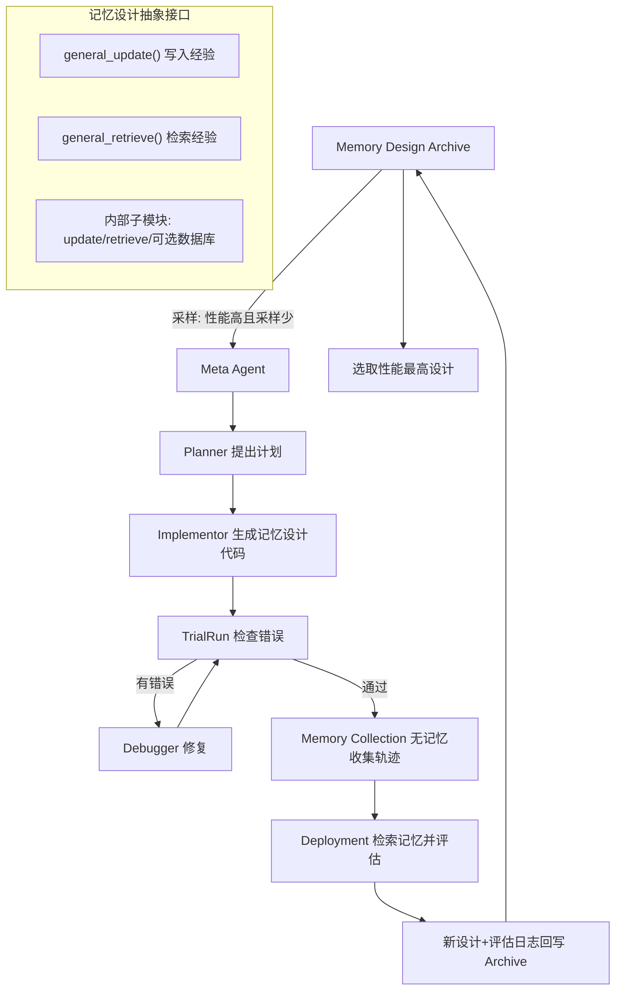

# 通过元学习智能体记忆设计实现持续学习

## 一、论文基础元数据

- **原文标题**：Learning to Continually Learn via Meta-learning Agentic Memory Designs
- **中文译版**：通过元学习智能体记忆设计实现持续学习
- **发表渠道**：arXiv 预印本（待补充具体等级，暂按预印本处理）
- **发表时间**：2025 年（具体月份待补充）
- **链接**：arXiv:2602.07755；开源代码：https://github.com/zksha/alma.git
- **作者及核心机构**：Yiming Xiong、Shengran Hu、Jeff Clune（核心机构待补充，Jeff Clune 为知名进化计算/AI-generating algorithms 领域学者，常与 OpenAI/University of British Columbia 等机构关联）
- **研究领域**：一级领域——人工智能/机器学习；二级子领域——智能体系统（Agentic Systems）、元学习（Meta-learning）、持续学习（Continual Learning）
- **关联数据集**：
  - ALFWorld（文本交互式家庭环境任务，语言：英语，含任务轨迹标注）
  - TextWorld（文本冒险游戏环境，语言：英语，程序化生成任务）
  - Baba Is AI（推箱子式谜题游戏，语言：英语/符号表示）
  - MiniHack（基于 NetHack 的轻量级 RL 环境，语言：英语/符号表示）
  - 上述四个基准均为序列决策任务，规模与具体标注细节待补充

## 二、论文综合评价

### 2.1 量化评分（1-5分，5分为最优）

| 评价维度 | 评分 | 备注 |
| -------- | ---- | ---- |
| 📚 理论基础 | ⭐⭐⭐⭐ | 根植于 AI-generating algorithms 与 learning to learn 范式 |
| 🎯 问题核心性 | ⭐⭐⭐⭐⭐ | 直击 Agent 无状态、难以持续积累经验的核心瓶颈 |
| 💡 方法创新性 | ⭐⭐⭐⭐⭐ | 以代码为搜索空间，自动元学习记忆设计，范式新颖 |
| ⚙️ 技术壁垒 | ⭐⭐⭐⭐ | 依赖 FM 代码生成、评估反馈与沙箱执行，工程门槛较高 |
| 🧪 实验严谨性 | ⭐⭐⭐⭐ | 四基准、多手工基线、静态/动态模式与分布偏移测试 |
| 🔧 落地可行性 | ⭐⭐⭐⭐ | 更省成本、可扩展，但当前为离线学习集训练模式 |
| 🚀 应用前景 | ⭐⭐⭐⭐⭐ | 面向终身学习 Agent 与自改进 AI，跨领域迁移潜力大 |
| 📊 综合评分 | 4.4 | 范式创新突出、实验扎实，在线学习与算力成本为主要约束 |

### 2.2 定性综合评价（≤300字）

> 本文定位于 AI-generating algorithms 的"元学习学习算法"支柱，提出 ALMA 框架，将 Agent 记忆模块的设计从人工工程转变为可学习的对象。核心价值在于：以 Python 代码为搜索空间，由 Meta Agent 开放式探索记忆设计，通过 Memory Design Archive 与"表现好但采样少"的采样策略平衡探索与利用。差异化优势在于显式优化"持续学习能力"而非单次任务表现，且学到的记忆设计可跨分布迁移。关键结论：在 ALFWorld、TextWorld、Baba Is AI、MiniHack 四个序列决策基准上，ALMA 学到的记忆设计一致优于 SOTA 手工方案，成本更优、扩展性更好、适应分布偏移更快；开放式探索优于贪心选择。当前聚焦 token-level memory，尚未覆盖参数化与潜在记忆。

## 三、领域本体论映射

| 核心维度 | 具体内容 |
| -------- | -------- |
| 核心研究对象 | 智能体系统中的记忆模块（Agentic Memory）及其自动化元学习设计 |
| 核心技术路径 | Meta Agent + 代码生成 + 开放式探索 + Archive 采样（AutoML/AI-generating algorithms 范式） |
| 数据/载体形态 | Python 代码表示的记忆设计；交互轨迹与评估日志；token 级记忆存储 |
| 核心功能目标 | 自动发现领域特化记忆设计，使 Agent 跨任务持续积累并复用经验 |
| 验证核心指标 | 任务性能、端到端记忆成本、检索 token 大小、分布偏移下的学习速度 |

## 四、核心问题与解决方案

### 4.1 待解决的核心问题

1. **领域级根本问题**：Foundation Models 在推理时是无状态的，Agent 难以跨任务积累经验、实现持续学习，往往重复从零求解任务。
2. **现有方法痛点**：给 Agent 加 Memory 模块是主流思路，但记忆设计仍主要靠人工定制；不同领域需要不同记忆（对话 Agent 关注用户事实，策略游戏 Agent 关注抽象技能），手工设计困难、昂贵、难以适配动态环境。
3. **工程落地卡点**：评估每个记忆设计需大量 rollout，计算预算受限；当前为基于预定义学习集的离线设计，未实现学习/测试一体化的在线持续学习；记忆设计能力受底层基础模型能力约束。

### 4.2 核心解决方案

- **理论框架**：对齐"learning to learn"与 AI-generating algorithms 第二支柱（元学习学习算法），将记忆设计本身变为可学习对象。
- **核心架构**：**ALMA**（Automated meta-Learning of Memory designs for Agentic systems），包含 Meta Agent、Memory Design Archive、TrialRun/Debugger、Memory Collection 与 Deployment 两阶段评估。
- **关键技术**：Python 代码表示记忆设计；抽象接口 `general_update()` 与 `general_retrieve()`；Planner–Implementor–Debugger 协作；Archive 采样策略（归一化性能 + 历史采样次数）。
- **创新机制**：以代码为搜索空间理论上可发现任意记忆结构并具可解释性；开放式探索允许中等性能设计作为"踏脚石"，优于贪心选择。

### 4.3 核心优势（量化+定性）

1. **性能优势**：在四个序列决策基准上一致超过 SOTA 人工设计（Trajectory Retrieval、Dynamic Cheatsheet、ReasoningBank、G-Memory）。
2. **效率优势**：比多数手工基线更成本高效；随记忆规模增长性能扩展更有效；检索知识 token 开销更优。
3. **工程优势**：分布偏移下学习更快；搜索结果可解释（代码形式）；开源可复现；开放式探索具备发现新设计范式的潜力。

## 五、方法与技术架构

### 5.1 核心架构设计

> ALMA 以元学习循环为核心：每轮从 Memory Design Archive 采样基础设计，Meta Agent（Planner + Implementor + Debugger）反思评估日志并生成新记忆设计代码；新设计经 TrialRun 校验后在 Memory Collection 阶段无记忆收集轨迹，再在 Deployment 阶段检索记忆并评估；结果与日志回写 Archive。循环结束后选取 Archive 中性能最高者作为最终记忆设计。

### 5.2 关键技术实现细节

| 技术模块 | 实现路径 | 工程注意事项 |
| -------- | -------- | ------------ |
| Meta Agent | 由基础模型驱动，Planner 规划、Implementor 用 Python 实现、Debugger 修复 | 需保证代码可执行、接口一致性 |
| Memory Design Archive | 存储全部已发现设计、性能、评估样本、采样次数 | 采样策略需平衡探索与利用，防同质化 |
| 采样策略 | 基于归一化性能与历史采样次数，优先"表现好但采样少"的设计 | 维持多样性，避免过早收敛 |
| 记忆抽象接口 | `general_update()` / `general_retrieve()`，内部可含层次化、模块化子模块 | 接口契约稳定，便于跨设计组合 |
| TrialRun/Debugger | 执行前错误检查与自动修复 | 需隔离沙箱、限制外部访问 |
| 两阶段评估 | Memory Collection（无记忆收集轨迹）+ Deployment（检索记忆评估） | 评估需大量 rollout，算力成本高 |
| 依赖组件 | 基础模型代码生成能力、序列决策环境、沙箱执行环境 | 模型能力上限约束设计空间 |

### 5.3 架构优缺点

- **优点**：以代码为搜索空间表达力强、可解释；开放式探索可发现非直觉设计；Archive 机制平衡探索利用；学到的设计可迁移、可扩展。
- **缺点**：评估成本高（每个设计需大量 rollout）；离线学习集模式，未实现在线持续学习；依赖 FM 代码生成质量；搜索空间为 token-level memory，未覆盖参数化/潜在记忆。

## 六、实验设计与结果分析

### 6.1 实验基础设置

| 维度 | 内容 |
| ---- | ---- |
| 数据集 | ALFWorld、TextWorld、Baba Is AI、MiniHack（四个序列决策基准） |
| 基线方法 | Trajectory Retrieval、Dynamic Cheatsheet（Cumulative）、ReasoningBank、G-Memory |
| 实验环境 | 学习阶段 GPT-5-nano/low；测试迁移阶段 GPT-5-mini/medium；沙箱隔离执行 |
| 评价指标 | 任务性能、端到端记忆成本、检索知识 token 大小；静态/动态模式；ALFWorld 另测分布偏移 |

### 6.2 核心实验结果

> 说明：所提供分析为定性汇总，未给出具体数值，下表以定性结论填列。

| 方法 | 核心指标1（性能） | 核心指标2（成本/token） | 工程指标（算力/耗时） |
| ---- | --------- | --------- | -------------------- |
| Trajectory Retrieval | 低于 ALMA | 待补充 | 待补充 |
| Dynamic Cheatsheet (Cumulative) | 低于 ALMA | 待补充 | 待补充 |
| ReasoningBank | 低于 ALMA | 待补充 | 待补充 |
| G-Memory | 低于 ALMA | 待补充 | 待补充 |
| 本文方法（ALMA） | 四基准一致最优 | 比多数手工基线更成本高效 | 评估需大量 rollout，离线学习集模式 |

### 6.3 消融实验/鲁棒性分析

| 实验变体 | 指标变化 | 核心结论 |
| -------- | -------- | -------- |
| 开放式探索 vs 贪心选择 | 开放式探索性能更优 | 中等性能设计可作"踏脚石"，通向最优设计 |
| 静态模式 vs 动态模式 | 动态模式下 ALMA 保持优势 | 学到的设计适应动态环境 |
| ALFWorld 分布偏移 | 学习更快 | 跨分布迁移能力优于手工基线 |
| 记忆规模增长 | 性能扩展更有效 | 设计具备良好的可扩展性 |

### 6.4 实验结论（工程视角）

从工程视角看，ALMA 的实证价值在于：其一，以代码为载体的记忆设计可被自动搜索、验证与复用，降低了人工定制记忆模块的边际成本；其二，在四个异构基准上的一致优势说明其不依赖特定环境，具备跨领域泛化潜力；其三，成本与 token 效率优于多数手工基线，对生产级 Agent 的上下文预算友好。但需注意，其评估阶段需大量 rollout，离线学习集训练模式导致在线持续学习尚未验证，工程部署前需评估算力预算与在线适应需求。

## 七、领域贡献与创新点

| 贡献层级 | 具体内容 |
| -------- | -------- |
| 理论贡献 | 将 Agent 记忆设计纳入 learning to learn 框架，倡导显式优化"持续学习能力"而非单次任务表现 |
| 方法/架构贡献 | 提出 ALMA 框架：Meta Agent + 代码搜索空间 + Archive 采样 + 两阶段评估 |
| 数据/工具贡献 | 开源代码（https://github.com/zksha/alma.git）；构建 Memory Design Archive 机制 |
| 实验/验证贡献 | 在四个序列决策基准上系统比较四类手工记忆设计，验证自动设计优于人工设计 |
| 工程落地贡献 | 提供可扩展、成本高效、可解释的记忆设计自动发现流程，可迁移至医学、金融、软件工程等领域 |

## 八、局限性与风险

| 维度 | 具体描述 | 应对思路 |
| ---- | -------- | -------- |
| 学术局限性 | 记忆设计基于预定义学习集，非动态在线学习；仅聚焦 token-level memory，未覆盖参数化/潜在记忆；能力受底层 FM 限制 | 探索在线元学习、扩展记忆形态、结合更强或自训练模型 |
| 工程落地风险 | 评估每个设计需大量 rollout，算力成本高；依赖 FM 代码生成与评估反馈质量；沙箱隔离要求高 | 预算化搜索、并行评估、强化沙箱与访问控制 |
| 伦理/合规风险 | AI-generating algorithms 组件由学习而非人工设计，可能偏离人类意图或忽略目标指标；存在 prompt injection 风险 | 隔离沙箱执行、访问受限、人类监督、系统化 AI+人类审查机制 |

## 九、未来研究/落地方向

| 方向类型 | 具体内容 | 优先级 |
| -------- | -------- | ------ |
| 科研拓展 | 实现在线学习记忆设计，持续适应任意领域；自动设计并训练具原生记忆支持的新基础模型架构 | 高 |
| 工程优化 | 降低评估 rollout 成本、提升搜索效率、完善沙箱与安全检查机制 | 高 |
| 跨领域适配 | 将 ALMA 推广至医学、金融、软件工程等需要领域特化记忆的场景 | 中 |

## 十、关键词与术语表

| 语言 | 关键词 |
| ---- | ------ |
| 中文 | 持续学习、元学习、智能体记忆、记忆设计、开放式探索、代码搜索空间、AI 生成算法、自动化机器学习 |
| 英文 | Continual Learning, Meta-learning, Agentic Memory, Memory Design, Open-ended Exploration, Code Search Space, AI-generating Algorithms, AutoML, Learning to Learn, ALMA |
| 领域专属术语 | **ALMA**：Automated meta-Learning of Memory designs for Agentic systems，自动元学习智能体记忆设计的框架；**Memory Design Archive**：存储已发现记忆设计、性能、评估样本与采样次数的档案库；**general_update()/general_retrieve()**：记忆设计的抽象写入/检索接口；**AI-generating algorithms**：由 AI 自动生成 AI 系统组件的算法范式，含架构搜索、学习算法元学习、环境生成三支柱；**Memory Collection / Deployment**：ALMA 的两阶段评估流程，前者无记忆收集轨迹，后者检索记忆评估性能 |

## 十一、参考文献与关联资源

- **核心参考文献**：待补充（论文具体引用列表未在分析中提供）
- **补充阅读**：AI-generating algorithms 三支柱相关文献（Neural Architecture Search、MAML、Meta-RL、POET 等）；手工记忆设计基线对应论文（Trajectory Retrieval、Dynamic Cheatsheet、ReasoningBank、G-Memory）
- **开源代码/工具**：https://github.com/zksha/alma.git

## 十二、阅读者批注

1. **科研启发**：将"设计记忆"抽象为"元学习对象"是关键跃迁，提示后续研究可将 Agent 其他组件（如规划器、工具选择策略）同样纳入代码空间的开放式搜索，形成"元设计"范式谱系。
2. **工程落地思考**：ALMA 的两阶段评估与 Archive 机制可直接迁移至企业中台的 Agent 记忆层自动化选型；但 rollout 成本需通过并行化、缓存与早停策略控制，落地前应先做小规模离线验证。
3. **待验证/存疑点**：学到的记忆设计是否在完全不同模态（如视觉、多模态）任务上迁移？搜索空间为 Python 代码，是否受 FM 代码风格偏置影响？离线学习集与在线目标分布不一致时的性能衰减幅度未知。
4. **个人/团队应用场景**：可用于构建领域特化的客户支持 Agent 记忆层、代码 Agent 的经验库、以及教育 Agent 的学习者画像记忆，通过 ALMA 自动发现高性价比记忆结构。

## 十三、阅读元信息

| 维度 | 内容 |
| ---- | ---- |
| 阅读日期 | 2026-09-30 20:44 |
| 阅读人 | xPaperReader AI |
| 文档编号 | arxiv-2602.07755 |
| 版本迭代 | v1.0 |